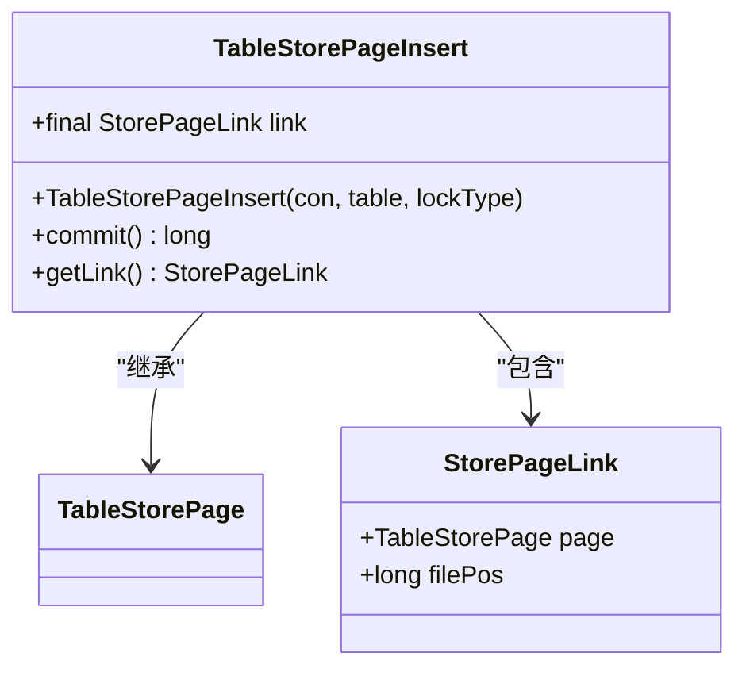
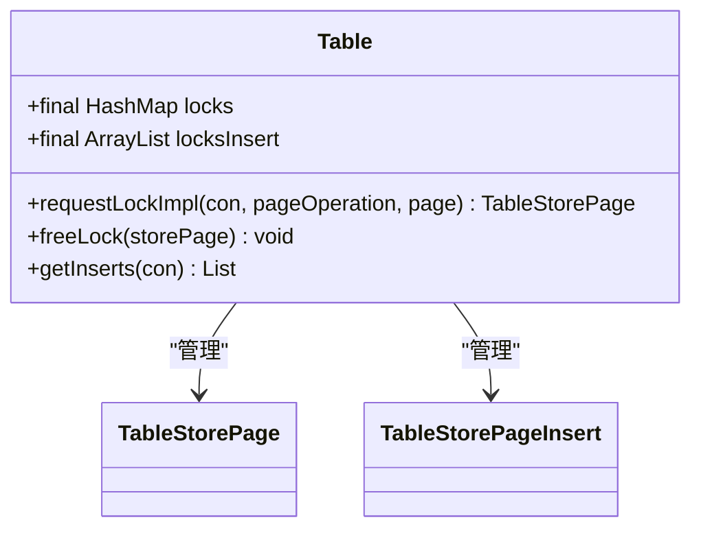
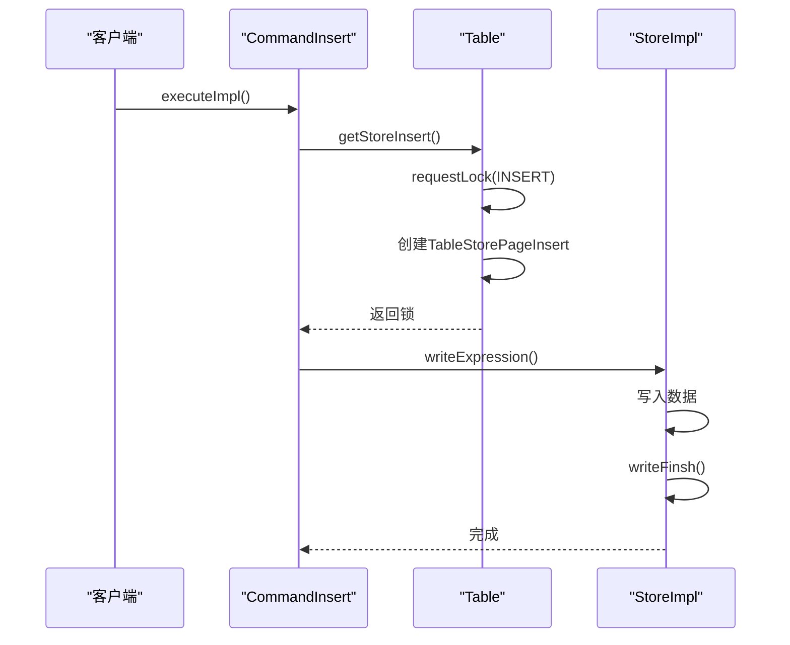
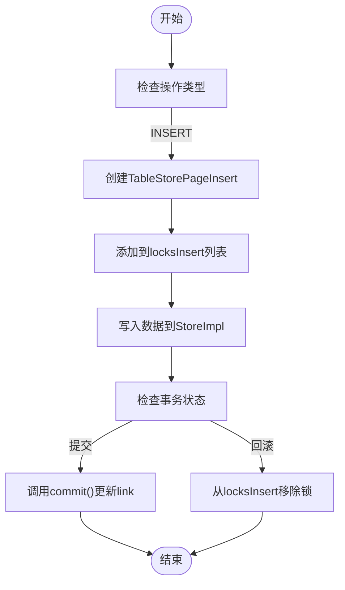
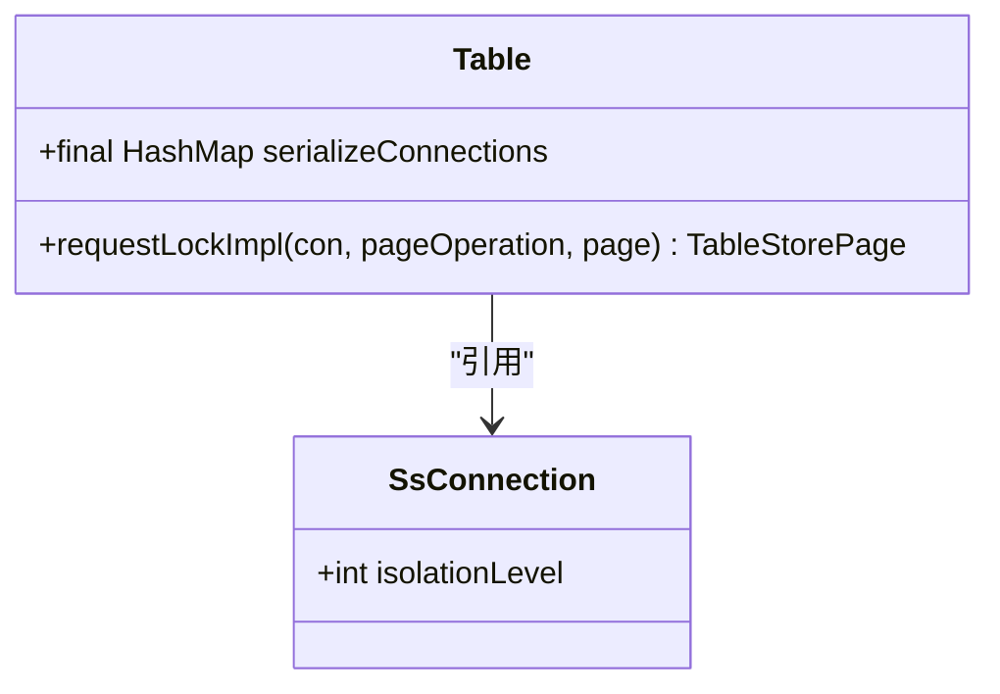
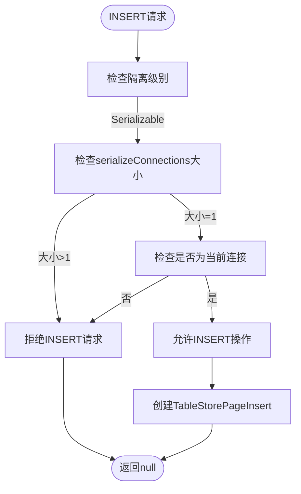
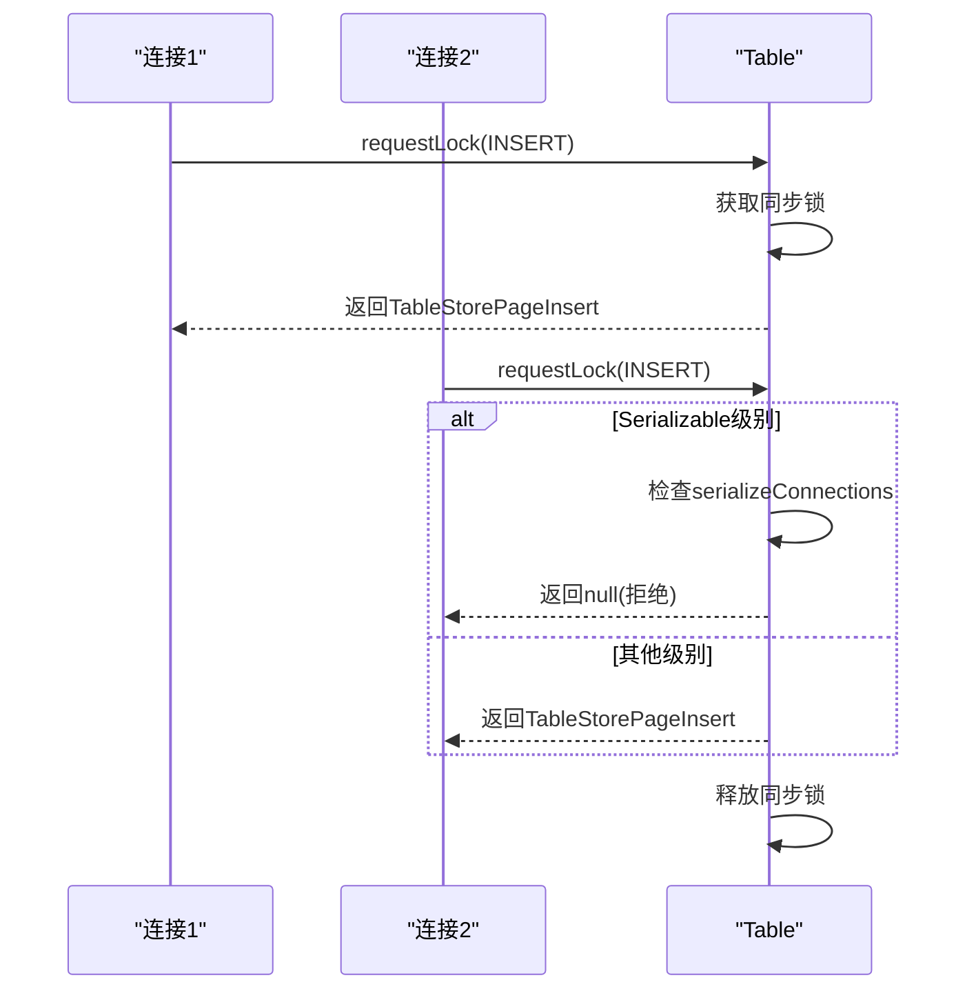
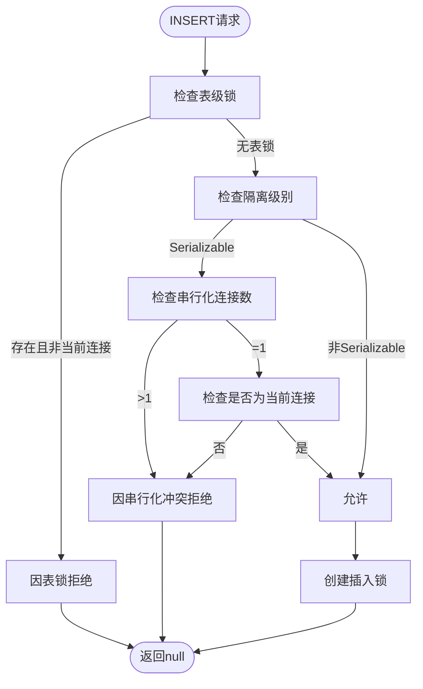
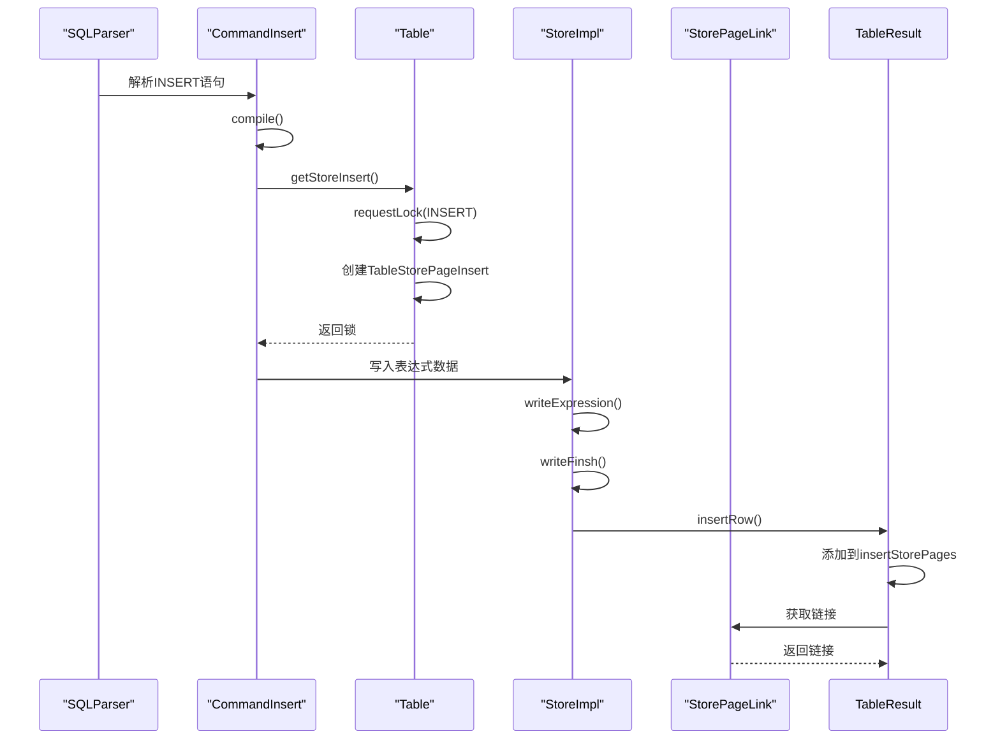
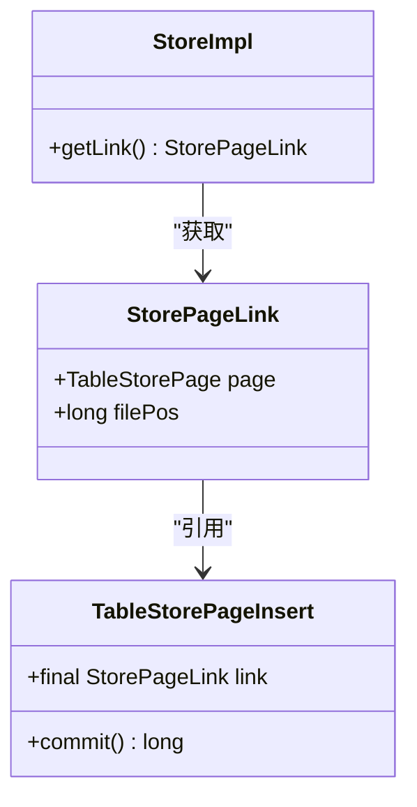

# 行级锁实现

<cite>
**本文档引用的文件**   
- [TableStorePageInsert.java](file://src/main/java/io/leavesfly/smallsql/rdb/engine/store/TableStorePageInsert.java)
- [Table.java](file://src/main/java/io/leavesfly/smallsql/rdb/engine/Table.java)
- [StoreImpl.java](file://src/main/java/io/leavesfly/smallsql/rdb/engine/store/StoreImpl.java)
- [CommandInsert.java](file://src/main/java/io/leavesfly/smallsql/rdb/command/dml/CommandInsert.java)
- [SQLTokenizer.java](file://src/main/java/io/leavesfly/smallsql/rdb/sql/parser/SQLTokenizer.java)
- [TableResult.java](file://src/main/java/io/leavesfly/smallsql/rdb/engine/selector/result/TableResult.java)
</cite>

## 目录
1. [引言](#引言)
2. [核心组件分析](#核心组件分析)
3. [插入锁的生命周期管理](#插入锁的生命周期管理)
4. [Serializable隔离级别的串行化控制](#serializable隔离级别的串行化控制)
5. [多连接环境下的锁竞争与拒绝策略](#多连接环境下的锁竞争与拒绝策略)
6. [代码示例与实现细节](#代码示例与实现细节)

## 引言
SmallSQL数据库系统通过创新的间接方式实现了行级锁机制，特别是在处理INSERT操作时。本文档深入解析了通过TableStorePageInsert类和locksInsert列表管理未提交插入行的核心机制。系统通过获取LOCK_INSERT类型的页锁来实现对新行的独占控制，这种设计在Serializable隔离级别下提供了强大的串行化控制能力。文档将详细阐述INSERT操作的锁获取流程、多连接环境下的竞争处理策略，以及插入锁与事务提交/回滚的联动关系。

## 核心组件分析

### TableStorePageInsert类的作用
TableStorePageInsert类是SmallSQL中实现插入锁的核心组件，专门用于管理INSERT操作期间的未提交数据。该类继承自TableStorePage，通过引入StorePageLink机制解决了新创建页面在提交前无法确定文件位置的问题。

**图示来源**
- [TableStorePageInsert.java](file://src/main/java/io/leavesfly/smallsql/rdb/engine/store/TableStorePageInsert.java#L35-L74)

**本节来源**
- [TableStorePageInsert.java](file://src/main/java/io/leavesfly/smallsql/rdb/engine/store/TableStorePageInsert.java#L35-L74)

### Table类中的锁管理机制
Table类维护了两个关键的数据结构来管理不同类型的锁：HashMap类型的locks用于管理常规的读写锁，而ArrayList类型的locksInsert专门用于管理插入锁。这种分离的设计使得系统能够高效地处理不同类型的并发操作。

**图示来源**
- [Table.java](file://src/main/java/io/leavesfly/smallsql/rdb/engine/Table.java#L452-L573)

**本节来源**
- [Table.java](file://src/main/java/io/leavesfly/smallsql/rdb/engine/Table.java#L452-L573)

## 插入锁的生命周期管理

### 插入锁的获取与释放
INSERT操作通过Table类的requestLockImpl方法获取插入锁。当执行INSERT语句时，系统会创建一个TableStorePageInsert实例并将其添加到locksInsert列表中。这个锁的生命周期与事务紧密相关，只有在事务提交或回滚时才会被释放。

**图示来源**
- [Table.java](file://src/main/java/io/leavesfly/smallsql/rdb/engine/Table.java#L368-L484)
- [CommandInsert.java](file://src/main/java/io/leavesfly/smallsql/rdb/command/dml/CommandInsert.java#L0-L207)

**本节来源**
- [Table.java](file://src/main/java/io/leavesfly/smallsql/rdb/engine/Table.java#L368-L484)
- [CommandInsert.java](file://src/main/java/io/leavesfly/smallsql/rdb/command/dml/CommandInsert.java#L0-L207)

### 事务提交与回滚的联动
插入锁的生命周期与事务状态紧密耦合。在事务提交时，TableStorePageInsert的commit方法会被调用，更新StorePageLink中的文件位置信息；而在事务回滚时，相应的锁会被从locksInsert列表中移除，确保未提交的数据不会影响其他事务。

**图示来源**
- [TableStorePageInsert.java](file://src/main/java/io/leavesfly/smallsql/rdb/engine/store/TableStorePageInsert.java#L48-L74)
- [Table.java](file://src/main/java/io/leavesfly/smallsql/rdb/engine/Table.java#L526-L573)

**本节来源**
- [TableStorePageInsert.java](file://src/main/java/io/leavesfly/smallsql/rdb/engine/store/TableStorePageInsert.java#L48-L74)
- [Table.java](file://src/main/java/io/leavesfly/smallsql/rdb/engine/Table.java#L526-L573)

## Serializable隔离级别的串行化控制

### 串行化连接的管理
在Serializable隔离级别下，Table类通过serializeConnections HashMap来跟踪所有具有串行化锁的连接。这种机制确保了在Serializable级别下，多个连接不能同时进行INSERT操作，从而实现了严格的串行化控制。

**图示来源**
- [Table.java](file://src/main/java/io/leavesfly/smallsql/rdb/engine/Table.java#L368-L484)

**本节来源**
- [Table.java](file://src/main/java/io/leavesfly/smallsql/rdb/engine/Table.java#L368-L484)

### 插入操作的串行化检查
当连接以Serializable隔离级别请求INSERT锁时，系统会检查serializeConnections的大小。如果已经有多个连接持有串行化锁，新的INSERT请求将被拒绝，确保了事务的串行化执行。

**图示来源**
- [Table.java](file://src/main/java/io/leavesfly/smallsql/rdb/engine/Table.java#L368-L484)

**本节来源**
- [Table.java](file://src/main/java/io/leavesfly/smallsql/rdb/engine/Table.java#L368-L484)

## 多连接环境下的锁竞争与拒绝策略

### 锁竞争的处理机制
在多连接环境下，SmallSQL通过同步锁和条件检查来处理INSERT操作的竞争。Table类的requestLock方法使用synchronized关键字确保对锁管理结构的线程安全访问，防止多个连接同时修改锁状态。

**图示来源**
- [Table.java](file://src/main/java/io/leavesfly/smallsql/rdb/engine/Table.java#L368-L484)

**本节来源**
- [Table.java](file://src/main/java/io/leavesfly/smallsql/rdb/engine/Table.java#L368-L484)

### 拒绝策略的实现
系统对INSERT操作的拒绝策略主要体现在两个方面：一是当存在表级锁时拒绝所有INSERT操作；二是在Serializable隔离级别下，当有多个串行化连接时拒绝新的INSERT请求。这种策略确保了数据的一致性和事务的隔离性。

**图示来源**
- [Table.java](file://src/main/java/io/leavesfly/smallsql/rdb/engine/Table.java#L368-L484)

**本节来源**
- [Table.java](file://src/main/java/io/leavesfly/smallsql/rdb/engine/Table.java#L368-L484)

## 代码示例与实现细节

### INSERT操作的完整流程
INSERT操作的执行流程涉及多个组件的协同工作，从SQL解析到数据存储，每个步骤都体现了SmallSQL的设计哲学。

**图示来源**
- [CommandInsert.java](file://src/main/java/io/leavesfly/smallsql/rdb/command/dml/CommandInsert.java#L0-L207)
- [TableResult.java](file://src/main/java/io/leavesfly/smallsql/rdb/engine/selector/result/TableResult.java#L130-L168)

**本节来源**
- [CommandInsert.java](file://src/main/java/io/leavesfly/smallsql/rdb/command/dml/CommandInsert.java#L0-L207)
- [TableResult.java](file://src/main/java/io/leavesfly/smallsql/rdb/engine/selector/result/TableResult.java#L130-L168)

### StorePageLink的链接机制
StorePageLink类作为TableStorePageInsert和实际数据存储之间的桥梁，其设计巧妙地解决了未提交数据的引用问题。通过维护对TableStorePageInsert的引用和文件位置，系统能够在提交后准确地定位和更新数据。

**图示来源**
- [TableStorePageInsert.java](file://src/main/java/io/leavesfly/smallsql/rdb/engine/store/TableStorePageInsert.java#L35-L74)
- [StoreImpl.java](file://src/main/java/io/leavesfly/smallsql/rdb/engine/store/StoreImpl.java#L1563-L1605)

**本节来源**
- [TableStorePageInsert.java](file://src/main/java/io/leavesfly/smallsql/rdb/engine/store/TableStorePageInsert.java#L35-L74)
- [StoreImpl.java](file://src/main/java/io/leavesfly/smallsql/rdb/engine/store/StoreImpl.java#L1563-L1605)