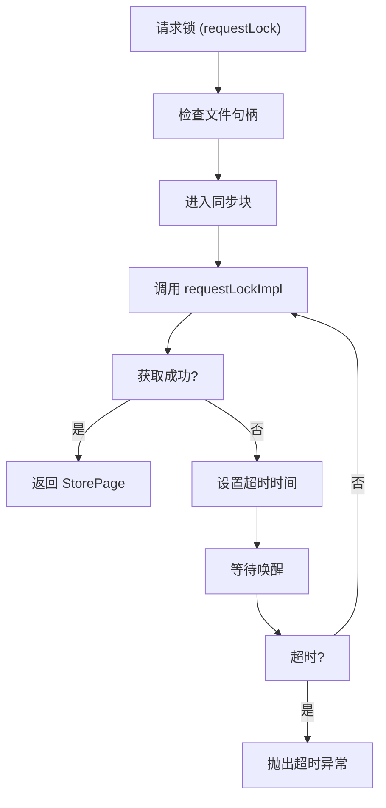
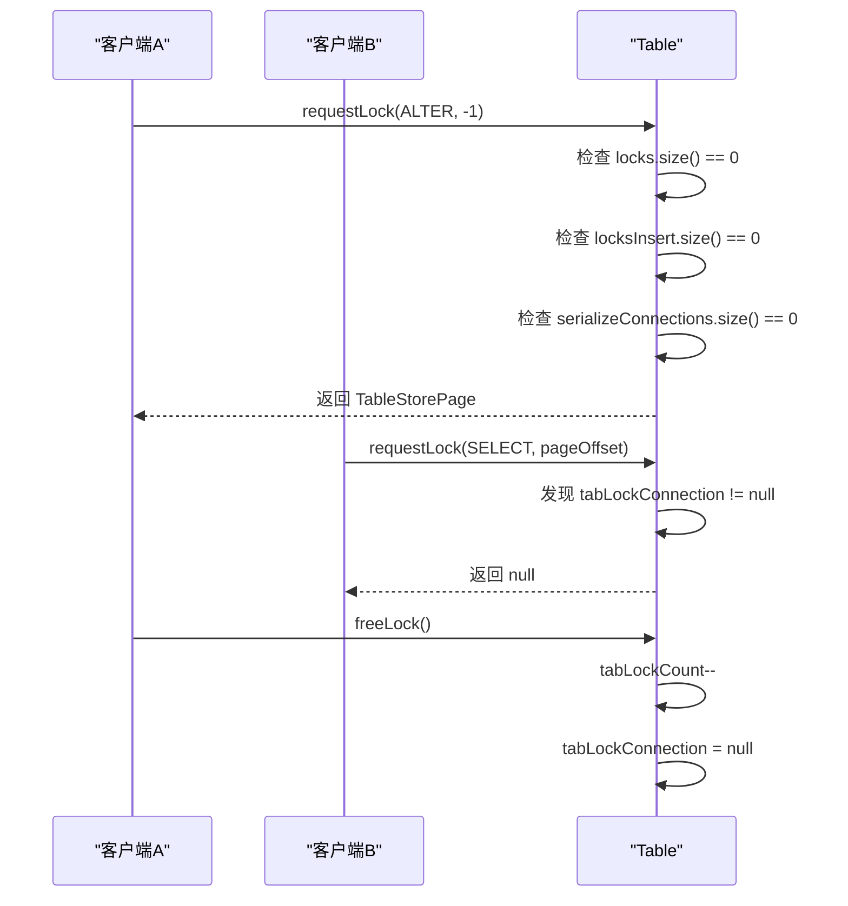
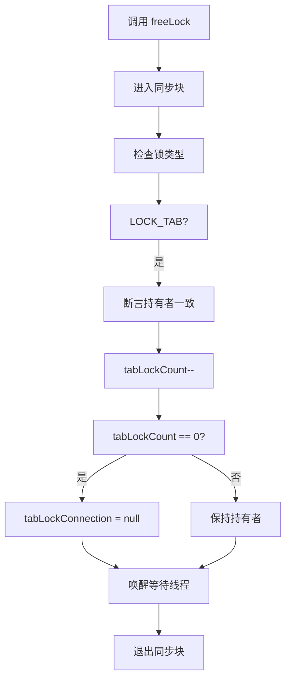

# 表级锁实现

<cite>
**本文档中引用的文件**  
- [Table.java](file://src/main/java/io/leavesfly/smallsql/rdb/engine/Table.java)
- [CommandTable.java](file://src/main/java/io/leavesfly/smallsql/rdb/command/ddl/CommandTable.java)
- [CommandDrop.java](file://src/main/java/io/leavesfly/smallsql/rdb/command/ddl/CommandDrop.java)
- [SsConnection.java](file://src/main/java/io/leavesfly/smallsql/jdbc/SsConnection.java)
- [Database.java](file://src/main/java/io/leavesfly/smallsql/rdb/engine/Database.java)
</cite>

## 目录
1. [引言](#引言)
2. [核心组件分析](#核心组件分析)
3. [表级锁获取机制](#表级锁获取机制)
4. [DDL操作中的锁管理](#ddl操作中的锁管理)
5. [事务隔离级别的交互影响](#事务隔离级别的交互影响)
6. [多连接竞争场景分析](#多连接竞争场景分析)
7. [锁释放流程](#锁释放流程)
8. [数据库模式变更安全性](#数据库模式变更安全性)
9. [结论](#结论)

## 引言
SmallSQL 是一个轻量级的 Java 数据库管理系统，其表级锁（LOCK_TAB）机制在保障数据库模式变更操作（如 ALTER、DROP）的原子性和一致性方面起着关键作用。本文深入解析 SmallSQL 中表级锁的实现机制，重点分析 `Table` 类中的 `tabLockConnection` 和 `tabLockCount` 字段如何协同工作，确保在 DDL 操作期间阻止其他连接的并发访问。通过详细阐述表级锁的获取条件、持有者管理及释放流程，并结合 `requestLockImpl` 方法中的 CREATE 和 ALTER 操作逻辑，揭示其与事务隔离级别的交互影响。同时，提供代码示例展示多个连接竞争表级锁时的阻塞与超时行为，全面分析其对数据库模式变更安全性的保障作用。

## 核心组件分析

SmallSQL 的表级锁机制主要由 `Table` 类、`SsConnection` 类和 `Database` 类协同实现。`Table` 类是核心，它通过 `tabLockConnection` 字段记录当前持有表级锁的连接，`tabLockCount` 字段则用于支持锁的可重入性。`SsConnection` 类代表数据库连接，负责管理事务状态和隔离级别，这些信息直接影响锁的获取逻辑。`Database` 类作为数据库的容器，管理所有表和视图的生命周期，其 `replaceTable` 方法在 `ALTER TABLE` 操作中扮演关键角色。

**Section sources**
- [Table.java](file://src/main/java/io/leavesfly/smallsql/rdb/engine/Table.java#L59-L607)
- [SsConnection.java](file://src/main/java/io/leavesfly/smallsql/jdbc/SsConnection.java#L1-L715)
- [Database.java](file://src/main/java/io/leavesfly/smallsql/rdb/engine/Database.java#L1-L564)

## 表级锁获取机制

表级锁的获取由 `Table` 类的 `requestLock` 和 `requestLockImpl` 方法共同完成。`requestLock` 方法提供了一个带超时机制的公共接口，它在内部循环调用 `requestLockImpl`，如果在 5 秒内无法获取锁，则抛出超时异常。`requestLockImpl` 方法是实际的锁获取逻辑，它首先检查 `tabLockConnection` 字段，如果该字段不为空且不等于当前请求的连接，则直接返回 `null`，表示锁已被其他连接持有。

**Diagram sources**
- [Table.java](file://src/main/java/io/leavesfly/smallsql/rdb/engine/Table.java#L325-L376)

**Section sources**
- [Table.java](file://src/main/java/io/leavesfly/smallsql/rdb/engine/Table.java#L325-L376)

## DDL操作中的锁管理

在 DDL 操作（如 CREATE、ALTER、DROP）中，表级锁的管理策略有所不同。对于 `CREATE` 操作，`requestLockImpl` 会检查 `locks` 和 `locksInsert` 集合，确保没有其他连接持有任何页锁或插入锁。只有当所有现有锁都属于当前连接时，才能成功获取表级锁。对于 `ALTER` 操作，其要求更为严格，不仅要求 `locks` 和 `locksInsert` 集合为空，还要求没有其他连接处于 `SERIALIZABLE` 隔离级别。这确保了在 `ALTER TABLE` 执行期间，表处于完全静默状态。

**Diagram sources**
- [Table.java](file://src/main/java/io/leavesfly/smallsql/rdb/engine/Table.java#L378-L418)
- [CommandTable.java](file://src/main/java/io/leavesfly/smallsql/rdb/command/ddl/CommandTable.java#L1-L155)

**Section sources**
- [Table.java](file://src/main/java/io/leavesfly/smallsql/rdb/engine/Table.java#L378-L418)
- [CommandTable.java](file://src/main/java/io/leavesfly/smallsql/rdb/command/ddl/CommandTable.java#L1-L155)

## 事务隔离级别的交互影响

表级锁的获取逻辑与事务隔离级别紧密相关。当连接的隔离级别为 `SERIALIZABLE` 时，`requestLockImpl` 会将该连接添加到 `serializeConnections` 映射中。这会影响 `CREATE` 和 `ALTER` 操作的锁获取条件。例如，在 `CREATE` 操作中，即使其他连接持有读锁，只要这些连接的隔离级别是 `SERIALIZABLE`，并且当前请求的连接也是 `SERIALIZABLE`，那么锁的获取仍然可能失败，因为 `serializeConnections` 的存在会触发额外的检查。这种设计确保了 `SERIALIZABLE` 隔离级别下的严格一致性。

**Section sources**
- [Table.java](file://src/main/java/io/leavesfly/smallsql/rdb/engine/Table.java#L368-L376)

## 多连接竞争场景分析

当多个连接竞争表级锁时，会表现出典型的阻塞与超时行为。例如，一个连接在 `REPEATABLE_READ` 隔离级别下执行 `SELECT` 查询，会持有表的读锁。此时，另一个连接尝试执行 `ALTER TABLE`，由于 `ALTER` 操作需要获取表级锁，而 `requestLockImpl` 检测到 `locks` 集合不为空，因此会立即返回 `null`，导致 `ALTER` 操作失败。如果第一个连接的查询时间过长，第二个连接的 `requestLock` 调用将在 5 秒后因超时而抛出异常。这种机制防止了长时间运行的查询阻塞关键的模式变更操作。

**Section sources**
- [TestAlterTable.java](file://src/test/java/io/leavesfly/smallsql/junit/sql/ddl/TestAlterTable.java#L73-L107)

## 锁释放流程

表级锁的释放由 `freeLock` 方法完成。当一个 `TableStorePage` 对象被释放时，`freeLock` 方法会根据其 `lockType` 进行处理。对于 `LOCK_TAB` 类型的锁，方法会断言 `storePage.con` 必须等于 `tabLockConnection`，以保证锁的持有者一致性。然后，`tabLockCount` 计数器递减，当计数器归零时，`tabLockConnection` 被置为 `null`，表示表级锁已被完全释放。最后，`locks.notifyAll()` 被调用，唤醒所有在 `locks` 对象上等待的线程，使它们有机会重新竞争锁。

**Diagram sources**
- [Table.java](file://src/main/java/io/leavesfly/smallsql/rdb/engine/Table.java#L526-L573)

**Section sources**
- [Table.java](file://src/main/java/io/leavesfly/smallsql/rdb/engine/Table.java#L526-L573)

## 数据库模式变更安全性

表级锁机制是保障 SmallSQL 数据库模式变更安全性的核心。通过强制 DDL 操作在获取表级锁后才能执行，系统确保了在 `ALTER` 或 `DROP` 操作期间，表的结构不会被其他连接以任何形式访问或修改。`CommandTable` 类在执行 `ALTER` 操作时，会先调用 `oldTable.requestLock(con, SQLTokenizer.ALTER, -1)` 获取锁，然后在 `finally` 块中通过 `tableLock.freeLock()` 确保锁的最终释放，即使操作失败也不会造成死锁。这种“获取-操作-释放”的模式，结合超时机制，为数据库的元数据操作提供了强一致性和高可靠性。

**Section sources**
- [CommandTable.java](file://src/main/java/io/leavesfly/smallsql/rdb/command/ddl/CommandTable.java#L1-L155)
- [CommandDrop.java](file://src/main/java/io/leavesfly/smallsql/rdb/command/ddl/CommandDrop.java#L1-L84)

## 结论
SmallSQL 的表级锁实现是一个精巧而有效的并发控制机制。它利用 `tabLockConnection` 和 `tabLockCount` 字段，通过 `requestLockImpl` 方法的精细逻辑，成功地在 DDL 操作期间实现了对表的独占访问。该机制不仅考虑了不同操作类型（CREATE、ALTER）的特定需求，还与事务隔离级别进行了深度交互，确保了在各种并发场景下的数据一致性。尽管其超时时间固定为 5 秒，缺乏可配置性，但整体设计简洁、可靠，为嵌入式数据库环境下的模式变更提供了坚实的安全保障。