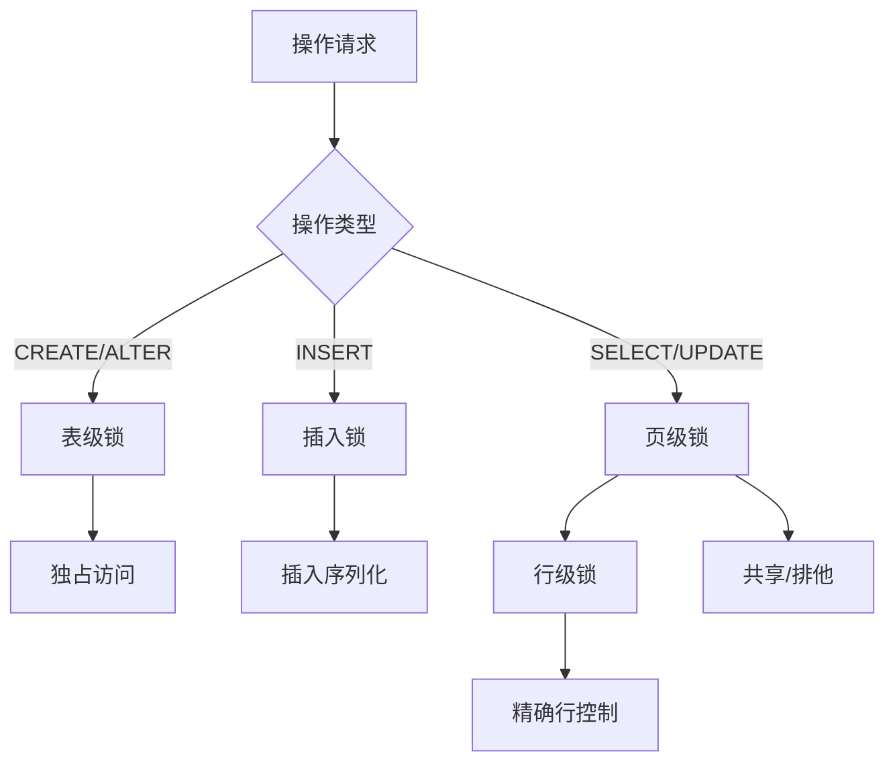
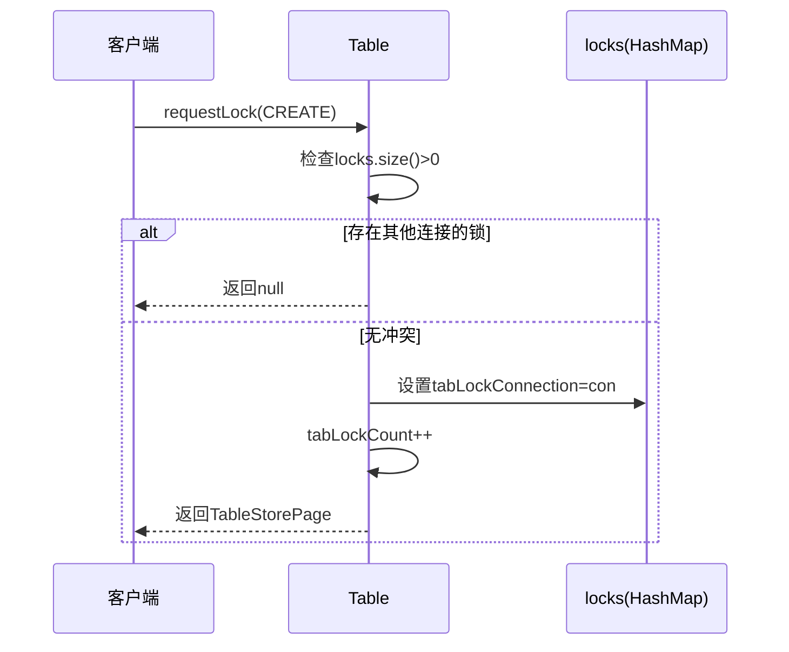
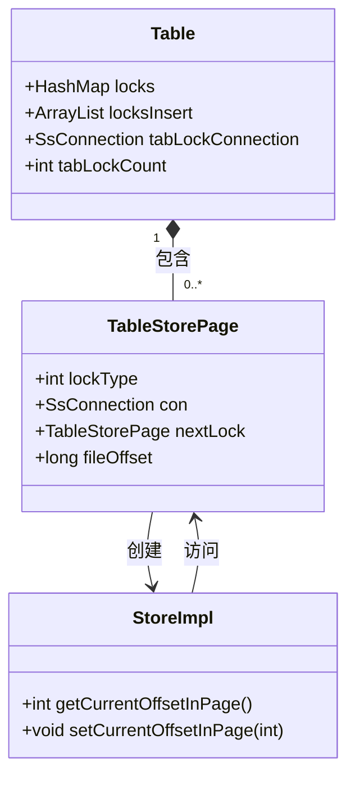
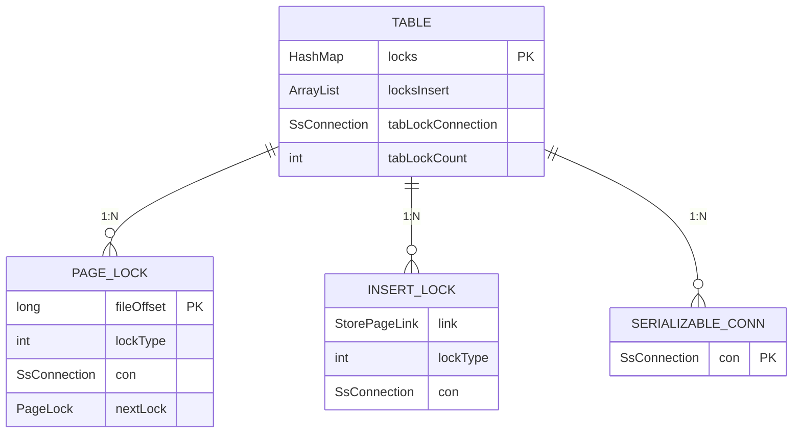
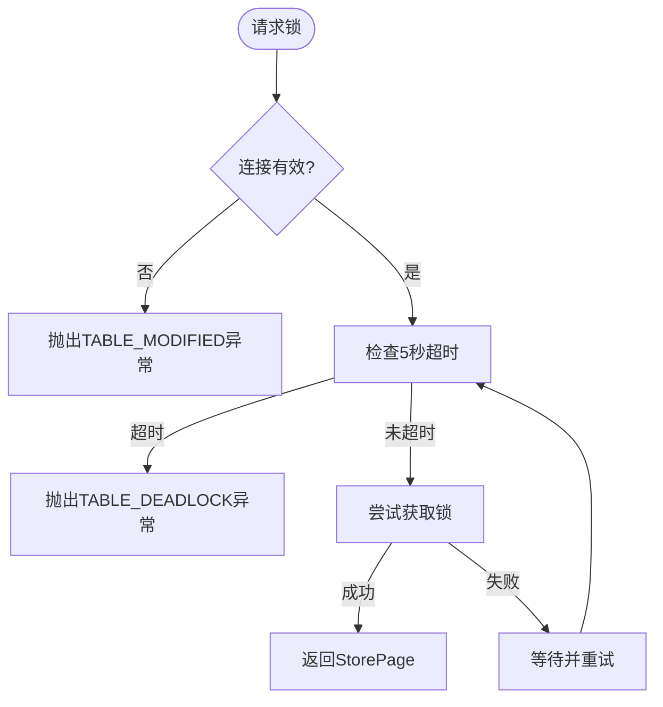
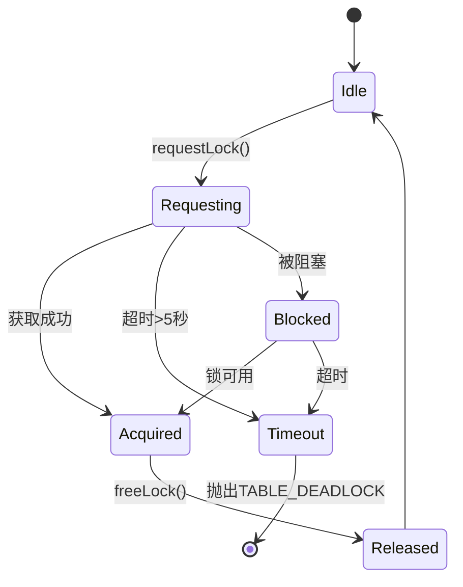

# 锁机制实现

<cite>
**本文档中引用的文件**  
- [Table.java](file://src/main/java/io/leavesfly/smallsql/rdb/engine/Table.java)
- [StorePage.java](file://src/main/java/io/leavesfly/smallsql/rdb/engine/store/StorePage.java)
- [TableStorePage.java](file://src/main/java/io/leavesfly/smallsql/rdb/engine/store/TableStorePage.java)
- [TableStorePageInsert.java](file://src/main/java/io/leavesfly/smallsql/rdb/engine/store/TableStorePageInsert.java)
- [Database.java](file://src/main/java/io/leavesfly/smallsql/rdb/engine/Database.java)
- [SsConnection.java](file://src/main/java/io/leavesfly/smallsql/jdbc/SsConnection.java)
</cite>

## 目录
1. [引言](#引言)
2. [多粒度锁机制概述](#多粒度锁机制概述)
3. [表级锁实现原理](#表级锁实现原理)
4. [页级锁与行级锁实现](#页级锁与行级锁实现)
5. [锁状态管理与数据结构设计](#锁状态管理与数据结构设计)
6. [锁的获取、释放与升级过程](#锁的获取释放与升级过程)
7. [锁的递归获取与可重入性](#锁的递归获取与可重入性)
8. [锁超时机制与异常处理](#锁超时机制与异常处理)
9. [并发性能影响与优化策略](#并发性能影响与优化策略)
10. [高并发写入场景解决方案](#高并发写入场景解决方案)

## 引言
SmallSQL作为轻量级Java数据库管理系统，采用多粒度锁机制来平衡数据一致性与并发性能。本文档深入解析其表级锁、页级锁和行级锁的协同工作机制，基于核心类Table和StorePage的源码实现，系统阐述锁的生命周期管理、状态转换机制及并发控制策略。

**文档来源**
- [Table.java](file://src/main/java/io/leavesfly/smallsql/rdb/engine/Table.java)
- [StorePage.java](file://src/main/java/io/leavesfly/smallsql/rdb/engine/store/StorePage.java)

## 多粒度锁机制概述
SmallSQL实现三级锁粒度：表级锁（LOCK_TAB）、页级锁（LOCK_READ/LOCK_WRITE）和行级锁（通过页内偏移实现）。这种分层设计允许在不同操作场景下选择最优锁粒度，既保证了数据一致性，又最大限度提升了并发吞吐量。

**图示来源**
- [Table.java](file://src/main/java/io/leavesfly/smallsql/rdb/engine/Table.java#L378-L418)
- [Table.java](file://src/main/java/io/leavesfly/smallsql/rdb/engine/Table.java#L415-L456)

## 表级锁实现原理
表级锁通过Table类的`tabLockConnection`和`tabLockCount`字段实现，采用引用计数机制支持锁的可重入性。当执行DDL操作（CREATE、ALTER）时，系统会检查所有现有锁，确保没有其他连接持有任何锁才能获取表级锁。

**图示来源**
- [Table.java](file://src/main/java/io/leavesfly/smallsql/rdb/engine/Table.java#L378-L418)
- [Table.java](file://src/main/java/io/leavesfly/smallsql/rdb/engine/Table.java#L526-L573)

**本节来源**
- [Table.java](file://src/main/java/io/leavesfly/smallsql/rdb/engine/Table.java#L378-L418)

## 页级锁与行级锁实现
页级锁以页偏移量为键，存储在Table的`locks` HashMap中，支持读写锁分离。行级锁通过在页内定位具体行偏移实现，实际由StoreImpl在页锁保护下完成行操作。INSERT操作使用特殊的`locksInsert`列表管理未提交的插入页。

**图示来源**
- [Table.java](file://src/main/java/io/leavesfly/smallsql/rdb/engine/Table.java#L59-L607)
- [TableStorePage.java](file://src/main/java/io/leavesfly/smallsql/rdb/engine/store/TableStorePage.java#L0-L78)

## 锁状态管理与数据结构设计
锁状态通过`lockType`枚举管理，包括LOCK_NONE、LOCK_READ、LOCK_WRITE、LOCK_INSERT和LOCK_TAB。Table类使用HashMap存储页锁，ArrayList管理插入锁，HashMap记录序列化事务连接，形成高效的多粒度锁管理结构。

**图示来源**
- [Table.java](file://src/main/java/io/leavesfly/smallsql/rdb/engine/Table.java#L59-L607)
- [TableStorePage.java](file://src/main/java/io/leavesfly/smallsql/rdb/engine/store/TableStorePage.java#L0-L78)

## 锁的获取、释放与升级过程
锁获取通过`requestLock`方法实现，包含5秒超时机制。锁释放由`freeLock`方法完成，支持链式锁的清理。锁升级通过`requestWriteLock`实现，允许将读锁升级为写锁，满足事务回滚到保存点的需求。

**图示来源**
- [Table.java](file://src/main/java/io/leavesfly/smallsql/rdb/engine/Table.java#L325-L376)
- [Table.java](file://src/main/java/io/leavesfly/smallsql/rdb/engine/Table.java#L486-L524)

## 锁的递归获取与可重入性
SmallSQL通过连接标识（SsConnection）实现锁的可重入性。同一连接可多次获取同一资源的锁，通过引用计数（tabLockCount）管理。INSERT操作的可重入性由`locksInsert`列表中连接检查保证，序列化事务通过`serializeConnections`映射管理。

**本节来源**
- [Table.java](file://src/main/java/io/leavesfly/smallsql/rdb/engine/Table.java#L415-L456)
- [Table.java](file://src/main/java/io/leavesfly/smallsql/rdb/engine/Table.java#L378-L418)

## 锁超时机制与异常处理
系统采用5秒固定超时策略，通过`endTime`和`waitTime`计算实现。当锁请求超时时，抛出`TABLE_DEADLOCK`异常。异常处理策略包括：连接关闭时自动回滚、文件损坏时抛出`TABLE_MODIFIED`异常、死锁时抛出`TABLE_DEADLOCK`异常。

**图示来源**
- [Table.java](file://src/main/java/io/leavesfly/smallsql/rdb/engine/Table.java#L325-L376)
- [Table.java](file://src/main/java/io/leavesfly/smallsql/rdb/engine/Table.java#L526-L573)

## 并发性能影响与优化策略
不同隔离级别对锁行为有显著影响：SERIALIZABLE级别会阻塞其他连接的INSERT操作，READ_UNCOMMITTED级别允许脏读。页级锁相比表级锁显著提升并发度，但相比行级锁仍有锁升级开销。优化策略包括合理选择隔离级别、减少事务范围、避免长事务。

**本节来源**
- [Table.java](file://src/main/java/io/leavesfly/smallsql/rdb/engine/Table.java#L415-L456)
- [Table.java](file://src/main/java/io/leavesfly/smallsql/rdb/engine/Table.java#L378-L418)

## 高并发写入场景解决方案
针对高并发写入，SmallSQL采用INSERT专用锁机制，通过`locksInsert`列表管理未提交的插入操作。对于序列化事务，系统严格限制同时只能有一个连接持有序列化锁，防止幻读。解决方案包括：使用批量插入减少锁请求次数、合理设计主键避免页分裂、监控锁等待时间优化性能。

**本节来源**
- [Table.java](file://src/main/java/io/leavesfly/smallsql/rdb/engine/Table.java#L415-L456)
- [Table.java](file://src/main/java/io/leavesfly/smallsql/rdb/engine/Table.java#L526-L573)