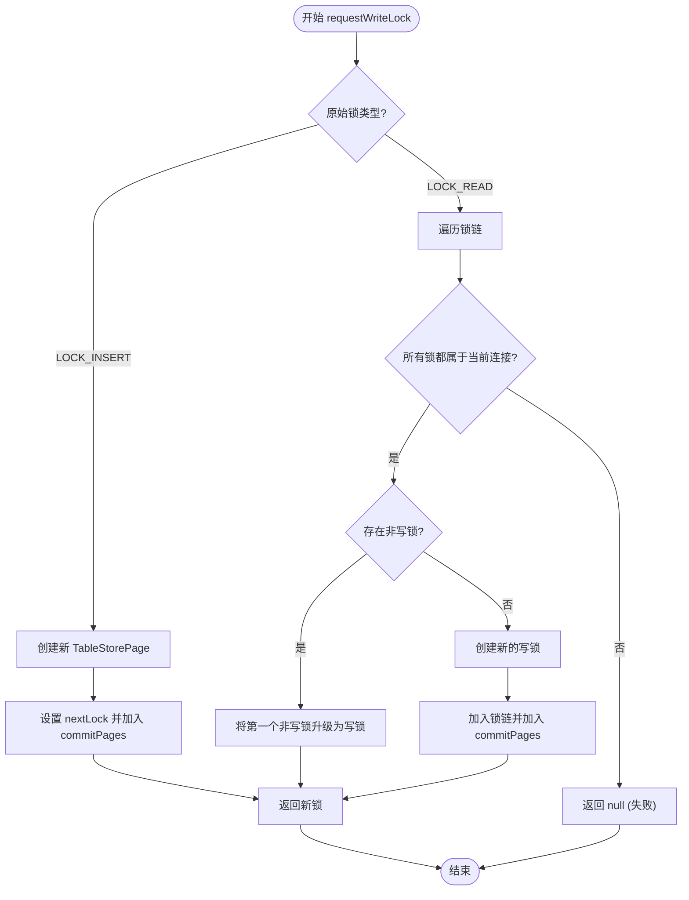
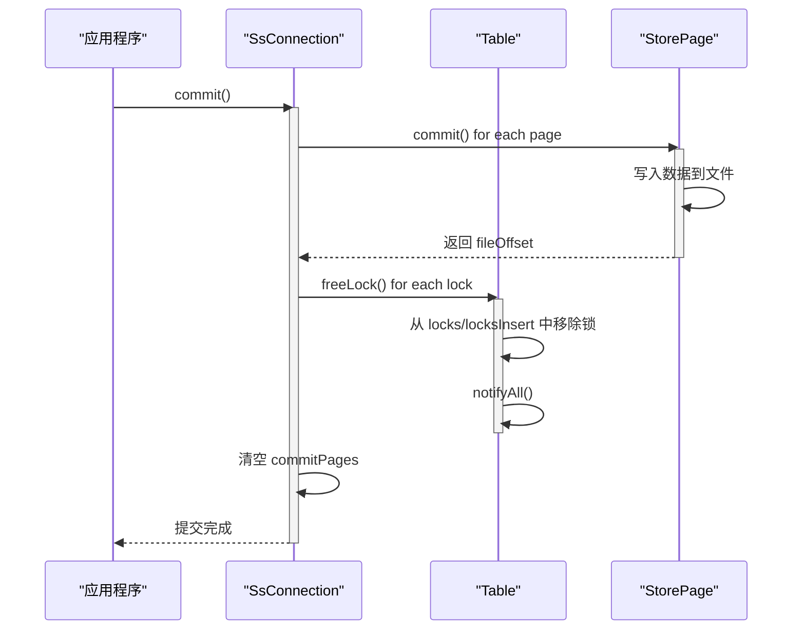
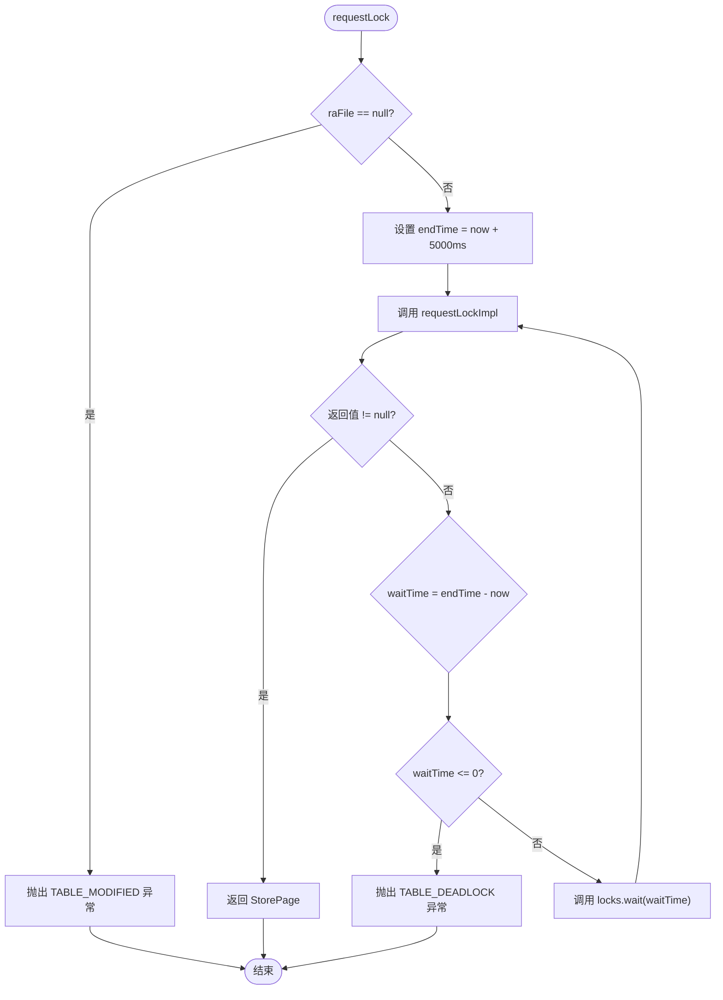

# 锁管理与并发控制

<cite>
**本文档引用的文件**  
- [Table.java](file://src/main/java/io/leavesfly/smallsql/rdb/engine/Table.java)
- [StorePage.java](file://src/main/java/io/leavesfly/smallsql/rdb/engine/store/StorePage.java)
- [TableStorePage.java](file://src/main/java/io/leavesfly/smallsql/rdb/engine/store/TableStorePage.java)
- [TableStorePageInsert.java](file://src/main/java/io/leavesfly/smallsql/rdb/engine/store/TableStorePageInsert.java)
- [SsConnection.java](file://src/main/java/io/leavesfly/smallsql/jdbc/SsConnection.java)
</cite>

## 目录
1. [引言](#引言)
2. [多粒度锁层级结构](#多粒度锁层级结构)
3. [锁请求与等待队列管理](#锁请求与等待队列管理)
4. [锁升级机制](#锁升级机制)
5. [锁与事务生命周期绑定](#锁与事务生命周期绑定)
6. [死锁检测与超时策略](#死锁检测与超时策略)
7. [高并发性能分析与优化建议](#高并发性能分析与优化建议)
8. [结论](#结论)

## 引言

SmallSQL 实现了一套精细的多粒度锁管理系统，旨在平衡并发性能与数据一致性。该系统通过表级锁、页级锁和插入锁三种粒度的协同工作，支持多种事务隔离级别。本文档深入分析其锁管理机制，涵盖锁的获取、释放、升级、等待队列管理以及与事务生命周期的绑定关系，为理解其并发控制原理和优化高并发场景提供全面指导。

## 多粒度锁层级结构

SmallSQL 的锁系统采用多粒度设计，允许在不同层次上施加锁，以适应不同的操作需求。

```mermaid
graph TD
A[锁层级] --> B[表级锁 (LOCK_TAB)]
A --> C[页级锁 (LOCK_READ/LOCK_WRITE)]
A --> D[插入锁 (LOCK_INSERT)]
B --> E[通过 tabLockConnection 和 tabLockCount 管理]
C --> F[存储在 locks HashMap 中，以页偏移量为键]
D --> G[存储在 locksInsert ArrayList 中]
```

**图示来源**
- [Table.java](file://src/main/java/io/leavesfly/smallsql/rdb/engine/Table.java#L60-L65)

**本节来源**
- [Table.java](file://src/main/java/io/leavesfly/smallsql/rdb/engine/Table.java#L59-L607)

## 锁请求与等待队列管理

锁的请求和管理围绕 `Table` 类中的 `locks` 对象展开，该对象是一个 `HashMap<Long, TableStorePage>`，并使用 `synchronized(locks)` 块来保证线程安全。

当一个连接请求锁时，会调用 `requestLock` 方法。该方法首先检查表文件句柄是否有效，然后进入一个循环，尝试通过 `requestLockImpl` 方法获取锁。如果 `requestLockImpl` 返回 `null`（表示锁被其他连接持有），当前线程不会立即失败，而是调用 `locks.wait(waitTime)` 进入等待状态。

```mermaid
sequenceDiagram
participant Client as "客户端连接"
participant Table as "Table 实例"
Client->>Table : requestLock(con, operation, page)
activate Table
loop 等待或获取锁
Table->>Table : requestLockImpl(con, operation, page)
alt 成功获取
Table-->>Client : 返回 TableStorePage
deactivate Table
else 失败，需等待
Note over Table : endTime = now + 5000ms
Table->>Table : wait(waitTime)
activate Client
Note over Client : 线程挂起，等待通知
deactivate Client
end
end
alt 超时
Table-->>Client : 抛出 TABLE_DEADLOCK 异常
deactivate Table
end
```

**图示来源**
- [Table.java](file://src/main/java/io/leavesfly/smallsql/rdb/engine/Table.java#L325-L376)

**本节来源**
- [Table.java](file://src/main/java/io/leavesfly/smallsql/rdb/engine/Table.java#L325-L376)

## 锁升级机制

锁升级是指将一个较低级别的锁（如读锁）转换为较高级别的锁（如写锁）。SmallSQL 通过 `requestWriteLock` 方法实现此功能，确保了在事务内部进行锁升级的安全性。

该方法首先检查原始锁的类型。如果原始锁是插入锁（`LOCK_INSERT`），则直接创建一个新的插入锁并链接到原始锁的 `nextLock`，然后将其加入连接的提交列表。如果原始锁是页级读锁，则会遍历 `locks` 映射中对应页偏移量的锁链。



**图示来源**
- [Table.java](file://src/main/java/io/leavesfly/smallsql/rdb/engine/Table.java#L486-L524)

**本节来源**
- [Table.java](file://src/main/java/io/leavesfly/smallsql/rdb/engine/Table.java#L486-L524)

## 锁与事务生命周期绑定

锁的生命周期与事务紧密绑定。当一个操作（如 SELECT、UPDATE）需要访问数据时，它会通过 `requestLock` 获取一个 `TableStorePage` 锁对象。这个锁对象随后会被添加到连接（`SsConnection`）的 `commitPages` 列表中。



**图示来源**
- [SsConnection.java](file://src/main/java/io/leavesfly/smallsql/jdbc/SsConnection.java#L261-L283)
- [StorePage.java](file://src/main/java/io/leavesfly/smallsql/rdb/engine/store/StorePage.java#L45-L89)

**本节来源**
- [SsConnection.java](file://src/main/java/io/leavesfly/smallsql/jdbc/SsConnection.java#L261-L283)
- [StorePage.java](file://src/main/java/io/leavesfly/smallsql/rdb/engine/store/StorePage.java#L45-L89)

## 死锁检测与超时策略

SmallSQL 采用超时机制来检测和防止死锁。在 `requestLock` 方法中，如果 `requestLockImpl` 无法立即获取锁，线程将进入等待状态。



**图示来源**
- [Table.java](file://src/main/java/io/leavesfly/smallsql/rdb/engine/Table.java#L325-L376)

**本节来源**
- [Table.java](file://src/main/java/io/leavesfly/smallsql/rdb/engine/Table.java#L325-L376)

## 高并发性能分析与优化建议

在高并发场景下，SmallSQL 的锁机制可能成为性能瓶颈，主要体现在以下几个方面：

1.  **锁粒度选择**：当前的页级锁（`LOCK_READ`/`LOCK_WRITE`）虽然比表级锁更细，但仍可能造成不必要的阻塞。例如，两个连接修改同一数据页的不同行时，仍会相互阻塞。优化建议是实现行级锁，但这会显著增加锁管理的复杂性和内存开销。

2.  **隔离级别配置**：`TRANSACTION_SERIALIZABLE` 隔离级别通过 `serializeConnections` 映射实现，会阻止其他连接的插入操作，极大地降低了并发度。在大多数应用中，`TRANSACTION_READ_COMMITTED` 或 `TRANSACTION_REPEATABLE_READ` 已经足够，应避免不必要的高隔离级别。

3.  **锁等待与超时**：5秒的硬编码超时时间可能过短或过长，取决于具体应用场景。建议将此超时时间配置为可调参数，以便根据业务需求进行优化。

4.  **锁的存储结构**：`locks` 使用 `HashMap<Long, TableStorePage>`，而 `locksInsert` 使用 `ArrayList<TableStorePage>`。对于频繁的插入锁操作，`ArrayList` 的遍历查找可能成为瓶颈。可以考虑使用更高效的数据结构，如 `ConcurrentLinkedQueue`。

**本节来源**
- [Table.java](file://src/main/java/io/leavesfly/smallsql/rdb/engine/Table.java#L59-L607)
- [SsConnection.java](file://src/main/java/io/leavesfly/smallsql/jdbc/SsConnection.java#L261-L338)

## 结论

SmallSQL 的多粒度锁管理系统通过表级、页级和插入锁的协同工作，结合 `synchronized` 块和 `wait()/notifyAll()` 机制，有效地管理了并发访问。其锁升级机制保证了事务内部操作的原子性，而5秒超时策略则提供了基本的死锁防护。锁与事务生命周期的紧密绑定确保了数据的一致性。尽管在高并发场景下可能存在性能瓶颈，但通过合理选择锁粒度和配置隔离级别，可以在性能和一致性之间取得良好的平衡。