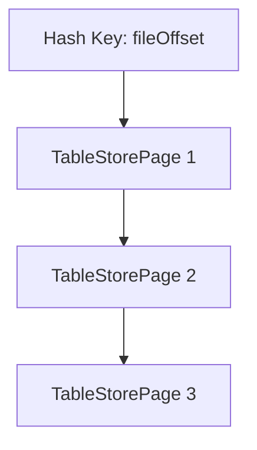

# 页级锁实现

<cite>
**本文档引用的文件**  
- [Table.java](file://src/main/java/io/leavesfly/smallsql/rdb/engine/Table.java)
- [StorePage.java](file://src/main/java/io/leavesfly/smallsql/rdb/engine/store/StorePage.java)
- [TableStorePage.java](file://src/main/java/io/leavesfly/smallsql/rdb/engine/store/TableStorePage.java)
- [SQLTokenizer.java](file://src/main/java/io/leavesfly/smallsql/rdb/sql/parser/SQLTokenizer.java)
- [View.java](file://src/main/java/io/leavesfly/smallsql/rdb/engine/View.java)
</cite>

## 目录
1. [引言](#引言)
2. [核心数据结构设计](#核心数据结构设计)
3. [锁的获取与兼容性规则](#锁的获取与兼容性规则)
4. [可重复读隔离级别下的页级锁行为](#可重复读隔离级别下的页级锁行为)
5. [页锁的链式组织结构](#页锁的链式组织结构)
6. [事务回滚中的锁清理机制](#事务回滚中的锁清理机制)

## 引言
SmallSQL采用基于页式存储的页级锁机制来实现并发控制。该机制通过在`Table`类中维护一个`HashMap<Long, TableStorePage>`类型的`locks`数据结构，为每个数据页提供细粒度的锁定能力。本文档将深入分析该锁机制的设计原理及其在SELECT和UPDATE操作中的应用，重点阐述锁的获取策略、兼容性规则以及在可重复读（REPEATABLE_READ）隔离级别下的作用。

## 核心数据结构设计

`Table`类中的`locks`字段是页级锁机制的核心，其定义如下：

```java
final private HashMap<Long, TableStorePage> locks = new HashMap<Long, TableStorePage>();
```

该哈希表以物理页面的文件偏移量（`fileOffset`）作为键，以`TableStorePage`对象作为值。`TableStorePage`继承自`StorePage`，不仅包含页面数据，还封装了锁相关的信息，包括：

- `lockType`：锁的类型（读锁或写锁）
- `con`：持有锁的连接对象
- `nextLock`：指向同一页面上的下一个锁，形成链式结构

`StorePage`作为锁的载体，通过`fileOffset`字段与物理页面的偏移量直接关联，确保了锁与具体存储位置的一一对应关系。

**本节来源**  
- [Table.java](file://src/main/java/io/leavesfly/smallsql/rdb/engine/Table.java#L59)
- [StorePage.java](file://src/main/java/io/leavesfly/smallsql/rdb/engine/store/StorePage.java#L45)
- [TableStorePage.java](file://src/main/java/io/leavesfly/smallsql/rdb/engine/store/TableStorePage.java#L15)

## 锁的获取与兼容性规则

页级锁的获取通过`requestLockImpl`方法实现，该方法根据操作类型（`pageOperation`）和当前事务的隔离级别来决定是否授予锁。

### 读锁与写锁的获取策略

- **读锁（LOCK_READ）**：在`SELECT`操作中，当事务隔离级别为`REPEATABLE_READ`或更高时，会请求读锁。读锁允许多个事务同时持有，但会阻止写锁的获取。
- **写锁（LOCK_WRITE）**：在`UPDATE`操作中，会直接请求写锁。写锁是独占的，同一时间只能有一个事务持有。

### 兼容性规则

在`requestLockImpl`方法中，对`SELECT`和`UPDATE`操作的处理逻辑体现了锁的兼容性规则：

```java
case SQLTokenizer.SELECT:
case SQLTokenizer.UPDATE: {
    Long pageKey = new Long(page);
    TableStorePage prevLock = null;
    TableStorePage lock = (TableStorePage) locks.get(pageKey);
    TableStorePage usableLock = null;
    while (lock != null) {
        if (lock.con == con || con.isolationLevel <= Connection.TRANSACTION_READ_UNCOMMITTED) {
            usableLock = lock;
        } else {
            if (lock.lockType == LOCK_WRITE) {
                return null; // 写锁被其他连接持有，无法获取
            }
        }
        prevLock = lock;
        lock = lock.nextLock;
    }
    // ... 创建新锁的逻辑
}
```

从上述代码可以看出：
1. 如果目标页面上已存在由其他事务持有的写锁，则当前请求将被拒绝（返回`null`）。
2. 如果当前事务已经持有该页面的锁，或者隔离级别较低（如`READ_UNCOMMITTED`），则可以直接复用现有锁。
3. 否则，将创建一个新的锁对象并加入链表。

**本节来源**  
- [Table.java](file://src/main/java/io/leavesfly/smallsql/rdb/engine/Table.java#L368)
- [SQLTokenizer.java](file://src/main/java/io/leavesfly/smallsql/rdb/sql/parser/SQLTokenizer.java#L410)
- [View.java](file://src/main/java/io/leavesfly/smallsql/rdb/engine/View.java#L70)

## 可重复读隔离级别下的页级锁行为

在可重复读（REPEATABLE_READ）隔离级别下，页级锁的作用尤为关键。当一个事务执行`SELECT`操作时，`requestLockImpl`方法会根据以下条件决定是否获取读锁：

```java
if (con.isolationLevel >= Connection.TRANSACTION_REPEATABLE_READ
    || pageOperation == SQLTokenizer.UPDATE) {
    lock.lockType = pageOperation == SQLTokenizer.UPDATE ? LOCK_WRITE : LOCK_READ;
    // ... 将锁加入哈希表或链表
}
```

这意味着，在`REPEATABLE_READ`级别下，`SELECT`操作会显式地获取读锁。这一机制确保了：
- 同一事务内多次读取同一数据页的结果保持一致。
- 阻止其他事务对该页面进行修改（因为写锁与读锁不兼容），从而避免了不可重复读的问题。

## 页锁的链式组织结构

`TableStorePage`类中的`nextLock`字段构成了页锁的链式组织结构。当多个事务或同一事务内的不同操作需要对同一页面加锁时，这些锁会通过`nextLock`指针链接起来，形成一个单向链表。

这种设计的优势在于：
- **高效管理**：哈希表只存储链表的头节点，减少了内存开销。
- **顺序处理**：可以按顺序遍历同一页面上的所有锁，便于进行锁的检查和清理。
- **支持锁升级**：通过`requestWriteLock`方法，可以将已有的读锁升级为写锁，这在实现复杂的事务逻辑时非常有用。



**图示来源**  
- [TableStorePage.java](file://src/main/java/io/leavesfly/smallsql/rdb/engine/store/TableStorePage.java#L25)

## 事务回滚中的锁清理机制

当事务回滚时，所有由该事务持有的锁都需要被清理。这一过程通过`freeLock`方法实现：

```java
public void freeLock(TableStorePage storePage) {
    final int lockType = storePage.lockType;
    final long fileOffset = storePage.fileOffset;
    synchronized (locks) {
        try {
            // ... 根据锁类型从相应的数据结构中移除
            switch (lockType) {
                case LOCK_READ:
                case LOCK_WRITE:
                    Long pageKey = new Long(fileOffset);
                    // 从链表中移除指定的锁节点
                    // ...
                    break;
                // ... 其他锁类型的处理
            }
        } finally {
            locks.notifyAll();
        }
    }
}
```

`freeLock`方法首先根据锁的类型确定其所在的数据结构（`locks`哈希表或`locksInsert`列表），然后在同步块中安全地将其移除。移除操作需要遍历链表，找到目标节点并调整前后指针，确保链表的完整性。最后，通过`notifyAll()`唤醒所有等待锁的线程，使它们有机会重新竞争锁资源。

**本节来源**  
- [Table.java](file://src/main/java/io/leavesfly/smallsql/rdb/engine/Table.java#L486)