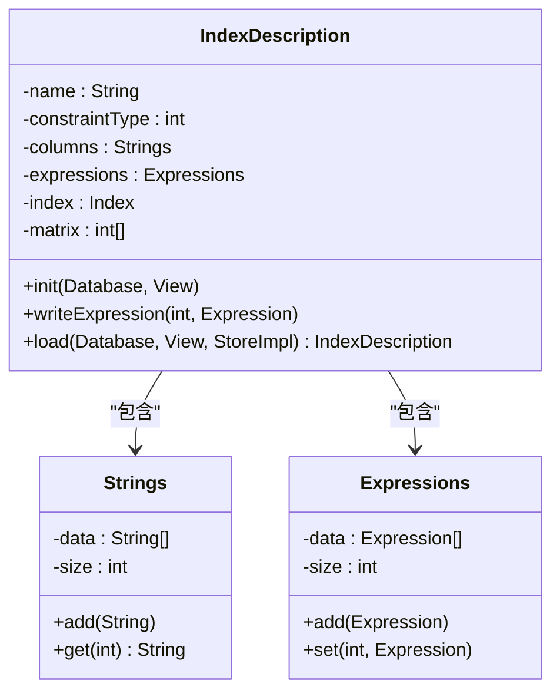
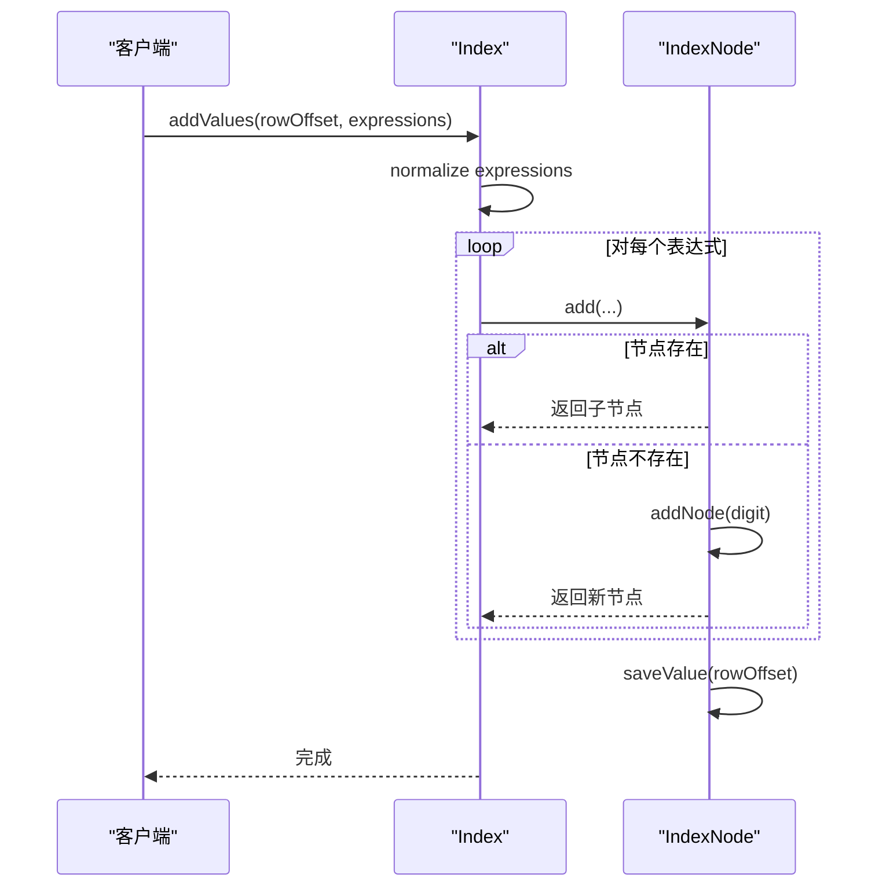

# B+树索引实现

<cite>
**本文档引用的文件**   
- [Index.java](file://src/main/java/io/leavesfly/smallsql/rdb/engine/Index.java)
- [IndexNode.java](file://src/main/java/io/leavesfly/smallsql/rdb/engine/IndexNode.java)
- [FileIndexNode.java](file://src/main/java/io/leavesfly/smallsql/rdb/engine/index/FileIndexNode.java)
- [IndexDescription.java](file://src/main/java/io/leavesfly/smallsql/rdb/engine/index/IndexDescription.java)
- [IndexScrollStatus.java](file://src/main/java/io/leavesfly/smallsql/rdb/engine/IndexScrollStatus.java)
- [StoreImpl.java](file://src/main/java/io/leavesfly/smallsql/rdb/engine/store/StoreImpl.java)
- [LongTreeList.java](file://src/main/java/io/leavesfly/smallsql/util/datastruct/LongTreeList.java)
- [Expressions.java](file://src/main/java/io/leavesfly/smallsql/rdb/sql/expression/Expressions.java)
</cite>

## 目录
1. [引言](#引言)
2. [索引容器与节点结构](#索引容器与节点结构)
3. [节点分裂与合并算法](#节点分裂与合并算法)
4. [文件存储与加载机制](#文件存储与加载机制)
5. [索引元数据定义](#索引元数据定义)
6. [索引操作流程](#索引操作流程)
7. [性能影响分析](#性能影响分析)

## 引言
本文档全面阐述了SmallSQL数据库系统中B+树索引的内部实现机制。B+树作为一种高效的平衡搜索树，被广泛应用于数据库索引以加速数据检索。在SmallSQL中，索引系统由`Index`类作为容器，`IndexNode`类表示树的内部和叶节点，通过`FileIndexNode`实现持久化存储，并由`IndexDescription`管理索引的元数据。本文将深入分析这些核心组件的交互与实现细节，揭示其如何支持高效的查找、插入和删除操作。

## 索引容器与节点结构

`Index`类是B+树索引的顶层容器，负责管理整个索引树的根节点和提供对外的操作接口。它通过一个`IndexNode`类型的`rootPage`字段来指向树的根节点，从而构建起整个索引结构。

`IndexNode`类是构成B+树的基本单元，代表树中的一个节点。每个节点包含以下核心组件：
- **digit**: 一个`char`类型的字段，表示该节点在父节点中的“数字”或“键值”的一部分，用于在树中进行导航。
- **nodes**: 一个`IndexNode`数组，存储指向其子节点的引用。这个数组的大小是动态的，根据节点中存储的键值数量而变化。
- **value**: 一个`Object`类型的字段，其含义根据节点类型而变化。在叶节点中，它存储实际的行偏移量（`Long`）或行偏移量列表（`LongTreeList`）；在内部节点中，它可能指向下一个层级的子树（另一个`IndexNode`）。
- **remainderKey**: 一个`char`数组，用于存储键值的剩余部分。当一个键值不能完全由从根到当前节点的路径上的`digit`序列表示时，其剩余部分就存储在此处，以优化存储空间。
- **unique**: 一个`boolean`标志，指示该索引是否为唯一索引。这决定了`value`字段是存储单个`Long`还是`LongTreeList`。

`Index`和`IndexNode`共同协作，`Index`提供`addValues`、`findRows`和`removeValue`等方法，这些方法最终递归地调用`IndexNode`的`add`、`find`和`removeNode`等私有方法来遍历和修改树结构。

**本节来源**
- [Index.java](file://src/main/java/io/leavesfly/smallsql/rdb/engine/Index.java#L1-L553)
- [IndexNode.java](file://src/main/java/io/leavesfly/smallsql/rdb/engine/IndexNode.java#L1-L468)

## 节点分裂与合并算法

B+树的核心特性是其自平衡能力，这通过节点的分裂（split）和合并（merge）算法来实现。在SmallSQL的实现中，这些操作是隐式完成的，主要体现在`add`和`removeValue`方法的逻辑中。

### 节点分裂
当向一个节点插入新键值时，如果该节点已满（即其`nodes`数组需要扩容），就会触发分裂。在`IndexNode.add`方法中，当需要为一个`digit`创建新节点时，会调用`saveNode`方法。该方法会创建一个新的`IndexNode`数组，将现有节点和新节点按`digit`排序后放入新数组。这个过程本质上就是将一个节点的容量“扩展”，当扩展到一定程度时，逻辑上就等同于将一个满节点分裂成两个节点，并将中间键值上移到父节点。键值的分布策略依赖于`findNodeInsertPos`方法，它使用二分查找来确定新节点在`nodes`数组中的正确插入位置，确保所有子节点按键值有序排列。

### 节点合并
节点合并通常在删除操作后发生，当一个节点的子节点数量过少时，需要与兄弟节点合并以维持树的平衡。在`Index.removeValue`方法中，首先通过`findRows`找到目标叶节点并删除其值。然后，它会从叶子节点向上遍历父节点（通过`nodeList`记录的路径），检查每个节点是否为空（`isEmpty()`）。如果一个节点为空，`removeNode`方法会被调用，将其从父节点的`nodes`数组中移除。这个移除操作会触发父节点的`nodes`数组重新排序和收缩，从而实现了逻辑上的节点合并。当一个内部节点的所有子节点都被移除后，该节点自身也会被移除，从而保证了树的高度不会因删除操作而无限增长。

**本节来源**
- [Index.java](file://src/main/java/io/leavesfly/smallsql/rdb/engine/Index.java#L200-L300)
- [IndexNode.java](file://src/main/java/io/leavesfly/smallsql/rdb/engine/IndexNode.java#L200-L468)

## 文件存储与加载机制

为了实现索引的持久化，SmallSQL使用`FileIndexNode`类来扩展`IndexNode`，使其能够将节点数据存储到文件中。

`FileIndexNode`继承自`IndexNode`，并添加了两个关键字段：
- **file**: 一个`FileChannel`对象，指向用于存储索引数据的文件。
- **fileOffset**: 一个`long`值，表示该节点在文件中的偏移量。

当需要将一个`FileIndexNode`写入文件时，会调用其`save()`方法。该方法会创建一个`StorePage`和`StoreImpl`对象，然后调用`save(StoreImpl)`方法（由父类`IndexNode`定义）将节点的`digit`、`remainderKey`、`value`和`nodes`等信息序列化到`StoreImpl`中。序列化完成后，数据被写入文件，`fileOffset`被更新为实际的写入位置。

加载机制则相反。`loadRootNode`静态方法用于从文件的指定偏移量加载根节点。它首先读取节点的`digit`，然后调用`load(StoreImpl)`方法（由`IndexNode`定义）来反序列化节点的其余部分。在反序列化过程中，当遇到`value`或`nodes`中的`IndexNode`引用时，`loadRef(long offset)`方法会被调用，它会递归地从文件的`offset`位置加载对应的子节点。这种机制确保了整个B+树可以从磁盘上按需重建。

```mermaid
graph TD
A[开始] --> B[调用 FileIndexNode.save()]
B --> C[创建 StoreImpl 实例]
C --> D[调用 IndexNode.save(StoreImpl)]
D --> E[序列化 digit, remainderKey, value]
E --> F[遍历 nodes 数组]
F --> G[对每个子节点调用 saveRef(StoreImpl)]
G --> H[写入文件并更新 fileOffset]
H --> I[结束]
```

**图示来源**
- [FileIndexNode.java](file://src/main/java/io/leavesfly/smallsql/rdb/engine/index/FileIndexNode.java#L1-L103)
- [IndexNode.java](file://src/main/java/io/leavesfly/smallsql/rdb/engine/IndexNode.java#L400-L468)
- [StoreImpl.java](file://src/main/java/io/leavesfly/smallsql/rdb/engine/store/StoreImpl.java#L1-L799)

## 索引元数据定义

`IndexDescription`类负责定义和管理索引的元数据，它是索引在数据库逻辑层面的描述。

其核心字段包括：
- **name**: 索引的名称。
- **constraintType**: 索引的类型，如主键（PRIMARY）、唯一（UNIQUE）或普通索引（INDEX）。
- **columns**: 一个`Strings`对象，存储构成该索引的列名列表。
- **expressions**: 一个`Expressions`对象，存储与`columns`对应的表达式，用于在插入或更新时计算索引键值。
- **matrix**: 一个`int`数组，用于建立表列与索引列之间的映射关系。`matrix[i] = j`表示表的第`i`列对应索引的第`j`列。

`IndexDescription`的`init`方法在创建索引时被调用，它会遍历表的列，通过`findColumnIdx`找到每个索引列在表中的位置，并填充`matrix`数组。这样，当表的一行数据发生变化时，`writeExpression`方法可以根据`matrix`快速定位到需要更新的索引表达式，从而高效地维护索引一致性。



**图示来源**
- [IndexDescription.java](file://src/main/java/io/leavesfly/smallsql/rdb/engine/index/IndexDescription.java#L1-L292)
- [Strings.java](file://src/main/java/io/leavesfly/smallsql/rdb/sql/datatype/Strings.java)
- [Expressions.java](file://src/main/java/io/leavesfly/smallsql/rdb/sql/expression/Expressions.java)

## 索引操作流程

### 查找操作
查找操作由`Index.findRows`方法启动。它接收一个`Expressions`对象，该对象包含了要查找的键值。方法从根节点开始，根据键值的数据类型（如整数、字符串、浮点数等），调用相应的`normalize`函数（如`intToBinarySortOrder`、`stringToBinarySortOrder`）将其转换为具有二进制排序顺序的中间表示。然后，`find`方法会逐位（`digit`）遍历这个中间表示，通过`getChildNode`在树中向下导航，直到找到匹配的叶节点，最终返回关联的行偏移量或行偏移量列表。

### 插入操作
插入操作由`Index.addValues`方法处理。它同样接收键值和行偏移量。流程与查找类似，首先将键值规范化，然后在树中导航。如果路径上的节点不存在，则会创建新节点。当到达叶节点时，会调用`saveValue`方法将行偏移量存储在`value`字段中。对于非唯一索引，`value`是一个`LongTreeList`，可以存储多个行偏移量。

### 删除操作
删除操作由`Index.removeValue`方法执行。它首先通过`findRows`定位到存储目标行偏移量的叶节点。对于非唯一索引，它会从`LongTreeList`中移除该行偏移量。如果移除后`LongTreeList`为空，则调用`clearValue`清空`value`。接着，算法会向上遍历父节点，如果发现某个节点变为空（`isEmpty()`），则通过`removeNode`将其从父节点中移除，从而触发树的重构。



**图示来源**
- [Index.java](file://src/main/java/io/leavesfly/smallsql/rdb/engine/Index.java#L100-L300)
- [IndexNode.java](file://src/main/java/io/leavesfly/smallsql/rdb/engine/IndexNode.java#L200-L300)

## 性能影响分析

B+树索引显著提升了查询性能，特别是对于`WHERE`、`ORDER BY`和`JOIN`操作。查找、插入和删除操作的时间复杂度均为O(log n)，其中n是索引中的键值数量，这比全表扫描的O(n)要高效得多。

然而，索引也带来了额外的开销：
1.  **存储开销**: 每个索引都需要额外的磁盘空间来存储B+树结构和行偏移量。
2.  **写入开销**: 每次对表进行`INSERT`、`UPDATE`或`DELETE`操作时，所有相关的索引都必须被更新，这会增加写操作的延迟。
3.  **维护开销**: 节点的分裂和合并是相对昂贵的操作，尽管它们不频繁发生，但在高并发写入场景下仍可能成为瓶颈。

因此，合理设计索引至关重要。应为经常用于查询条件的列创建索引，但避免为更新频繁且查询不频繁的列创建索引，以在查询性能和写入性能之间取得平衡。