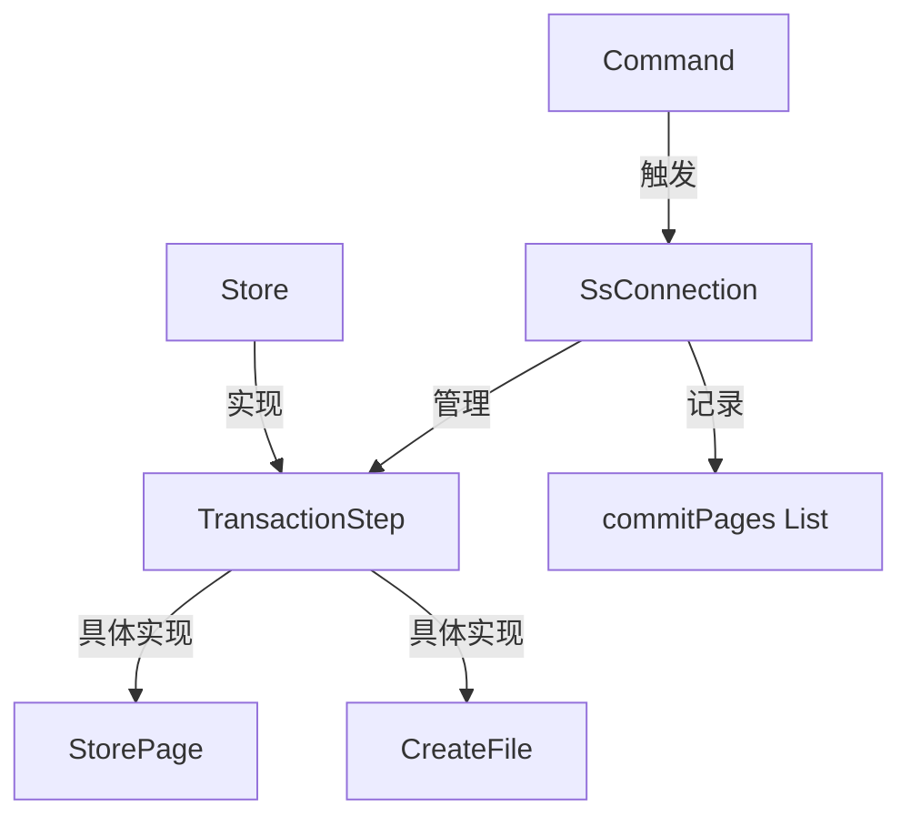
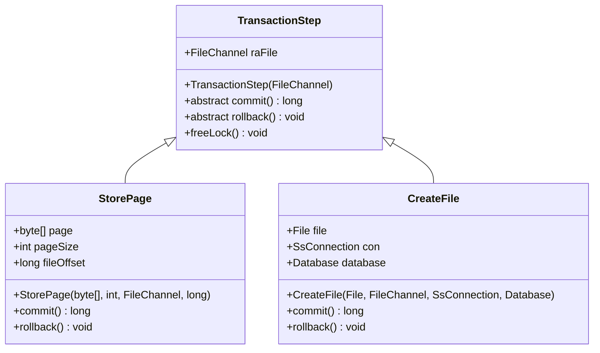
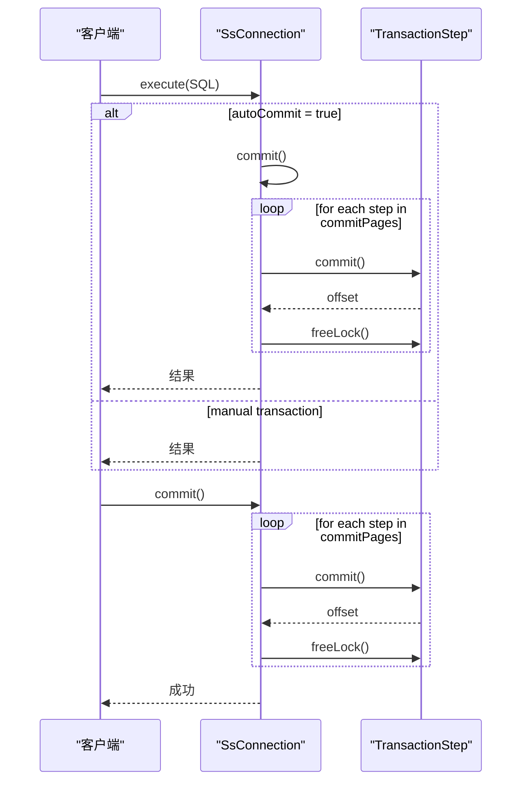
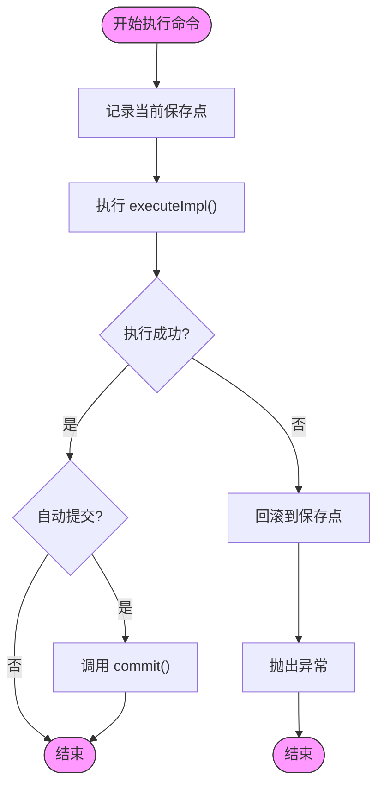

# 事务机制

<cite>
**本文档中引用的文件**  
- [TransactionStep.java](file://src/main/java/io/leavesfly/smallsql/rdb/engine/TransactionStep.java)
- [SsConnection.java](file://src/main/java/io/leavesfly/smallsql/jdbc/SsConnection.java)
- [Command.java](file://src/main/java/io/leavesfly/smallsql/rdb/command/Command.java)
- [Store.java](file://src/main/java/io/leavesfly/smallsql/rdb/engine/Store.java)
- [StorePage.java](file://src/main/java/io/leavesfly/smallsql/rdb/engine/store/StorePage.java)
- [CreateFile.java](file://src/main/java/io/leavesfly/smallsql/rdb/engine/store/CreateFile.java)
</cite>

## 目录
1. [引言](#引言)
2. [事务机制总体架构](#事务机制总体架构)
3. [事务步骤管理](#事务步骤管理)
4. [连接层事务控制](#连接层事务控制)
5. [命令执行与事务关联](#命令执行与事务关联)
6. [存储层事务一致性](#存储层事务一致性)
7. [日志与恢复机制](#日志与恢复机制)
8. [总结](#总结)

## 引言
SmallSQL 是一个轻量级的 Java 数据库管理系统，其事务机制设计旨在确保数据操作的 ACID（原子性、一致性、隔离性、持久性）特性。本文档系统化地文档化 SmallSQL 的事务处理机制，重点说明 `TransactionStep` 类如何记录事务中的每一步操作，支持回滚和提交；分析 `SsConnection` 如何管理事务生命周期，包括自动提交模式和手动事务控制；探讨命令执行（`Command`）与事务步骤的关联机制，以及 `Store` 在事务中如何保证数据一致性。同时涵盖日志记录策略、检查点机制和崩溃恢复流程，为开发者提供事务可靠性保障的理解基础。

## 事务机制总体架构

SmallSQL 的事务机制由多个核心组件协同工作，形成一个完整的事务处理体系。主要组件包括：

- **SsConnection**：负责管理事务的生命周期，提供提交、回滚、保存点等接口。
- **TransactionStep**：抽象类，表示事务中的一个操作步骤，具体实现类负责记录对数据页或文件的修改。
- **Command**：SQL 命令的抽象基类，执行时会触发事务步骤的添加。
- **Store** 及其子类：负责数据的存储和访问，与事务步骤紧密关联。

**图示来源**  
- [SsConnection.java](file://src/main/java/io/leavesfly/smallsql/jdbc/SsConnection.java#L1-L715)
- [TransactionStep.java](file://src/main/java/io/leavesfly/smallsql/rdb/engine/TransactionStep.java#L1-L57)
- [StorePage.java](file://src/main/java/io/leavesfly/smallsql/rdb/engine/store/StorePage.java#L1-L90)
- [CreateFile.java](file://src/main/java/io/leavesfly/smallsql/rdb/engine/store/CreateFile.java#L1-L95)

**本节来源**  
- [SsConnection.java](file://src/main/java/io/leavesfly/smallsql/jdbc/SsConnection.java#L1-L715)
- [TransactionStep.java](file://src/main/java/io/leavesfly/smallsql/rdb/engine/TransactionStep.java#L1-L57)

## 事务步骤管理

`TransactionStep` 是事务机制的核心抽象类，定义了事务步骤的基本行为。每个事务步骤代表对数据库的一个修改操作，如数据页的写入或文件的创建。

### 核心方法
- **commit()**：抽象方法，由子类实现具体的提交逻辑，将修改持久化到存储介质。
- **rollback()**：抽象方法，由子类实现回滚逻辑，撤销该步骤的修改。
- **freeLock()**：释放该步骤持有的锁资源，默认为空实现。

### 子类实现
- **StorePage**：继承自 `TransactionStep`，表示对数据页的修改。`commit()` 方法将页数据写入文件通道，`rollback()` 方法通过置空文件通道实现回滚。
- **CreateFile**：表示创建数据库文件的操作。`commit()` 方法仅标记成功，`rollback()` 方法则关闭文件通道并删除文件。

**图示来源**  
- [TransactionStep.java](file://src/main/java/io/leavesfly/smallsql/rdb/engine/TransactionStep.java#L35-L56)
- [StorePage.java](file://src/main/java/io/leavesfly/smallsql/rdb/engine/store/StorePage.java#L50-L90)
- [CreateFile.java](file://src/main/java/io/leavesfly/smallsql/rdb/engine/store/CreateFile.java#L50-L95)

**本节来源**  
- [TransactionStep.java](file://src/main/java/io/leavesfly/smallsql/rdb/engine/TransactionStep.java#L1-L57)
- [StorePage.java](file://src/main/java/io/leavesfly/smallsql/rdb/engine/store/StorePage.java#L1-L90)
- [CreateFile.java](file://src/main/java/io/leavesfly/smallsql/rdb/engine/store/CreateFile.java#L1-L95)

## 连接层事务控制

`SsConnection` 类实现了 `java.sql.Connection` 接口，是事务控制的入口。它通过 `commitPages` 列表管理当前事务中的所有 `TransactionStep`。

### 自动提交模式
当 `autoCommit` 为 `true` 时，每个 SQL 命令执行后会自动提交。`setAutoCommit()` 方法在切换模式时会先提交当前事务。

### 手动事务控制
- **commit()**：遍历 `commitPages` 中的所有 `TransactionStep`，依次调用其 `commit()` 方法，然后调用 `freeLock()` 并清空列表。
- **rollback()**：遍历 `commitPages` 中的所有 `TransactionStep`，依次调用其 `rollback()` 和 `freeLock()` 方法，然后清空列表。
- **保存点（Savepoint）**：通过 `rollback(int savepoint)` 方法实现回滚到指定保存点，移除保存点之后的所有事务步骤并回滚。

**图示来源**  
- [SsConnection.java](file://src/main/java/io/leavesfly/smallsql/jdbc/SsConnection.java#L256-L317)
- [TransactionStep.java](file://src/main/java/leavesfly/smallsql/rdb/engine/TransactionStep.java#L45-L56)

**本节来源**  
- [SsConnection.java](file://src/main/java/io/leavesfly/smallsql/jdbc/SsConnection.java#L1-L715)

## 命令执行与事务关联

`Command` 类是所有 SQL 命令的基类。其 `execute()` 方法实现了事务的自动管理。

### 执行流程
1. 记录当前保存点。
2. 调用 `executeImpl()` 执行具体命令逻辑。
3. 若发生异常，回滚到保存点。
4. 若为自动提交模式，则提交事务。

此机制确保了单个命令的原子性，并与连接层的事务控制无缝集成。

**图示来源**  
- [Command.java](file://src/main/java/io/leavesfly/smallsql/rdb/command/Command.java#L150-L170)

**本节来源**  
- [Command.java](file://src/main/java/io/leavesfly/smallsql/rdb/command/Command.java#L1-L190)

## 存储层事务一致性

`Store` 类是数据存储的抽象基类，其子类（如 `StoreImpl`）在执行数据修改操作（如 `deleteRow()`）时，会创建相应的 `TransactionStep`（如 `StorePage`）并添加到 `SsConnection` 的 `commitPages` 中。

### 数据一致性保障
- **延迟写入**：修改首先记录在内存中的页（`StorePage.page`），只有在 `commit()` 时才写入文件。
- **原子性**：`StorePage.commit()` 方法使用同步块确保文件写入的原子性。
- **资源管理**：通过 `freeLock()` 方法释放锁，避免资源泄漏。

**本节来源**  
- [Store.java](file://src/main/java/io/leavesfly/smallsql/rdb/engine/Store.java#L1-L90)
- [StorePage.java](file://src/main/java/io/leavesfly/smallsql/rdb/engine/store/StorePage.java#L1-L90)

## 日志与恢复机制

SmallSQL 的事务机制本身具备一定的日志和恢复能力，主要体现在：

### 日志记录
- **操作日志**：通过 `Logger` 类记录 `commit` 和 `rollback` 等关键操作。
- **参数日志**：在调试模式下，记录预编译语句的参数值。

### 恢复流程
- **崩溃恢复**：由于数据修改在 `commit()` 时才写入文件，未提交的事务在重启后自然丢失，保证了持久性。
- **文件删除恢复**：`rollbackFile()` 方法专门处理文件被删除的情况，回滚所有对该文件的修改。

**本节来源**  
- [SsConnection.java](file://src/main/java/io/leavesfly/smallsql/jdbc/SsConnection.java#L260-L261)
- [SsConnection.java](file://src/main/java/io/leavesfly/smallsql/jdbc/SsConnection.java#L285-L295)

## 总结
SmallSQL 的事务机制通过 `TransactionStep` 抽象、`SsConnection` 管理和 `Command` 执行流程的紧密结合，有效地实现了 ACID 特性。其设计简洁而高效，利用文件通道和内存页的结合，保证了数据的一致性和可靠性。开发者可以基于此机制理解事务的生命周期、回滚原理和数据持久化过程，为应用开发和问题排查提供坚实的基础。