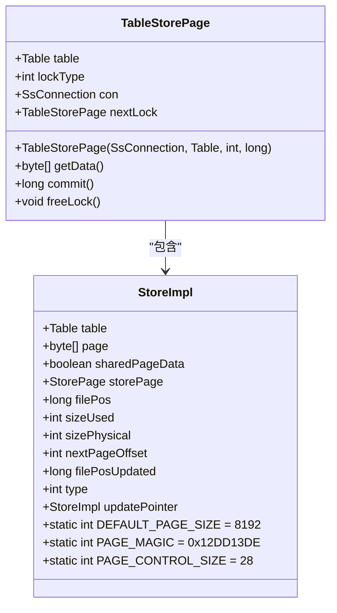
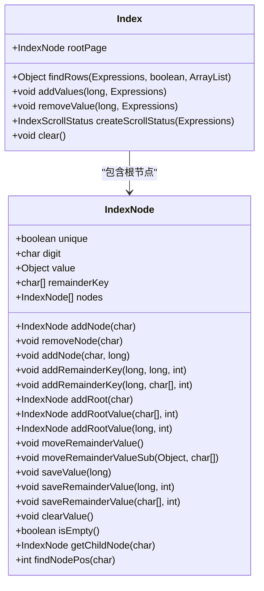
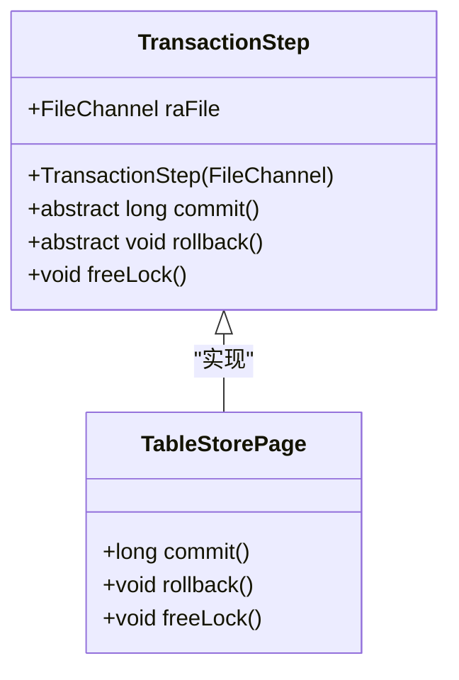
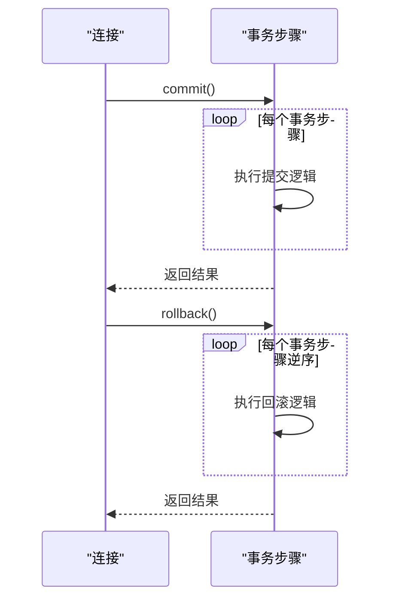
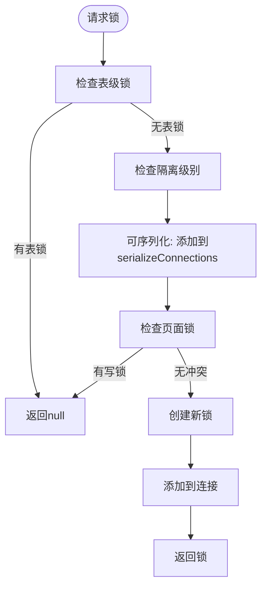

# 存储引擎原理

<cite>
**本文档引用的文件**  
- [Table.java](file://src/main/java/io/leavesfly/smallsql/rdb/engine/Table.java)
- [StoreImpl.java](file://src/main/java/io/leavesfly/smallsql/rdb/engine/store/StoreImpl.java)
- [IndexNode.java](file://src/main/java/io/leavesfly/smallsql/rdb/engine/IndexNode.java)
- [Index.java](file://src/main/java/io/leavesfly/smallsql/rdb/engine/Index.java)
- [TransactionStep.java](file://src/main/java/io/leavesfly/smallsql/rdb/engine/TransactionStep.java)
- [SsConnection.java](file://src/main/java/io/leavesfly/smallsql/jdbc/SsConnection.java)
- [Lobs.java](file://src/main/java/io/leavesfly/smallsql/rdb/engine/table/Lobs.java)
- [TableStorePage.java](file://src/main/java/io/leavesfly/smallsql/rdb/engine/store/TableStorePage.java)
</cite>

## 目录
1. [引言](#引言)
2. [存储文件组织结构](#存储文件组织结构)
3. [页式存储管理机制](#页式存储管理机制)
4. [B+树索引实现](#b树索引实现)
5. [事务管理机制](#事务管理机制)
6. [并发控制与锁机制](#并发控制与锁机制)
7. [LOB存储管理](#lob存储管理)
8. [性能优化建议](#性能优化建议)

## 引言
本文档深入解析SmallSQL存储引擎的底层实现机制，涵盖基于文件的存储格式、页式存储管理、B+树索引实现、事务管理以及并发控制等核心组件。通过系统化的分析，为开发者提供全面的技术参考。

## 存储文件组织结构
SmallSQL采用基于文件的存储架构，每个数据库对象对应独立的文件。数据库表以二进制文件形式存储，包含表头信息和数据页。表头记录了列定义、索引描述等元数据，数据页则存储实际的行数据。LOB（大对象）数据存储在单独的文件中，通过引用机制与主表关联。

**Section sources**
- [Table.java](file://src/main/java/io/leavesfly/smallsql/rdb/engine/Table.java#L68-L99)
- [Lobs.java](file://src/main/java/io/leavesfly/smallsql/rdb/engine/table/Lobs.java#L37-L59)

## 页式存储管理机制
### TableStorePage实现
存储引擎采用页式管理机制，页面大小为8KB（1024*8字节）。每个页面包含28字节的控制块，存储页面魔数、状态、使用大小、物理大小、下一页偏移和更新页面位置等信息。

**Diagram sources**
- [TableStorePage.java](file://src/main/java/io/leavesfly/smallsql/rdb/engine/store/TableStorePage.java#L36-L78)
- [StoreImpl.java](file://src/main/java/io/leavesfly/smallsql/rdb/engine/store/StoreImpl.java#L55-L82)

### 页面状态管理
页面支持四种状态：NORMAL（正常）、DELETED（已删除）、UPDATE_POINTER（更新指针）和UPDATED_PAGE（更新页面）。当更新导致数据变大时，原页面变为UPDATE_POINTER，指向新的UPDATED_PAGE，确保行位置不变。

**Section sources**
- [StoreImpl.java](file://src/main/java/io/leavesfly/smallsql/rdb/engine/store/StoreImpl.java#L55-L80)
- [StoreImpl.java](file://src/main/java/io/leavesfly/smallsql/rdb/engine/store/StoreImpl.java#L165-L209)

## B+树索引实现
### IndexNode结构
B+树索引节点（IndexNode）采用前缀压缩技术，通过remainderKey存储剩余键值，减少树的深度。节点支持添加、删除和查找操作，包括节点分裂和合并的完整实现。

**Diagram sources**
- [IndexNode.java](file://src/main/java/io/leavesfly/smallsql/rdb/engine/IndexNode.java#L169-L324)
- [Index.java](file://src/main/java/io/leavesfly/smallsql/rdb/engine/Index.java#L70-L110)

### 索引操作算法
索引支持多列复合索引，通过二进制排序顺序实现高效查找。对于不同数据类型，采用相应的二进制转换函数（如floatToBinarySortOrder、doubleToBinarySortOrder等）确保正确的排序行为。

**Section sources**
- [Index.java](file://src/main/java/io/leavesfly/smallsql/rdb/engine/Index.java#L145-L178)
- [Index.java](file://src/main/java/io/leavesfly/smallsql/rdb/engine/Index.java#L224-L258)

## 事务管理机制
### TransactionStep抽象
事务管理基于TransactionStep抽象类实现，每个事务步骤关联一个文件通道（FileChannel），并定义了commit和rollback的抽象方法。具体的事务步骤（如页面更新）通过继承实现这些方法。

**Diagram sources**
- [TransactionStep.java](file://src/main/java/io/leavesfly/smallsql/rdb/engine/TransactionStep.java#L35-L56)
- [TableStorePage.java](file://src/main/java/io/leavesfly/smallsql/rdb/engine/store/TableStorePage.java#L36-L78)

### 事务提交与回滚
事务提交时，按顺序执行所有事务步骤的commit方法，然后释放锁。回滚时，逆序执行rollback方法。支持保存点回滚，可回滚到指定的保存点位置。

**Diagram sources**
- [SsConnection.java](file://src/main/java/io/leavesfly/smallsql/jdbc/SsConnection.java#L256-L283)
- [SsConnection.java](file://src/main/java/io/leavesfly/smallsql/jdbc/SsConnection.java#L285-L317)

## 并发控制与锁机制
### 锁类型与粒度
存储引擎实现多级锁机制：
- **行级锁**：通过TableStorePage实现，支持读锁和写锁
- **页级锁**：在页面级别进行锁定
- **表级锁**：通过LOCK_TAB实现，用于DDL操作

### 锁管理实现
锁管理采用链表结构，支持锁升级（从读锁到写锁）。请求锁时，根据隔离级别和操作类型进行检查，确保事务的ACID属性。

**Diagram sources**
- [Table.java](file://src/main/java/io/leavesfly/smallsql/rdb/engine/Table.java#L325-L376)
- [Table.java](file://src/main/java/io/leavesfly/smallsql/rdb/engine/Table.java#L415-L456)

**Section sources**
- [Table.java](file://src/main/java/io/leavesfly/smallsql/rdb/engine/Table.java#L378-L418)
- [Table.java](file://src/main/java/io/leavesfly/smallsql/rdb/engine/Table.java#L486-L524)

## LOB存储管理
LOB数据存储在独立的文件中，文件名通过Utils.createLobFileName生成。主表通过长整型文件位置引用LOB数据，实现高效的大对象管理。

**Section sources**
- [Lobs.java](file://src/main/java/io/leavesfly/smallsql/rdb/engine/table/Lobs.java#L37-L59)
- [StoreImpl.java](file://src/main/java/io/leavesfly/smallsql/rdb/engine/store/StoreImpl.java#L597-L637)

## 性能优化建议
1. **索引设计**：合理设计复合索引，利用前缀压缩特性
2. **页面大小**：8KB的页面大小适合大多数工作负载
3. **事务管理**：尽量减少事务范围，避免长时间持有锁
4. **LOB处理**：大对象存储独立文件，减少主表I/O压力
5. **缓存策略**：利用页面共享机制提高读取性能