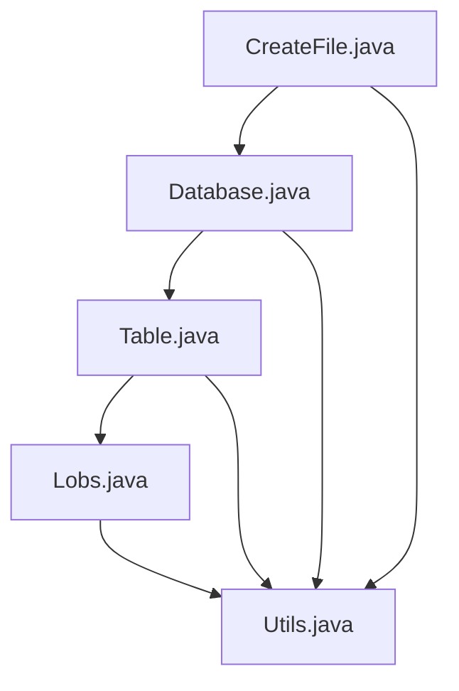
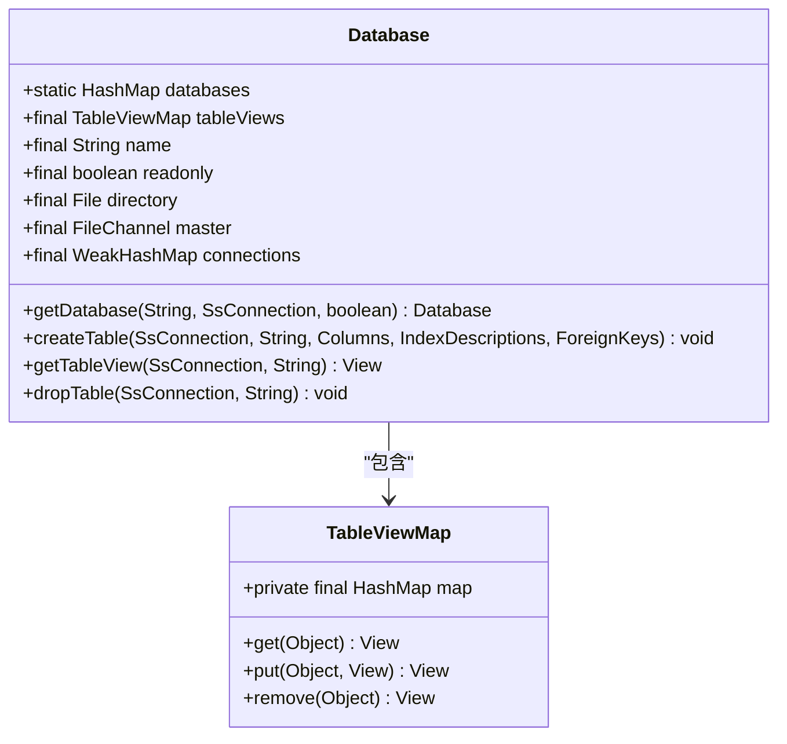
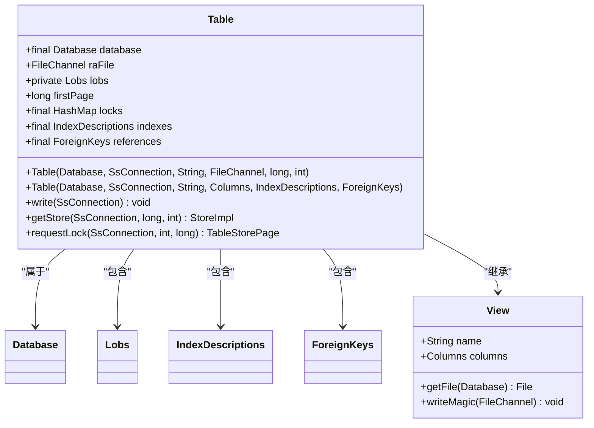
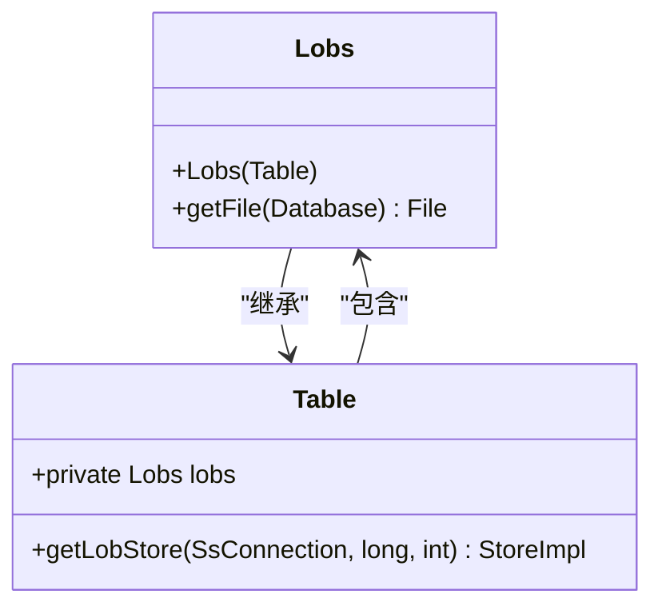
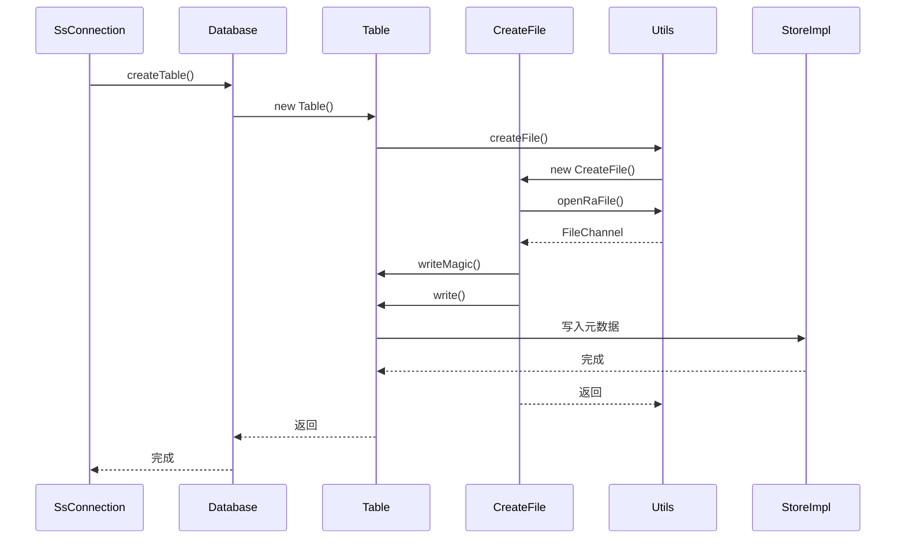

# 文件组织结构

<cite>
**本文档中引用的文件**  
- [Database.java](file://src/main/java/io/leavesfly/smallsql/rdb/engine/Database.java)
- [Table.java](file://src/main/java/io/leavesfly/smallsql/rdb/engine/Table.java)
- [Lobs.java](file://src/main/java/io/leavesfly/smallsql/rdb/engine/table/Lobs.java)
- [CreateFile.java](file://src/main/java/io/leavesfly/smallsql/rdb/engine/store/CreateFile.java)
- [Utils.java](file://src/main/java/io/leavesfly/smallsql/util/Utils.java)
</cite>

## 目录
1. [项目结构](#项目结构)
2. [数据库目录与文件布局](#数据库目录与文件布局)
3. [Database类的元数据管理](#database类的元数据管理)
4. [Table类与物理文件映射](#table类与物理文件映射)
5. [Lobs类的大对象存储策略](#lobs类的大对象存储策略)
6. [文件创建与初始化流程](#文件创建与初始化流程)
7. [文件头信息与格式说明](#文件头信息与格式说明)

## 项目结构



**图示来源**  
- [Database.java](file://src/main/java/io/leavesfly/smallsql/rdb/engine/Database.java)
- [Table.java](file://src/main/java/io/leavesfly/smallsql/rdb/engine/Table.java)
- [Lobs.java](file://src/main/java/io/leavesfly/smallsql/rdb/engine/table/Lobs.java)
- [CreateFile.java](file://src/main/java/io/leavesfly/smallsql/rdb/engine/store/CreateFile.java)
- [Utils.java](file://src/main/java/io/leavesfly/smallsql/util/Utils.java)

**本节来源**  
- [Database.java](file://src/main/java/io/leavesfly/smallsql/rdb/engine/Database.java)
- [Table.java](file://src/main/java/io/leavesfly/smallsql/rdb/engine/Table.java)

## 数据库目录与文件布局

SmallSQL数据库采用基于文件系统的物理存储布局，每个数据库对应一个独立的目录。数据库目录中包含以下类型的文件：

- **主控文件**：名为`master`的文件，用于标识数据库目录的有效性
- **表文件**：以`.ss`为扩展名的文件，存储表结构和数据
- **LOB文件**：以`.lob`为扩展名的文件，存储大对象数据
- **索引文件**：作为表文件的一部分，不单独存在

文件命名规则由`Utils`类中的常量定义：
- `MASTER_FILENAME`：主控文件名，值为"master"
- `TABLE_VIEW_EXTENTION`：表文件扩展名，值为".ss"
- `LOB_EXTENTION`：LOB文件扩展名，值为".lob"

数据库目录的组织结构示例如下：
```
/mydatabase/
├── master
├── users.ss
├── users.lob
├── products.ss
├── products.lob
└── orders.ss
```

**本节来源**  
- [Database.java](file://src/main/java/io/leavesfly/smallsql/rdb/engine/Database.java#L50-L60)
- [Utils.java](file://src/main/java/io/leavesfly/smallsql/util/Utils.java)

## Database类的元数据管理

`Database`类负责管理多个表的元数据，是数据库系统的核心管理组件。其主要功能包括：

- **单例模式管理**：通过静态`HashMap`维护所有打开的数据库实例，确保每个数据库在内存中只有一个实例
- **表缓存管理**：使用`TableViewMap`（基于`HashMap`）缓存已加载的表和视图对象
- **连接跟踪**：通过`WeakHashMap`跟踪引用该数据库的所有连接，当所有连接关闭时自动卸载数据库

`Database`类的关键字段包括：
- `tableViews`：存储表和视图的映射表
- `name`：数据库名称
- `readonly`：只读标志
- `directory`：数据库目录文件对象
- `master`：主控文件的文件通道

当创建新表时，`Database`类会实例化`Table`对象并将其添加到`tableViews`缓存中。表的元数据（列定义、索引、外键等）在`Table`对象中维护，而`Database`类负责整体的生命周期管理。



**图示来源**  
- [Database.java](file://src/main/java/io/leavesfly/smallsql/rdb/engine/Database.java#L45-L60)
- [TableViewMap.java](file://src/main/java/io/leavesfly/smallsql/rdb/engine/table/TableViewMap.java#L45)

**本节来源**  
- [Database.java](file://src/main/java/io/leavesfly/smallsql/rdb/engine/Database.java#L45-L564)

## Table类与物理文件映射

`Table`类是表在内存中的表示，直接映射到物理文件系统。其核心设计特点包括：

- **文件通道管理**：`raFile`字段持有表文件的`FileChannel`，用于随机访问文件内容
- **数据页管理**：通过`TableStorePage`和`StoreImpl`类管理数据页的读写操作
- **锁机制**：实现细粒度的页级锁，支持多线程并发访问

`Table`类的构造函数有两种主要形式：
1. **读取现有表**：从已存在的文件中读取表结构和数据
2. **创建新表**：初始化新的表文件并写入元数据

表文件的物理结构包括：
- **文件头**：8字节，包含魔数和版本号
- **元数据区**：存储列定义、索引描述等元数据
- **数据区**：从`firstPage`偏移量开始，存储实际的数据行

`Table`类通过`getFile()`方法确定表文件的物理路径，该方法委托给`Utils.createTableViewFileName()`工具方法生成标准的文件名。



**图示来源**  
- [Table.java](file://src/main/java/io/leavesfly/smallsql/rdb/engine/Table.java#L59-L607)
- [Database.java](file://src/main/java/io/leavesfly/smallsql/rdb/engine/Database.java)

**本节来源**  
- [Table.java](file://src/main/java/io/leavesfly/smallsql/rdb/engine/Table.java#L59-L607)

## Lobs类的大对象存储策略

`Lobs`类专门负责管理大对象（LOB）数据的存储，其设计特点包括：

- **继承关系**：`Lobs`类继承自`Table`类，复用表的基本文件操作机制
- **专用文件**：每个表的LOB数据存储在独立的`.lob`文件中，与主表文件分离
- **延迟初始化**：`lobs`字段在首次访问时才创建，优化资源使用

`Lobs`类的核心方法是`getStore()`，它获取LOB数据的存储通道。当访问包含LOB类型的列时，系统会通过`Table.getLobStore()`方法获取`Lobs`实例，进而进行LOB数据的读写操作。

`Lobs`类重写了`getFile()`方法，使用`Utils.createLobFileName()`生成LOB文件的路径，确保与主表文件的命名一致性。



**图示来源**  
- [Lobs.java](file://src/main/java/io/leavesfly/smallsql/rdb/engine/table/Lobs.java#L44-L59)
- [Table.java](file://src/main/java/io/leavesfly/smallsql/rdb/engine/Table.java)

**本节来源**  
- [Lobs.java](file://src/main/java/io/leavesfly/smallsql/rdb/engine/table/Lobs.java#L44-L59)

## 文件创建与初始化流程

文件创建过程由`CreateFile`类和`Utils`工具类协同完成，主要流程如下：

1. **事务步骤封装**：`CreateFile`类继承自`TransactionStep`，将文件创建操作包装为事务步骤
2. **文件通道创建**：通过`Utils.openRaFile()`方法创建随机访问文件通道
3. **魔数写入**：调用`writeMagic()`方法写入8字节的文件头（魔数和版本号）
4. **元数据写入**：写入列定义、索引等表结构元数据
5. **事务提交**：完成初始化后提交事务，确保数据一致性

`CreateFile`类的`rollback()`方法实现了创建失败时的回滚逻辑，包括：
- 关闭文件通道
- 删除已创建的文件
- 从数据库缓存中移除表名

文件创建的原子性由文件系统的rename操作保证，在`Database.replaceTable()`方法中通过临时文件和重命名实现。



**图示来源**  
- [CreateFile.java](file://src/main/java/io/leavesfly/smallsql/rdb/engine/store/CreateFile.java#L46-L95)
- [Table.java](file://src/main/java/io/leavesfly/smallsql/rdb/engine/Table.java)
- [Utils.java](file://src/main/java/io/leavesfly/smallsql/util/Utils.java)

**本节来源**  
- [CreateFile.java](file://src/main/java/io/leavesfly/smallsql/rdb/engine/store/CreateFile.java#L46-L95)

## 文件头信息与格式说明

SmallSQL的文件头采用统一的8字节格式，包含以下信息：

| 偏移量 | 长度 | 内容 | 说明 |
|--------|------|------|------|
| 0 | 4字节 | 魔数 | 标识文件类型，表文件为特定值 |
| 4 | 4字节 | 版本号 | 文件格式版本，TABLE_VIEW_VERSION |

文件格式的关键特征：
- **魔数验证**：确保文件是有效的SmallSQL表文件
- **版本兼容**：支持向后兼容的版本管理
- **固定头部**：简化文件解析逻辑

表文件的完整结构布局：
1. **文件头**（8字节）：魔数 + 版本号
2. **元数据区**：列数量 + 列定义 + 索引描述 + 其他元数据
3. **数据区**：从`firstPage`（通常为8）开始的数据页

这种设计确保了文件的可移植性和可靠性，同时支持高效的随机访问和增量写入。

**本节来源**  
- [Table.java](file://src/main/java/io/leavesfly/smallsql/rdb/engine/Table.java#L59-L607)
- [CreateFile.java](file://src/main/java/io/leavesfly/smallsql/rdb/engine/store/CreateFile.java)
- [Utils.java](file://src/main/java/io/leavesfly/smallsql/util/Utils.java)