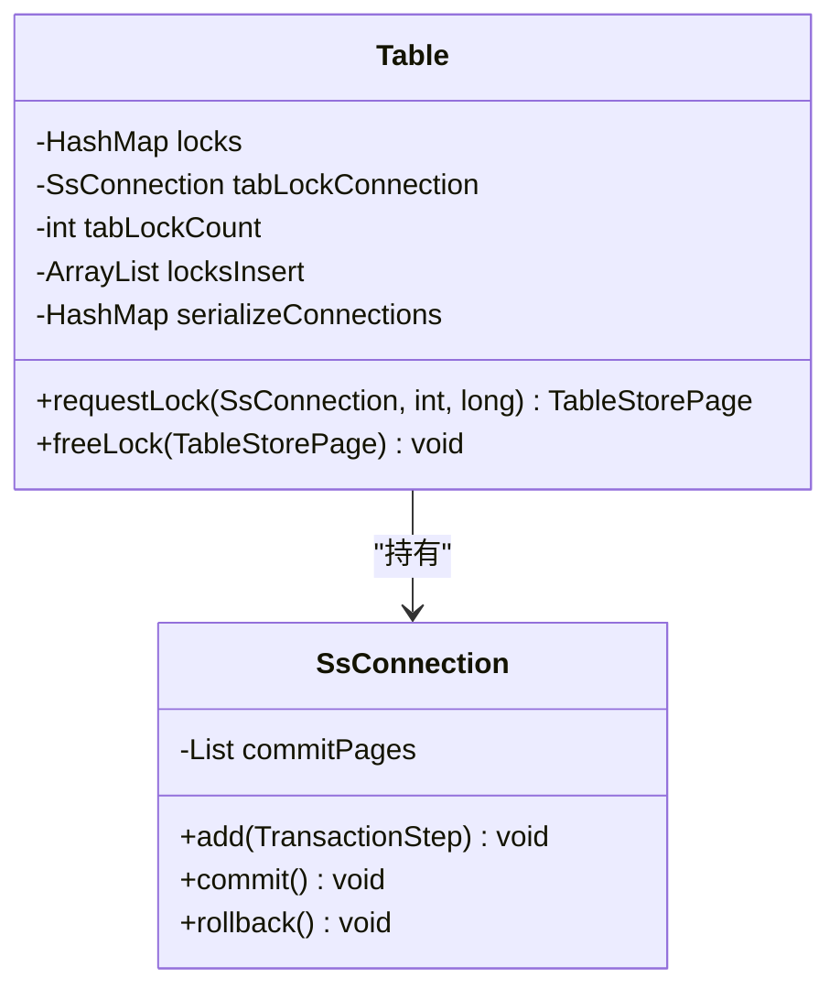
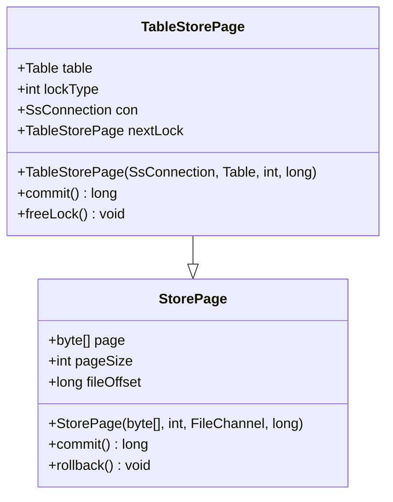
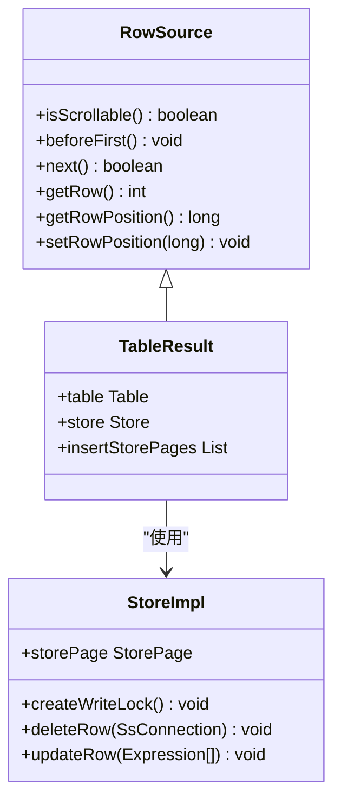
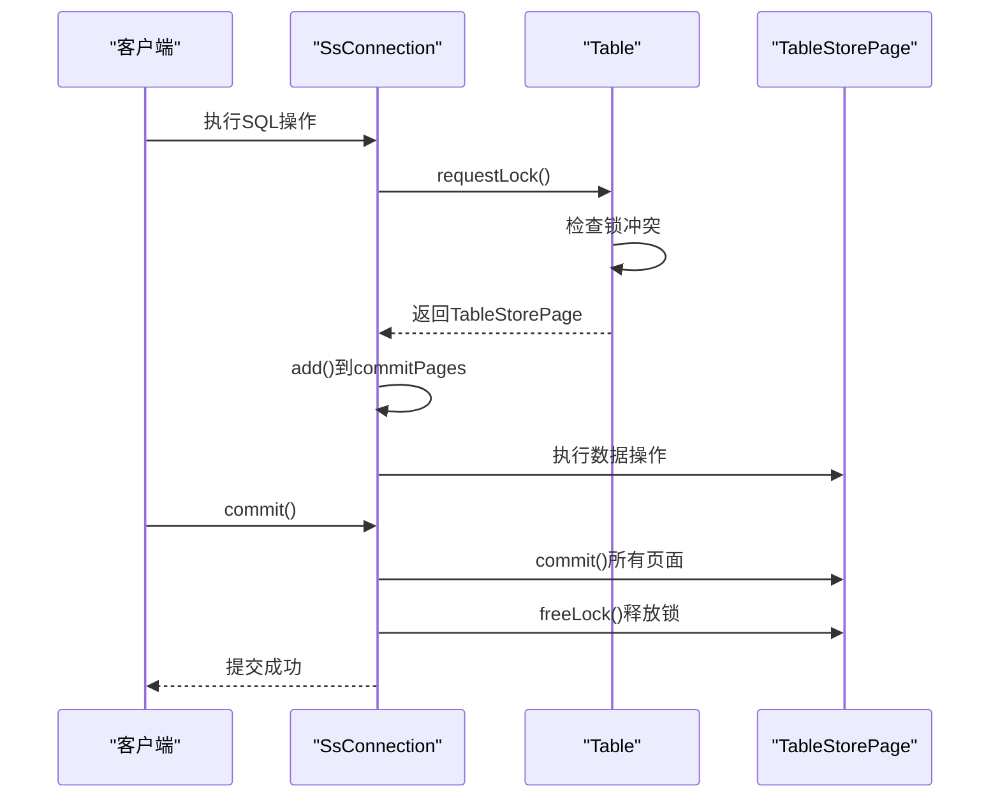
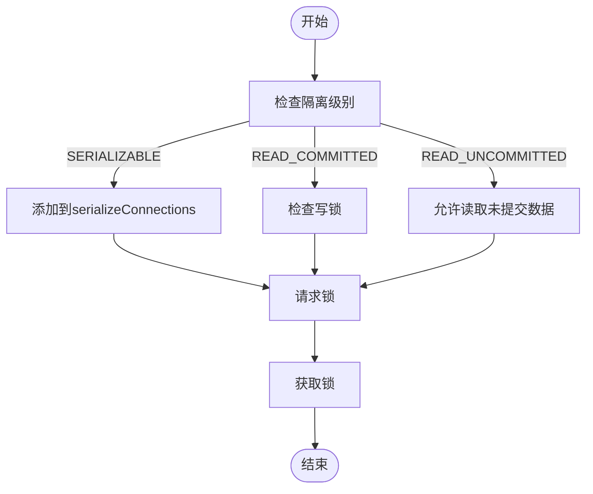
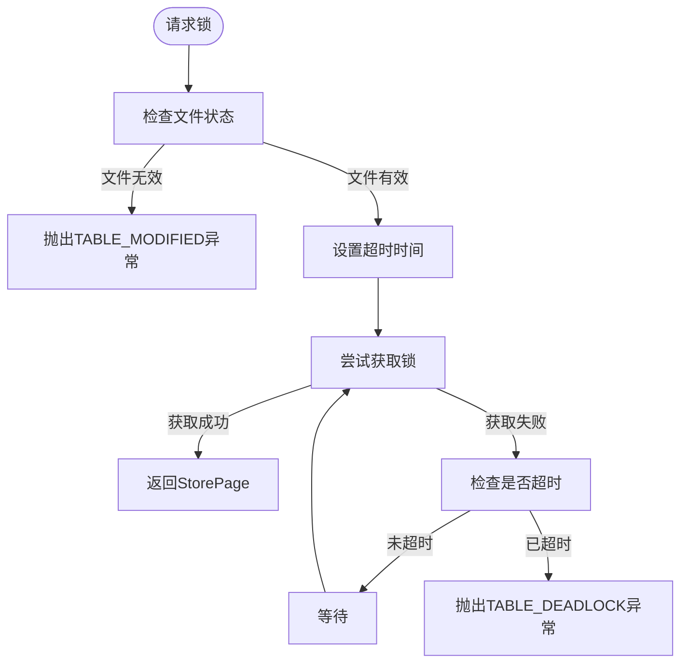
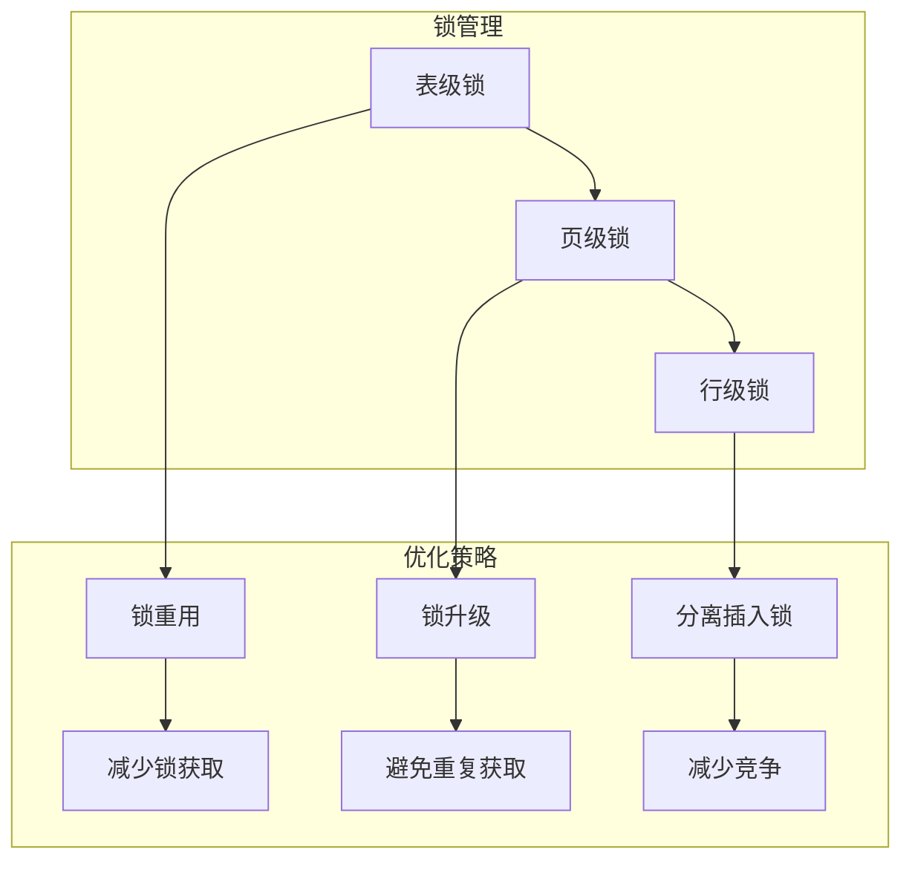

# 锁机制

<cite>
**本文档引用的文件**
- [Table.java](file://src/main/java/io/leavesfly/smallsql/rdb/engine/Table.java)
- [TableStorePage.java](file://src/main/java/io/leavesfly/smallsql/rdb/engine/store/TableStorePage.java)
- [SsConnection.java](file://src/main/java/io/leavesfly/smallsql/jdbc/SsConnection.java)
- [RowSource.java](file://src/main/java/io/leavesfly/smallsql/rdb/engine/RowSource.java)
- [StoreImpl.java](file://src/main/java/io/leavesfly/smallsql/rdb/engine/store/StoreImpl.java)
</cite>

## 目录
1. [锁机制概述](#锁机制概述)
2. [表级锁](#表级锁)
3. [页级锁](#页级锁)
4. [行级锁](#行级锁)
5. [事务协调](#事务协调)
6. [隔离级别与锁行为](#隔离级别与锁行为)
7. [死锁检测与处理](#死锁检测与处理)
8. [锁竞争与性能优化](#锁竞争与性能优化)

## 锁机制概述

SmallSQL数据库系统实现了多粒度锁机制，包括表级锁、页级锁和行级锁，以实现并发控制。该机制通过`Table`类、`StorePage`类和`SsConnection`类协同工作，确保在多用户环境下数据的一致性和完整性。锁的获取和释放遵循严格的规则，以防止死锁并优化性能。

**Section sources**
- [Table.java](file://src/main/java/io/leavesfly/smallsql/rdb/engine/Table.java#L68-L99)
- [SsConnection.java](file://src/main/java/io/leavesfly/smallsql/jdbc/SsConnection.java#L76-L120)

## 表级锁

表级锁由`Table`类管理，用于控制对整个表的访问。当执行DDL操作（如CREATE、ALTER）时，需要获取表级锁。`Table`类中的`tabLockConnection`字段记录了持有表锁的连接，`tabLockCount`记录了锁的计数。通过`requestLock`方法，连接可以请求表级锁，如果已有其他连接持有锁，则请求将被拒绝。

**Diagram sources**
- [Table.java](file://src/main/java/io/leavesfly/smallsql/rdb/engine/Table.java#L68-L99)
- [SsConnection.java](file://src/main/java/io/leavesfly/smallsql/jdbc/SsConnection.java#L76-L120)

**Section sources**
- [Table.java](file://src/main/java/io/leavesfly/smallsql/rdb/engine/Table.java#L378-L418)
- [Table.java](file://src/main/java/io/leavesfly/smallsql/rdb/engine/Table.java#L526-L573)

## 页级锁

页级锁由`TableStorePage`类实现，用于管理对数据页的并发访问。每个`TableStorePage`对象代表一个数据页的锁，包含`lockType`（锁类型）、`con`（持有锁的连接）和`nextLock`（锁链表的下一个锁）等字段。`Table`类通过`locks`哈希表管理所有页级锁，确保同一页面不会被多个连接同时修改。

**Diagram sources**
- [TableStorePage.java](file://src/main/java/io/leavesfly/smallsql/rdb/engine/store/TableStorePage.java#L36-L78)
- [StorePage.java](file://src/main/java/io/leavesfly/smallsql/rdb/engine/store/StorePage.java#L35-L56)

**Section sources**
- [Table.java](file://src/main/java/io/leavesfly/smallsql/rdb/engine/Table.java#L325-L376)
- [Table.java](file://src/main/java/io/leavesfly/smallsql/rdb/engine/Table.java#L452-L484)

## 行级锁

行级锁通过`RowSource`接口和`StoreImpl`类实现，提供对单行数据的精细控制。`RowSource`是所有数据源的抽象基类，定义了行导航方法。`StoreImpl`类通过`createWriteLock`方法实现行级写锁的升级，允许在读取行后升级为写锁，以支持更新操作。

**Diagram sources**
- [RowSource.java](file://src/main/java/io/leavesfly/smallsql/rdb/engine/RowSource.java#L0-L189)
- [StoreImpl.java](file://src/main/java/io/leavesfly/smallsql/rdb/engine/store/StoreImpl.java#L276-L290)

**Section sources**
- [StoreImpl.java](file://src/main/java/io/leavesfly/smallsql/rdb/engine/store/StoreImpl.java#L276-L290)
- [TableResult.java](file://src/main/java/io/leavesfly/smallsql/rdb/engine/selector/result/TableResult.java#L68-L130)

## 事务协调

`SsConnection`类负责在事务中协调锁的获取与释放。每个连接维护一个`commitPages`列表，记录了事务中所有已获取的锁。在提交事务时，系统会依次提交所有锁对应的页面，然后释放锁；在回滚事务时，会回滚所有页面并释放锁。这种机制确保了事务的原子性和一致性。

**Diagram sources**
- [SsConnection.java](file://src/main/java/io/leavesfly/smallsql/jdbc/SsConnection.java#L256-L283)
- [SsConnection.java](file://src/main/java/io/leavesfly/smallsql/jdbc/SsConnection.java#L319-L371)

**Section sources**
- [SsConnection.java](file://src/main/java/io/leavesfly/smallsql/jdbc/SsConnection.java#L208-L254)
- [SsConnection.java](file://src/main/java/io/leavesfly/smallsql/jdbc/SsConnection.java#L256-L283)

## 隔离级别与锁行为

SmallSQL支持多种事务隔离级别，不同级别下锁的行为有所不同。在`TRANSACTION_SERIALIZABLE`级别，系统会将连接添加到`serializeConnections`集合中，严格限制并发操作。在较低隔离级别，系统会根据`isolationLevel`字段的值调整锁的获取策略，以平衡一致性和性能。

**Diagram sources**
- [Table.java](file://src/main/java/io/leavesfly/smallsql/rdb/engine/Table.java#L325-L376)
- [Table.java](file://src/main/java/io/leavesfly/smallsql/rdb/engine/Table.java#L415-L456)

**Section sources**
- [Table.java](file://src/main/java/io/leavesfly/smallsql/rdb/engine/Table.java#L325-L376)
- [TestTransactions.java](file://src/test/java/io/leavesfly/smallsql/junit/sql/tpl/TestTransactions.java#L428-L461)

## 死锁检测与处理

系统通过超时机制检测和处理死锁。在`requestLock`方法中，如果在5秒内无法获取锁，系统会抛出`TABLE_DEADLOCK`异常。`locks.wait(waitTime)`方法实现了等待逻辑，`endTime`变量记录了超时时间。这种机制防止了无限等待，确保系统在出现死锁时能够及时恢复。

**Diagram sources**
- [Table.java](file://src/main/java/io/leavesfly/smallsql/rdb/engine/Table.java#L325-L376)
- [Table.java](file://src/main/java/io/leavesfly/smallsql/rdb/engine/Table.java#L526-L573)

**Section sources**
- [Table.java](file://src/main/java/io/leavesfly/smallsql/rdb/engine/Table.java#L325-L376)
- [TestTransactions.java](file://src/test/java/io/leavesfly/smallsql/junit/sql/tpl/TestTransactions.java#L493-L511)

## 锁竞争与性能优化

为减少锁竞争，系统采用了多种优化策略。页级锁的链表结构允许同一连接在不同操作中重用锁。`requestWriteLock`方法支持从读锁升级到写锁，避免了重复获取锁的开销。此外，系统通过`locksInsert`列表管理插入操作的锁，减少了对主锁表的竞争。

**Diagram sources**
- [Table.java](file://src/main/java/io/leavesfly/smallsql/rdb/engine/Table.java#L486-L524)
- [Table.java](file://src/main/java/io/leavesfly/smallsql/rdb/engine/Table.java#L279-L323)

**Section sources**
- [Table.java](file://src/main/java/io/leavesfly/smallsql/rdb/engine/Table.java#L486-L524)
- [Table.java](file://src/main/java/io/leavesfly/smallsql/rdb/engine/Table.java#L279-L323)