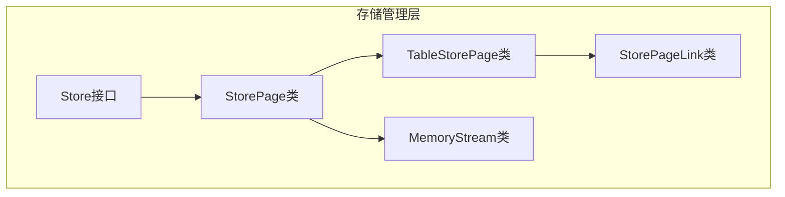
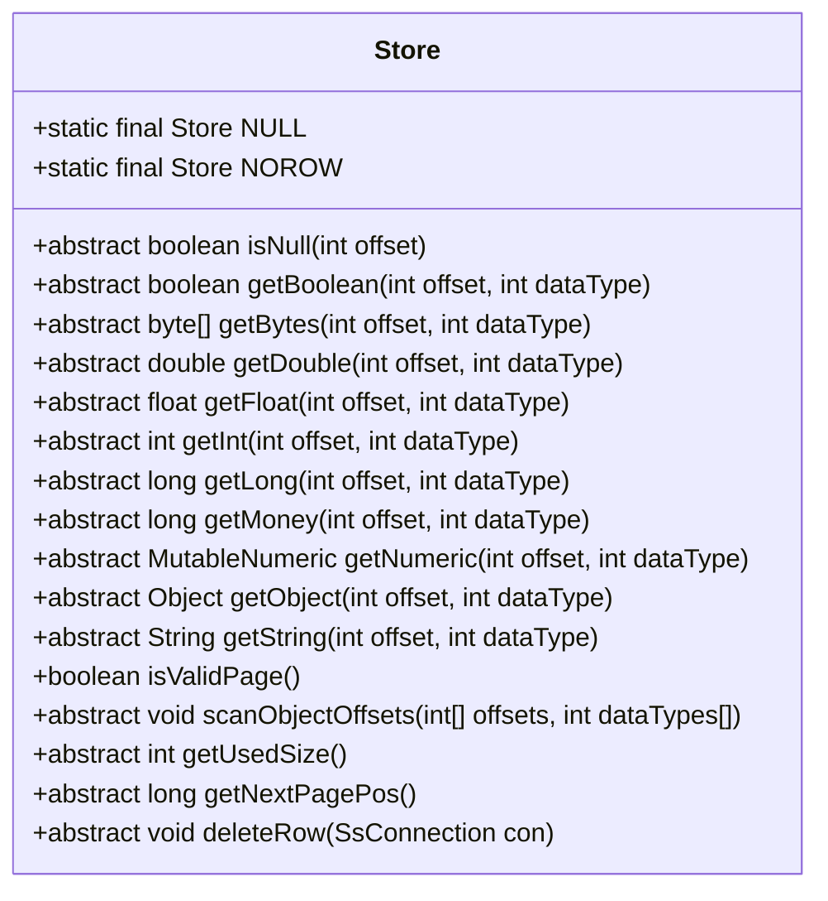
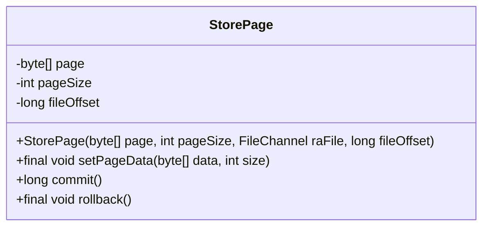
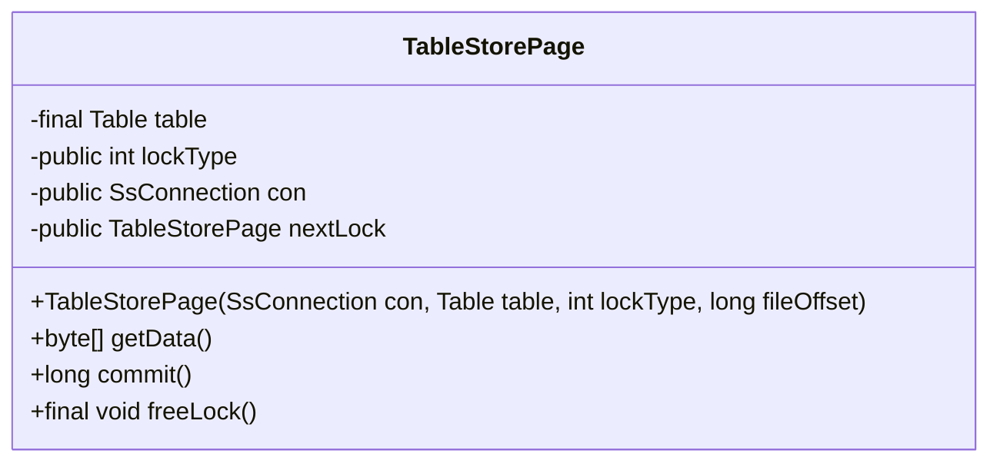
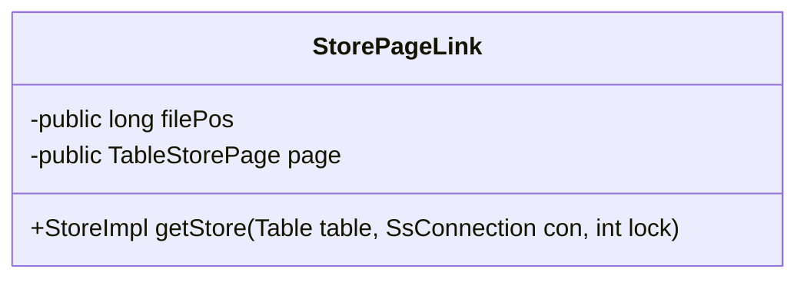
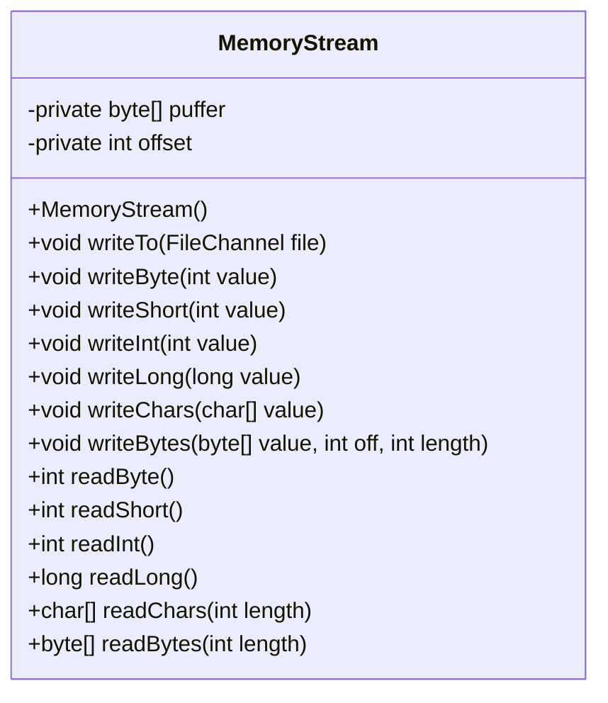
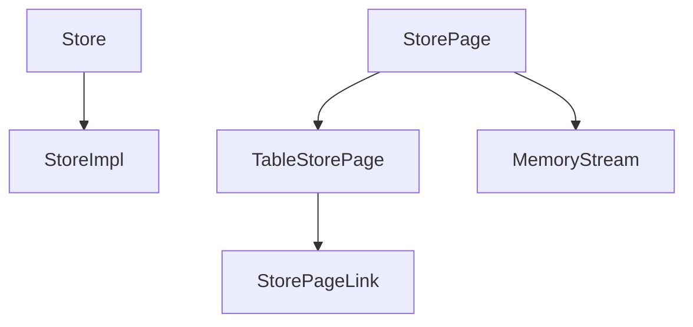

# 页式存储管理

<cite>
**本文档中引用的文件**  
- [Store.java](file://src/main/java/io/leavesfly/smallsql/rdb/engine/Store.java)
- [StoreImpl.java](file://src/main/java/io/leavesfly/smallsql/rdb/engine/store/StoreImpl.java)
- [StorePage.java](file://src/main/java/io/leavesfly/smallsql/rdb/engine/store/StorePage.java)
- [TableStorePage.java](file://src/main/java/io/leavesfly/smallsql/rdb/engine/store/TableStorePage.java)
- [StorePageLink.java](file://src/main/java/io/leavesfly/smallsql/rdb/engine/store/StorePageLink.java)
- [MemoryStream.java](file://src/main/java/io/leavesfly/smallsql/rdb/engine/store/MemoryStream.java)
</cite>

## 目录
1. [引言](#引言)
2. [核心组件](#核心组件)
3. [架构概述](#架构概述)
4. [详细组件分析](#详细组件分析)
5. [依赖分析](#依赖分析)
6. [性能考虑](#性能考虑)
7. [故障排除指南](#故障排除指南)
8. [结论](#结论)

## 引言
本文档深入解析页式存储管理系统的设计与实现。详细说明Store接口的职责及其在数据读写中的作用。分析StorePage类作为基本存储单元的结构设计，包括页面头信息、空闲空间管理和跨页链接（StorePageLink）。阐述TableStorePage如何组织表数据页面，实现行的插入、更新和删除操作。解释MemoryStream在内存中模拟存储流的用途。结合代码示例说明页面分配、填充率控制和缓存策略，为性能调优提供指导。

## 核心组件
页式存储管理系统的核心组件包括Store接口、StorePage类、TableStorePage类、StorePageLink类和MemoryStream类。这些组件共同协作，实现了高效的数据存储和管理。

**Section sources**
- [Store.java](file://src/main/java/io/leavesfly/smallsql/rdb/engine/Store.java#L45-L90)
- [StoreImpl.java](file://src/main/java/io/leavesfly/smallsql/rdb/engine/store/StoreImpl.java#L55-L1605)
- [StorePage.java](file://src/main/java/io/leavesfly/smallsql/rdb/engine/store/StorePage.java#L45-L89)
- [TableStorePage.java](file://src/main/java/io/leavesfly/smallsql/rdb/engine/store/TableStorePage.java#L40-L78)
- [StorePageLink.java](file://src/main/java/io/leavesfly/smallsql/rdb/engine/store/StorePageLink.java#L44-L56)
- [MemoryStream.java](file://src/main/java/io/leavesfly/smallsql/rdb/engine/store/MemoryStream.java#L42-L162)

## 架构概述
页式存储管理系统的架构设计旨在提供高效的数据存储和访问机制。系统通过Store接口定义了数据读写的基本操作，StorePage类作为基本存储单元，TableStorePage类组织表数据页面，StorePageLink类实现跨页链接，MemoryStream类在内存中模拟存储流。

**Diagram sources**
- [Store.java](file://src/main/java/io/leavesfly/smallsql/rdb/engine/Store.java#L45-L90)
- [StoreImpl.java](file://src/main/java/io/leavesfly/smallsql/rdb/engine/store/StoreImpl.java#L55-L1605)
- [StorePage.java](file://src/main/java/io/leavesfly/smallsql/rdb/engine/store/StorePage.java#L45-L89)
- [TableStorePage.java](file://src/main/java/io/leavesfly/smallsql/rdb/engine/store/TableStorePage.java#L40-L78)
- [StorePageLink.java](file://src/main/java/io/leavesfly/smallsql/rdb/engine/store/StorePageLink.java#L44-L56)
- [MemoryStream.java](file://src/main/java/io/leavesfly/smallsql/rdb/engine/store/MemoryStream.java#L42-L162)

## 详细组件分析
### Store接口分析
Store接口定义了数据读写的基本操作，包括isNull、getBoolean、getBytes、getDouble、getFloat、getInt、getLong、getMoney、getNumeric、getObject、getString等方法。这些方法为上层应用提供了统一的数据访问接口。

**Diagram sources**
- [Store.java](file://src/main/java/io/leavesfly/smallsql/rdb/engine/Store.java#L45-L90)

**Section sources**
- [Store.java](file://src/main/java/io/leavesfly/smallsql/rdb/engine/Store.java#L45-L90)

### StorePage类分析
StorePage类作为基本存储单元，包含页面数据、页面大小和文件偏移量等属性。它通过commit方法将数据写入文件，通过rollback方法回滚未提交的数据。

**Diagram sources**
- [StorePage.java](file://src/main/java/io/leavesfly/smallsql/rdb/engine/store/StorePage.java#L45-L89)

**Section sources**
- [StorePage.java](file://src/main/java/io/leavesfly/smallsql/rdb/engine/store/StorePage.java#L45-L89)

### TableStorePage类分析
TableStorePage类继承自StorePage类，用于组织表数据页面。它包含表引用、锁类型、连接和下一个锁等属性，通过commit方法提交数据，通过freeLock方法释放锁。

**Diagram sources**
- [TableStorePage.java](file://src/main/java/io/leavesfly/smallsql/rdb/engine/store/TableStorePage.java#L40-L78)

**Section sources**
- [TableStorePage.java](file://src/main/java/io/leavesfly/smallsql/rdb/engine/store/TableStorePage.java#L40-L78)

### StorePageLink类分析
StorePageLink类用于实现跨页链接，包含文件位置和页面引用等属性。通过getStore方法获取存储实例，实现跨页数据访问。

**Diagram sources**
- [StorePageLink.java](file://src/main/java/io/leavesfly/smallsql/rdb/engine/store/StorePageLink.java#L44-L56)

**Section sources**
- [StorePageLink.java](file://src/main/java/io/leavesfly/smallsql/rdb/engine/store/StorePageLink.java#L44-L56)

### MemoryStream类分析
MemoryStream类在内存中模拟存储流，包含缓冲区和偏移量等属性。通过writeTo方法将数据写入文件，通过read和write系列方法实现数据的读写操作。

**Diagram sources**
- [MemoryStream.java](file://src/main/java/io/leavesfly/smallsql/rdb/engine/store/MemoryStream.java#L42-L162)

**Section sources**
- [MemoryStream.java](file://src/main/java/io/leavesfly/smallsql/rdb/engine/store/MemoryStream.java#L42-L162)

## 依赖分析
页式存储管理系统的各个组件之间存在紧密的依赖关系。Store接口被StoreImpl类实现，StorePage类被TableStorePage类继承，StorePageLink类依赖于TableStorePage类，MemoryStream类被StorePage类使用。

**Diagram sources**
- [Store.java](file://src/main/java/io/leavesfly/smallsql/rdb/engine/Store.java#L45-L90)
- [StoreImpl.java](file://src/main/java/io/leavesfly/smallsql/rdb/engine/store/StoreImpl.java#L55-L1605)
- [StorePage.java](file://src/main/java/io/leavesfly/smallsql/rdb/engine/store/StorePage.java#L45-L89)
- [TableStorePage.java](file://src/main/java/io/leavesfly/smallsql/rdb/engine/store/TableStorePage.java#L40-L78)
- [StorePageLink.java](file://src/main/java/io/leavesfly/smallsql/rdb/engine/store/StorePageLink.java#L44-L56)
- [MemoryStream.java](file://src/main/java/io/leavesfly/smallsql/rdb/engine/store/MemoryStream.java#L42-L162)

**Section sources**
- [Store.java](file://src/main/java/io/leavesfly/smallsql/rdb/engine/Store.java#L45-L90)
- [StoreImpl.java](file://src/main/java/io/leavesfly/smallsql/rdb/engine/store/StoreImpl.java#L55-L1605)
- [StorePage.java](file://src/main/java/io/leavesfly/smallsql/rdb/engine/store/StorePage.java#L45-L89)
- [TableStorePage.java](file://src/main/java/io/leavesfly/smallsql/rdb/engine/store/TableStorePage.java#L40-L78)
- [StorePageLink.java](file://src/main/java/io/leavesfly/smallsql/rdb/engine/store/StorePageLink.java#L44-L56)
- [MemoryStream.java](file://src/main/java/io/leavesfly/smallsql/rdb/engine/store/MemoryStream.java#L42-L162)

## 性能考虑
页式存储管理系统的性能优化主要体现在页面分配、填充率控制和缓存策略等方面。通过合理的页面大小设置和填充率控制，可以有效减少磁盘I/O操作，提高数据访问效率。缓存策略则通过减少重复读取操作，进一步提升系统性能。

## 故障排除指南
在使用页式存储管理系统时，可能会遇到页面损坏、锁冲突等问题。通过检查页面头信息和状态标志，可以快速定位问题。对于锁冲突问题，可以通过调整锁类型和锁粒度来解决。

**Section sources**
- [StoreImpl.java](file://src/main/java/io/leavesfly/smallsql/rdb/engine/store/StoreImpl.java#L55-L1605)
- [TableStorePage.java](file://src/main/java/io/leavesfly/smallsql/rdb/engine/store/TableStorePage.java#L40-L78)

## 结论
页式存储管理系统通过Store接口、StorePage类、TableStorePage类、StorePageLink类和MemoryStream类的协同工作，实现了高效的数据存储和管理。通过合理的架构设计和性能优化策略，系统能够满足高并发、大数据量的存储需求。