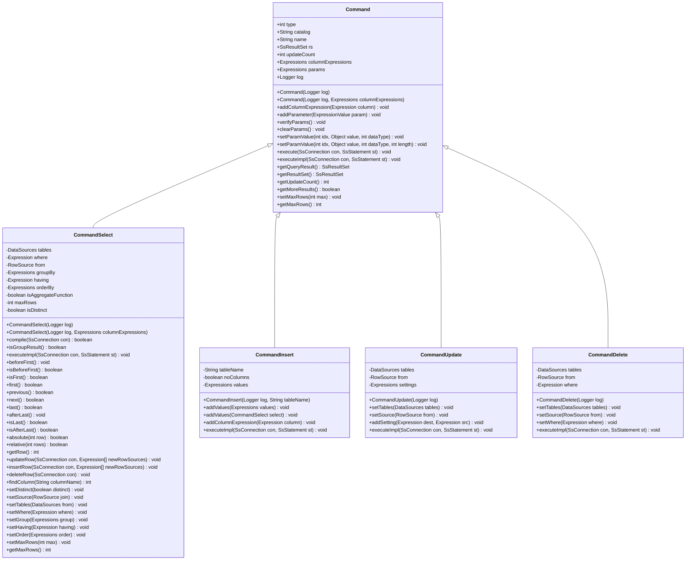
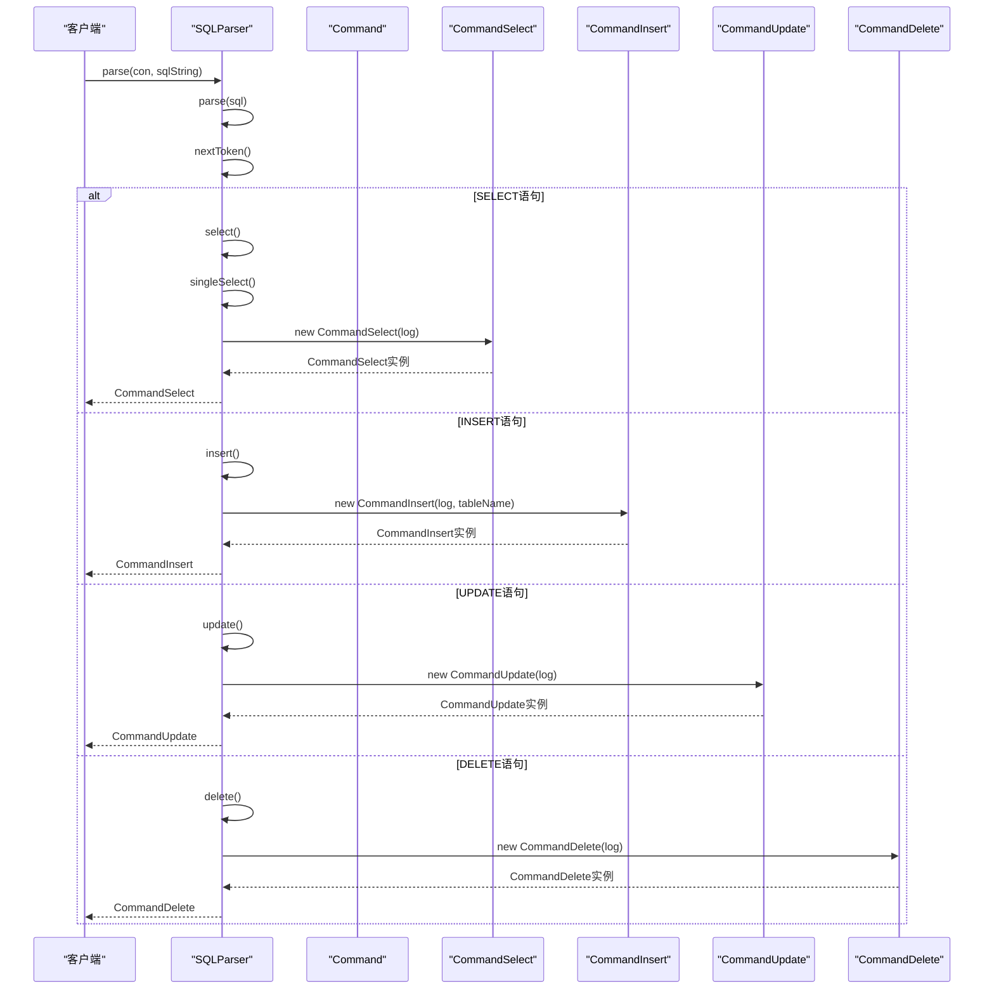
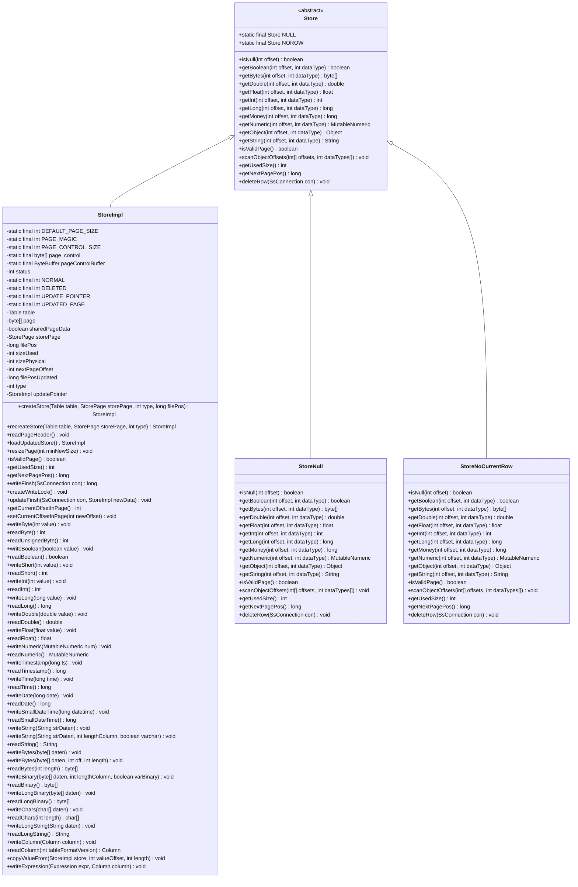
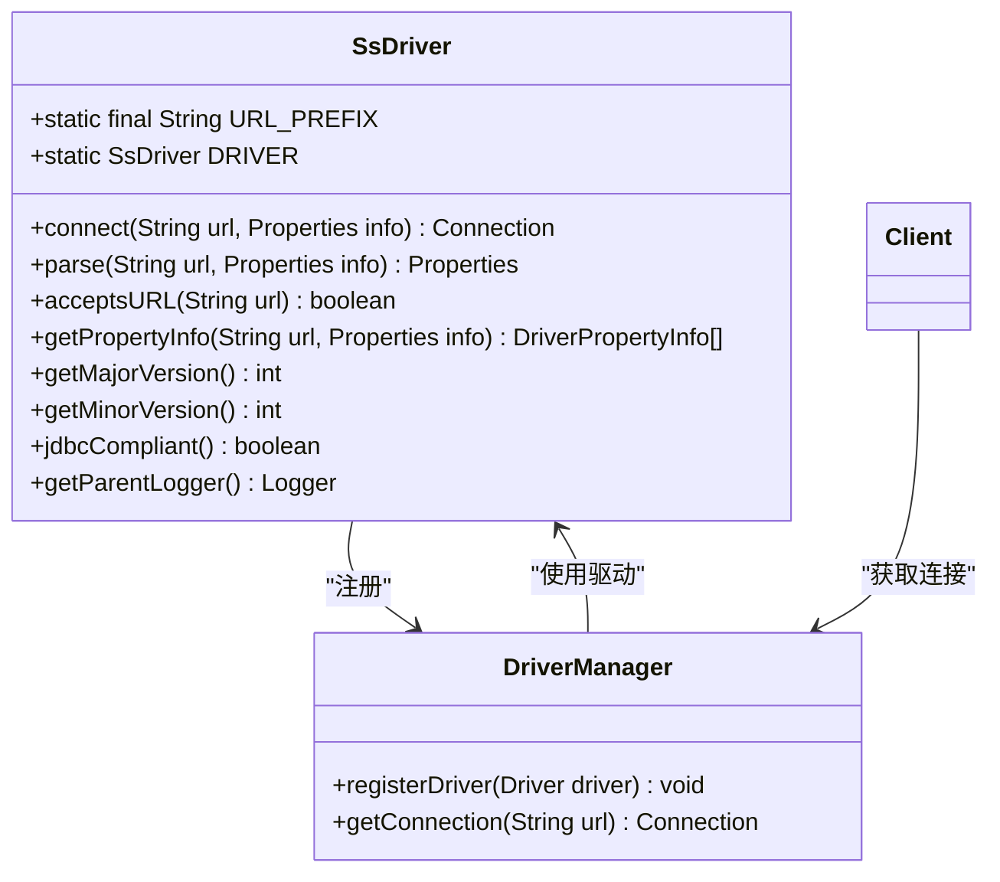

# 关键设计模式

<cite>
**本文档中引用的文件**   
- [Command.java](file://src/main/java/io/leavesfly/smallsql/rdb/command/Command.java)
- [CommandSelect.java](file://src/main/java/io/leavesfly/smallsql/rdb/command/dql/CommandSelect.java)
- [SQLParser.java](file://src/main/java/io/leavesfly/smallsql/rdb/sql/SQLParser.java)
- [StoreImpl.java](file://src/main/java/io/leavesfly/smallsql/rdb/engine/store/StoreImpl.java)
- [Store.java](file://src/main/java/io/leavesfly/smallsql/rdb/engine/Store.java)
- [SsDriver.java](file://src/main/java/io/leavesfly/smallsql/SsDriver.java)
</cite>

## 目录
1. [命令模式](#命令模式)
2. [工厂模式](#工厂模式)
3. [装饰器模式](#装饰器模式)
4. [单例模式](#单例模式)

## 命令模式

命令模式在SmallSQL中通过Command抽象类实现，为DDL、DML和DQL操作提供了统一的处理框架。Command类作为所有SQL命令的基类，定义了executeImpl()模板方法，该方法在execute()方法中被调用。execute()方法实现了事务控制逻辑，包括保存点设置、异常回滚和自动提交处理，而具体的命令执行逻辑则由子类通过重写executeImpl()方法来实现。

Command类提供了参数管理、结果集处理和更新计数等通用功能。子类如CommandSelect、CommandInsert等继承Command类并实现executeImpl()方法，以处理特定类型的SQL语句。这种设计使得不同类型的SQL命令可以遵循相同的执行流程，同时保持各自的执行逻辑。

**图源**
- [Command.java](file://src/main/java/io/leavesfly/smallsql/rdb/command/Command.java#L47-L190)
- [CommandSelect.java](file://src/main/java/io/leavesfly/smallsql/rdb/command/dql/CommandSelect.java#L61-L587)

**节源**
- [Command.java](file://src/main/java/io/leavesfly/smallsql/rdb/command/Command.java#L47-L190)
- [CommandSelect.java](file://src/main/java/io/leavesfly/smallsql/rdb/command/dql/CommandSelect.java#L61-L587)

## 工厂模式

工厂模式在SQLParser类中得到应用，根据SQL语句类型创建具体的Command子类实例。SQLParser的parse()方法作为工厂方法，根据SQL语句的第一个关键字（如SELECT、INSERT、UPDATE等）来决定创建哪种类型的Command对象。这种设计将对象的创建逻辑集中在一个类中，使得系统更容易扩展和维护。

当解析到不同的SQL语句时，SQLParser会调用相应的私有方法（如select()、insert()、update()等）来创建具体的Command实例。例如，当解析到SELECT语句时，会创建CommandSelect实例；当解析到INSERT语句时，会创建CommandInsert实例。这种工厂模式的实现使得添加新的SQL语句类型变得简单，只需在SQLParser中添加相应的解析方法和Command子类即可。

**图源**
- [SQLParser.java](file://src/main/java/io/leavesfly/smallsql/rdb/sql/SQLParser.java#L137-L2527)

**节源**
- [SQLParser.java](file://src/main/java/io/leavesfly/smallsql/rdb/sql/SQLParser.java#L137-L2527)

## 装饰器模式

装饰器模式在Store类层次结构中体现，特别是StoreImpl如何增强基础Store功能。Store是一个抽象类，定义了数据存储的基本操作接口，如读取不同类型的数据、获取页面状态等。StoreImpl类继承Store并提供了具体的实现，同时通过组合的方式增强了基础Store的功能。

StoreImpl不仅实现了Store定义的抽象方法，还提供了额外的功能，如页面管理、数据写入、事务处理等。通过StoreImpl，系统可以对数据存储进行更精细的控制，如页面大小管理、数据压缩、缓存等。这种装饰器模式的设计使得可以在不修改原有Store类的情况下，通过继承和组合的方式添加新的功能，提高了代码的灵活性和可扩展性。

**图源**
- [Store.java](file://src/main/java/io/leavesfly/smallsql/rdb/engine/Store.java#L45-L90)
- [StoreImpl.java](file://src/main/java/io/leavesfly/smallsql/rdb/engine/store/StoreImpl.java#L0-L799)

**节源**
- [Store.java](file://src/main/java/io/leavesfly/smallsql/rdb/engine/Store.java#L45-L90)
- [StoreImpl.java](file://src/main/java/io/leavesfly/smallsql/rdb/engine/store/StoreImpl.java#L0-L799)

## 单例模式

单例模式在SsDriver类中实现，确保在整个应用程序中只有一个SsDriver实例。SsDriver类通过静态代码块在类加载时创建并注册驱动程序实例，保证了实例的唯一性。DRIVER静态字段持有SsDriver的唯一实例，客户端通过DriverManager获取连接时，实际上使用的是同一个SsDriver实例。

这种单例模式的实现方式确保了数据库驱动程序的全局唯一性，避免了多个实例可能带来的资源浪费和状态不一致问题。同时，静态初始化的方式保证了线程安全，因为在类加载过程中，JVM会确保静态代码块只执行一次。

**图源**
- [SsDriver.java](file://src/main/java/io/leavesfly/smallsql/SsDriver.java#L52-L202)

**节源**
- [SsDriver.java](file://src/main/java/io/leavesfly/smallsql/SsDriver.java#L52-L202)