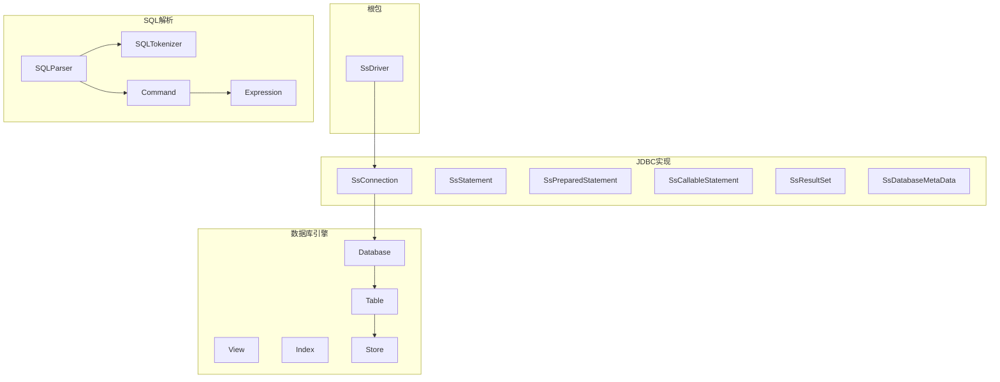
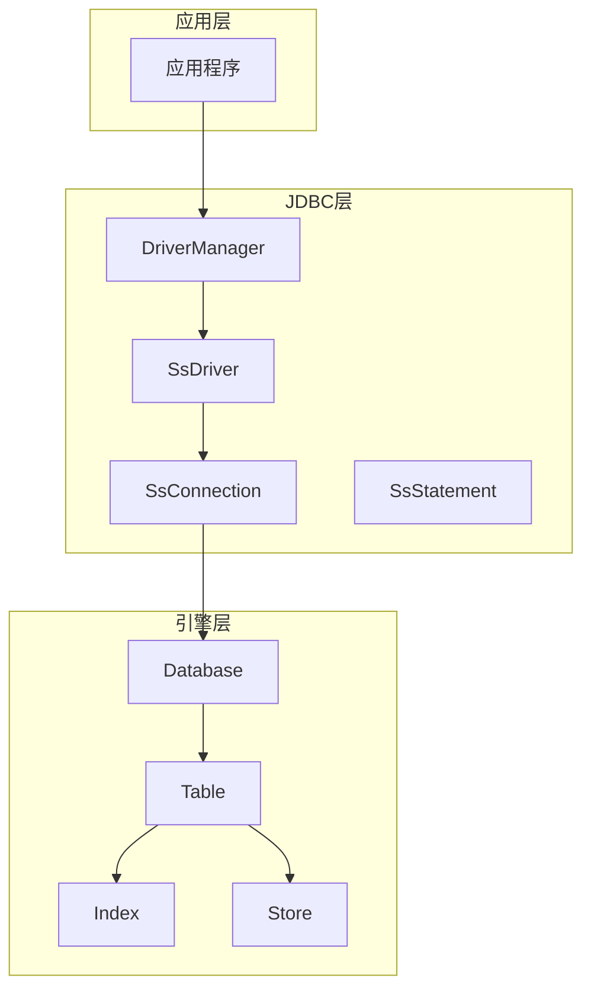
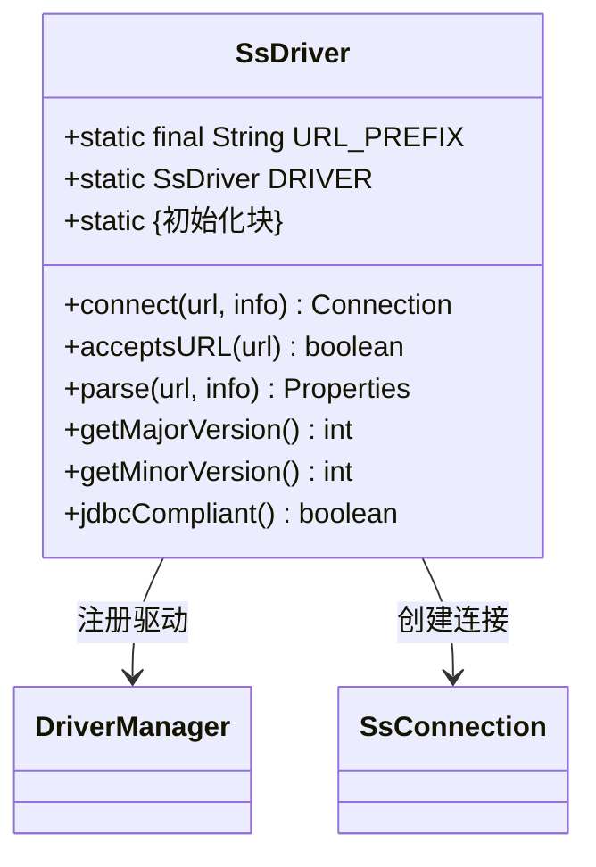
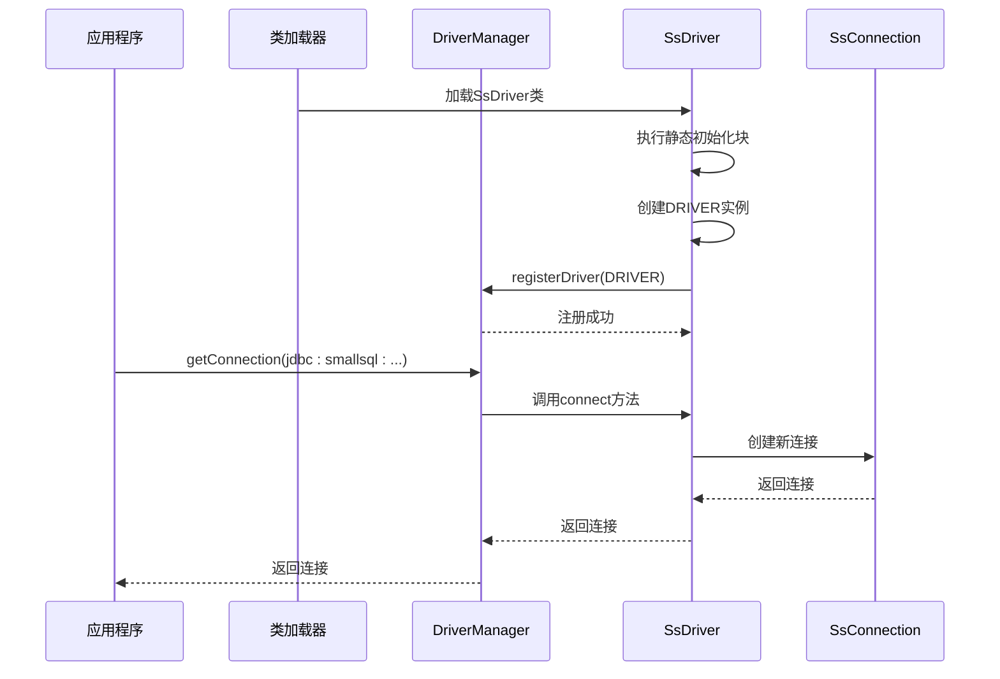
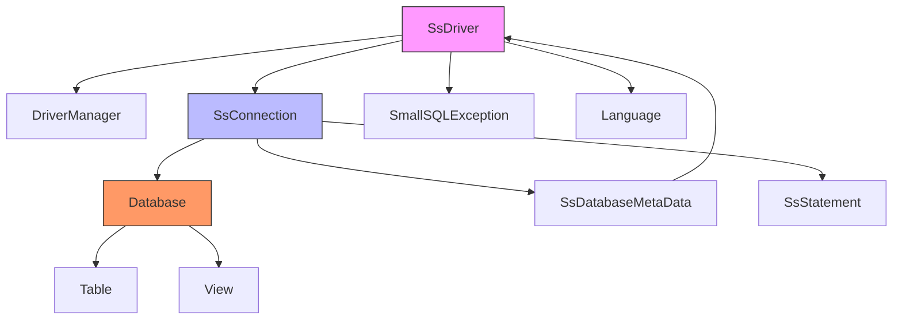

# 单例模式

<cite>
**本文档中引用的文件**  
- [SsDriver.java](file://src/main/java/io/leavesfly/smallsql/SsDriver.java)
- [SsConnection.java](file://src/main/java/io/leavesfly/smallsql/jdbc/SsConnection.java)
- [Database.java](file://src/main/java/io/leavesfly/smallsql/rdb/engine/Database.java)
- [SsDatabaseMetaData.java](file://src/main/java/io/leavesfly/smallsql/jdbc/metadata/SsDatabaseMetaData.java)
</cite>

## 目录
1. [引言](#引言)
2. [项目结构](#项目结构)
3. [核心组件](#核心组件)
4. [架构概述](#架构概述)
5. [详细组件分析](#详细组件分析)
6. [依赖分析](#依赖分析)
7. [性能考虑](#性能考虑)
8. [故障排除指南](#故障排除指南)
9. [结论](#结论)

## 引言
本文档深入分析SmallSQL数据库JDBC驱动程序中的单例模式实现机制。重点研究SsDriver类如何利用Java类加载器的特性确保系统中只有一个驱动实例，符合JDBC规范的要求。文档详细阐述了静态初始化块在驱动自动注册过程中的作用，分析了单例模式在驱动管理中的必要性，并提供了应用程序通过DriverManager获取连接的完整时序图。

## 项目结构
SmallSQL项目采用典型的Java数据库库结构，主要分为JDBC接口实现、数据库引擎和SQL解析器三个核心模块。驱动程序实现位于根包中，而JDBC相关类、数据库引擎和SQL解析器分别组织在独立的包中。

**图示来源**
- [SsDriver.java](file://src/main/java/io/leavesfly/smallsql/SsDriver.java)
- [SsConnection.java](file://src/main/java/io/leavesfly/smallsql/jdbc/SsConnection.java)
- [Database.java](file://src/main/java/io/leavesfly/smallsql/rdb/engine/Database.java)

**本节来源**
- [SsDriver.java](file://src/main/java/io/leavesfly/smallsql/SsDriver.java)
- [SsConnection.java](file://src/main/java/io/leavesfly/smallsql/jdbc/SsConnection.java)
- [Database.java](file://src/main/java/io/leavesfly/smallsql/rdb/engine/Database.java)

## 核心组件
SsDriver类是SmallSQL数据库JDBC驱动程序的核心组件，实现了java.sql.Driver接口。该类采用单例模式设计，确保在整个JVM中只有一个驱动实例存在。通过静态初始化块在类加载时自动注册到DriverManager，实现了JDBC驱动的自动发现和注册机制。

**本节来源**
- [SsDriver.java](file://src/main/java/io/leavesfly/smallsql/SsDriver.java)

## 架构概述
SmallSQL的架构设计遵循JDBC规范，采用分层架构模式。最上层是JDBC驱动接口，中间层是连接和语句管理，底层是数据库引擎和存储管理。SsDriver作为入口点，负责创建SsConnection实例，而SsConnection则管理与Database实例的交互。

**图示来源**
- [SsDriver.java](file://src/main/java/io/leavesfly/smallsql/SsDriver.java)
- [SsConnection.java](file://src/main/java/io/leavesfly/smallsql/jdbc/SsConnection.java)
- [Database.java](file://src/main/java/io/leavesfly/smallsql/rdb/engine/Database.java)

## 详细组件分析

### SsDriver单例实现分析
SsDriver类的单例实现机制是SmallSQL驱动程序的核心设计。通过静态字段和静态初始化块的组合，确保了驱动实例的唯一性和自动注册。

**图示来源**
- [SsDriver.java](file://src/main/java/io/leavesfly/smallsql/SsDriver.java)

#### 单例模式实现机制
SsDriver类通过以下方式实现单例模式：
1. **静态实例字段**：`public static SsDriver DRIVER` 声明了一个静态字段来保存唯一的驱动实例
2. **静态初始化块**：在类加载时自动执行，创建实例并注册到DriverManager
3. **私有构造函数**：虽然代码中未显式声明，但通过静态初始化块控制实例创建

这种实现方式利用了Java类加载器的特性，确保在类被加载时只执行一次初始化块，从而保证了单例的线程安全性和唯一性。

**图示来源**
- [SsDriver.java](file://src/main/java/io/leavesfly/smallsql/SsDriver.java)
- [SsConnection.java](file://src/main/java/io/leavesfly/smallsql/jdbc/SsConnection.java)

**本节来源**
- [SsDriver.java](file://src/main/java/io/leavesfly/smallsql/SsDriver.java)
- [SsConnection.java](file://src/main/java/io/leavesfly/smallsql/jdbc/SsConnection.java)

### 驱动注册流程分析
JDBC驱动注册过程是SsDriver单例模式的关键应用场景。当应用程序调用DriverManager.getConnection()时，整个流程如下：

1. **类加载阶段**：当SsDriver类被类加载器加载时，静态初始化块立即执行
2. **实例创建**：在静态块中创建SsDriver实例并赋值给静态字段DRIVER
3. **自动注册**：调用DriverManager.registerDriver()将实例注册到驱动管理器
4. **连接建立**：应用程序通过标准JDBC API获取连接，DriverManager委托给已注册的SsDriver实例

这种设计符合JDBC 4.0规范的自动加载要求，无需应用程序显式调用Class.forName()来加载驱动类。

**本节来源**
- [SsDriver.java](file://src/main/java/io/leavesfly/smallsql/SsDriver.java)

## 依赖分析
SsDriver类与其他组件存在明确的依赖关系，形成了清晰的调用链。

**图示来源**
- [SsDriver.java](file://src/main/java/io/leavesfly/smallsql/SsDriver.java)
- [SsConnection.java](file://src/main/java/io/leavesfly/smallsql/jdbc/SsConnection.java)
- [Database.java](file://src/main/java/io/leavesfly/smallsql/rdb/engine/Database.java)
- [SsDatabaseMetaData.java](file://src/main/java/io/leavesfly/smallsql/jdbc/metadata/SsDatabaseMetaData.java)

**本节来源**
- [SsDriver.java](file://src/main/java/io/leavesfly/smallsql/SsDriver.java)
- [SsConnection.java](file://src/main/java/io/leavesfly/smallsql/jdbc/SsConnection.java)
- [Database.java](file://src/main/java/io/leavesfly/smallsql/rdb/engine/Database.java)

## 性能考虑
单例模式在嵌入式数据库场景下具有显著的性能优势，但也存在一些潜在限制。

### 性能优势
1. **资源节约**：避免了多个驱动实例占用额外内存
2. **快速访问**：静态字段提供O(1)时间复杂度的实例访问
3. **线程安全**：类加载器保证静态初始化块的线程安全性
4. **启动效率**：自动注册机制减少了应用程序的初始化代码

### 潜在限制
1. **类加载开销**：首次使用时需要加载整个驱动类
2. **内存占用**：即使不使用数据库，驱动类也会驻留在内存中
3. **扩展性限制**：难以支持多个不同配置的驱动实例

这些特性使得SsDriver的单例实现特别适合嵌入式数据库场景，其中资源效率和简单性是首要考虑因素。

## 故障排除指南
在使用SsDriver时可能遇到的常见问题及解决方案：

1. **驱动未注册异常**：确保JDBC URL以"jdbc:smallsql"开头
2. **类加载问题**：检查类路径是否包含smallsql.jar
3. **连接失败**：验证数据库路径是否正确
4. **版本兼容性**：确认驱动版本与应用程序要求匹配

通过查看SsDriver中的静态初始化块异常处理，可以获取详细的错误信息。

**本节来源**
- [SsDriver.java](file://src/main/java/io/leavesfly/smallsql/SsDriver.java)
- [SsConnection.java](file://src/main/java/io/leavesfly/smallsql/jdbc/SsConnection.java)

## 结论
SsDriver类的单例模式实现是SmallSQL数据库驱动程序的核心设计。通过静态初始化块和静态字段的巧妙结合，实现了线程安全的单例模式，确保了系统中只有一个驱动实例。这种设计不仅符合JDBC规范的自动注册要求，还在嵌入式数据库场景下提供了优异的性能表现。静态初始化块在类加载时自动完成驱动注册，简化了应用程序的使用，体现了优雅的设计哲学。