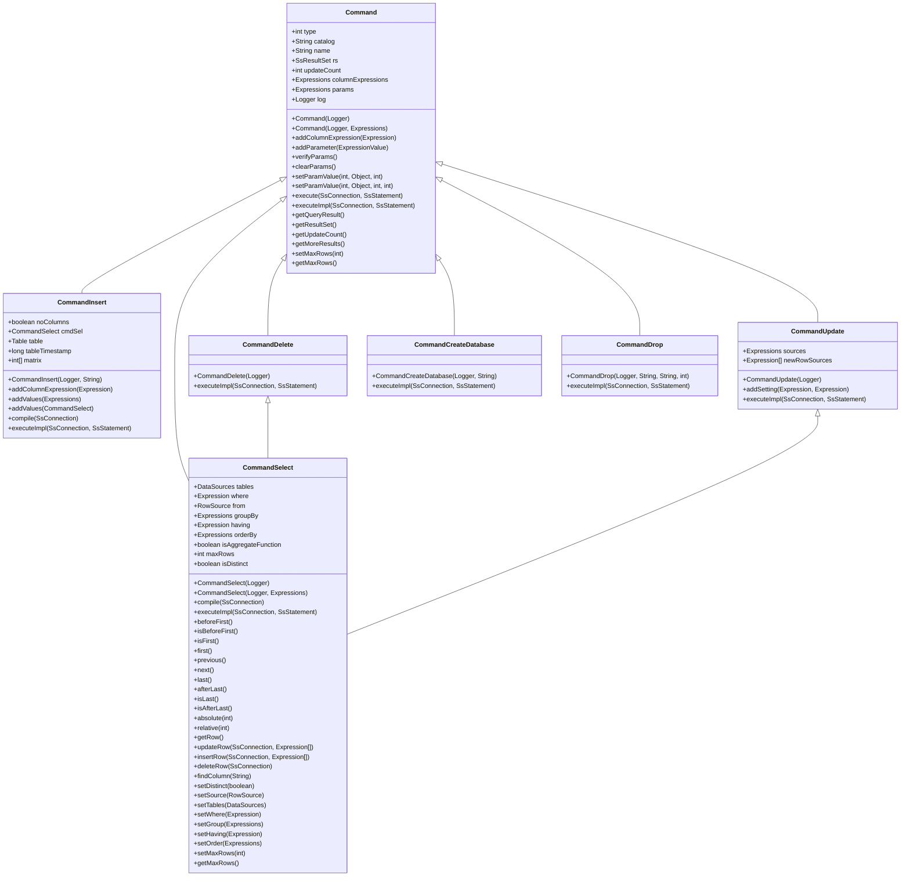
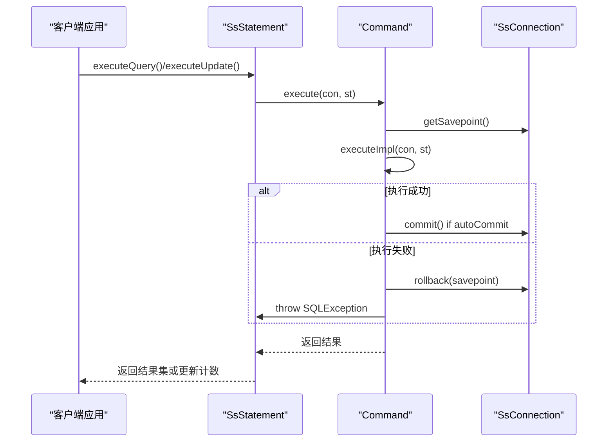
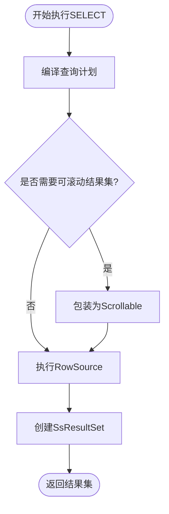
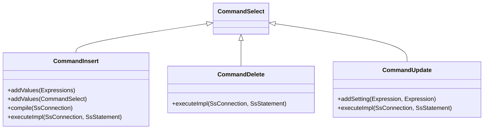
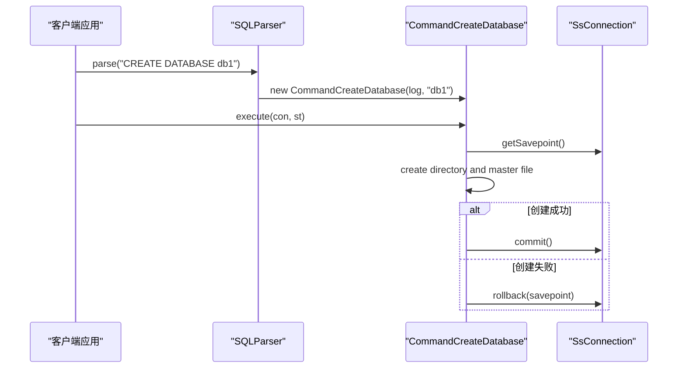

# 命令模式

<cite>
**本文档中引用的文件**   
- [Command.java](file://src/main/java/io/leavesfly/smallsql/rdb/command/Command.java)
- [CommandSelect.java](file://src/main/java/io/leavesfly/smallsql/rdb/command/dql/CommandSelect.java)
- [CommandInsert.java](file://src/main/java/io/leavesfly/smallsql/rdb/command/dml/CommandInsert.java)
- [CommandDelete.java](file://src/main/java/io/leavesfly/smallsql/rdb/command/dml/CommandDelete.java)
- [CommandUpdate.java](file://src/main/java/io/leavesfly/smallsql/rdb/command/dml/CommandUpdate.java)
- [CommandCreateDatabase.java](file://src/main/java/io/leavesfly/smallsql/rdb/command/ddl/CommandCreateDatabase.java)
- [CommandDrop.java](file://src/main/java/io/leavesfly/smallsql/rdb/command/ddl/CommandDrop.java)
- [SQLParser.java](file://src/main/java/io/leavesfly/smallsql/rdb/sql/SQLParser.java)
- [SsConnection.java](file://src/main/java/io/leavesfly/smallsql/jdbc/SsConnection.java)
</cite>

## 目录
1. [简介](#简介)
2. [项目结构](#项目结构)
3. [核心组件](#核心组件)
4. [架构概述](#架构概述)
5. [详细组件分析](#详细组件分析)
6. [依赖分析](#依赖分析)
7. [性能考虑](#性能考虑)
8. [故障排除指南](#故障排除指南)
9. [结论](#结论)

## 简介
本文档深入分析SmallSQL数据库系统中命令模式的设计与实现。重点探讨Command抽象类如何作为所有SQL操作的统一接口，封装DDL、DML和DQL命令的执行逻辑。文档详细解释了execute()方法中模板方法模式的应用，包括事务保存点管理、异常回滚和自动提交处理。同时深入分析executeImpl()抽象方法在不同子类中的具体实现，如CommandSelect、CommandInsert等如何重写该方法来执行特定SQL操作。通过类图展示命令模式的继承体系，用代码片段说明命令的创建、参数绑定和执行流程，并解释命令模式如何解耦SQL解析与执行过程，提升系统的可扩展性和维护性。

## 项目结构
SmallSQL项目的结构遵循典型的Java数据库系统分层架构，主要分为客户端、JDBC接口、语言资源、日志、RDB引擎和工具等模块。核心的命令模式实现在rdb/command包中，按DDL、DML、DQL进行分类组织。

```mermaid
graph TD
subgraph "src/main/java/io/leavesfly/smallsql"
subgraph "client"
Console["Console.java"]
end
subgraph "jdbc"
subgraph "metadata"
SsDatabaseMetaData["SsDatabaseMetaData.java"]
SsResultSetMetaData["SsResultSetMetaData.java"]
end
subgraph "statement"
SsCallableStatement["SsCallableStatement.java"]
SsPreparedStatement["SsPreparedStatement.java"]
SsSavepoint["SsSavepoint.java"]
SsStatement["SsStatement.java"]
end
SmallSQLException["SmallSQLException.java"]
SsConnection["SsConnection.java"]
SsResultSet["SsResultSet.java"]
end
subgraph "lang"
Language["Language.java"]
Language_de["Language_de.java"]
Language_en["Language_en.java"]
Language_it["Language_it.java"]
end
subgraph "logger"
Logger["Logger.java"]
end
subgraph "rdb"
subgraph "command"
subgraph "ddl"
CommandCreateDatabase["CommandCreateDatabase.java"]
CommandCreateView["CommandCreateView.java"]
CommandDrop["CommandDrop.java"]
CommandSet["CommandSet.java"]
CommandTable["CommandTable.java"]
end
subgraph "dml"
CommandDelete["CommandDelete.java"]
CommandInsert["CommandInsert.java"]
CommandUpdate["CommandUpdate.java"]
end
subgraph "dql"
CommandSelect["CommandSelect.java"]
end
Command["Command.java"]
end
subgraph "engine"
subgraph "index"
FileIndexNode["FileIndexNode.java"]
IndexDescription["IndexDescription.java"]
IndexDescriptions["IndexDescriptions.java"]
IndexNodeScrollStatus["IndexNodeScrollStatus.java"]
end
subgraph "selector"
subgraph "multioper"
Distinct["Distinct.java"]
GroupResult["GroupResult.java"]
Join["Join.java"]
SortedResult["SortedResult.java"]
UnionAll["UnionAll.java"]
Where["Where.java"]
end
subgraph "result"
MemoryResult["MemoryResult.java"]
NoFromResult["NoFromResult.java"]
TableResult["TableResult.java"]
TableViewResult["TableViewResult.java"]
ViewResult["ViewResult.java"]
end
DataSource["DataSource.java"]
DataSources["DataSources.java"]
Scrollable["Scrollable.java"]
end
subgraph "store"
CreateFile["CreateFile.java"]
MemoryStream["MemoryStream.java"]
StoreImpl["StoreImpl.java"]
StoreNoCurrentRow["StoreNoCurrentRow.java"]
StoreNull["StoreNull.java"]
StorePage["StorePage.java"]
StorePageLink["StorePageLink.java"]
TableStorePage["TableStorePage.java"]
TableStorePageInsert["TableStorePageInsert.java"]
end
subgraph "table"
Column["Column.java"]
Columns["Columns.java"]
ForeignKey["ForeignKey.java"]
ForeignKeys["ForeignKeys.java"]
Lobs["Lobs.java"]
TableViewMap["TableViewMap.java"]
end
Database["Database.java"]
Index["Index.java"]
IndexNode["IndexNode.java"]
IndexScrollStatus["IndexScrollStatus.java"]
RowSource["RowSource.java"]
Store["Store.java"]
Table["Table.java"]
TransactionStep["TransactionStep.java"]
View["View.java"]
ViewTable["ViewTable.java"]
end
subgraph "sql"
subgraph "datatype"
DateTime["DateTime.java"]
Identity["Identity.java"]
Money["Money.java"]
Mutable["Mutable.java"]
MutableDouble["MutableDouble.java"]
MutableFloat["MutableFloat.java"]
MutableInteger["MutableInteger.java"]
MutableLong["MutableLong.java"]
MutableNumeric["MutableNumeric.java"]
Strings["Strings.java"]
end
subgraph "expression"
subgraph "function"
subgraph "numeric"
ExpressionFunctionACos["ExpressionFunctionACos.java"]
ExpressionFunctionASin["ExpressionFunctionASin.java"]
ExpressionFunctionATan["ExpressionFunctionATan.java"]
ExpressionFunctionATan2["ExpressionFunctionATan2.java"]
ExpressionFunctionAbs["ExpressionFunctionAbs.java"]
ExpressionFunctionCeiling["ExpressionFunctionCeiling.java"]
ExpressionFunctionCos["ExpressionFunctionCos.java"]
ExpressionFunctionCot["ExpressionFunctionCot.java"]
ExpressionFunctionDegrees["ExpressionFunctionDegrees.java"]
ExpressionFunctionExp["ExpressionFunctionExp.java"]
ExpressionFunctionFloor["ExpressionFunctionFloor.java"]
ExpressionFunctionLog["ExpressionFunctionLog.java"]
ExpressionFunctionLog10["ExpressionFunctionLog10.java"]
ExpressionFunctionMod["ExpressionFunctionMod.java"]
ExpressionFunctionPI["ExpressionFunctionPI.java"]
ExpressionFunctionPower["ExpressionFunctionPower.java"]
ExpressionFunctionRadians["ExpressionFunctionRadians.java"]
ExpressionFunctionRand["ExpressionFunctionRand.java"]
ExpressionFunctionRound["ExpressionFunctionRound.java"]
ExpressionFunctionSign["ExpressionFunctionSign.java"]
ExpressionFunctionSin["ExpressionFunctionSin.java"]
ExpressionFunctionSqrt["ExpressionFunctionSqrt.java"]
ExpressionFunctionTan["ExpressionFunctionTan.java"]
ExpressionFunctionTruncate["ExpressionFunctionTruncate.java"]
end
subgraph "string"
ExpressionFunctionAscii["ExpressionFunctionAscii.java"]
ExpressionFunctionBitLen["ExpressionFunctionBitLen.java"]
ExpressionFunctionChar["ExpressionFunctionChar.java"]
ExpressionFunctionCharLen["ExpressionFunctionCharLen.java"]
ExpressionFunctionDifference["ExpressionFunctionDifference.java"]
ExpressionFunctionInsert["ExpressionFunctionInsert.java"]
ExpressionFunctionLCase["ExpressionFunctionLCase.java"]
ExpressionFunctionLTrim["ExpressionFunctionLTrim.java"]
ExpressionFunctionLeft["ExpressionFunctionLeft.java"]
ExpressionFunctionLength["ExpressionFunctionLength.java"]
ExpressionFunctionLocate["ExpressionFunctionLocate.java"]
ExpressionFunctionOctetLen["ExpressionFunctionOctetLen.java"]
ExpressionFunctionRTrim["ExpressionFunctionRTrim.java"]
ExpressionFunctionRepeat["ExpressionFunctionRepeat.java"]
ExpressionFunctionRight["ExpressionFunctionRight.java"]
ExpressionFunctionSoundex["ExpressionFunctionSoundex.java"]
ExpressionFunctionSpace["ExpressionFunctionSpace.java"]
ExpressionFunctionSubstring["ExpressionFunctionSubstring.java"]
ExpressionFunctionUCase["ExpressionFunctionUCase.java"]
end
subgraph "system"
ExpressionFunctionCase["ExpressionFunctionCase.java"]
ExpressionFunctionConvert["ExpressionFunctionConvert.java"]
ExpressionFunctionIIF["ExpressionFunctionIIF.java"]
end
subgraph "time"
ExpressionFunctionDayOfMonth["ExpressionFunctionDayOfMonth.java"]
ExpressionFunctionDayOfWeek["ExpressionFunctionDayOfWeek.java"]
ExpressionFunctionDayOfYear["ExpressionFunctionDayOfYear.java"]
ExpressionFunctionHour["ExpressionFunctionHour.java"]
ExpressionFunctionMinute["ExpressionFunctionMinute.java"]
ExpressionFunctionMonth["ExpressionFunctionMonth.java"]
ExpressionFunctionTimestampAdd["ExpressionFunctionTimestampAdd.java"]
ExpressionFunctionTimestampDiff["ExpressionFunctionTimestampDiff.java"]
ExpressionFunctionYear["ExpressionFunctionYear.java"]
end
ConcreteFunctionFactory["ConcreteFunctionFactory.java"]
ExpressionFunction["ExpressionFunction.java"]
ExpressionFunctionReplace["ExpressionFunctionReplace.java"]
ExpressionFunctionReturnFloat["ExpressionFunctionReturnFloat.java"]
ExpressionFunctionReturnInt["ExpressionFunctionReturnInt.java"]
ExpressionFunctionReturnP1["ExpressionFunctionReturnP1.java"]
ExpressionFunctionReturnP1Number["ExpressionFunctionReturnP1Number.java"]
ExpressionFunctionReturnP1StringAndBinary["ExpressionFunctionReturnP1StringAndBinary.java"]
ExpressionFunctionReturnString["ExpressionFunctionReturnString.java"]
FunctionFactory["FunctionFactory.java"]
end
subgraph "operator"
ExpressionArithmetic["ExpressionArithmetic.java"]
ExpressionInSelect["ExpressionInSelect.java"]
end
ColumnExpression["ColumnExpression.java"]
Expression["Expression.java"]
ExpressionName["ExpressionName.java"]
ExpressionValue["ExpressionValue.java"]
Expressions["Expressions.java"]
end
subgraph "parser"
SQLToken["SQLToken.java"]
SQLTokenizer["SQLTokenizer.java"]
end
SQLParser["SQLParser.java"]
end
end
subgraph "util"
subgraph "datastruct"
LongList["LongList.java"]
LongLongList["LongLongList.java"]
LongTreeList["LongTreeList.java"]
LongTreeListEnum["LongTreeListEnum.java"]
end
Utils["Utils.java"]
end
SsDriver["SsDriver.java"]
end
```

**图示来源**
- [Command.java](file://src/main/java/io/leavesfly/smallsql/rdb/command/Command.java)
- [CommandSelect.java](file://src/main/java/io/leavesfly/smallsql/rdb/command/dql/CommandSelect.java)
- [CommandInsert.java](file://src/main/java/io/leavesfly/smallsql/rdb/command/dml/CommandInsert.java)

**章节来源**
- [Command.java](file://src/main/java/io/leavesfly/smallsql/rdb/command/Command.java#L1-L50)
- [project_structure](file://project_structure#L1-L200)

## 核心组件
SmallSQL中的命令模式以Command抽象类为核心，作为所有SQL操作的统一接口。该类定义了命令执行的基本框架，包括参数管理、结果处理和事务控制等通用功能。Command类通过模板方法模式实现了execute()方法，将具体的执行逻辑延迟到executeImpl()抽象方法中由子类实现。这种设计使得不同类型的SQL命令（如SELECT、INSERT、UPDATE、DELETE等）可以在保持统一执行流程的同时，实现各自特定的业务逻辑。

Command类还负责管理PreparedStatement的参数绑定，通过params字段存储参数表达式，并提供setParamValue()等方法进行参数设置。同时，它维护了结果集rs和更新计数updateCount等执行状态信息，为上层JDBC接口提供统一的数据访问方式。这种设计有效地解耦了SQL解析与执行过程，提升了系统的可扩展性和维护性。

**章节来源**
- [Command.java](file://src/main/java/io/leavesfly/smallsql/rdb/command/Command.java#L47-L190)
- [CommandSelect.java](file://src/main/java/io/leavesfly/smallsql/rdb/command/dql/CommandSelect.java#L1-L50)

## 架构概述
SmallSQL的命令模式采用典型的模板方法设计模式，Command抽象类定义了命令执行的骨架方法execute()，而具体的执行逻辑由各个子类通过重写executeImpl()方法来实现。这种设计模式确保了所有命令在执行时都遵循相同的事务处理流程：首先创建保存点，然后执行具体操作，如果发生异常则回滚到保存点，最后在自动提交模式下提交事务。

**图示来源**
- [Command.java](file://src/main/java/io/leavesfly/smallsql/rdb/command/Command.java#L47-L190)
- [CommandSelect.java](file://src/main/java/io/leavesfly/smallsql/rdb/command/dql/CommandSelect.java#L1-L588)
- [CommandInsert.java](file://src/main/java/io/leavesfly/smallsql/rdb/command/dml/CommandInsert.java#L1-L208)
- [CommandDelete.java](file://src/main/java/io/leavesfly/smallsql/rdb/command/dml/CommandDelete.java#L1-L67)
- [CommandUpdate.java](file://src/main/java/io/leavesfly/smallsql/rdb/command/dml/CommandUpdate.java#L1-L117)
- [CommandCreateDatabase.java](file://src/main/java/io/leavesfly/smallsql/rdb/command/ddl/CommandCreateDatabase.java#L1-L68)
- [CommandDrop.java](file://src/main/java/io/leavesfly/smallsql/rdb/command/ddl/CommandDrop.java#L1-L85)

**章节来源**
- [Command.java](file://src/main/java/io/leavesfly/smallsql/rdb/command/Command.java#L47-L190)

## 详细组件分析

### Command抽象类分析
Command抽象类是SmallSQL命令模式的核心，它定义了所有SQL命令的统一接口和执行框架。该类通过模板方法模式实现了execute()方法，将具体的执行逻辑延迟到executeImpl()抽象方法中由子类实现。这种设计确保了所有命令在执行时都遵循相同的事务处理流程。

**图示来源**
- [Command.java](file://src/main/java/io/leavesfly/smallsql/rdb/command/Command.java#L150-L175)
- [SsConnection.java](file://src/main/java/io/leavesfly/smallsql/jdbc/SsConnection.java#L1-L716)

**章节来源**
- [Command.java](file://src/main/java/io/leavesfly/smallsql/rdb/command/Command.java#L150-L175)

### DQL命令分析
DQL（数据查询语言）命令以CommandSelect类为代表，负责处理SELECT语句的执行。该类不仅实现了executeImpl()方法，还提供了完整的游标操作接口，如next()、previous()、first()等，支持结果集的遍历。CommandSelect通过compile()方法在执行前进行查询计划的编译和优化，将SQL语句转换为可执行的RowSource执行树。

**图示来源**
- [CommandSelect.java](file://src/main/java/io/leavesfly/smallsql/rdb/command/dql/CommandSelect.java#L300-L320)
- [SQLParser.java](file://src/main/java/io/leavesfly/smallsql/rdb/sql/SQLParser.java#L1-L2528)

**章节来源**
- [CommandSelect.java](file://src/main/java/io/leavesfly/smallsql/rdb/command/dql/CommandSelect.java#L300-L320)

### DML命令分析
DML（数据操作语言）命令包括CommandInsert、CommandDelete和CommandUpdate三个子类，分别处理INSERT、DELETE和UPDATE语句。这些命令共享CommandSelect的查询能力，通过继承获得FROM子句和WHERE条件的处理逻辑，同时添加了各自特定的数据修改功能。

**图示来源**
- [CommandInsert.java](file://src/main/java/io/leavesfly/smallsql/rdb/command/dml/CommandInsert.java#L1-L208)
- [CommandDelete.java](file://src/main/java/io/leavesfly/smallsql/rdb/command/dml/CommandDelete.java#L1-L67)
- [CommandUpdate.java](file://src/main/java/io/leavesfly/smallsql/rdb/command/dml/CommandUpdate.java#L1-L117)

**章节来源**
- [CommandInsert.java](file://src/main/java/io/leavesfly/smallsql/rdb/command/dml/CommandInsert.java#L1-L208)

### DDL命令分析
DDL（数据定义语言）命令包括CommandCreateDatabase和CommandDrop等类，负责数据库对象的创建和删除。这些命令直接继承自Command基类，因为它们不需要复杂的查询处理能力，主要关注数据库文件系统的操作。

**图示来源**
- [CommandCreateDatabase.java](file://src/main/java/io/leavesfly/smallsql/rdb/command/ddl/CommandCreateDatabase.java#L1-L68)
- [CommandDrop.java](file://src/main/java/io/leavesfly/smallsql/rdb/command/ddl/CommandDrop.java#L1-L85)

**章节来源**
- [CommandCreateDatabase.java](file://src/main/java/io/leavesfly/smallsql/rdb/command/ddl/CommandCreateDatabase.java#L1-L68)

## 依赖分析
SmallSQL的命令模式与其他组件存在紧密的依赖关系。Command类依赖于SsConnection进行事务管理，依赖于Logger进行日志记录，依赖于Expressions和ExpressionValue进行参数和列表达式的管理。各个具体命令类还依赖于RDB引擎的Table、View、Index等数据结构来执行具体的数据操作。

```mermaid
graph TD
Command["Command"] --> Logger["Logger"]
Command --> Expressions["Expressions"]
Command --> ExpressionValue["ExpressionValue"]
Command --> SsConnection["SsConnection"]
CommandSelect["CommandSelect"] --> DataSources["DataSources"]
CommandSelect --> Expression["Expression"]
CommandSelect --> RowSource["RowSource"]
CommandSelect --> View["View"]
CommandInsert["CommandInsert"] --> CommandSelect["CommandSelect"]
CommandInsert --> Table["Table"]
CommandInsert --> StoreImpl["StoreImpl"]
CommandInsert --> IndexDescriptions["IndexDescriptions"]
CommandDelete["CommandDelete"] --> TableViewResult["TableViewResult"]
CommandUpdate["CommandUpdate"] --> ExpressionName["ExpressionName"]
CommandUpdate --> DataSource["DataSource"]
CommandUpdate --> TableResult["TableResult"]
CommandCreateDatabase["CommandCreateDatabase"] --> File["File"]
CommandDrop["CommandDrop"] --> Database["Database"]
CommandDrop --> File["File"]
SsConnection["SsConnection"] --> TransactionStep["TransactionStep"]
SsConnection --> Database["Database"]
```

**图示来源**
- [Command.java](file://src/main/java/io/leavesfly/smallsql/rdb/command/Command.java#L1-L190)
- [SsConnection.java](file://src/main/java/io/leavesfly/smallsql/jdbc/SsConnection.java#L1-L716)

**章节来源**
- [Command.java](file://src/main/java/io/leavesfly/smallsql/rdb/command/Command.java#L1-L190)

## 性能考虑
命令模式的设计对SmallSQL的性能有重要影响。通过模板方法模式，execute()方法中的事务管理逻辑只需要实现一次，避免了代码重复，提高了执行效率。然而，每次命令执行都需要创建保存点和可能的提交/回滚操作，这会带来一定的性能开销。

对于查询命令，CommandSelect的compile()方法在每次执行时都会被调用，这可能导致重复的查询计划编译。理想情况下，应该缓存编译后的执行计划以提高性能。此外，参数绑定和验证在每次执行时都会进行，虽然保证了安全性，但也增加了执行时间。

在数据修改操作中，CommandInsert和CommandUpdate等命令在循环中执行单行操作，每次都需要获取锁和释放锁，这可能成为性能瓶颈。批量操作的支持可以显著提高这类命令的执行效率。

## 故障排除指南
在使用SmallSQL命令模式时，可能会遇到以下常见问题：

1. **参数绑定错误**：当使用PreparedStatement时，如果参数索引超出范围或参数为空，会抛出相应的SQLException。确保参数索引从1开始，并在执行前设置所有参数值。

2. **事务回滚问题**：如果命令执行过程中发生异常，事务会自动回滚到保存点。检查日志中的错误信息，确保数据库操作的正确性。

3. **结果集访问错误**：对于查询命令，如果尝试访问未产生的结果集，会抛出异常。确保在调用getQueryResult()之前命令已成功执行。

4. **并发访问问题**：多个线程同时使用同一个Connection对象可能导致数据不一致。确保Connection对象的线程安全使用，或为每个线程使用独立的Connection。

5. **资源泄漏**：未正确关闭ResultSet、Statement或Connection可能导致资源泄漏。使用try-with-resources语句确保资源的正确释放。

**章节来源**
- [Command.java](file://src/main/java/io/leavesfly/smallsql/rdb/command/Command.java#L100-L150)
- [SsConnection.java](file://src/main/java/io/leavesfly/smallsql/jdbc/SsConnection.java#L1-L716)

## 结论
SmallSQL中的命令模式通过Command抽象类为所有SQL操作提供了统一的接口和执行框架。该模式采用模板方法设计模式，将通用的事务管理逻辑封装在execute()方法中，而将具体的执行逻辑延迟到executeImpl()抽象方法中由子类实现。这种设计有效地解耦了SQL解析与执行过程，提升了系统的可扩展性和维护性。

命令模式的继承体系清晰地划分了DDL、DML和DQL等不同类型的SQL命令，每个子类可以根据需要重写特定的方法来实现具体的功能。通过继承和多态，SmallSQL能够以统一的方式处理各种SQL语句，同时保持足够的灵活性来支持复杂的数据库操作。

这种设计模式不仅提高了代码的复用性和可维护性，还为未来的功能扩展提供了良好的基础。新的SQL命令可以通过继承Command类并实现executeImpl()方法来轻松添加，而不会影响现有的代码结构。