# 子类实现

<cite>
**本文档中引用的文件**  
- [Command.java](file://src/main/java/io/leavesfly/smallsql/rdb/command/Command.java)
- [CommandSelect.java](file://src/main/java/io/leavesfly/smallsql/rdb/command/dql/CommandSelect.java)
- [CommandInsert.java](file://src/main/java/io/leavesfly/smallsql/rdb/command/dml/CommandInsert.java)
- [CommandCreateDatabase.java](file://src/main/java/io/leavesfly/smallsql/rdb/command/ddl/CommandCreateDatabase.java)
- [Scrollable.java](file://src/main/java/io/leavesfly/smallsql/rdb/engine/selector/Scrollable.java)
- [GroupResult.java](file://src/main/java/io/leavesfly/smallsql/rdb/engine/selector/multioper/GroupResult.java)
- [SortedResult.java](file://src/main/java/io/leavesfly/smallsql/rdb/engine/selector/multioper/SortedResult.java)
- [Where.java](file://src/main/java/io/leavesfly/smallsql/rdb/engine/selector/multioper/Where.java)
- [TableViewResult.java](file://src/main/java/io/leavesfly/smallsql/rdb/engine/selector/result/TableViewResult.java)
</cite>

## 目录
1. [简介](#简介)
2. [命令模式基础结构](#命令模式基础结构)
3. [DQL命令实现：CommandSelect](#dql命令实现commandselect)
4. [DML命令实现：CommandInsert](#dml命令实现commandinsert)
5. [DDL命令实现：CommandCreateDatabase](#ddl命令实现commandcreatedatabase)
6. [executeImpl方法实现策略对比](#executeimpl方法实现策略对比)
7. [典型使用场景与性能特征](#典型使用场景与性能特征)
8. [结论](#结论)

## 简介
本文档详细分析SmallSQL数据库系统中命令模式子类的实现机制，重点阐述DDL、DML和DQL三类SQL命令的具体实现差异。文档深入解析了`CommandSelect`如何处理复杂查询操作，包括FROM子句处理、WHERE条件过滤、GROUP BY分组聚合、ORDER BY排序等核心功能，以及Scrollable结果集支持。同时分析了`CommandInsert`如何处理数据插入操作，包括列映射矩阵的构建、默认值处理、自动生成键支持等特性。此外，文档还阐述了`CommandCreateDatabase`如何实现数据库创建的文件系统操作，包括目录创建、主文件生成等底层细节。通过对比不同类型命令在`executeImpl()`方法中的实现策略，说明查询命令返回ResultSet而更新命令返回影响行数的设计考量，并提供代码示例展示各类命令的典型使用场景和性能特征。

## 命令模式基础结构
命令模式在SmallSQL系统中通过抽象基类`Command`实现，为所有SQL命令提供统一的执行框架和公共功能。该基类定义了命令执行的核心流程，包括参数管理、事务控制和结果处理等机制。

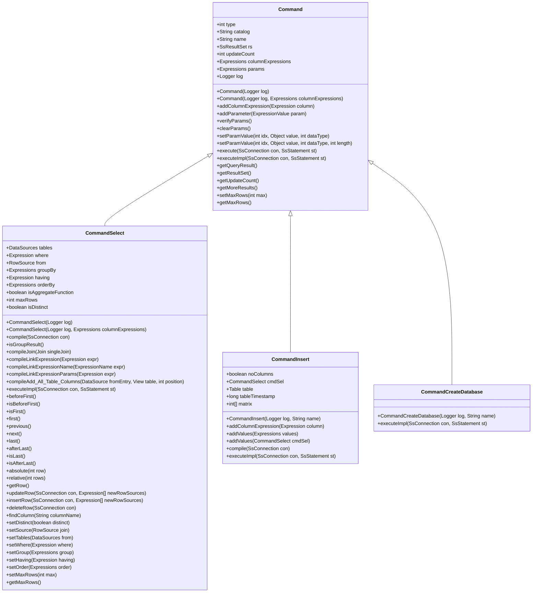

**图表来源**  
- [Command.java](file://src/main/java/io/leavesfly/smallsql/rdb/command/Command.java#L34-L190)
- [CommandSelect.java](file://src/main/java/io/leavesfly/smallsql/rdb/command/dql/CommandSelect.java#L34-L587)
- [CommandInsert.java](file://src/main/java/io/leavesfly/smallsql/rdb/command/dml/CommandInsert.java#L34-L207)
- [CommandCreateDatabase.java](file://src/main/java/io/leavesfly/smallsql/rdb/command/ddl/CommandCreateDatabase.java#L34-L67)

**章节来源**  
- [Command.java](file://src/main/java/io/leavesfly/smallsql/rdb/command/Command.java#L1-L190)

## DQL命令实现：CommandSelect
`CommandSelect`类实现了SQL查询命令的核心功能，通过复杂的执行计划构建和结果集处理机制支持各种查询操作。该类采用编译-执行模式，在执行前对查询语句进行语法和语义分析，建立列名与表对象的链接关系。

### 查询编译与执行流程
查询编译过程通过`compile()`方法实现，该方法负责解析SELECT语句中的各个子句并构建相应的执行组件。编译过程首先处理FROM子句，初始化数据源；然后处理SELECT子句中的列表达式，建立列名与表列的映射关系；最后处理WHERE、GROUP BY、HAVING和ORDER BY等子句。

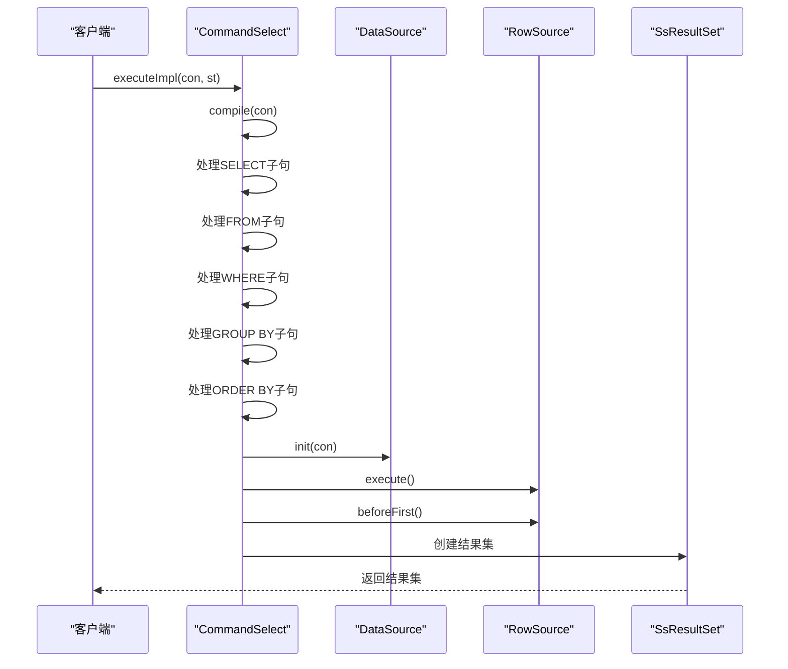

**图表来源**  
- [CommandSelect.java](file://src/main/java/io/leavesfly/smallsql/rdb/command/dql/CommandSelect.java#L100-L250)

**章节来源**  
- [CommandSelect.java](file://src/main/java/io/leavesfly/smallsql/rdb/command/dql/CommandSelect.java#L34-L587)

### FROM子句与数据源处理
FROM子句的处理通过`DataSources`和`DataSource`类实现，支持单表查询、多表连接和视图查询等多种数据源类型。`DataSources`维护查询中涉及的所有表或视图的列表，而`DataSource`负责具体的数据源初始化和元数据获取。

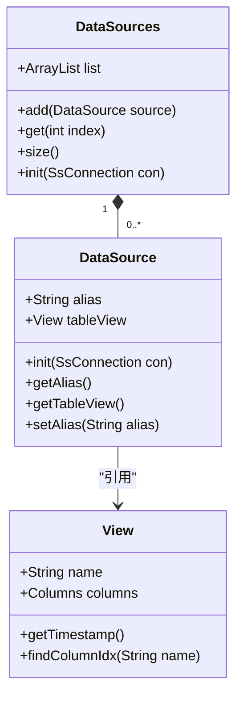

**图表来源**  
- [CommandSelect.java](file://src/main/java/leavesfly/smallsql/rdb/command/dql/CommandSelect.java#L50-L60)
- [DataSources.java](file://src/main/java/io/leavesfly/smallsql/rdb/engine/selector/DataSources.java)
- [DataSource.java](file://src/main/java/io/leavesfly/smallsql/rdb/engine/selector/DataSource.java)

### WHERE条件过滤实现
WHERE条件过滤通过`Where`类实现，该类包装底层的`RowSource`，在遍历结果时验证每行是否满足指定的条件表达式。`Where`类通过`isValidRow()`方法检查当前行是否符合WHERE条件，只有符合条件的行才会被返回给上层。

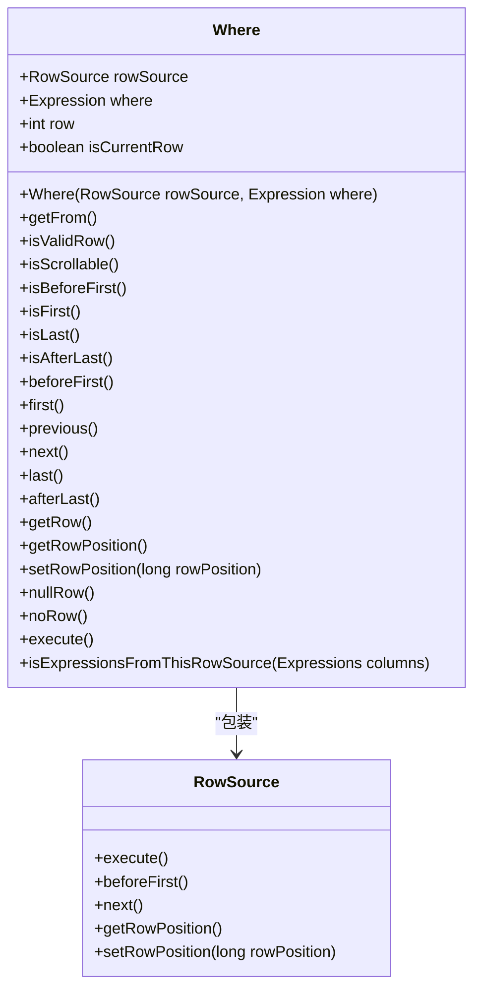

**图表来源**  
- [Where.java](file://src/main/java/io/leavesfly/smallsql/rdb/engine/selector/multioper/Where.java#L34-L176)
- [CommandSelect.java](file://src/main/java/io/leavesfly/smallsql/rdb/command/dql/CommandSelect.java#L200-L220)

### GROUP BY分组聚合实现
GROUP BY分组聚合功能通过`GroupResult`类实现，该类继承自`MemoryResult`，将查询结果按指定的分组表达式进行分组，并对每个分组执行聚合函数计算。`GroupResult`维护一个内存中的结果集，存储每个分组的聚合结果。

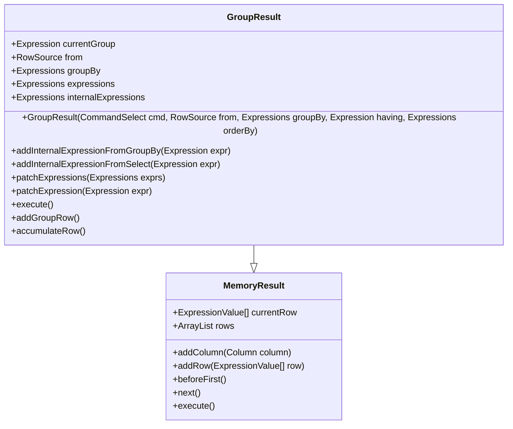

**图表来源**  
- [GroupResult.java](file://src/main/java/io/leavesfly/smallsql/rdb/engine/selector/multioper/GroupResult.java#L34-L284)
- [MemoryResult.java](file://src/main/java/io/leavesfly/smallsql/rdb/engine/selector/result/MemoryResult.java)

### ORDER BY排序实现
ORDER BY排序功能通过`SortedResult`类实现，该类使用`Index`数据结构对查询结果进行排序。`SortedResult`在执行阶段收集所有结果行的排序键值，构建排序索引，然后通过索引的游标按排序顺序访问结果行。

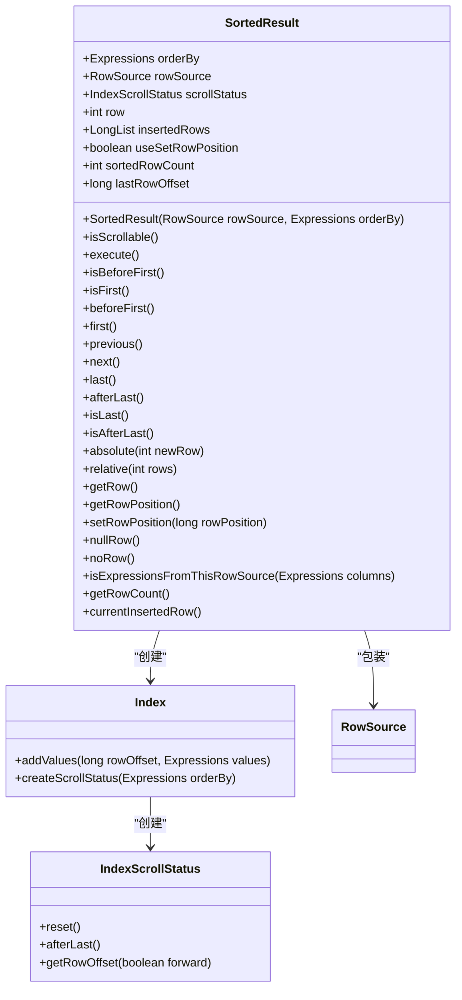

**图表来源**  
- [SortedResult.java](file://src/main/java/io/leavesfly/smallsql/rdb/engine/selector/multioper/SortedResult.java#L34-L307)
- [Index.java](file://src/main/java/io/leavesfly/smallsql/rdb/engine/Index.java)
- [IndexScrollStatus.java](file://src/main/java/io/leavesfly/smallsql/rdb/engine/IndexScrollStatus.java)

### Scrollable结果集支持
Scrollable结果集支持通过`Scrollable`类实现，该类包装不可滚动的`RowSource`，添加前后滚动功能。`Scrollable`维护一个行位置映射表`rowList`，记录已访问行的物理位置，支持`first()`、`last()`、`previous()`、`absolute()`和`relative()`等滚动操作。

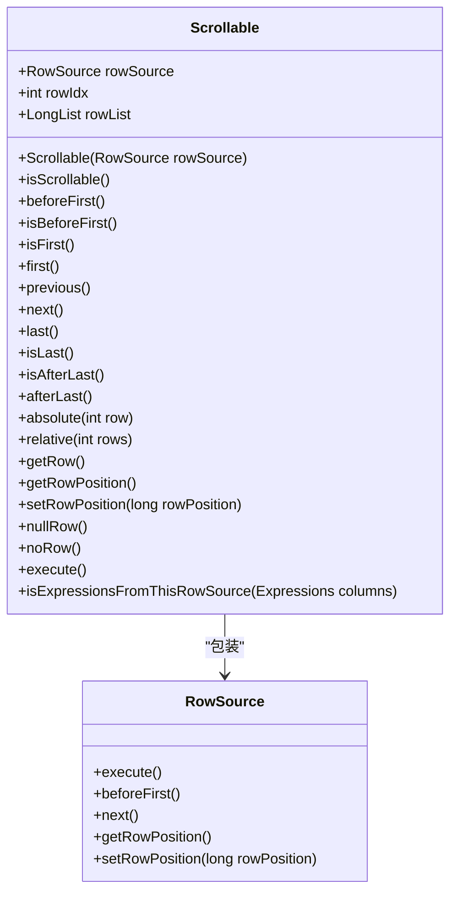

**图表来源**  
- [Scrollable.java](file://src/main/java/io/leavesfly/smallsql/rdb/engine/selector/Scrollable.java#L34-L235)
- [RowSource.java](file://src/main/java/io/leavesfly/smallsql/rdb/engine/RowSource.java)

## DML命令实现：CommandInsert
`CommandInsert`类实现了SQL插入命令的核心功能，通过列映射矩阵和值源处理机制支持各种插入操作。该类采用编译-执行模式，在执行前对插入语句进行语法和语义分析，建立列名与表列的映射关系。

### 列映射矩阵构建
列映射矩阵`matrix`是`CommandInsert`的核心数据结构，用于建立INSERT语句中列列表与目标表列的对应关系。矩阵的索引对应目标表的列索引，值对应INSERT语句中列列表的索引，-1表示使用默认值。

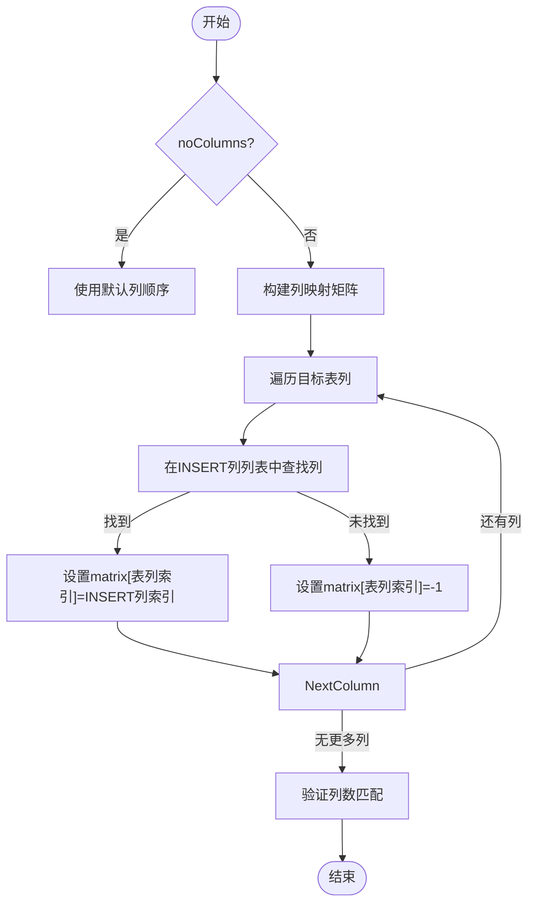

**图表来源**  
- [CommandInsert.java](file://src/main/java/io/leavesfly/smallsql/rdb/command/dml/CommandInsert.java#L100-L150)

### 默认值处理机制
默认值处理机制通过`Column.getDefaultValue()`方法实现，当INSERT语句中未指定某列的值时，系统会使用该列的默认值。对于自动生成键（如IDENTITY列），默认值可能是自动生成的序列值。

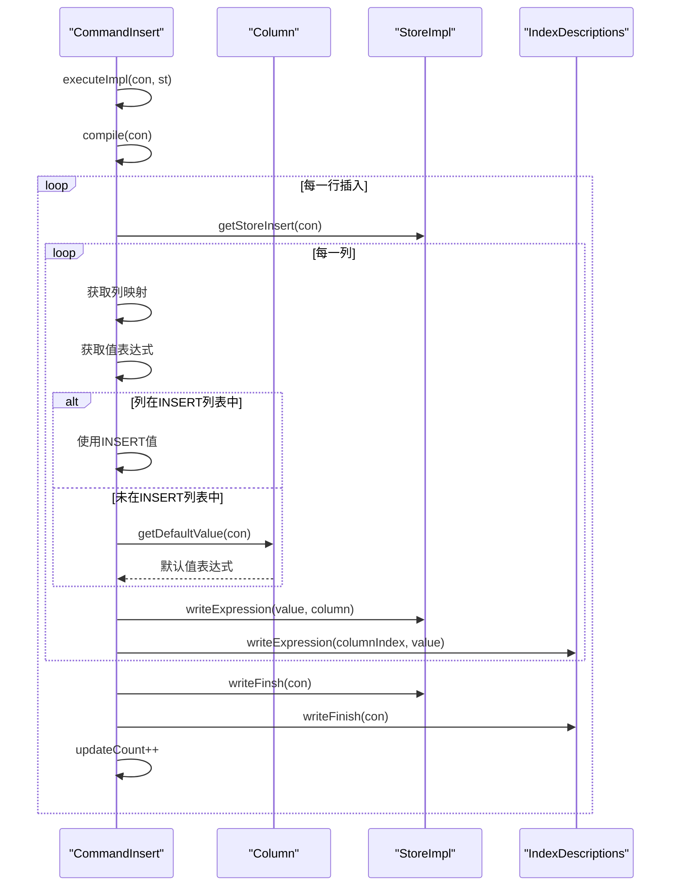

**图表来源**  
- [CommandInsert.java](file://src/main/java/io/leavesfly/smallsql/rdb/command/dml/CommandInsert.java#L150-L200)
- [Column.java](file://src/main/java/io/leavesfly/smallsql/rdb/engine/table/Column.java)

### 自动生成键支持
自动生成键支持通过`SsStatement.needGeneratedKeys()`和`setGeneratedKeys()`方法实现。当需要返回自动生成键时，系统会收集相关列的值并创建一个包含这些值的结果集返回给客户端。

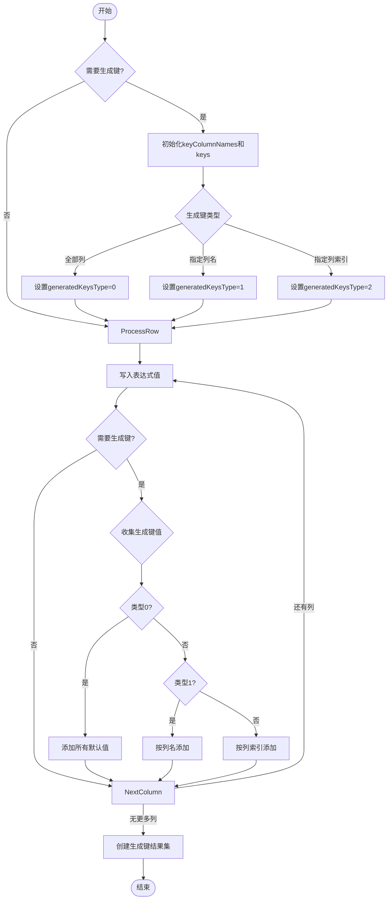

**图表来源**  
- [CommandInsert.java](file://src/main/java/io/leavesfly/smallsql/rdb/command/dml/CommandInsert.java#L180-L200)
- [SsStatement.java](file://src/main/java/io/leavesfly/smallsql/jdbc/statement/SsStatement.java)

## DDL命令实现：CommandCreateDatabase
`CommandCreateDatabase`类实现了数据库创建命令的核心功能，通过文件系统操作实现数据库的物理创建。该类直接操作文件系统，创建数据库目录和主文件。

### 文件系统操作流程
数据库创建流程包括检查只读状态、创建目录结构和生成主文件三个主要步骤。系统首先验证连接是否为只读模式，然后创建指定路径的目录结构，最后生成主文件标识数据库。

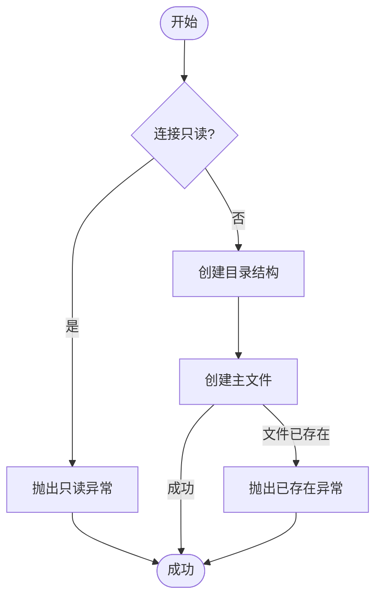

**图表来源**  
- [CommandCreateDatabase.java](file://src/main/java/io/leavesfly/smallsql/rdb/command/ddl/CommandCreateDatabase.java#L34-L67)

### 目录创建与主文件生成
目录创建使用`File.mkdirs()`方法递归创建所有必要的目录，确保路径完整。主文件生成使用`File.createNewFile()`方法创建空文件，该文件作为数据库存在的标识。

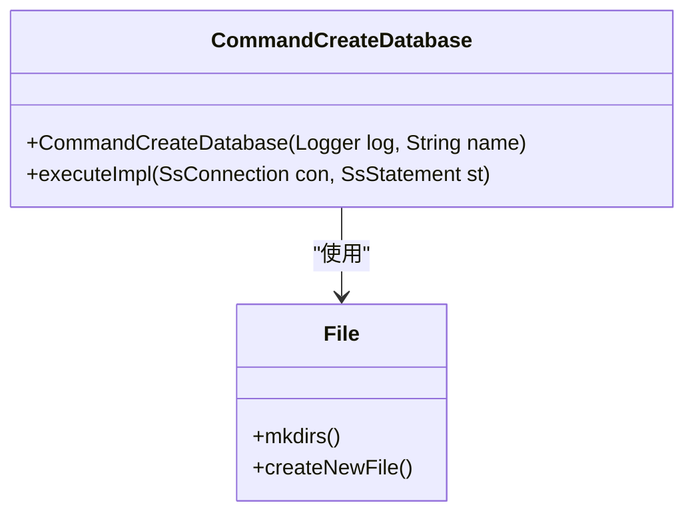

**图表来源**  
- [CommandCreateDatabase.java](file://src/main/java/io/leavesfly/smallsql/rdb/command/ddl/CommandCreateDatabase.java#L50-L60)
- [File.java](java.io.File)

## executeImpl方法实现策略对比
不同类型命令在`executeImpl()`方法中的实现策略存在显著差异，反映了查询命令和更新命令的不同需求和行为特征。

### 查询命令与更新命令设计考量
查询命令返回`ResultSet`而更新命令返回影响行数的设计考量主要基于以下几点：查询命令需要返回多行结果数据，而更新命令只需要返回操作的统计信息；查询命令的结果集支持游标操作，而更新命令是瞬时操作；查询命令可能涉及复杂的数据处理流程，而更新命令通常是简单的数据修改。

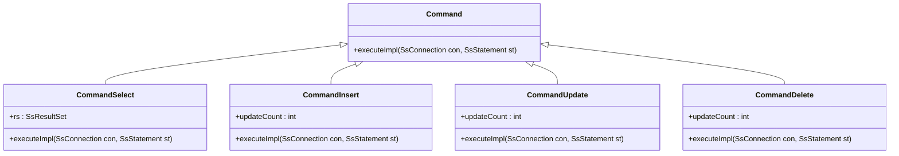

**图表来源**  
- [Command.java](file://src/main/java/io/leavesfly/smallsql/rdb/command/Command.java#L128-L138)
- [CommandSelect.java](file://src/main/java/io/leavesfly/smallsql/rdb/command/dql/CommandSelect.java#L250-L280)
- [CommandInsert.java](file://src/main/java/io/leavesfly/smallsql/rdb/command/dml/CommandInsert.java#L150-L200)

### 结果返回机制差异
查询命令通过`rs`字段返回`SsResultSet`对象，该对象封装了查询结果和游标状态。更新命令通过`updateCount`字段返回影响行数，表示操作修改的记录数量。这种设计分离了数据查询和数据修改的返回值类型，使API更加清晰和一致。

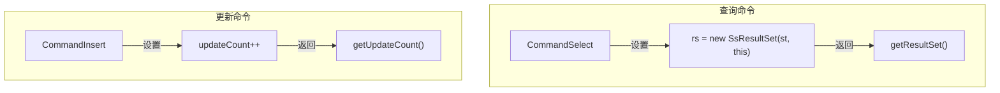

**图表来源**  
- [CommandSelect.java](file://src/main/java/io/leavesfly/smallsql/rdb/command/dql/CommandSelect.java#L270-L280)
- [CommandInsert.java](file://src/main/java/io/leavesfly/smallsql/rdb/command/dml/CommandInsert.java#L190-L200)

## 典型使用场景与性能特征
不同类型的命令在实际使用中表现出不同的性能特征和适用场景，了解这些特征有助于优化数据库操作。

### 查询命令性能特征
查询命令的性能主要受查询复杂度、数据量大小和索引使用情况的影响。简单查询通常具有较低的延迟，而复杂查询（涉及多表连接、分组聚合和排序）可能需要较长的执行时间。使用适当的索引可以显著提高查询性能。

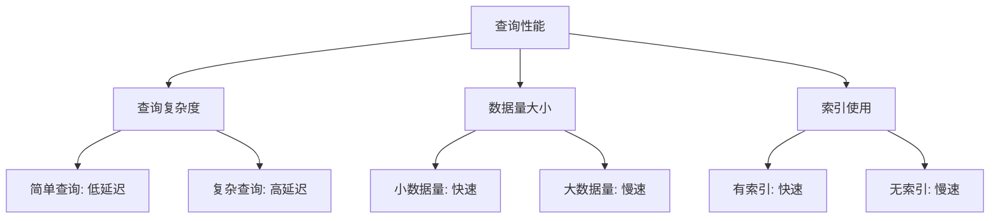

### 插入命令性能特征
插入命令的性能主要受批量大小、索引数量和事务大小的影响。批量插入通常比单行插入更高效，因为减少了事务开销。然而，大量索引会增加插入操作的开销，因为每个索引都需要更新。

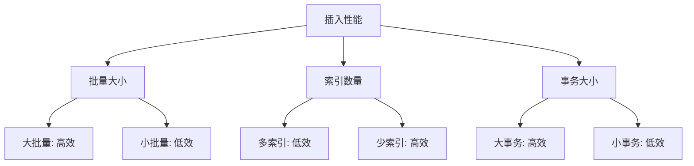

### 数据库创建性能特征
数据库创建命令的性能通常很高，因为主要涉及文件系统操作。创建时间主要取决于文件系统性能和磁盘I/O速度。由于操作简单，通常在毫秒级别完成。

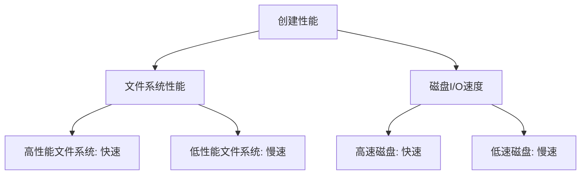

## 结论
本文档详细分析了SmallSQL系统中命令模式子类的实现机制，重点阐述了DDL、DML和DQL三类SQL命令的具体实现差异。`CommandSelect`通过复杂的执行计划构建和结果集处理机制支持各种查询操作，包括FROM子句处理、WHERE条件过滤、GROUP BY分组聚合、ORDER BY排序等核心功能，以及Scrollable结果集支持。`CommandInsert`通过列映射矩阵和值源处理机制支持各种插入操作，包括默认值处理和自动生成键支持。`CommandCreateDatabase`通过文件系统操作实现数据库的物理创建。不同类型命令在`executeImpl()`方法中的实现策略反映了查询命令返回ResultSet而更新命令返回影响行数的设计考量。了解这些实现细节和性能特征有助于更好地使用和优化SmallSQL数据库系统。

**章节来源**  
- [Command.java](file://src/main/java/io/leavesfly/smallsql/rdb/command/Command.java#L1-L190)
- [CommandSelect.java](file://src/main/java/io/leavesfly/smallsql/rdb/command/dql/CommandSelect.java#L1-L587)
- [CommandInsert.java](file://src/main/java/io/leavesfly/smallsql/rdb/command/dml/CommandInsert.java#L1-L207)
- [CommandCreateDatabase.java](file://src/main/java/io/leavesfly/smallsql/rdb/command/ddl/CommandCreateDatabase.java#L1-L67)