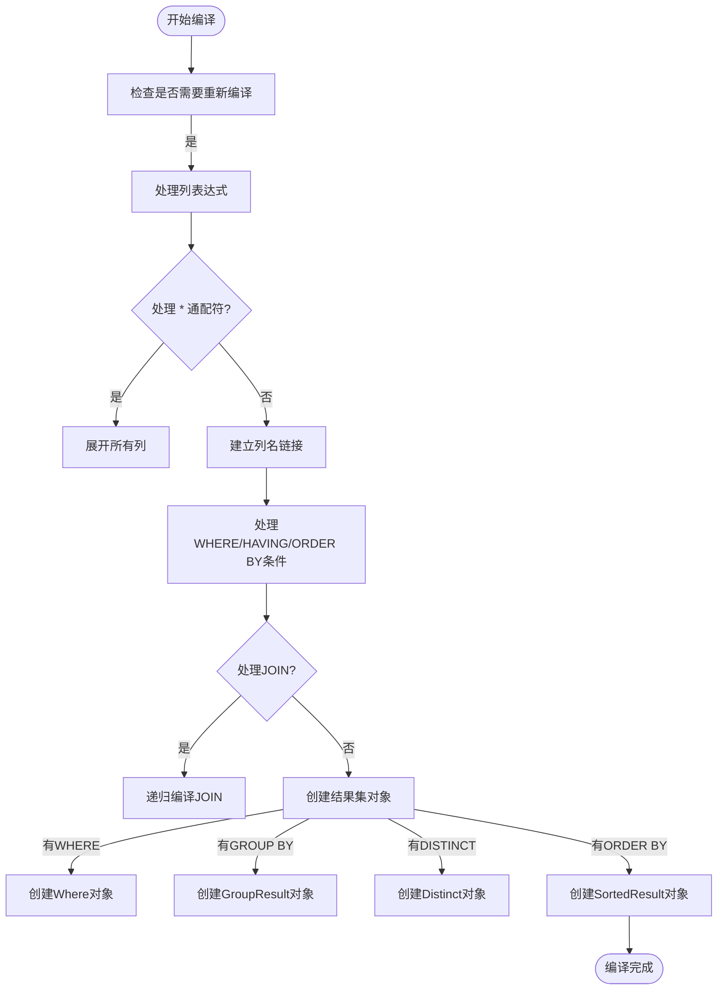
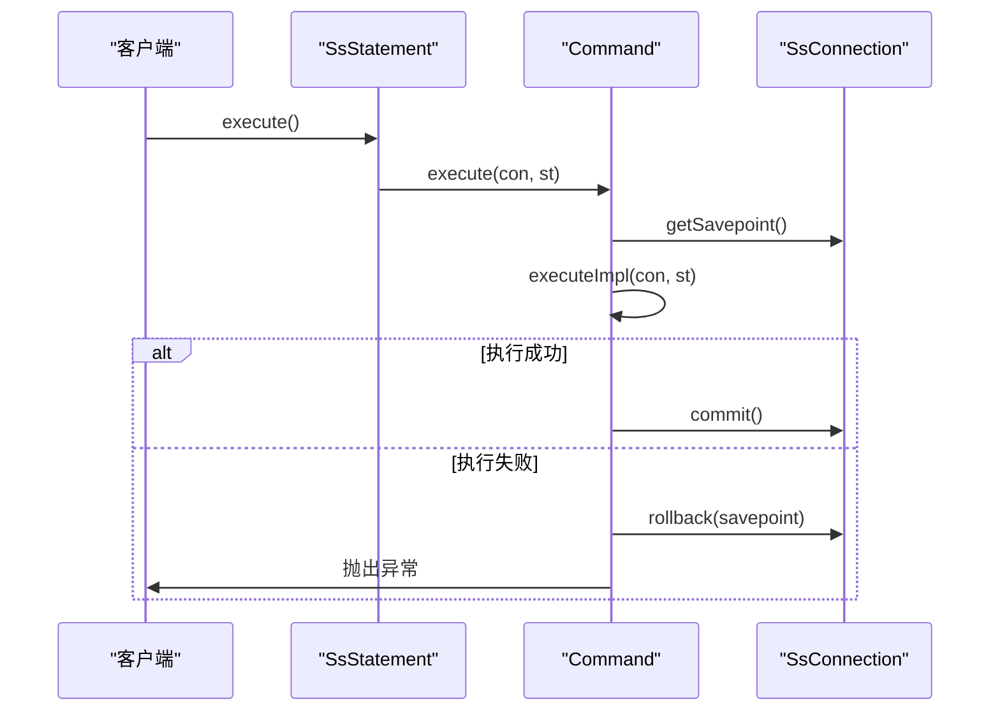

# 执行流程

<cite>
**本文档引用的文件**
- [Command.java](file://src/main/java/io/leavesfly/smallsql/rdb/command/Command.java)
- [SQLParser.java](file://src/main/java/io/leavesfly/smallsql/rdb/sql/SQLParser.java)
- [CommandSelect.java](file://src/main/java/io/leavesfly/smallsql/rdb/command/dql/CommandSelect.java)
- [CommandInsert.java](file://src/main/java/io/leavesfly/smallsql/rdb/command/dml/CommandInsert.java)
- [SsConnection.java](file://src/main/java/io/leavesfly/smallsql/jdbc/SsConnection.java)
</cite>

## 目录
1. [命令执行生命周期概述](#命令执行生命周期概述)
2. [参数绑定与预处理](#参数绑定与预处理)
3. [编译验证阶段](#编译验证阶段)
4. [执行阶段与事务管理](#执行阶段与事务管理)
5. [连接与语句状态影响](#连接与语句状态影响)
6. [错误处理与资源清理](#错误处理与资源清理)
7. [ACID特性与系统稳定性](#acid特性与系统稳定性)

## 命令执行生命周期概述

SmallSQL的命令执行流程遵循典型的三阶段模式：参数绑定、编译验证和实际执行。整个生命周期始于`SQLParser`将SQL语句解析为`Command`对象，最终通过`execute()`方法完成操作。`Command`类作为所有SQL命令的抽象基类，定义了统一的执行框架。`SQLParser`根据SQL语句类型（如SELECT、INSERT）创建相应的`Command`子类实例，并通过`parse()`方法构建完整的命令对象。此过程将SQL文本转换为可执行的内部表示，为后续的编译和执行阶段奠定基础。

**Section sources**
- [SQLParser.java](file://src/main/java/io/leavesfly/smallsql/rdb/sql/SQLParser.java#L137-L2527)
- [Command.java](file://src/main/java/io/leavesfly/smallsql/rdb/command/Command.java#L47-L190)

## 参数绑定与预处理

参数绑定是命令执行前的关键准备阶段，主要通过`Command`类的`setParamValue()`方法实现。对于预编译语句（PreparedStatement），参数以`ExpressionValue`形式存储在`params`列表中，通过索引（从1开始）进行设置。`verifyParams()`方法在执行前检查所有参数是否已设置，确保执行的完整性。`clearParams()`方法用于清除所有参数值，为下一次执行做准备。这一机制支持动态SQL执行，允许在运行时绑定变量值，提高了SQL语句的灵活性和安全性。

**Section sources**
- [Command.java](file://src/main/java/io/leavesfly/smallsql/rdb/command/Command.java#L47-L190)

## 编译验证阶段

编译验证阶段通过`compile()`方法实现，负责解析表结构、建立列映射关系并进行语法语义检查。以`CommandSelect`为例，`compile()`方法首先初始化数据源，然后遍历`columnExpressions`列表，处理`*`通配符和列别名。`compileLinkExpressionName()`方法将列名表达式与实际的表和列索引建立链接，解决列名歧义问题。对于`CommandInsert`，`compile()`方法构建`matrix`数组，实现INSERT语句中列与表中列的映射，确保数据正确插入到对应位置。此阶段还处理聚合函数、分组和排序等复杂逻辑，为执行阶段准备优化后的执行计划。

**Diagram sources**
- [CommandSelect.java](file://src/main/java/io/leavesfly/smallsql/rdb/command/dql/CommandSelect.java#L61-L587)
- [CommandInsert.java](file://src/main/java/io/leavesfly/smallsql/rdb/command/dml/CommandInsert.java#L55-L207)

## 执行阶段与事务管理

执行阶段的核心是`execute()`模板方法，它实现了统一的事务管理框架。`execute()`方法首先获取当前保存点，然后在`try`块中调用抽象的`executeImpl()`方法执行具体逻辑。如果发生异常，`catch`块会回滚到保存点，确保数据一致性。`finally`块根据`autoCommit`设置决定是否提交事务。`SsConnection`类通过`commitPages`列表管理事务步骤，`commit()`和`rollback()`方法分别处理提交和回滚操作。这种设计保证了ACID特性中的原子性和一致性。

**Diagram sources**
- [Command.java](file://src/main/java/io/leavesfly/smallsql/rdb/command/Command.java#L128-L190)
- [SsConnection.java](file://src/main/java/io/leavesfly/smallsql/jdbc/SsConnection.java#L256-L283)

## 连接与语句状态影响

不同命令类型对`SsConnection`和`SsStatement`状态产生不同影响。`CommandSet`直接修改连接的隔离级别或当前目录。DML命令（INSERT、UPDATE、DELETE）通过`updateCount`返回受影响的行数。DQL命令（SELECT）创建`SsResultSet`，其类型由`SsStatement`的`rsType`决定。滚动敏感结果集会包装`Scrollable`对象以支持随机访问。`SsConnection`的`autoCommit`属性控制事务的自动提交行为，而`commitPages`列表跟踪所有待提交的更改，确保事务的完整性。

**Section sources**
- [CommandSet.java](file://src/main/java/io/leavesfly/smallsql/rdb/command/ddl/CommandSet.java#L34-L61)
- [SsConnection.java](file://src/main/java/io/leavesfly/smallsql/jdbc/SsConnection.java#L256-L283)

## 错误处理与资源清理

系统采用分层错误处理机制。`SQLParser`在解析阶段抛出语法错误，`compile()`方法在验证阶段抛出语义错误，`executeImpl()`在执行阶段处理运行时错误。所有异常最终被包装为`SmallSQLException`。资源清理通过`finally`块保证，即使发生异常也会执行`commit()`或`rollback()`。`freeLock()`方法释放事务中持有的锁，防止资源泄漏。测试用例验证了保存点回滚、部分提交和异常安全等场景，确保系统在各种错误条件下都能保持稳定。

**Section sources**
- [TestTransactions.java](file://src/test/java/io/leavesfly/smallsql/junit/sql/tpl/TestTransactions.java#L278-L309)

## ACID特性与系统稳定性

执行流程设计通过多种机制保证ACID特性和系统稳定性。原子性通过保存点和回滚机制实现，确保操作要么全部成功，要么全部失败。一致性通过编译阶段的约束检查和执行阶段的完整性验证维护。隔离性由`isolationLevel`控制，支持不同级别的并发控制。持久性通过`commit()`方法将更改写入持久存储保证。模板方法模式和异常安全的事务管理框架共同确保了系统的健壮性，即使在高并发和异常情况下也能保持数据的完整性和一致性。