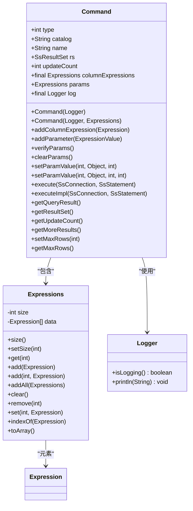
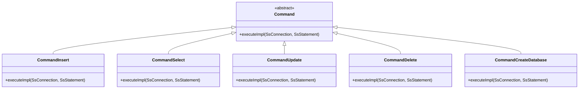

# 核心设计

<cite>
**本文档中引用的文件**  
- [Command.java](file://src/main/java/io/leavesfly/smallsql/rdb/command/Command.java)
- [CommandInsert.java](file://src/main/java/io/leavesfly/smallsql/rdb/command/dml/CommandInsert.java)
- [CommandSelect.java](file://src/main/java/io/leavesfly/smallsql/rdb/command/dql/CommandSelect.java)
- [CommandUpdate.java](file://src/main/java/io/leavesfly/smallsql/rdb/command/dml/CommandUpdate.java)
- [CommandDelete.java](file://src/main/java/io/leavesfly/smallsql/rdb/command/dml/CommandDelete.java)
- [Expressions.java](file://src/main/java/io/leavesfly/smallsql/rdb/sql/expression/Expressions.java)
- [Logger.java](file://src/main/java/io/leavesfly/smallsql/logger/Logger.java)
</cite>

## 目录
1. [引言](#引言)
2. [Command抽象类架构设计](#command抽象类架构设计)
3. [核心字段设计原理](#核心字段设计原理)
4. [execute()模板方法实现机制](#execute模板方法实现机制)
5. [executeImpl()抽象方法契约](#executeimpl抽象方法契约)
6. [辅助方法实现细节](#辅助方法实现细节)
7. [UML类图：继承关系](#uml类图继承关系)
8. [命令对象创建与初始化](#命令对象创建与初始化)
9. [关注点分离与代码复用](#关注点分离与代码复用)
10. [结论](#结论)

## 引言
`Command` 抽象类是SmallSQL数据库系统中SQL命令执行的核心基类，采用命令模式（Command Pattern）实现。该类为所有SQL操作（包括DDL、DML、DQL）提供了统一的执行接口和基础功能，通过模板方法模式定义了标准化的执行流程，并通过抽象方法将具体实现延迟到子类。这种设计实现了操作的原子性、事务安全性和代码的高度复用。

**Section sources**
- [Command.java](file://src/main/java/io/leavesfly/smallsql/rdb/command/Command.java#L1-L190)

## Command抽象类架构设计
`Command` 类作为所有SQL命令的基类，定义了命令执行的通用结构和行为。它采用抽象类的形式，强制子类实现核心的 `executeImpl()` 方法，同时提供了一系列模板方法和辅助功能，如参数管理、日志记录和结果处理。该类的设计体现了面向对象的开闭原则（对扩展开放，对修改关闭），使得新的SQL命令可以通过继承轻松添加。

**Section sources**
- [Command.java](file://src/main/java/io/leavesfly/smallsql/rdb/command/Command.java#L47-L190)

## 核心字段设计原理
`Command` 类的核心字段设计旨在支持SQL命令的解析、执行和结果返回。

- **params**: 一个 `Expressions` 类型的列表，用于存储预编译语句（PreparedStatement）中的参数占位符。每个参数由 `ExpressionValue` 对象表示，支持动态赋值。
- **columnExpressions**: 一个 `Expressions` 类型的列表，用于存储与命令相关的列表达式。例如，在 `INSERT` 语句中，它存储要插入的值；在 `SELECT` 语句中，它存储要查询的列。
- **log**: 一个 `Logger` 类型的只读字段，用于在执行过程中输出调试信息。日志功能通过 `DriverManager.getLogWriter()` 进行控制，确保了日志的可配置性。

**Diagram sources**
- [Command.java](file://src/main/java/io/leavesfly/smallsql/rdb/command/Command.java#L47-L190)
- [Expressions.java](file://src/main/java/io/leavesfly/smallsql/rdb/sql/expression/Expressions.java#L1-L133)
- [Logger.java](file://src/main/java/io/leavesfly/smallsql/logger/Logger.java#L1-L58)

## execute()模板方法实现机制
`execute()` 方法是 `Command` 类中定义的模板方法，它封装了SQL命令执行的标准流程，确保了操作的原子性和事务安全性。

1.  **保存事务点**: 首先调用 `con.getSavepoint()` 获取当前事务的保存点。
2.  **执行核心逻辑**: 在 `try` 块中调用抽象的 `executeImpl()` 方法，执行具体的SQL操作。
3.  **异常回滚**: 如果在执行过程中抛出任何异常（`Throwable`），则在 `catch` 块中调用 `con.rollback(savepoint)` 回滚到保存点，撤销所有已执行的操作。
4.  **自动提交**: 在 `finally` 块中，如果连接处于自动提交模式（`con.getAutoCommit()`），则调用 `con.commit()` 提交事务。

这种设计保证了无论操作成功还是失败，数据库都能保持一致的状态。

**Section sources**
- [Command.java](file://src/main/java/io/leavesfly/smallsql/rdb/command/Command.java#L147-L166)

## executeImpl()抽象方法契约
`executeImpl()` 是一个抽象方法，其契约约定如下：
- **职责**: 子类必须实现此方法，以执行具体的SQL命令逻辑（如创建表、插入数据、查询等）。
- **参数**: 接收 `SsConnection` 和 `SsStatement` 两个参数，分别代表数据库连接和语句对象，用于与数据库引擎交互。
- **异常**: 方法声明抛出 `Exception`，允许子类抛出任何类型的异常。`execute()` 模板方法会捕获这些异常并进行统一处理。
- **实现**: 子类在实现时，应专注于业务逻辑，而不必关心事务管理，因为事务管理由 `execute()` 方法负责。

**Section sources**
- [Command.java](file://src/main/java/io/leavesfly/smallsql/rdb/command/Command.java#L168-L169)

## 辅助方法实现细节
`Command` 类提供了多个辅助方法来支持命令的执行。

- **verifyParams()**: 遍历 `params` 列表，检查所有参数是否已设置值。如果发现空参数，则抛出 `SmallSQLException` 异常，提示参数为空。
- **clearParams()**: 遍历 `params` 列表，调用每个 `ExpressionValue` 的 `clear()` 方法，将所有参数重置为空状态，以便于PreparedStatement的重复使用。
- **setParamValue()**: 根据索引（从1开始）设置参数的值和数据类型。如果日志功能开启，会将参数信息输出到日志中。

**Section sources**
- [Command.java](file://src/main/java/io/leavesfly/smallsql/rdb/command/Command.java#L100-L145)

## UML类图：继承关系
以下UML类图展示了 `Command` 类与主要子类之间的继承关系。

**Diagram sources**
- [Command.java](file://src/main/java/io/leavesfly/smallsql/rdb/command/Command.java#L47-L190)
- [CommandInsert.java](file://src/main/java/io/leavesfly/smallsql/rdb/command/dml/CommandInsert.java#L1-L207)
- [CommandSelect.java](file://src/main/java/io/leavesfly/smallsql/rdb/command/dql/CommandSelect.java#L1-L587)
- [CommandUpdate.java](file://src/main/java/io/leavesfly/smallsql/rdb/command/dml/CommandUpdate.java#L1-L116)
- [CommandDelete.java](file://src/main/java/io/leavesfly/smallsql/rdb/command/dml/CommandDelete.java#L1-L66)
- [CommandCreateDatabase.java](file://src/main/java/io/leavesfly/smallsql/rdb/command/ddl/CommandCreateDatabase.java#L1-L67)

## 命令对象创建与初始化
命令对象的创建通常由 `SQLParser` 解析SQL语句后完成。以 `CommandInsert` 为例：
1.  **构造**: 调用 `new CommandInsert(log, tableName)` 创建对象，传入日志记录器和表名。
2.  **添加列**: 调用 `addColumnExpression()` 方法，将SQL中的列名或表达式添加到 `columnExpressions` 列表中。
3.  **添加值**: 调用 `addValues()` 方法，将值列表或子查询命令关联到该插入命令。
4.  **执行**: 调用 `execute()` 方法，启动模板方法流程。

**Section sources**
- [CommandInsert.java](file://src/main/java/io/leavesfly/smallsql/rdb/command/dml/CommandInsert.java#L1-L207)

## 关注点分离与代码复用
`Command` 类通过抽象化SQL执行过程，实现了清晰的关注点分离：
- **通用逻辑分离**: 事务管理、异常处理、参数验证等通用逻辑集中在基类中。
- **具体逻辑分离**: 每种SQL命令的具体执行逻辑由各自的子类实现。
- **代码复用**: 所有子类都复用了基类的参数管理、日志记录和结果处理功能，避免了代码重复，极大地提升了代码的可维护性和可扩展性。

**Section sources**
- [Command.java](file://src/main/java/io/leavesfly/smallsql/rdb/command/Command.java#L47-L190)

## 结论
`Command` 抽象类是SmallSQL命令模式的核心，它通过模板方法模式和继承机制，为所有SQL命令提供了一个强大而灵活的执行框架。其设计精巧，不仅保证了操作的原子性和数据一致性，还通过关注点分离显著提升了代码的复用性和可维护性，是数据库系统中面向对象设计的一个典范。