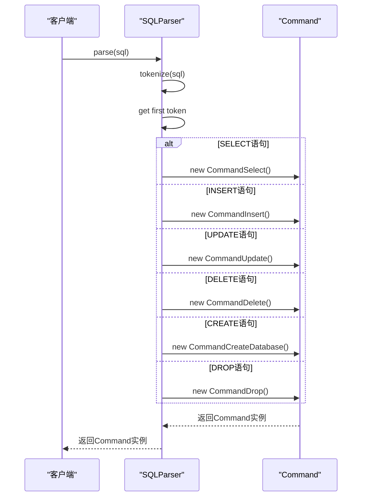
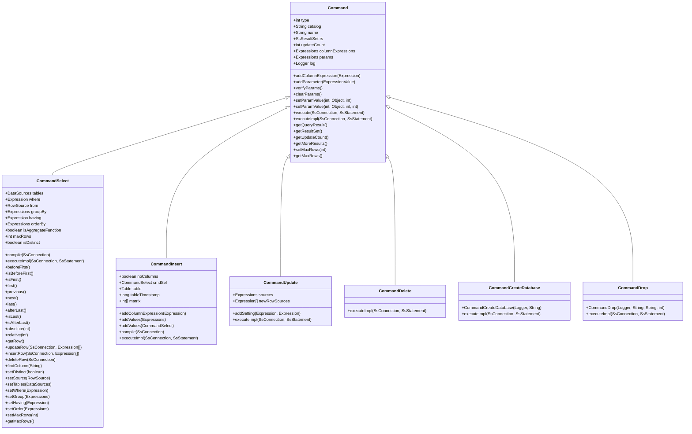
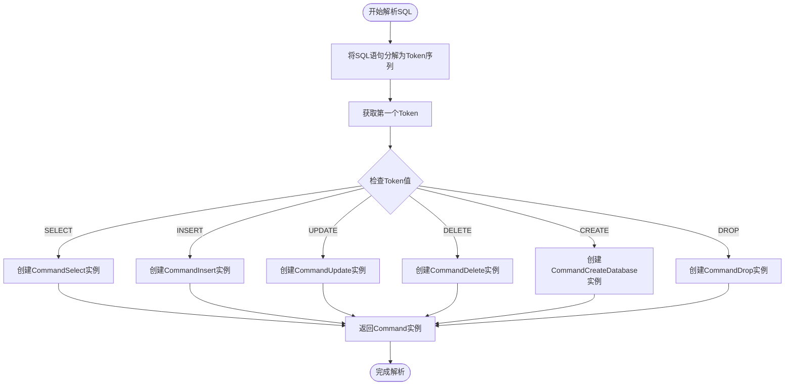
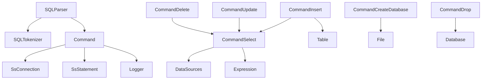

# 工厂模式

<cite>
**本文档引用的文件**   
- [Command.java](file://src/main/java/io/leavesfly/smallsql/rdb/command/Command.java)
- [CommandSelect.java](file://src/main/java/io/leavesfly/smallsql/rdb/command/dql/CommandSelect.java)
- [CommandInsert.java](file://src/main/java/io/leavesfly/smallsql/rdb/command/dml/CommandInsert.java)
- [CommandUpdate.java](file://src/main/java/io/leavesfly/smallsql/rdb/command/dml/CommandUpdate.java)
- [CommandDelete.java](file://src/main/java/io/leavesfly/smallsql/rdb/command/dml/CommandDelete.java)
- [CommandCreateDatabase.java](file://src/main/java/io/leavesfly/smallsql/rdb/command/ddl/CommandCreateDatabase.java)
- [CommandDrop.java](file://src/main/java/io/leavesfly/smallsql/rdb/command/ddl/CommandDrop.java)
- [SQLParser.java](file://src/main/java/io/leavesfly/smallsql/rdb/sql/SQLParser.java)
</cite>

## 目录
1. [引言](#引言)
2. [核心组件](#核心组件)
3. [架构概述](#架构概述)
4. [详细组件分析](#详细组件分析)
5. [依赖分析](#依赖分析)
6. [性能考虑](#性能考虑)
7. [故障排除指南](#故障排除指南)
8. [结论](#结论)

## 引言
本文档深入分析SmallSQL数据库系统中工厂模式的实现，重点研究SQLParser类如何作为Command对象的工厂。文档详细阐述了parse()方法如何根据SQL语句的第一个关键字（如SELECT、INSERT、UPDATE等）动态创建对应的Command子类实例。通过分析工厂方法模式在SQL解析过程中的应用，包括token识别、命令分发和对象创建的完整流程，展示工厂模式如何实现SQL语句类型与具体命令类之间的解耦，支持新SQL命令的无缝扩展。

## 核心组件
本文档的核心组件包括SQLParser类作为工厂类，Command类作为抽象产品类，以及各种Command子类作为具体产品类。SQLParser类的parse()方法根据SQL语句的第一个关键字动态创建对应的Command子类实例，实现了工厂方法模式。这种设计模式将对象的创建过程与使用过程分离，提高了代码的可维护性和可扩展性。

**Section sources**
- [SQLParser.java](file://src/main/java/io/leavesfly/smallsql/rdb/sql/SQLParser.java#L150-L250)
- [Command.java](file://src/main/java/io/leavesfly/smallsql/rdb/command/Command.java#L1-L50)

## 架构概述
SmallSQL系统采用工厂方法模式来处理不同类型的SQL语句。SQLParser类作为工厂类，负责解析SQL语句并创建相应的Command对象。Command类作为抽象基类，定义了所有命令的通用接口。各种具体的Command子类（如CommandSelect、CommandInsert等）实现了特定SQL语句的执行逻辑。

```mermaid
graph TB
SQLParser[SQLParser] --> |parse()| Command[Command]
Command --> CommandSelect[CommandSelect]
Command --> CommandInsert[CommandInsert]
Command --> CommandUpdate[CommandUpdate]
Command --> CommandDelete[CommandDelete]
Command --> CommandCreateDatabase[CommandCreateDatabase]
Command --> CommandDrop[CommandDrop]
```

**Diagram sources **
- [SQLParser.java](file://src/main/java/io/leavesfly/smallsql/rdb/sql/SQLParser.java#L150-L250)
- [Command.java](file://src/main/java/io/leavesfly/smallsql/rdb/command/Command.java#L1-L50)

## 详细组件分析

### SQLParser工厂类分析
SQLParser类作为工厂类，其parse()方法是工厂模式的核心实现。该方法首先将SQL语句解析为token序列，然后根据第一个token的值（即SQL关键字）决定创建哪种类型的Command对象。



**Diagram sources **
- [SQLParser.java](file://src/main/java/io/leavesfly/smallsql/rdb/sql/SQLParser.java#L150-L250)
- [Command.java](file://src/main/java/io/leavesfly/smallsql/rdb/command/Command.java#L1-L50)

**Section sources**
- [SQLParser.java](file://src/main/java/io/leavesfly/smallsql/rdb/sql/SQLParser.java#L150-L250)
- [Command.java](file://src/main/java/io/leavesfly/smallsql/rdb/command/Command.java#L1-L50)

### Command抽象产品类分析
Command类作为抽象产品类，定义了所有SQL命令的通用接口和基础功能。它提供了execute()方法作为模板方法，其中调用抽象的executeImpl()方法，由具体子类实现具体的执行逻辑。



**Diagram sources **
- [Command.java](file://src/main/java/io/leavesfly/smallsql/rdb/command/Command.java#L1-L190)
- [CommandSelect.java](file://src/main/java/io/leavesfly/smallsql/rdb/command/dql/CommandSelect.java#L1-L588)
- [CommandInsert.java](file://src/main/java/io/leavesfly/smallsql/rdb/command/dml/CommandInsert.java#L1-L208)
- [CommandUpdate.java](file://src/main/java/io/leavesfly/smallsql/rdb/command/dml/CommandUpdate.java#L1-L117)
- [CommandDelete.java](file://src/main/java/io/leavesfly/smallsql/rdb/command/dml/CommandDelete.java#L1-L67)
- [CommandCreateDatabase.java](file://src/main/java/io/leavesfly/smallsql/rdb/command/ddl/CommandCreateDatabase.java#L1-L68)
- [CommandDrop.java](file://src/main/java/io/leavesfly/smallsql/rdb/command/ddl/CommandDrop.java#L1-L85)

**Section sources**
- [Command.java](file://src/main/java/io/leavesfly/smallsql/rdb/command/Command.java#L1-L190)
- [CommandSelect.java](file://src/main/java/io/leavesfly/smallsql/rdb/command/dql/CommandSelect.java#L1-L588)
- [CommandInsert.java](file://src/main/java/io/leavesfly/smallsql/rdb/command/dml/CommandInsert.java#L1-L208)
- [CommandUpdate.java](file://src/main/java/io/leavesfly/smallsql/rdb/command/dml/CommandUpdate.java#L1-L117)
- [CommandDelete.java](file://src/main/java/io/leavesfly/smallsql/rdb/command/dml/CommandDelete.java#L1-L67)
- [CommandCreateDatabase.java](file://src/main/java/io/leavesfly/smallsql/rdb/command/ddl/CommandCreateDatabase.java#L1-L68)
- [CommandDrop.java](file://src/main/java/io/leavesfly/smallsql/rdb/command/ddl/CommandDrop.java#L1-L85)

### 工厂方法模式流程分析
工厂方法模式在SQL解析过程中的应用包括token识别、命令分发和对象创建的完整流程。SQLParser类首先将SQL语句解析为token序列，然后根据第一个token的值决定创建哪种类型的Command对象。



**Diagram sources **
- [SQLParser.java](file://src/main/java/io/leavesfly/smallsql/rdb/sql/SQLParser.java#L150-L250)

**Section sources**
- [SQLParser.java](file://src/main/java/io/leavesfly/smallsql/rdb/sql/SQLParser.java#L150-L250)

## 依赖分析
工厂模式的实现依赖于多个组件的协同工作。SQLParser类依赖于SQLTokenizer类进行token解析，Command类及其子类依赖于数据库连接和语句对象进行执行。



**Diagram sources **
- [SQLParser.java](file://src/main/java/io/leavesfly/smallsql/rdb/sql/SQLParser.java#L1-L50)
- [Command.java](file://src/main/java/io/leavesfly/smallsql/rdb/command/Command.java#L1-L50)

**Section sources**
- [SQLParser.java](file://src/main/java/io/leavesfly/smallsql/rdb/sql/SQLParser.java#L1-L50)
- [Command.java](file://src/main/java/io/leavesfly/smallsql/rdb/command/Command.java#L1-L50)

## 性能考虑
工厂模式在提高代码可维护性的同时，也带来了一些性能考虑。对象创建的开销、内存使用和方法调用的间接性都需要在设计时权衡。通过对象池或缓存机制可以优化频繁创建的对象，减少垃圾回收的压力。

## 故障排除指南
在使用工厂模式时，常见的问题包括token识别错误、命令分发失败和对象创建异常。确保SQL语句的语法正确，token解析器能够正确识别关键字，工厂方法能够正确分发和创建对象。

**Section sources**
- [SQLParser.java](file://src/main/java/io/leavesfly/smallsql/rdb/sql/SQLParser.java#L150-L250)
- [Command.java](file://src/main/java/io/leavesfly/smallsql/rdb/command/Command.java#L1-L50)

## 结论
工厂方法模式在SmallSQL系统中的应用有效地实现了SQL语句类型与具体命令类之间的解耦，支持新SQL命令的无缝扩展。通过将对象的创建过程与使用过程分离，提高了代码的可维护性和可测试性。这种设计模式使得系统更加灵活，易于扩展和维护。