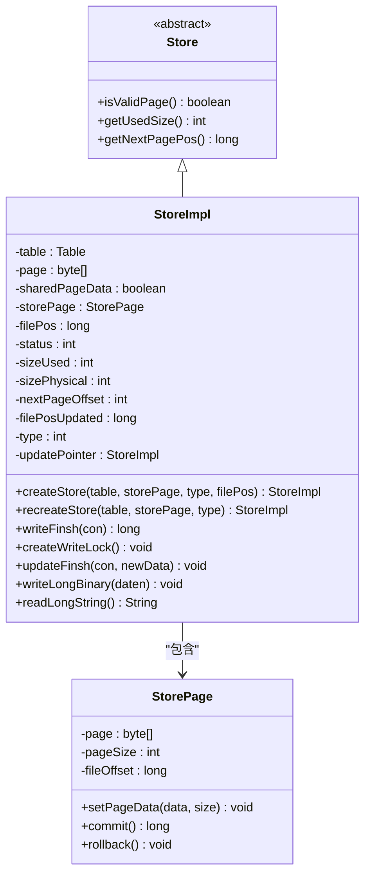
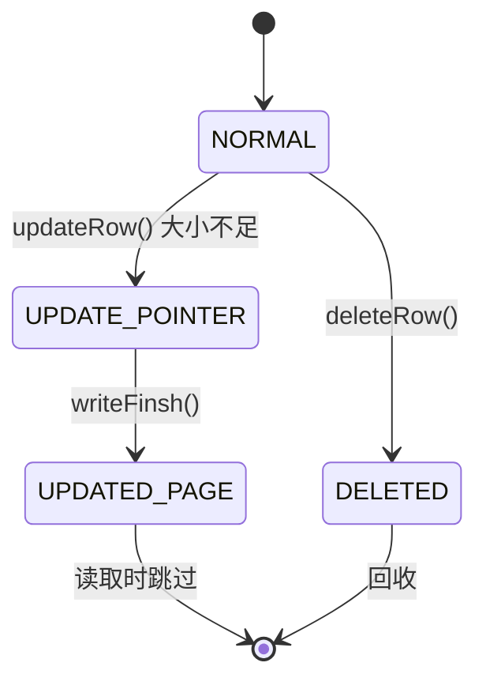
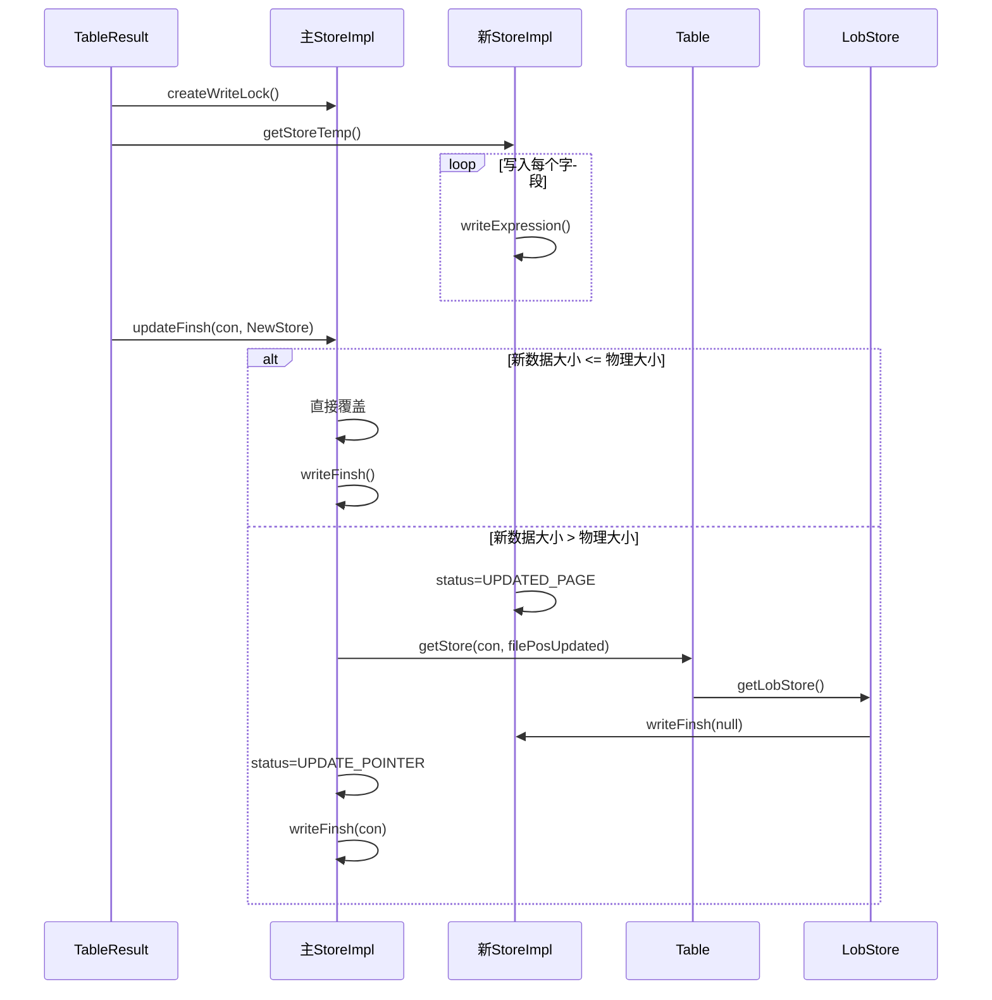

# StoreImpl功能增强机制

<cite>
**本文档引用的文件**  
- [StoreImpl.java](file://src/main/java/io/leavesfly/smallsql/rdb/engine/store/StoreImpl.java)
- [Store.java](file://src/main/java/io/leavesfly/smallsql/rdb/engine/Store.java)
- [StorePage.java](file://src/main/java/io/leavesfly/smallsql/rdb/engine/store/StorePage.java)
- [Lobs.java](file://src/main/java/io/leavesfly/smallsql/rdb/engine/table/Lobs.java)
- [Table.java](file://src/main/java/io/leavesfly/smallsql/rdb/engine/Table.java)
</cite>

## 目录
1. [引言](#引言)
2. [核心功能增强机制](#核心功能增强机制)
3. [页头控制块与页面状态管理](#页头控制块与页面状态管理)
4. [动态扩容机制](#动态扩容机制)
5. [LOB数据特殊处理逻辑](#lob数据特殊处理逻辑)
6. [装饰器调用链序列图](#装饰器调用链序列图)
7. [sharedPageData标志优化作用](#sharedpagedata标志优化作用)
8. [结论](#结论)

## 引言
`StoreImpl`类作为`Store`接口的具体实现，通过装饰器模式在基础存储功能之上实现了多项关键增强。该机制不仅提升了存储系统的灵活性和可靠性，还为大型对象（LOB）的高效管理提供了专门支持。本文将深入分析其如何在`StorePage`基础上添加页头控制、状态管理、动态扩容等特性，并重点解析LOB数据的独立存储策略。

**Section sources**
- [StoreImpl.java](file://src/main/java/io/leavesfly/smallsql/rdb/engine/store/StoreImpl.java#L1-L50)

## 核心功能增强机制
`StoreImpl`通过继承`Store`抽象类，在`StorePage`提供的基本页存储能力之上，封装了页头控制、状态管理、自动扩容和LOB处理等高级功能。其核心设计采用装饰器模式，将原始页数据包装在包含元信息的控制块中，从而实现对底层存储的透明增强。



**Diagram sources**
- [StoreImpl.java](file://src/main/java/io/leavesfly/smallsql/rdb/engine/store/StoreImpl.java#L55-L105)
- [Store.java](file://src/main/java/io/leavesfly/smallsql/rdb/engine/Store.java#L30-L90)
- [StorePage.java](file://src/main/java/io/leavesfly/smallsql/rdb/engine/store/StorePage.java#L30-L90)

## 页头控制块与页面状态管理
`StoreImpl`通过在每页数据前添加28字节的页头控制块（PAGE_CONTROL_SIZE），实现了对页面状态的精细化管理。该控制块包含魔数、状态码、使用大小、物理大小、下一页偏移和更新页位置等关键元数据。

页面状态分为四种：
- **NORMAL (0)**：正常页，包含有效数据
- **DELETED (1)**：已删除页，标记为可回收
- **UPDATE_POINTER (2)**：指向更新页的指针页
- **UPDATED_PAGE (3)**：实际包含更新数据的页

当更新操作导致新数据超出原页容量时，系统会将原页状态改为`UPDATE_POINTER`，并在新位置创建`UPDATED_PAGE`。读取时通过`loadUpdatedStore()`方法自动跳转到最新数据页，确保行位置不变。



**Diagram sources**
- [StoreImpl.java](file://src/main/java/io/leavesfly/smallsql/rdb/engine/store/StoreImpl.java#L55-L80)
- [StoreImpl.java](file://src/main/java/io/leavesfly/smallsql/rdb/engine/store/StoreImpl.java#L165-L209)

**Section sources**
- [StoreImpl.java](file://src/main/java/io/leavesfly/smallsql/rdb/engine/store/StoreImpl.java#L55-L209)

## 动态扩容机制
`StoreImpl`实现了智能的动态扩容策略，通过`resizePage()`方法在数据写入时自动调整页大小。当写入操作可能导致缓冲区溢出时，系统会创建一个至少为原大小两倍的新缓冲区，并将数据复制过去。

该机制在`writeFinsh()`和`updateFinsh()`方法中被触发，确保即使在插入或更新大对象时也能顺利完成。对于未提交的插入操作（filePos == -1），系统允许直接扩展原页；而对于已存在的页，则采用更新指针机制避免原地修改。

**Section sources**
- [StoreImpl.java](file://src/main/java/io/leavesfly/smallsql/rdb/engine/store/StoreImpl.java#L209-L215)
- [StoreImpl.java](file://src/main/java/io/leavesfly/smallsql/rdb/engine/store/StoreImpl.java#L292-L334)

## LOB数据特殊处理逻辑
对于LONGVARBINARY和LONGVARCHAR类型的大对象数据，`StoreImpl`采用独立的LOB存储机制。`writeLongBinary()`和`readLongString()`方法通过`table.getLobStore()`获取专用的LOB存储实例，将大对象写入独立文件。

写入时，主记录页仅存储指向LOB数据的文件位置（filePos），而实际数据被写入由`Lobs`类管理的专用文件。这种分离存储策略既保证了主表页的紧凑性，又实现了大对象的高效管理。

```mermaid
flowchart TD
A[writeLongBinary] --> B[getLobStore]
B --> C[创建LOB存储实例]
C --> D[写入数据长度]
D --> E[写入实际数据]
E --> F[返回filePos]
F --> G[writeLong(filePos)]
G --> H[主记录页]
I[readLongString] --> J[readLong() 获取filePos]
J --> K[getLobStore(filePos)]
K --> L[readInt() 获取长度]
L --> M[readChars(长度)]
M --> N[返回字符串]
```

**Diagram sources**
- [StoreImpl.java](file://src/main/java/io/leavesfly/smallsql/rdb/engine/store/StoreImpl.java#L555-L637)
- [Lobs.java](file://src/main/java/io/leavesfly/smallsql/rdb/engine/table/Lobs.java#L30-L60)

**Section sources**
- [StoreImpl.java](file://src/main/java/io/leavesfly/smallsql/rdb/engine/store/StoreImpl.java#L555-L637)

## 装饰器调用链序列图
以下序列图展示了数据更新时的装饰器调用链，从`TableResult.updateRow()`开始，经过`StoreImpl.updateFinsh()`，最终完成数据写入。



**Diagram sources**
- [StoreImpl.java](file://src/main/java/io/leavesfly/smallsql/rdb/engine/store/StoreImpl.java#L276-L334)
- [TableResult.java](file://src/main/java/io/leavesfly/smallsql/rdb/engine/selector/result/TableResult.java#L130-L168)

## sharedPageData标志优化作用
`sharedPageData`标志用于优化读写分离场景下的内存使用。当以只读模式（SELECT）加载页面时，`StoreImpl`会直接共享`StorePage`中的`page`数组，避免不必要的数据复制。这通过`sharedPageData = true`标记，并在需要写入时通过`createWriteLock()`获取独占锁并创建私有副本。

该机制显著减少了只读操作的内存开销和GC压力，同时确保了写操作的数据一致性。在事务处理中，这种读写分离优化对于提升并发性能至关重要。

**Section sources**
- [StoreImpl.java](file://src/main/java/io/leavesfly/smallsql/rdb/engine/store/StoreImpl.java#L82-L105)
- [StoreImpl.java](file://src/main/java/io/leavesfly/smallsql/rdb/engine/store/StoreImpl.java#L139-L163)

## 结论
`StoreImpl`通过精巧的装饰器设计，在基础存储功能上实现了页头控制、状态管理、动态扩容和LOB分离存储等关键增强。其采用的更新指针机制保证了行位置的稳定性，而sharedPageData优化则提升了读写分离场景的性能。这些设计共同构成了一个高效、可靠且可扩展的存储子系统，为数据库的核心功能提供了坚实基础。