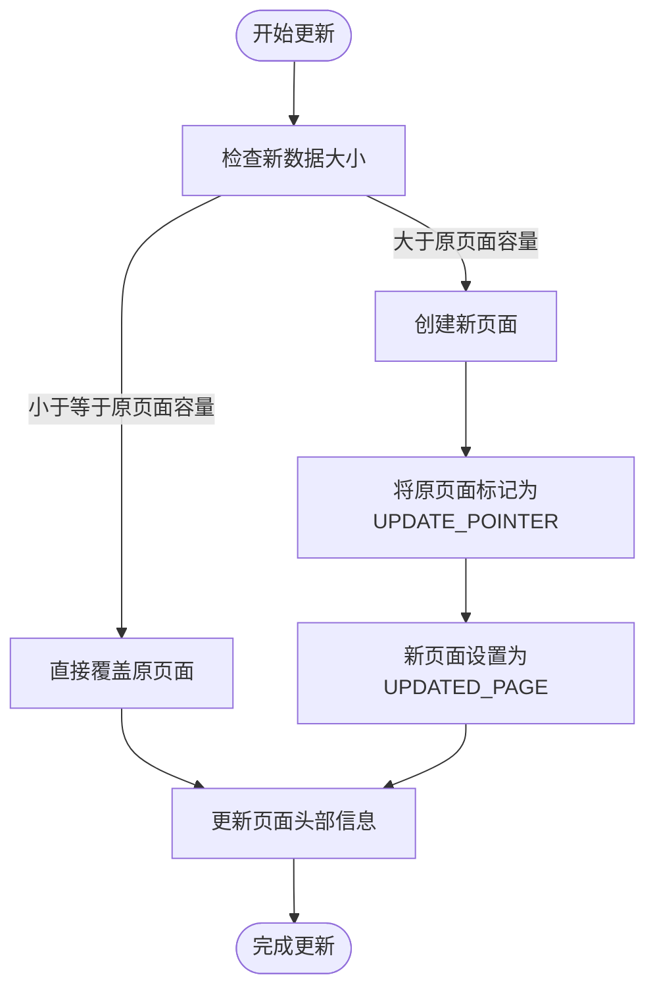
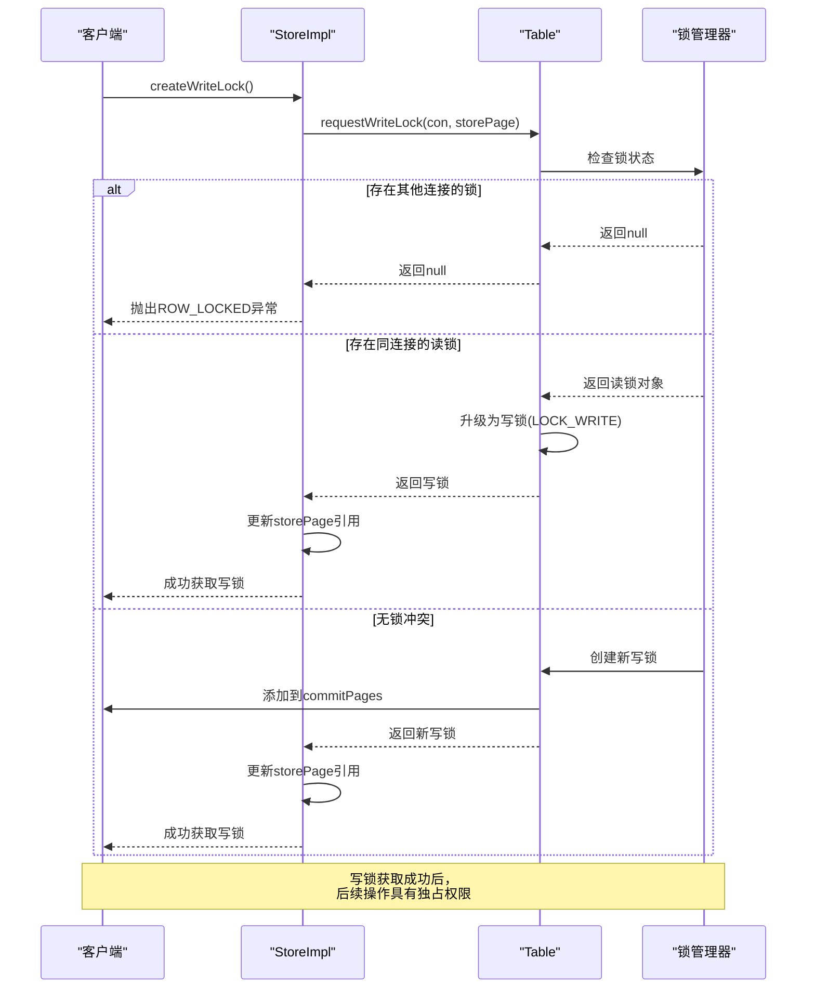
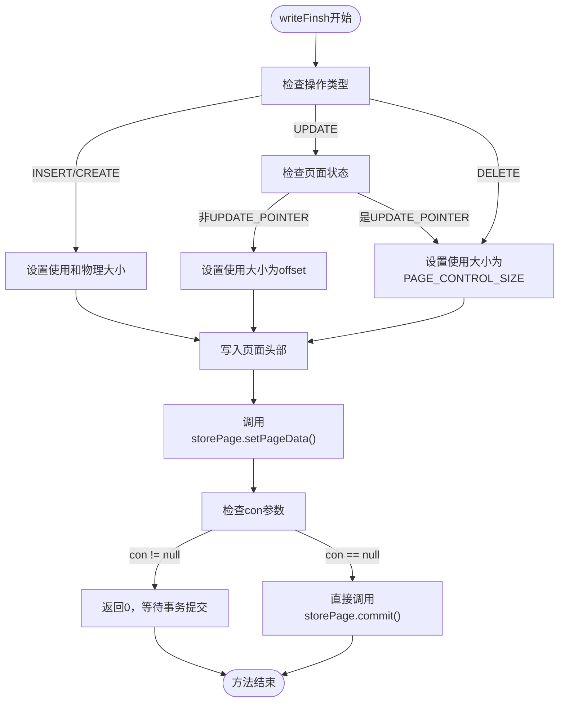
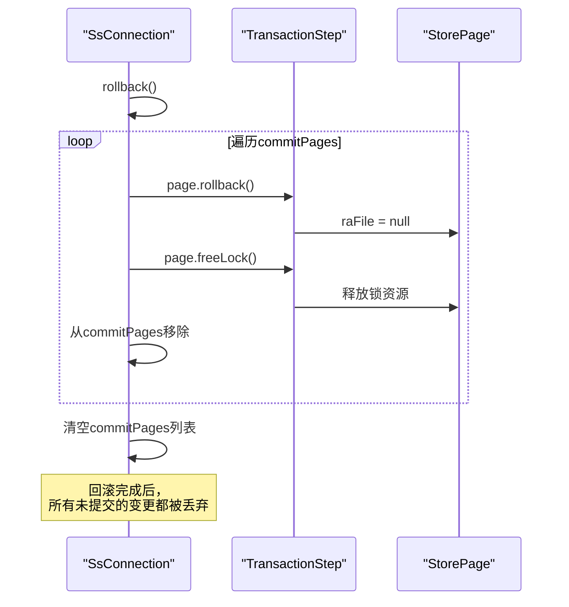

# 事务集成与版本控制

<cite>
**本文档引用的文件**  
- [StoreImpl.java](file://src/main/java/io/leavesfly/smallsql/rdb/engine/store/StoreImpl.java)
- [Table.java](file://src/main/java/io/leavesfly/smallsql/rdb/engine/Table.java)
- [StorePage.java](file://src/main/java/io/leavesfly/smallsql/rdb/engine/store/StorePage.java)
- [TransactionStep.java](file://src/main/java/io/leavesfly/smallsql/rdb/engine/TransactionStep.java)
- [SsConnection.java](file://src/main/java/io/leavesfly/smallsql/jdbc/SsConnection.java)
</cite>

## 目录
1. [事务处理中的StoreImpl集成机制](#事务处理中的storeimpl集成机制)  
2. [MVCC风格的版本控制实现](#mvcc风格的版本控制实现)  
3. [UPDATE_POINTER与UPDATED_PAGE状态协同机制](#update_pointer与updated_page状态协同机制)  
4. [非阻塞更新实现原理](#非阻塞更新实现原理)  
5. [写锁获取机制分析](#写锁获取机制分析)  
6. [事务提交时的数据持久化](#事务提交时的数据持久化)  
7. [事务回滚状态恢复流程](#事务回滚状态恢复流程)  
8. [装饰器模式在事务边界管理中的应用](#装饰器模式在事务边界管理中的应用)

## 事务处理中的StoreImpl集成机制

`StoreImpl`类作为SmallSQL存储引擎的核心组件，实现了事务处理中的数据页管理机制。该类通过与`Table`类的锁管理器交互，实现了完整的事务隔离和并发控制。`StoreImpl`不仅负责数据页的读写操作，还通过状态标记机制支持MVCC（多版本并发控制）风格的版本管理。

**Section sources**  
- [StoreImpl.java](file://src/main/java/io/leavesfly/smallsql/rdb/engine/store/StoreImpl.java#L82-L105)

## MVCC风格的版本控制实现

`StoreImpl`通过`updateFinsh`方法实现了MVCC风格的版本控制。该机制的核心在于使用状态标记来区分不同版本的数据页，从而支持非阻塞的读写操作。当数据更新时，系统会根据新数据的大小决定是直接覆盖原页面还是创建新版本页面。

`updateFinsh`方法首先检查新数据的大小是否超过原页面的物理容量。如果新数据可以容纳在原页面内，则直接覆盖原数据；否则，系统会创建一个新的数据页来存储更新后的数据，并将原页面标记为指向新页面的指针。



**Diagram sources**  
- [StoreImpl.java](file://src/main/java/io/leavesfly/smallsql/rdb/engine/store/StoreImpl.java#L292-L334)

**Section sources**  
- [StoreImpl.java](file://src/main/java/io/leavesfly/smallsql/rdb/engine/store/StoreImpl.java#L292-L334)

## UPDATE_POINTER与UPDATED_PAGE状态协同机制

`StoreImpl`定义了四种页面状态：NORMAL（正常）、DELETED（已删除）、UPDATE_POINTER（更新指针）和UPDATED_PAGE（已更新页面）。其中，`UPDATE_POINTER`和`UPDATED_PAGE`状态协同工作，实现了非阻塞更新机制。

当更新操作导致数据大小超过原页面容量时，系统会执行以下协同流程：
1. 创建新的数据页，将其状态设置为`UPDATED_PAGE`
2. 将原页面状态更改为`UPDATE_POINTER`
3. 在原页面中记录指向新页面的文件位置
4. 后续读取操作会自动通过指针访问最新版本的数据

这种机制确保了读操作不会被写操作阻塞，因为读取线程可以通过`UPDATE_POINTER`直接访问最新的`UPDATED_PAGE`，而无需等待写操作完成。

```mermaid
classDiagram
class StoreImpl {
+static final int NORMAL = 0
+static final int DELETED = 1
+static final int UPDATE_POINTER = 2
+static final int UPDATED_PAGE = 3
-int status
-long filePosUpdated
-StoreImpl updatePointer
+updateFinsh(SsConnection, StoreImpl)
+writeFinsh(SsConnection)
+createWriteLock()
}
StoreImpl --> StoreImpl : "updatePointer 指向"
note right of StoreImpl
UPDATE_POINTER状态的页面通过
filePosUpdated字段指向
UPDATED_PAGE状态的页面
end note
```

**Diagram sources**  
- [StoreImpl.java](file://src/main/java/io/leavesfly/smallsql/rdb/engine/store/StoreImpl.java#L70-L79)

**Section sources**  
- [StoreImpl.java](file://src/main/java/io/leavesfly/smallsql/rdb/engine/store/StoreImpl.java#L70-L79)

## 非阻塞更新实现原理

非阻塞更新的实现依赖于`UPDATE_POINTER`和`UPDATED_PAGE`状态的巧妙配合。当新数据超过原页面容量时，系统采用"写时复制"策略，避免了对原页面的直接修改，从而实现了读写操作的分离。

具体实现流程如下：
1. 为更新数据创建新的`StoreImpl`实例
2. 将新实例的状态设置为`UPDATED_PAGE`
3. 调用`writeFinsh(null)`将新页面写入文件系统，返回新页面的文件位置
4. 将原页面的`filePosUpdated`字段设置为新页面的位置
5. 将原页面状态更改为`UPDATE_POINTER`

这种设计使得读取操作可以继续访问原页面（现在是`UPDATE_POINTER`），并通过指针快速定位到最新数据，而无需等待写操作完成，从而实现了真正的非阻塞更新。

**Section sources**  
- [StoreImpl.java](file://src/main/java/io/leavesfly/smallsql/rdb/engine/store/StoreImpl.java#L292-L334)

## 写锁获取机制分析

`createWriteLock`方法实现了从读锁到写锁的升级机制，与`Table`类的锁管理器紧密协作。该机制确保了在事务边界内对数据页的独占访问权限。



**Diagram sources**  
- [StoreImpl.java](file://src/main/java/io/leavesfly/smallsql/rdb/engine/store/StoreImpl.java#L276-L290)
- [Table.java](file://src/main/java/io/leavesfly/smallsql/rdb/engine/Table.java#L486-L524)

**Section sources**  
- [StoreImpl.java](file://src/main/java/io/leavesfly/smallsql/rdb/engine/store/StoreImpl.java#L276-L290)
- [Table.java](file://src/main/java/io/leavesfly/smallsql/rdb/engine/Table.java#L486-L524)

## 事务提交时的数据持久化

`writeFinsh`方法负责将变更持久化到`StorePage`中，是事务提交过程中的关键环节。该方法根据操作类型（INSERT、UPDATE、DELETE）执行不同的持久化逻辑。

对于UPDATE操作，`writeFinsh`方法会：
1. 更新页面头部信息，包括状态、使用大小、物理大小等
2. 将数据写入`StorePage`的缓冲区
3. 如果传入`SsConnection`参数，则将`StorePage`添加到连接的提交列表中
4. 如果传入null，则直接将数据写入文件系统

这种设计实现了事务的两阶段提交：首先将变更记录在内存中，等待事务提交时再统一持久化，从而保证了事务的原子性和一致性。



**Diagram sources**  
- [StoreImpl.java](file://src/main/java/io/leavesfly/smallsql/rdb/engine/store/StoreImpl.java#L211-L274)

**Section sources**  
- [StoreImpl.java](file://src/main/java/io/leavesfly/smallsql/rdb/engine/store/StoreImpl.java#L211-L274)

## 事务回滚状态恢复流程

事务回滚时，系统通过`TransactionStep`接口的`rollback`方法恢复状态。`StorePage`类实现了`TransactionStep`，其`rollback`方法将`raFile`引用设置为null，从而标记该页面变更需要被丢弃。

当`SsConnection`执行`rollback`操作时，会遍历`commitPages`列表中的所有`TransactionStep`对象，依次调用它们的`rollback`和`freeLock`方法。对于`StorePage`对象，这会导致：
1. 文件通道引用被清除
2. 锁被释放
3. 未提交的变更被丢弃

这种机制确保了事务的原子性，即要么所有变更都持久化，要么所有变更都被完全回滚。



**Diagram sources**  
- [SsConnection.java](file://src/main/java/io/leavesfly/smallsql/jdbc/SsConnection.java#L256-L283)
- [TransactionStep.java](file://src/main/java/io/leavesfly/smallsql/rdb/engine/TransactionStep.java#L35-L56)

**Section sources**  
- [SsConnection.java](file://src/main/java/io/leavesfly/smallsql/jdbc/SsConnection.java#L256-L283)
- [TransactionStep.java](file://src/main/java/io/leavesfly/smallsql/rdb/engine/TransactionStep.java#L35-L56)

## 装饰器模式在事务边界管理中的应用

SmallSQL的事务管理机制巧妙地应用了装饰器模式的思想。`StorePage`类作为基础组件，提供了基本的页面存储功能；而`TableStorePage`类则"装饰"了`StorePage`，增加了事务相关的锁管理功能。

这种设计模式的优势在于：
1. **职责分离**：`StorePage`专注于数据存储，`TableStorePage`专注于事务控制
2. **灵活性**：可以在不修改`StorePage`的情况下添加新的事务功能
3. **可扩展性**：可以轻松添加更多的"装饰器"来支持复杂的事务特性

在事务边界内，`StoreImpl`持有的`storePage`引用会从只读的`StorePage`切换到具有写锁的`TableStorePage`，这种动态替换正是装饰器模式的典型应用，简化了事务边界内的状态管理。

**Section sources**  
- [StorePage.java](file://src/main/java/io/leavesfly/smallsql/rdb/engine/store/StorePage.java#L35-L90)
- [Table.java](file://src/main/java/io/leavesfly/smallsql/rdb/engine/Table.java#L36-L78)