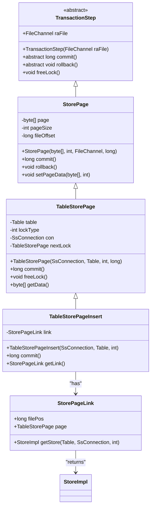

# 存储层基础结构

<cite>
**本文档中引用的文件**  
- [Store.java](file://src/main/java/io/leavesfly/smallsql/rdb/engine/Store.java)
- [StorePage.java](file://src/main/java/io/leavesfly/smallsql/rdb/engine/store/StorePage.java)
- [TransactionStep.java](file://src/main/java/io/leavesfly/smallsql/rdb/engine/TransactionStep.java)
- [StoreImpl.java](file://src/main/java/io/leavesfly/smallsql/rdb/engine/store/StoreImpl.java)
- [TableStorePage.java](file://src/main/java/io/leavesfly/smallsql/rdb/engine/store/TableStorePage.java)
- [TableStorePageInsert.java](file://src/main/java/io/leavesfly/smallsql/rdb/engine/store/TableStorePageInsert.java)
- [StorePageLink.java](file://src/main/java/io/leavesfly/smallsql/rdb/engine/store/StorePageLink.java)
</cite>

## 目录
1. [引言](#引言)
2. [核心组件概述](#核心组件概述)
3. [Store抽象类详解](#store抽象类详解)
4. [StorePage事务性存储单元](#storepage事务性存储单元)
5. [类图：Store与StorePage关系](#类图store与storepage关系)
6. [页面数据操作流程](#页面数据操作流程)
7. [事务控制机制分析](#事务控制机制分析)
8. [文件系统交互方式](#文件系统交互方式)
9. [结论](#结论)

## 引言
本文档详细阐述SmallSQL数据库系统中存储层的核心组件——`Store`抽象类和`StorePage`基础实现。重点分析`Store`作为装饰器模式核心所定义的统一存储接口，以及`StorePage`如何作为事务性存储单元管理页面数据缓冲区和文件偏移量。通过类图展示继承与组合关系，并说明其在事务控制中的角色及与文件系统的交互机制。

## 核心组件概述
存储层由多个关键类构成，其中`Store`为所有存储实现提供统一接口，`StorePage`则作为事务性操作的基本单元。`StoreImpl`是`Store`的具体实现，负责实际的数据读写操作；`TableStorePage`和`TableStorePageInsert`扩展了`StorePage`以支持表级锁定和插入操作；`StorePageLink`用于追踪未提交页面的位置。

**本节来源**
- [Store.java](file://src/main/java/io/leavesfly/smallsql/rdb/engine/Store.java#L1-L90)
- [StorePage.java](file://src/main/java/io/leavesfly/smallsql/rdb/engine/store/StorePage.java#L1-L90)
- [TransactionStep.java](file://src/main/java/io/leavesfly/smallsql/rdb/engine/TransactionStep.java#L1-L57)

## Store抽象类详解
`Store`是一个抽象类，定义了统一的存储接口，采用装饰器模式允许不同类型的存储实现共享相同的操作契约。该类提供了以下核心方法：

- **数据读写方法**：
  - `writeInt(int value)` / `readInt()`：32位整数读写
  - `writeLong(long value)` / `readLong()`：64位长整数读写
  - `writeDouble(double value)` / `readDouble()`：双精度浮点数读写
  - `writeString(String str)` / `readString()`：字符串读写
  - `writeBytes(byte[] data)` / `readBytes(int length)`：字节数组读写

- **状态管理方法**：
  - `isValidPage()`：判断当前页面是否有效（未被删除或更新）
  - `getUsedSize()`：获取页面已使用空间大小
  - `getNextPagePos()`：获取下一页在文件中的位置偏移量
  - `deleteRow(SsConnection con)`：标记当前行为已删除

此外，`Store`类还包含两个静态常量实例：`NULL`（表示空值）和`NOROW`（表示无当前行），用于特殊状态处理。

**本节来源**
- [Store.java](file://src/main/java/io/leavesfly/smallsql/rdb/engine/Store.java#L1-L90)
- [StoreImpl.java](file://src/main/java/io/leavesfly/smallsql/rdb/engine/store/StoreImpl.java#L1-L1606)

## StorePage事务性存储单元
`StorePage`类继承自`TransactionStep`，实现了事务性存储单元的核心功能。它封装了一个数据页的缓冲区及其在文件中的位置信息，支持提交（commit）和回滚（rollback）操作。

### 核心字段
- `page`：字节数组，存储页面数据
- `pageSize`：页面实际使用的大小
- `fileOffset`：该页面在文件中的起始偏移量
- `raFile`：关联的`FileChannel`，用于文件I/O操作

### 事务机制
- **commit()**：将页面数据写入文件。若`fileOffset < 0`，则追加到文件末尾；否则覆盖指定位置。
- **rollback()**：通过将`raFile`置为`null`来取消写入操作，实现回滚。

`StorePage`的设计使得所有对存储的修改都必须经过事务管理器，确保了数据一致性。

**图示来源**
- [StorePage.java](file://src/main/java/io/leavesfly/smallsql/rdb/engine/store/StorePage.java#L1-L90)
- [TransactionStep.java](file://src/main/java/io/leavesfly/smallsql/rdb/engine/TransactionStep.java#L1-L57)
- [TableStorePage.java](file://src/main/java/io/leavesfly/smallsql/rdb/engine/store/TableStorePage.java#L1-L78)
- [TableStorePageInsert.java](file://src/main/java/io/leavesfly/smallsql/rdb/engine/store/TableStorePageInsert.java#L1-L75)
- [StorePageLink.java](file://src/main/java/io/leavesfly/smallsql/rdb/engine/store/StorePageLink.java#L1-L57)

## 类图：Store与StorePage关系
上图展示了`Store`相关组件的类继承与组合关系。`StorePage`继承自`TransactionStep`，获得事务能力；`TableStorePage`进一步扩展以支持表级锁定；`TableStorePageInsert`通过`StorePageLink`维护对未提交页面的引用，确保插入操作可追踪。

## 页面数据操作流程
页面数据的操作遵循典型的加载-修改-持久化流程：

1. **加载**：通过`TableStorePage`构造函数创建实例，初始化`fileOffset`和`raFile`。
2. **读取**：调用`StoreImpl.createStore()`从文件读取页面头信息和数据。
3. **修改**：使用`writeInt()`、`writeString()`等方法修改内存中的`page`缓冲区。
4. **持久化**：调用`writeFinsh(SsConnection con)`准备数据并设置`StorePage`的`page`和`pageSize`，最终由事务管理器触发`commit()`写入磁盘。

此流程确保了所有更改都受事务控制，支持原子性和一致性保证。

**本节来源**
- [StoreImpl.java](file://src/main/java/io/leavesfly/smallsql/rdb/engine/store/StoreImpl.java#L1-L1606)
- [StorePage.java](file://src/main/java/io/leavesfly/smallsql/rdb/engine/store/StorePage.java#L1-L90)

## 事务控制机制分析
`StorePage`在事务控制中扮演关键角色。每个`StorePage`实例代表一个待提交的事务步骤，注册到`SsConnection`的事务列表中。

- **提交流程**：当事务提交时，遍历所有`TransactionStep`并调用其`commit()`方法，将数据写入文件。
- **回滚流程**：调用`rollback()`方法清除`raFile`引用，阻止写入操作。
- **锁管理**：`TableStorePage`通过`nextLock`链表维护锁链，`freeLock()`方法释放资源。

这种设计实现了细粒度的事务控制，支持行级锁定和并发访问管理。

**本节来源**
- [TransactionStep.java](file://src/main/java/io/leavesfly/smallsql/rdb/engine/TransactionStep.java#L1-L57)
- [TableStorePage.java](file://src/main/java/io/leavesfly/smallsql/rdb/engine/store/TableStorePage.java#L1-L78)
- [SsConnection.java](file://src/main/java/io/leavesfly/smallsql/jdbc/SsConnection.java)

## 文件系统交互方式
`StorePage`通过`java.nio.channels.FileChannel`与文件系统交互，确保线程安全和高效I/O：

- **同步写入**：`commit()`方法中使用`synchronized(raFile)`块保证文件操作的原子性。
- **位置管理**：利用`raFile.position(fileOffset)`定位写入点，支持随机访问。
- **追加模式**：当`fileOffset < 0`时，自动追加到文件末尾，适用于新页面分配。
- **缓冲区封装**：使用`ByteBuffer.wrap(page)`将字节数组包装为NIO缓冲区，提高写入效率。

该机制兼顾性能与可靠性，适合嵌入式数据库的轻量级需求。

**本节来源**
- [StorePage.java](file://src/main/java/io/leavesfly/smallsql/rdb/engine/store/StorePage.java#L1-L90)
- [TableStorePage.java](file://src/main/java/io/leavesfly/smallsql/rdb/engine/store/TableStorePage.java#L1-L78)

## 结论
`Store`抽象类和`StorePage`实现构成了SmallSQL存储层的核心。前者通过装饰器模式定义统一接口，后者基于`TransactionStep`提供事务性存储能力。二者结合实现了高效、可靠的数据管理机制，支持复杂的事务控制和文件系统交互。整体设计简洁而强大，体现了良好的面向对象原则和数据库系统架构思想。