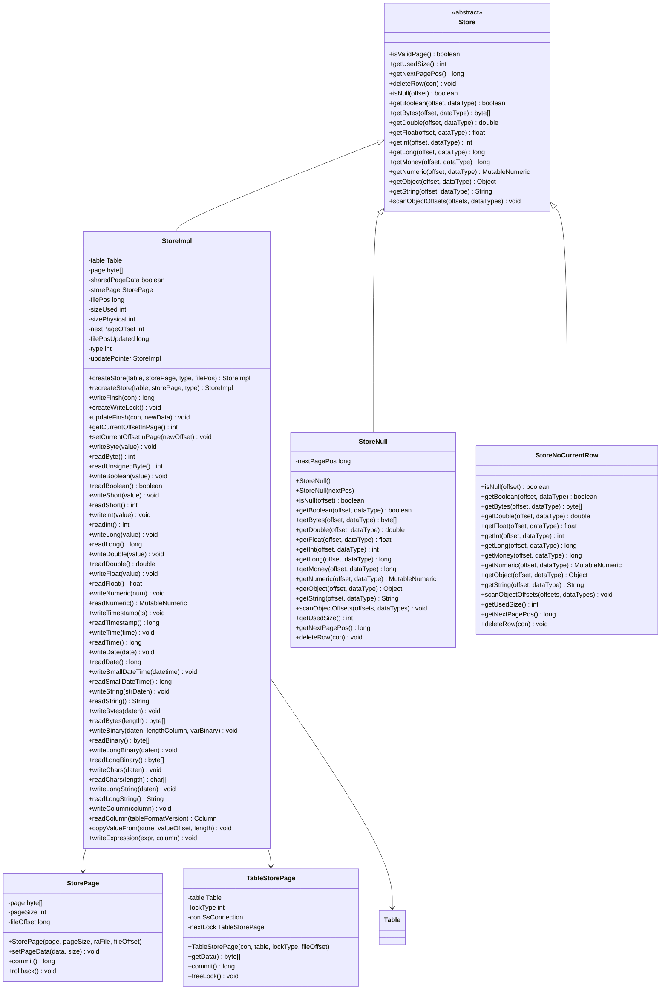
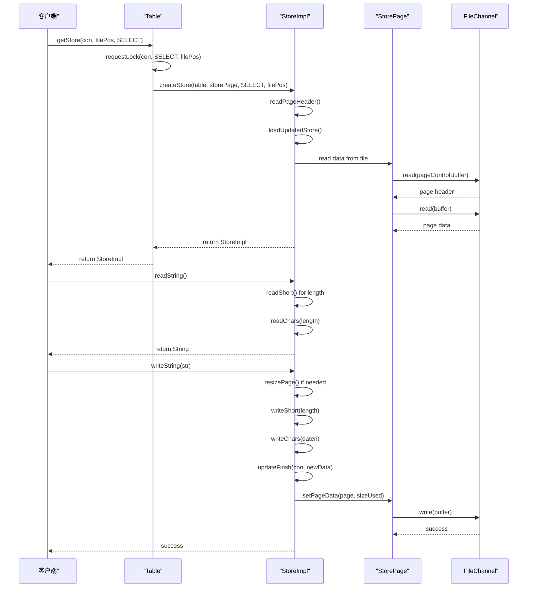

# 装饰器模式

<cite>
**本文档中引用的文件**  
- [Store.java](file://src/main/java/io/leavesfly/smallsql/rdb/engine/Store.java)
- [StoreImpl.java](file://src/main/java/io/leavesfly/smallsql/rdb/engine/store/StoreImpl.java)
- [Table.java](file://src/main/java/io/leavesfly/smallsql/rdb/engine/Table.java)
- [StorePage.java](file://src/main/java/io/leavesfly/smallsql/rdb/engine/store/StorePage.java)
- [TableStorePage.java](file://src/main/java/io/leavesfly/smallsql/rdb/engine/store/TableStorePage.java)
- [StoreNull.java](file://src/main/java/io/leavesfly/smallsql/rdb/engine/store/StoreNull.java)
- [StoreNoCurrentRow.java](file://src/main/java/io/leavesfly/smallsql/rdb/engine/store/StoreNoCurrentRow.java)
</cite>

## 目录
1. [引言](#引言)
2. [核心组件分析](#核心组件分析)
3. [装饰器模式架构](#装饰器模式架构)
4. [Store类层次结构](#store类层次结构)
5. [数据读写流程](#数据读写流程)
6. [横切关注点实现](#横切关注点实现)
7. [LOB存储支持](#lob存储支持)
8. [版本控制与事务](#版本控制与事务)
9. [性能优化](#性能优化)
10. [结论](#结论)

## 引言
装饰器模式在SmallSQL数据库系统的存储层中扮演着核心角色，通过Store类层次结构实现了灵活的功能扩展机制。该模式允许在不修改现有代码的情况下，动态地为存储操作添加页式管理、缓存、事务支持等横切关注点。本技术文档将深入分析Store抽象类如何定义存储操作的基本接口，以及StoreImpl类如何作为核心装饰器增强基础功能。

**Section sources**
- [Store.java](file://src/main/java/io/leavesfly/smallsql/rdb/engine/Store.java#L1-L100)
- [StoreImpl.java](file://src/main/java/io/leavesfly/smallsql/rdb/engine/store/StoreImpl.java#L1-L100)

## 核心组件分析
Store类层次结构是SmallSQL存储层的核心，通过装饰器模式实现了功能的灵活组合。Store抽象类定义了存储操作的基本接口，包括数据读写、状态检查和元数据获取等方法。StoreImpl类作为具体实现，不仅继承了这些基本功能，还添加了页式管理、缓存和事务支持等高级特性。

StoreImpl类通过继承Store抽象类并扩展其功能，实现了装饰器模式的核心思想。它不仅提供了基本的存储操作，还通过内部状态管理和文件位置跟踪，支持复杂的存储场景。这种设计使得存储功能可以按需组合，而不需要为每种功能组合创建新的类。

**Section sources**
- [Store.java](file://src/main/java/io/leavesfly/smallsql/rdb/engine/Store.java#L45-L90)
- [StoreImpl.java](file://src/main/java/io/leavesfly/smallsql/rdb/engine/store/StoreImpl.java#L55-L1605)

## 装饰器模式架构

**Diagram sources**
- [Store.java](file://src/main/java/io/leavesfly/smallsql/rdb/engine/Store.java#L1-L100)
- [StoreImpl.java](file://src/main/java/io/leavesfly/smallsql/rdb/engine/store/StoreImpl.java#L1-L1606)
- [StorePage.java](file://src/main/java/io/leavesfly/smallsql/rdb/engine/store/StorePage.java#L1-L91)
- [TableStorePage.java](file://src/main/java/io/leavesfly/smallsql/rdb/engine/store/TableStorePage.java#L1-L79)

**Section sources**
- [Store.java](file://src/main/java/io/leavesfly/smallsql/rdb/engine/Store.java#L1-L100)
- [StoreImpl.java](file://src/main/java/io/leavesfly/smallsql/rdb/engine/store/StoreImpl.java#L1-L1606)

## Store类层次结构
Store类层次结构通过装饰器模式实现了存储功能的灵活扩展。Store抽象类作为基类，定义了所有存储操作的基本接口。StoreImpl类继承自Store，不仅实现了这些基本接口，还添加了页式管理、缓存和事务支持等高级功能。

StoreImpl类的设计体现了装饰器模式的核心优势：通过组合而非继承来扩展功能。它通过持有StorePage和TableStorePage的引用，实现了对底层存储的访问和管理。同时，通过内部状态管理（如filePos、sizeUsed等字段），支持复杂的存储场景。

StoreNull和StoreNoCurrentRow类作为特殊实现，处理了空值和无当前行的特殊情况。这种设计使得存储层能够优雅地处理各种边界情况，而不需要在核心逻辑中添加复杂的条件判断。

**Section sources**
- [Store.java](file://src/main/java/io/leavesfly/smallsql/rdb/engine/Store.java#L45-L90)
- [StoreImpl.java](file://src/main/java/io/leavesfly/smallsql/rdb/engine/store/StoreImpl.java#L55-L1605)
- [StoreNull.java](file://src/main/java/io/leavesfly/smallsql/rdb/engine/store/StoreNull.java#L1-L130)
- [StoreNoCurrentRow.java](file://src/main/java/io/leavesfly/smallsql/rdb/engine/store/StoreNoCurrentRow.java#L1-L118)

## 数据读写流程

**Diagram sources**
- [StoreImpl.java](file://src/main/java/io/leavesfly/smallsql/rdb/engine/store/StoreImpl.java#L55-L1605)
- [Table.java](file://src/main/java/io/leavesfly/smallsql/rdb/engine/Table.java#L1-L609)
- [StorePage.java](file://src/main/java/io/leavesfly/smallsql/rdb/engine/store/StorePage.java#L1-L91)

**Section sources**
- [StoreImpl.java](file://src/main/java/io/leavesfly/smallsql/rdb/engine/store/StoreImpl.java#L55-L1605)
- [Table.java](file://src/main/java/io/leavesfly/smallsql/rdb/engine/Table.java#L1-L609)

## 横切关注点实现
装饰器模式在StoreImpl类中实现了多个横切关注点，包括页式管理、缓存和事务支持。页式管理通过PAGE_CONTROL_SIZE和相关字段实现，每个页面都有固定的控制块，包含页面状态、大小和位置信息。

缓存机制通过sharedPageData字段和page数组实现，支持读取时的数据共享。当多个操作需要访问同一页面时，可以共享数据以提高性能。事务支持通过StorePage的commit和rollback方法实现，确保数据的一致性和可恢复性。

UPDATE_POINTER和UPDATED_PAGE机制是装饰器模式的重要应用，用于处理页面更新时的大小变化。当更新后的数据大于原页面时，原页面被标记为UPDATE_POINTER，新数据存储在新的UPDATED_PAGE中。这种设计避免了数据移动，提高了更新效率。

**Section sources**
- [StoreImpl.java](file://src/main/java/io/leavesfly/smallsql/rdb/engine/store/StoreImpl.java#L55-L1605)
- [StorePage.java](file://src/main/java/io/leavesfly/smallsql/rdb/engine/store/StorePage.java#L1-L91)

## LOB存储支持
LOB（Large Object）存储支持是装饰器模式的另一个重要应用。StoreImpl类通过writeLongBinary和readLongBinary方法实现了对大对象的存储和读取。这些方法使用特殊的LONGVARBINARY类型，将大对象存储在单独的页面中，并通过文件位置引用。

writeLongBinary方法首先创建一个用于存储大对象的StoreImpl实例，写入数据长度和实际数据，然后将生成的文件位置写入主页面。readLongBinary方法则根据文件位置读取大对象数据。这种设计使得大对象的存储和读取与普通数据操作保持一致，体现了装饰器模式的统一接口优势。

**Section sources**
- [StoreImpl.java](file://src/main/java/io/leavesfly/smallsql/rdb/engine/store/StoreImpl.java#L55-L1605)

## 版本控制与事务
版本控制和事务管理通过StoreImpl类的status字段和相关方法实现。NORMAL、DELETED、UPDATE_POINTER和UPDATED_PAGE四种状态构成了基本的版本控制机制。当页面被更新且新数据更大时，原页面变为UPDATE_POINTER，新数据存储在UPDATED_PAGE中。

事务支持通过Table的requestLock和freeLock方法实现。这些方法管理着不同类型的锁（如LOCK_READ、LOCK_WRITE、LOCK_INSERT），确保事务的隔离性和一致性。StorePage的commit和rollback方法则负责事务的持久化和回滚。

**Section sources**
- [StoreImpl.java](file://src/main/java/io/leavesfly/smallsql/rdb/engine/store/StoreImpl.java#L55-L1605)
- [Table.java](file://src/main/java/io/leavesfly/smallsql/rdb/engine/Table.java#L1-L609)
- [StorePage.java](file://src/main/java/io/leavesfly/smallsql/rdb/engine/store/StorePage.java#L1-L91)

## 性能优化
装饰器模式在性能优化方面表现出色。通过resizePage方法，StoreImpl类实现了动态页面大小调整，避免了内存浪费。sharedPageData机制支持读取时的数据共享，减少了内存复制开销。

UPDATE_POINTER和UPDATED_PAGE机制避免了数据移动，提高了更新效率。LOB存储的分离设计减少了主页面的负载，提高了查询性能。此外，StoreImpl类提供的多种数据类型专用读写方法（如readInt、writeString等）避免了类型转换开销，提高了数据访问速度。

**Section sources**
- [StoreImpl.java](file://src/main/java/io/leavesfly/smallsql/rdb/engine/store/StoreImpl.java#L55-L1605)

## 结论
装饰器模式在SmallSQL存储层中的应用体现了其强大的灵活性和扩展性。通过Store类层次结构，系统实现了存储功能的动态组合和扩展，支持页式管理、缓存、事务、LOB存储和版本控制等多种高级特性。

StoreImpl类作为核心装饰器，不仅继承了Store抽象类的基本功能，还通过内部状态管理和文件位置跟踪，支持复杂的存储场景。这种设计使得存储功能可以按需组合，而不需要为每种功能组合创建新的类，大大提高了代码的可维护性和可扩展性。

装饰器模式的应用使得SmallSQL能够高效地处理各种存储需求，从简单的数据读写到复杂的事务管理和大对象存储，都通过统一的接口和灵活的实现机制得到支持。这种设计模式的成功应用，为数据库系统的存储层设计提供了有价值的参考。