# JDBC接口层

<cite>
**本文档中引用的文件**  
- [SsDriver.java](file://src/main/java/io/leavesfly/smallsql/SsDriver.java)
- [SsConnection.java](file://src/main/java/io/leavesfly/smallsql/jdbc/SsConnection.java)
- [SsStatement.java](file://src/main/java/io/leavesfly/smallsql/jdbc/statement/SsStatement.java)
- [SsPreparedStatement.java](file://src/main/java/io/leavesfly/smallsql/jdbc/statement/SsPreparedStatement.java)
- [SsResultSet.java](file://src/main/java/io/leavesfly/smallsql/jdbc/SsResultSet.java)
- [SmallSQLException.java](file://src/main/java/io/leavesfly/smallsql/jdbc/SmallSQLException.java)
- [SQLParser.java](file://src/main/java/io/leavesfly/smallsql/rdb/sql/SQLParser.java)
</cite>

## 目录
1. [引言](#引言)
2. [驱动程序实现与注册](#驱动程序实现与注册)
3. [连接管理](#连接管理)
4. [语句执行机制](#语句执行机制)
5. [结果集处理](#结果集处理)
6. [异常处理](#异常处理)
7. [标准JDBC工作流示例](#标准jdbc工作流示例)
8. [结论](#结论)

## 引言

SmallSQL 是一个轻量级的 Java 数据库管理系统，其 JDBC 接口层实现了标准的 JDBC API，为应用程序提供了与数据库交互的能力。本技术文档详细描述了 SmallSQL 的 JDBC 接口层实现，重点分析了 `SsDriver` 如何实现 `java.sql.Driver` 接口并注册到 `DriverManager`，`SsConnection` 的创建过程、连接属性配置和生命周期管理，以及 `SsStatement`、`SsPreparedStatement`、`SsCallableStatement` 和 `SsResultSet` 的执行机制和数据访问功能。

## 驱动程序实现与注册

### SsDriver 类实现

`SsDriver` 类是 SmallSQL 数据库的 JDBC 驱动程序实现，它实现了 `java.sql.Driver` 接口。该类负责解析 JDBC URL 并创建数据库连接，是应用程序与 SmallSQL 数据库之间的入口点。

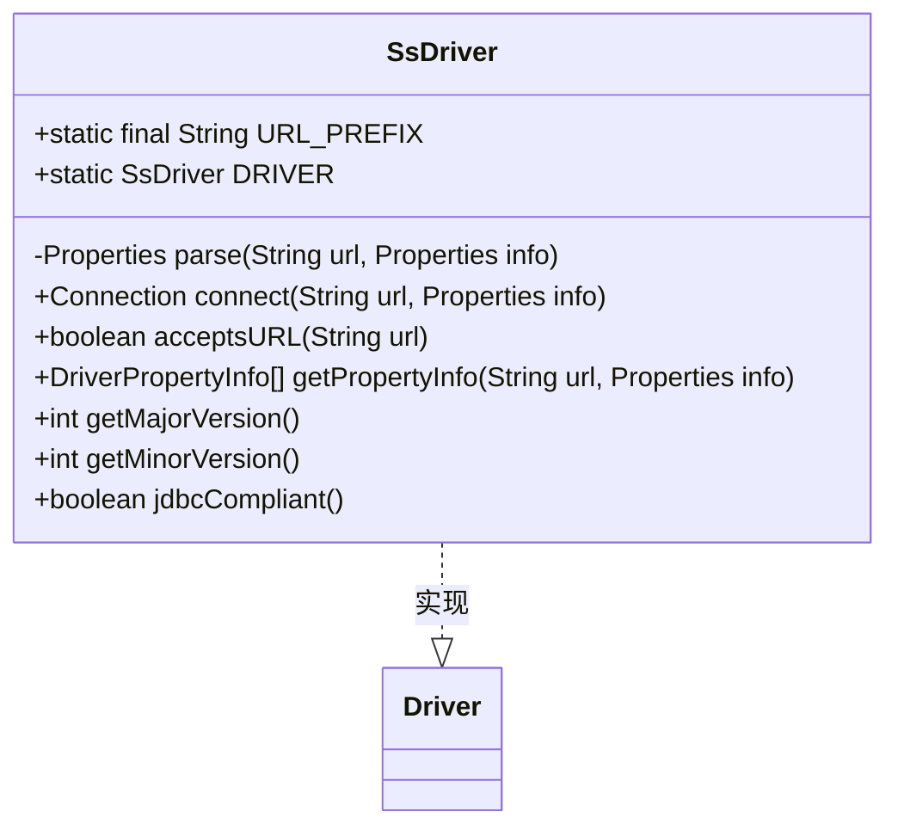

**Diagram sources**
- [SsDriver.java](file://src/main/java/io/leavesfly/smallsql/SsDriver.java#L1-L202)

### 驱动程序注册机制

`SsDriver` 类通过静态初始化块在类加载时自动注册到 `DriverManager`。当 JVM 加载 `SsDriver` 类时，会执行静态初始化块中的代码，创建驱动程序的单例实例并调用 `DriverManager.registerDriver()` 方法将其注册。

```java
static {
    try {
        DRIVER = new SsDriver();
        DriverManager.registerDriver(DRIVER);
    } catch (Throwable e) {
        e.printStackTrace();
    }
}
```

这种自动注册机制使得应用程序可以通过标准的 `Class.forName()` 方法加载驱动程序，而无需显式调用 `DriverManager.registerDriver()`。

### JDBC URL 解析

`SsDriver` 支持的 JDBC URL 格式为：`jdbc:smallsql:[database_path][?property=value...]`。例如：`jdbc:smallsql:./mydb?autocommit=true`。

`parse()` 方法负责解析 JDBC URL 并构建连接属性。它首先检查 URL 是否以 `jdbc:smallsql` 开头，然后提取数据库路径和连接属性。连接属性以键值对的形式出现在 URL 的查询字符串中，多个属性之间用 `&` 分隔。

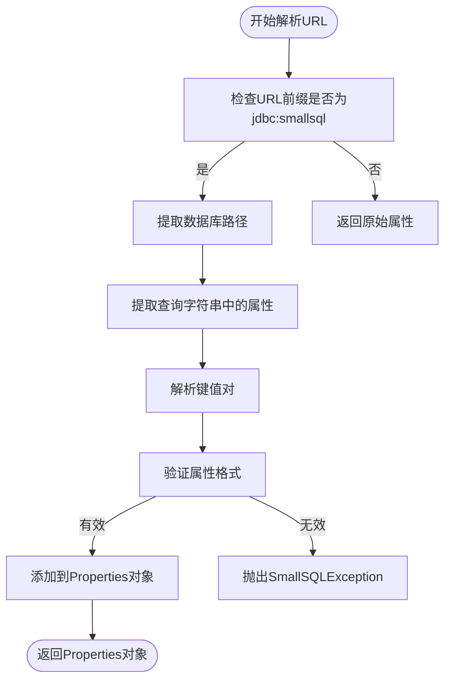

**Diagram sources**
- [SsDriver.java](file://src/main/java/io/leavesfly/smallsql/SsDriver.java#L52-L202)

**Section sources**
- [SsDriver.java](file://src/main/java/io/leavesfly/smallsql/SsDriver.java#L52-L202)

## 连接管理

### SsConnection 类实现

`SsConnection` 类实现了 `java.sql.Connection` 接口，代表与 SmallSQL 数据库的一个连接。它负责管理事务、创建语句、访问元数据等功能。

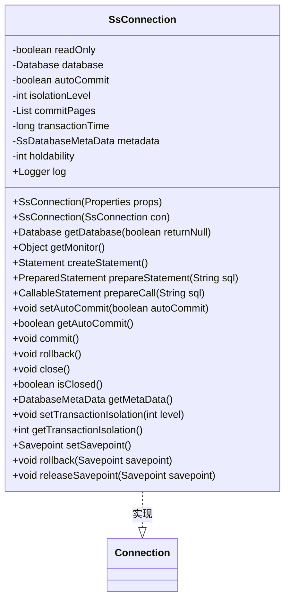

**Diagram sources**
- [SsConnection.java](file://src/main/java/io/leavesfly/smallsql/jdbc/SsConnection.java#L74-L715)

### 连接创建过程

当 `SsDriver.connect()` 方法被调用时，它会创建一个新的 `SsConnection` 实例。构造函数接收一个 `Properties` 对象，其中包含连接属性，如数据库路径、只读模式、是否创建数据库等。

```java
public SsConnection(Properties props) throws SQLException {
    SmallSQLException.setLanguage(props.get("locale"));
    log = new Logger();
    String name = props.getProperty("dbpath");
    readOnly = "true".equals(props.getProperty("readonly"));
    boolean create = "true".equals(props.getProperty("create"));
    database = Database.getDatabase(name, this, create);
    metadata = new SsDatabaseMetaData(this);
}
```

连接创建过程中，首先设置语言环境和日志记录器，然后从属性中提取数据库路径和其他配置，最后调用 `Database.getDatabase()` 方法获取或创建数据库实例，并初始化元数据对象。

### 连接属性配置

`SsConnection` 支持多种连接属性配置：

- **数据库路径 (dbpath)**: 指定数据库文件的路径。
- **只读模式 (readonly)**: 设置连接是否为只读模式。
- **自动创建 (create)**: 指定是否在数据库不存在时自动创建。
- **事务隔离级别**: 通过 `setTransactionIsolation()` 方法设置。
- **自动提交**: 通过 `setAutoCommit()` 方法控制。

### 生命周期管理

`SsConnection` 的生命周期管理包括连接的创建、使用和关闭。连接对象不是线程安全的，不应在多个线程之间共享。

- **创建**: 通过 `DriverManager.getConnection()` 方法创建。
- **使用**: 在连接上创建语句、执行 SQL、处理结果集。
- **关闭**: 调用 `close()` 方法关闭连接，会回滚未提交的事务并释放资源。

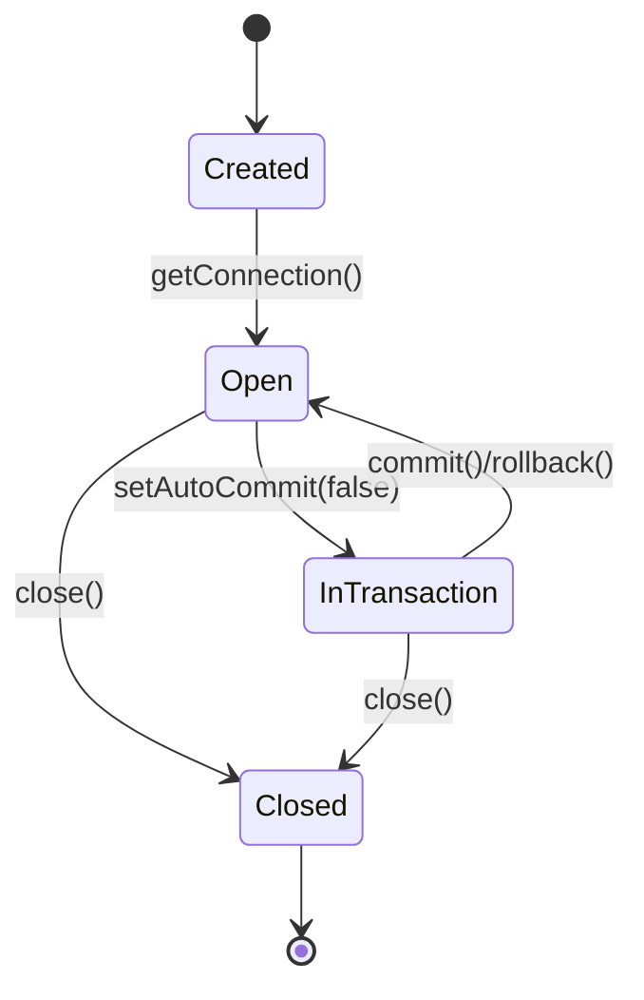

**Diagram sources**
- [SsConnection.java](file://src/main/java/io/leavesfly/smallsql/jdbc/SsConnection.java#L74-L715)

**Section sources**
- [SsConnection.java](file://src/main/java/io/leavesfly/smallsql/jdbc/SsConnection.java#L74-L715)

## 语句执行机制

### SsStatement 类实现

`SsStatement` 类实现了 `java.sql.Statement` 接口，用于执行静态 SQL 语句。它提供了执行查询、更新、批处理等操作的方法。

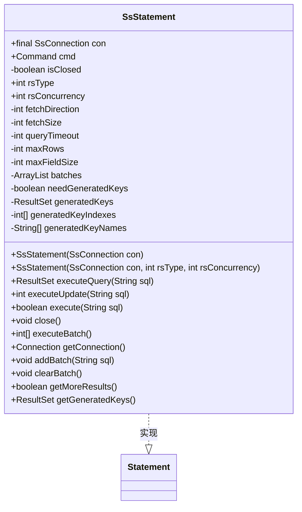

**Diagram sources**
- [SsStatement.java](file://src/main/java/io/leavesfly/smallsql/jdbc/statement/SsStatement.java#L51-L759)

### SQL 语句执行流程

`SsStatement` 执行 SQL 语句的流程如下：

1. 调用 `executeImpl()` 方法执行 SQL 语句。
2. 创建 `SQLParser` 实例解析 SQL 语句。
3. 调用 `parser.parse()` 方法生成 `Command` 对象。
4. 调用 `cmd.execute()` 方法执行命令。

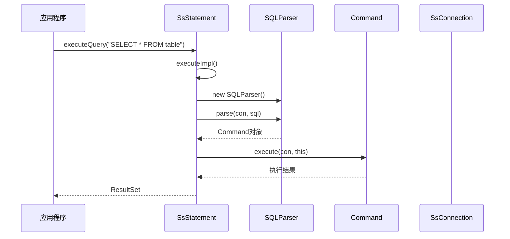

**Diagram sources**
- [SsStatement.java](file://src/main/java/io/leavesfly/smallsql/jdbc/statement/SsStatement.java#L51-L759)
- [SQLParser.java](file://src/main/java/io/leavesfly/smallsql/rdb/sql/SQLParser.java#L744-L770)

### SsPreparedStatement 和 SsCallableStatement

`SsPreparedStatement` 和 `SsCallableStatement` 分别用于执行预编译的 SQL 语句和存储过程。它们继承自 `SsStatement` 并提供了参数设置功能。

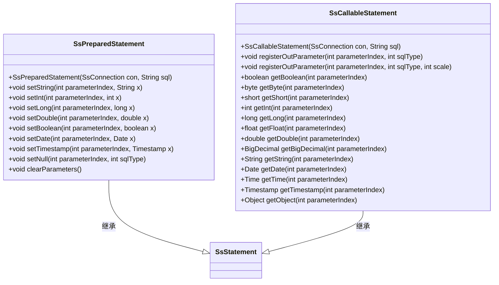

**Diagram sources**
- [SsPreparedStatement.java](file://src/main/java/io/leavesfly/smallsql/jdbc/statement/SsPreparedStatement.java#L206-L209)
- [SsCallableStatement.java](file://src/main/java/io/leavesfly/smallsql/jdbc/statement/SsCallableStatement.java#L206-L209)

### 参数设置机制

`SsPreparedStatement` 使用 `ExpressionValue` 类来存储参数值。`setXXX()` 方法将参数值和数据类型存储在 `ExpressionValue` 对象中。

```java
public final void set(Object newValue, int newDataType) throws SQLException {
    this.value = newValue;
    this.dataType = newDataType;
    if (dataType < 0) {
        if (newValue == null)
            this.dataType = SQLTokenizer.NULL;
        else if (newValue instanceof String)
            this.dataType = SQLTokenizer.VARCHAR;
        // ... 其他类型判断
    }
}
```

**Section sources**
- [SsStatement.java](file://src/main/java/io/leavesfly/smallsql/jdbc/statement/SsStatement.java#L51-L759)
- [SsPreparedStatement.java](file://src/main/java/io/leavesfly/smallsql/jdbc/statement/SsPreparedStatement.java#L206-L209)
- [ExpressionValue.java](file://src/main/java/io/leavesfly/smallsql/rdb/sql/expression/ExpressionValue.java#L369-L404)

## 结果集处理

### SsResultSet 类实现

`SsResultSet` 类实现了 `java.sql.ResultSet` 接口，用于表示 SQL 查询的结果集。它提供了游标导航、数据读取、元数据访问等功能。

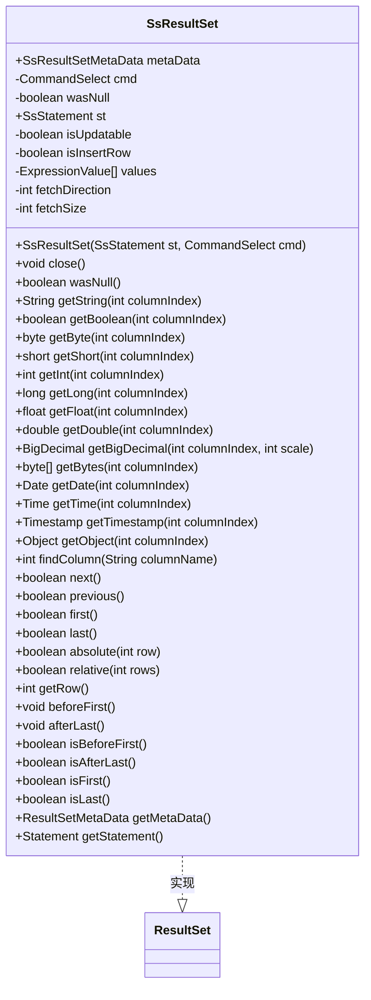

**Diagram sources**
- [SsResultSet.java](file://src/main/java/io/leavesfly/smallsql/jdbc/SsResultSet.java#L54-L1337)

### 游标行为

`SsResultSet` 支持多种游标行为，包括前进、后退、绝对定位和相对定位。游标位置的管理由底层的 `CommandSelect` 对象负责。

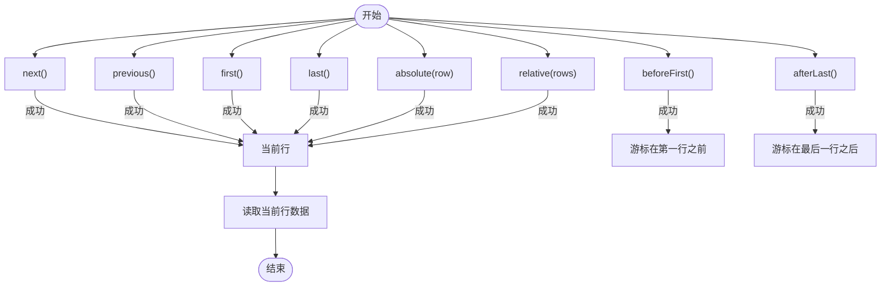

**Diagram sources**
- [SsResultSet.java](file://src/main/java/io/leavesfly/smallsql/jdbc/SsResultSet.java#L54-L1337)

### 数据读取方法

`SsResultSet` 提供了多种 `getXXX()` 方法来读取不同数据类型的数据。这些方法首先调用 `getValue()` 获取 `Expression` 对象，然后调用相应的方法获取具体值。

```java
public int getInt(int columnIndex) throws SQLException {
    try {
        Expression expr = getValue(columnIndex);
        wasNull = expr.isNull();
        return expr.getInt();
    } catch (Exception e) {
        throw SmallSQLException.createFromException(e);
    }
}
```

### 元数据访问

`SsResultSet` 通过 `getMetaData()` 方法返回 `SsResultSetMetaData` 对象，该对象提供了结果集的元数据信息，如列数、列名、列类型等。

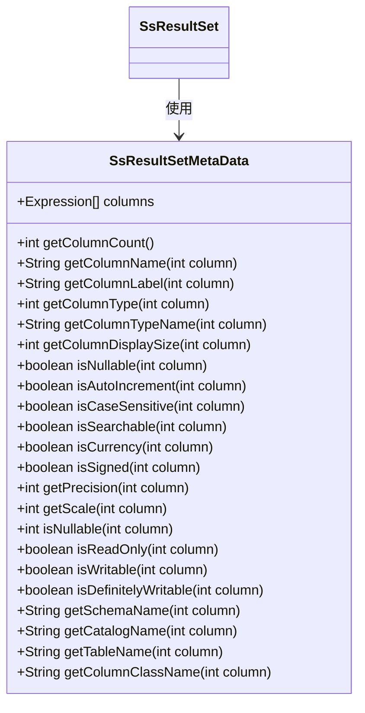

**Section sources**
- [SsResultSet.java](file://src/main/java/io/leavesfly/smallsql/jdbc/SsResultSet.java#L54-L1337)

## 异常处理

### SmallSQLException 类实现

`SmallSQLException` 类是 SmallSQL 的自定义异常类，它继承自 `SQLException`。该类提供了多种静态工厂方法来创建不同类型的异常。

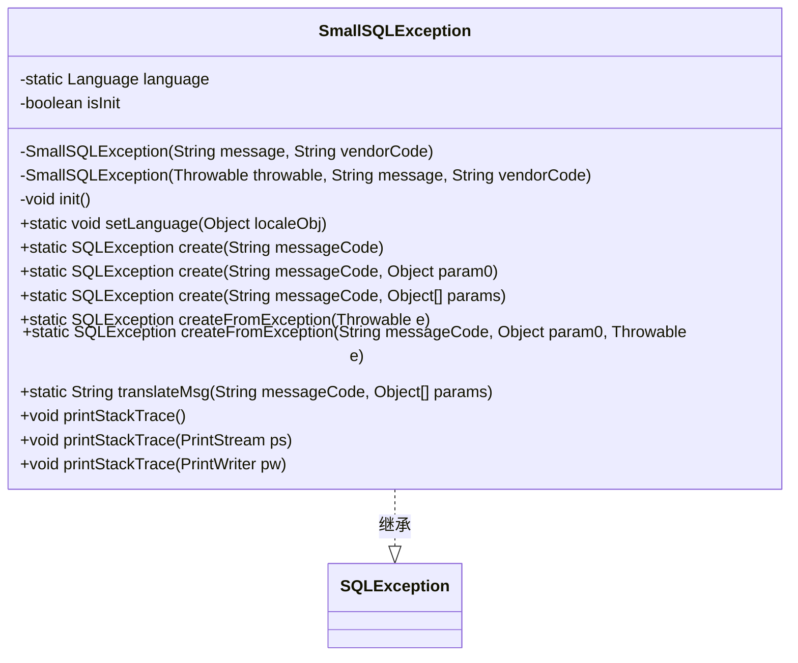

**Diagram sources**
- [SmallSQLException.java](file://src/main/java/io/leavesfly/smallsql/jdbc/SmallSQLException.java#L46-L230)

### 异常封装机制

SmallSQL 将底层的异常封装为 `SmallSQLException`。当执行 SQL 语句时，如果发生异常，会捕获底层异常并调用 `SmallSQLException.createFromException()` 方法创建 `SmallSQLException`。

```java
final private void executeImpl(String sql) throws SQLException {
    checkStatement();
    generatedKeys = null;
    try {
        con.log.println(sql);
        SQLParser parser = new SQLParser();
        cmd = parser.parse(con, sql);
        if (maxRows != 0
                && (cmd.getMaxRows() == -1 || cmd.getMaxRows() > maxRows))
            cmd.setMaxRows(maxRows);
        cmd.execute(con, this);
    } catch (Exception e) {
        throw SmallSQLException.createFromException(e);
    }
    needGeneratedKeys = false;
    generatedKeyIndexes = null;
    generatedKeyNames = null;
}
```

**Section sources**
- [SmallSQLException.java](file://src/main/java/io/leavesfly/smallsql/jdbc/SmallSQLException.java#L46-L230)

## 标准JDBC工作流示例

以下代码示例展示了标准的 JDBC 工作流：

```java
// 1. 加载驱动程序
Class.forName("io.leavesfly.smallsql.SsDriver");

// 2. 获取数据库连接
Connection conn = DriverManager.getConnection("jdbc:smallsql:./mydb");

// 3. 创建Statement对象
Statement stmt = conn.createStatement();

// 4. 执行查询
ResultSet rs = stmt.executeQuery("SELECT * FROM users");

// 5. 处理结果集
while (rs.next()) {
    int id = rs.getInt("id");
    String name = rs.getString("name");
    System.out.println("ID: " + id + ", Name: " + name);
}

// 6. 关闭资源
rs.close();
stmt.close();
conn.close();
```

**Section sources**
- [SsDriver.java](file://src/main/java/io/leavesfly/smallsql/SsDriver.java#L52-L202)
- [SsConnection.java](file://src/main/java/io/leavesfly/smallsql/jdbc/SsConnection.java#L74-L715)
- [SsStatement.java](file://src/main/java/io/leavesfly/smallsql/jdbc/statement/SsStatement.java#L51-L759)
- [SsResultSet.java](file://src/main/java/io/leavesfly/smallsql/jdbc/SsResultSet.java#L54-L1337)

## 结论

SmallSQL 的 JDBC 接口层完整实现了标准的 JDBC API，提供了驱动程序注册、连接管理、语句执行、结果集处理和异常处理等核心功能。通过 `SsDriver`、`SsConnection`、`SsStatement`、`SsPreparedStatement`、`SsCallableStatement` 和 `SsResultSet` 等类的协同工作，应用程序可以方便地与 SmallSQL 数据库进行交互。异常处理机制通过 `SmallSQLException` 类将底层异常封装为标准的 SQL 异常，提高了代码的健壮性和可维护性。整体设计遵循了 JDBC 规范，同时保持了轻量级和高性能的特点。