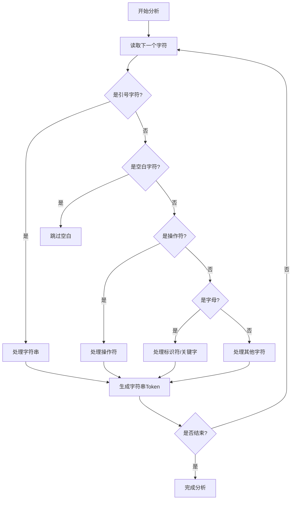
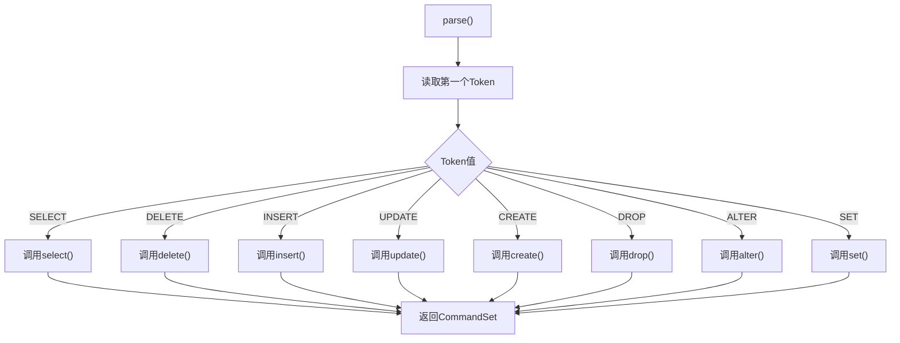
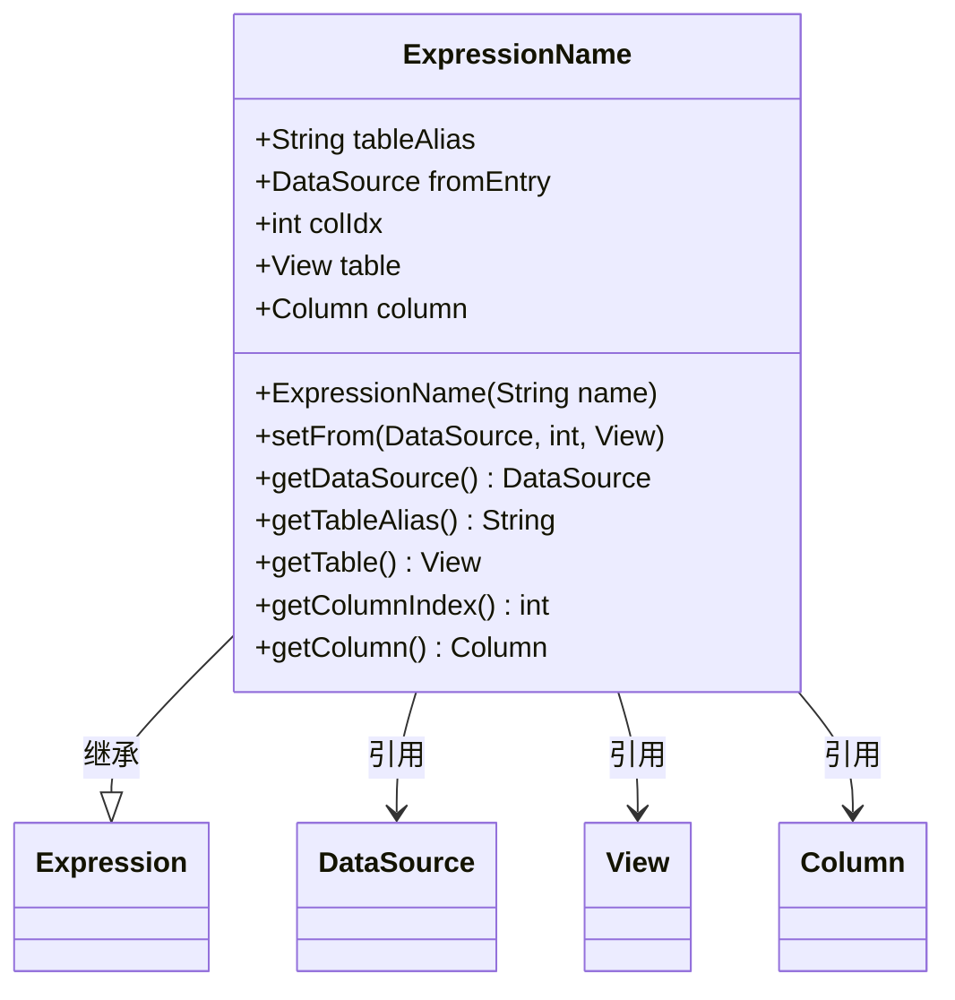
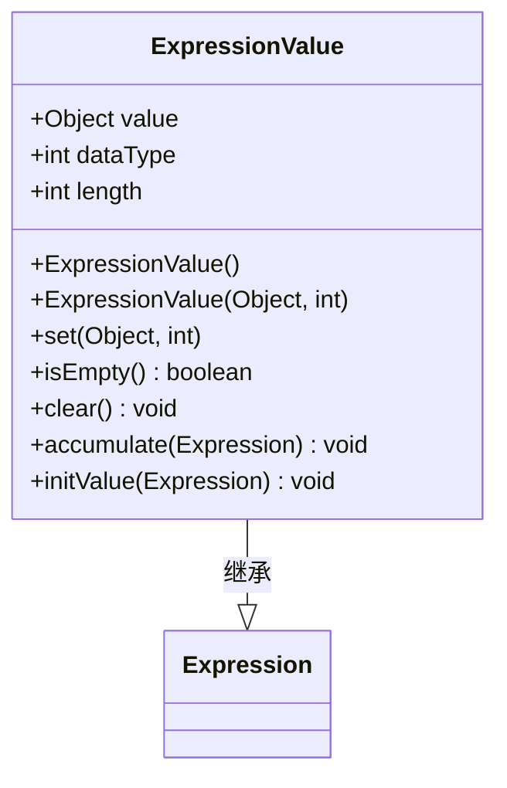
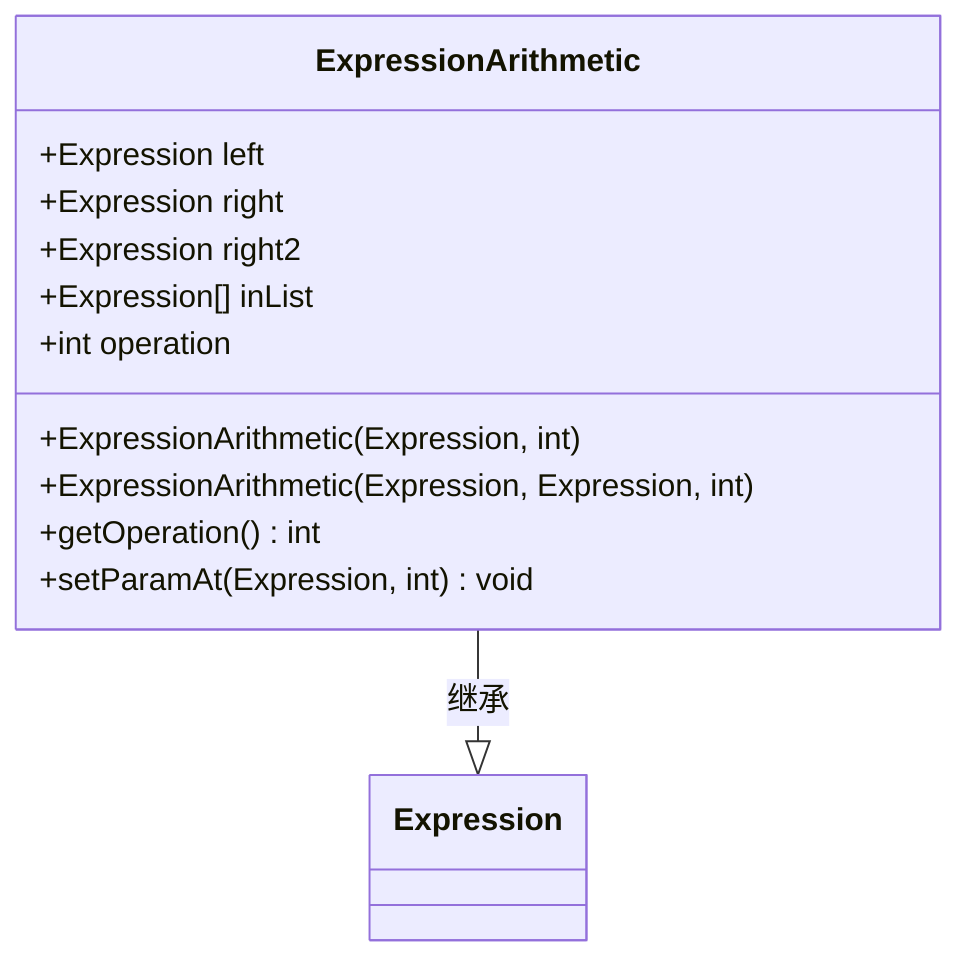
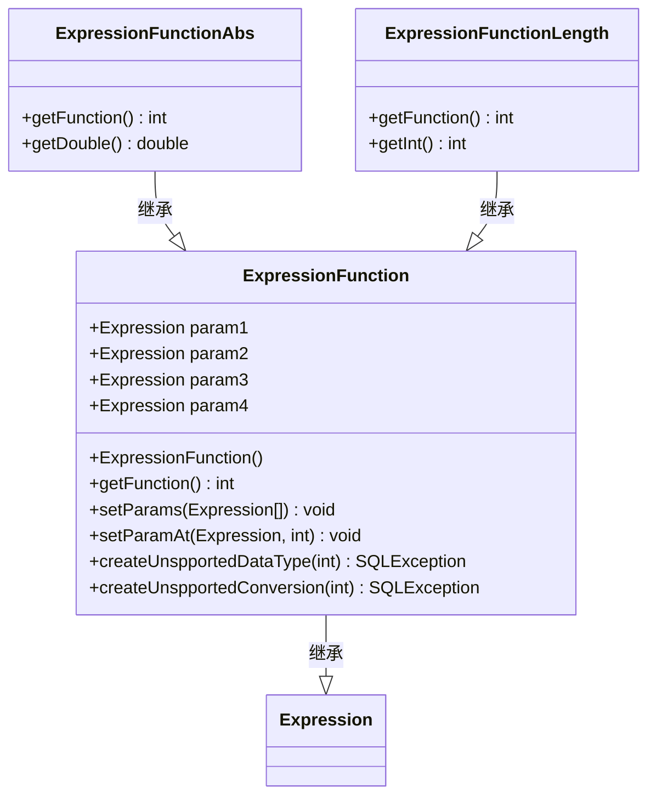
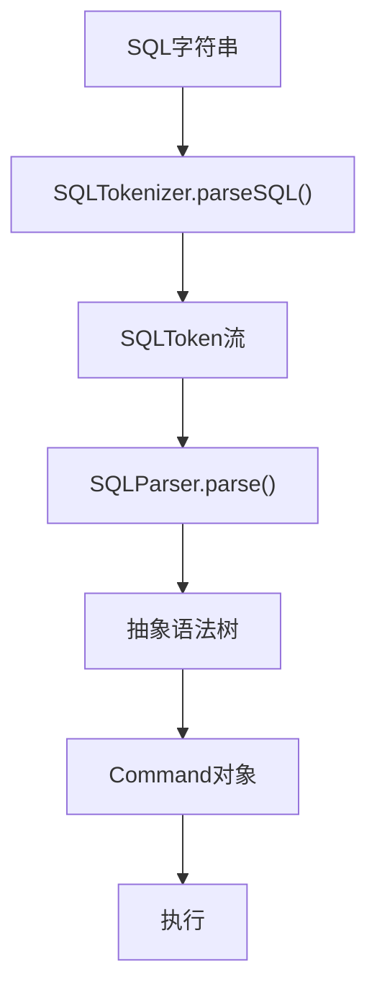
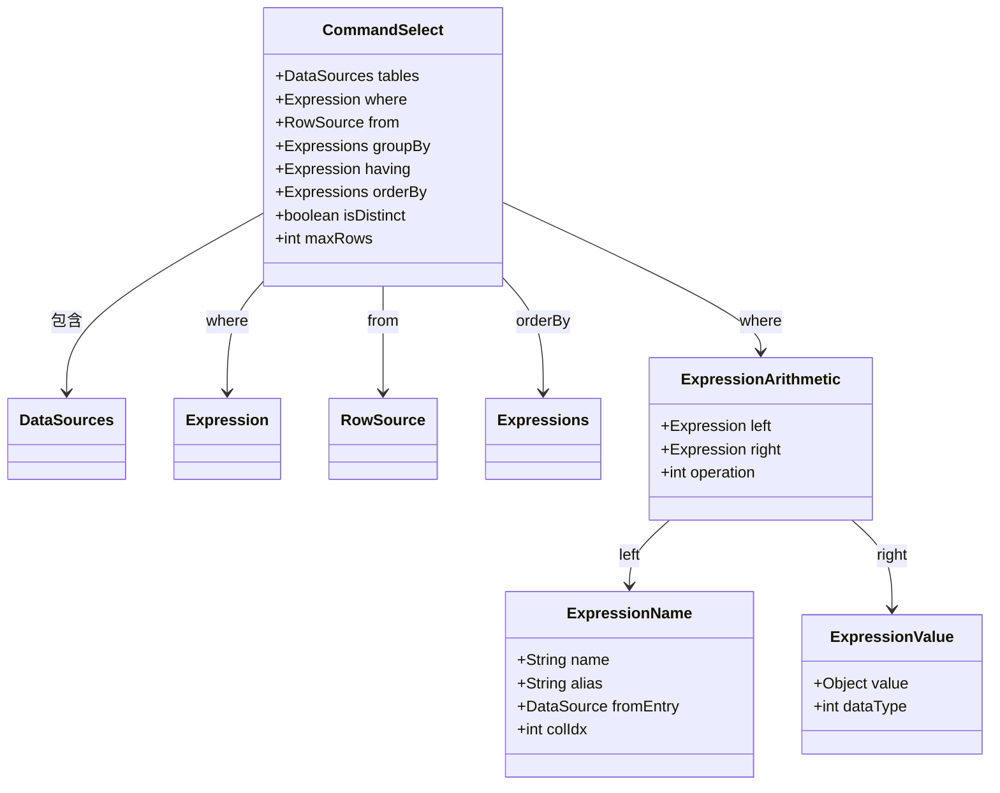
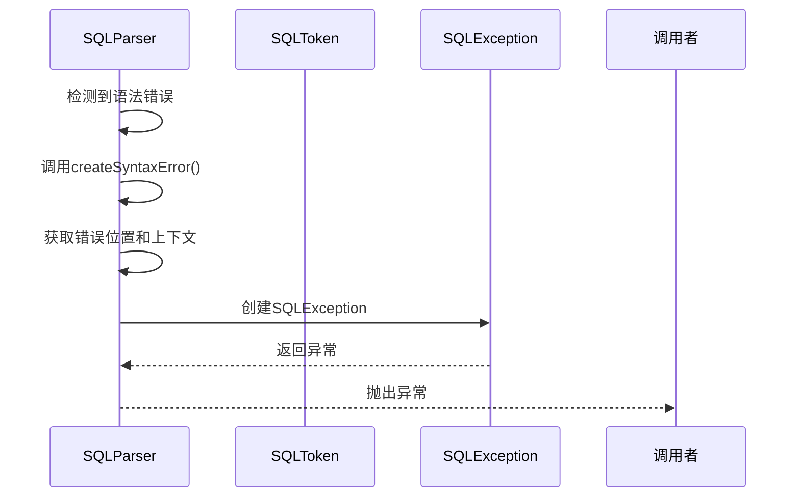

# SQL解析层

<cite>
**本文档引用的文件**
- [SQLTokenizer.java](file://src/main/java/io/leavesfly/smallsql/rdb/sql/parser/SQLTokenizer.java)
- [SQLToken.java](file://src/main/java/io/leavesfly/smallsql/rdb/sql/parser/SQLToken.java)
- [SQLParser.java](file://src/main/java/io/leavesfly/smallsql/rdb/sql/SQLParser.java)
- [Expression.java](file://src/main/java/io/leavesfly/smallsql/rdb/sql/expression/Expression.java)
- [ExpressionName.java](file://src/main/java/io/leavesfly/smallsql/rdb/sql/expression/ExpressionName.java)
- [ExpressionValue.java](file://src/main/java/io/leavesfly/smallsql/rdb/sql/expression/ExpressionValue.java)
- [ExpressionArithmetic.java](file://src/main/java/io/leavesfly/smallsql/rdb/sql/expression/operator/ExpressionArithmetic.java)
- [ExpressionFunction.java](file://src/main/java/io/leavesfly/smallsql/rdb/sql/expression/function/ExpressionFunction.java)
- [Expressions.java](file://src/main/java/io/leavesfly/smallsql/rdb/sql/expression/Expressions.java)
- [CommandSelect.java](file://src/main/java/io/leavesfly/smallsql/rdb/command/dql/CommandSelect.java)
</cite>

## 目录
1. [引言](#引言)
2. [词法分析器SQLTokenizer](#词法分析器sqltokenizer)
3. [语法分析器SQLParser](#语法分析器sqlparser)
4. [表达式树结构](#表达式树结构)
5. [SQL语句解析流程](#sql语句解析流程)
6. [解析示例：SELECT语句](#解析示例select语句)
7. [错误处理机制](#错误处理机制)
8. [总结](#总结)

## 引言

SQL解析层是数据库系统的核心组件之一，负责将用户输入的SQL语句字符串转换为可执行的内部数据结构。本系统采用两阶段解析方法：首先通过词法分析器（SQLTokenizer）将SQL字符串分解为标记流（Token Stream），然后由语法分析器（SQLParser）基于递归下降算法构建抽象语法树（AST）。解析结果最终生成对应的命令对象（Command），用于后续的执行阶段。本文档深入解析这一过程的实现机制。

## 词法分析器SQLTokenizer

SQLTokenizer是系统的词法分析器，负责将SQL语句字符串分解为一系列SQLToken对象。该过程是解析的第一步，为后续的语法分析提供基础。

### 词法分析原理

SQLTokenizer通过单次遍历输入的字符数组来识别和生成标记。它使用一个有限状态机来处理不同的字符序列，包括标识符、关键字、字符串常量、数字和操作符。分析器能够正确处理SQL中的各种语法元素，如单引号和双引号字符串、注释（单行`--`和多行`/* */`）、转义字符以及各种操作符。

**核心实现机制：**
- **关键字识别**：使用一个基于字符的搜索树（searchTree）来高效地识别SQL关键字。这种方法避免了对每个单词进行哈希查找，提高了性能。
- **字符串处理**：正确处理带引号的字符串，包括转义序列（如`''`表示单引号本身）。
- **数字识别**：能够识别整数、浮点数以及科学计数法表示的数字。
- **操作符处理**：支持单字符操作符（如`+`、`-`）和多字符操作符（如`<=`、`<>`）。

**图源**
- [SQLTokenizer.java](file://src/main/java/io/leavesfly/smallsql/rdb/sql/parser/SQLTokenizer.java#L0-L799)

**本节源码**
- [SQLTokenizer.java](file://src/main/java/io/leavesfly/smallsql/rdb/sql/parser/SQLTokenizer.java#L0-L799)
- [SQLToken.java](file://src/main/java/io/leavesfly/smallsql/rdb/sql/parser/SQLToken.java#L0-L66)

## 语法分析器SQLParser

SQLParser是系统的语法分析器，采用递归下降算法将SQLToken流转换为抽象语法树（AST）。该分析器是解析过程的核心，决定了SQL语句的语义结构。

### 递归下降算法

递归下降是一种自顶向下的语法分析方法，其中每个非终结符对应一个解析函数。SQLParser的实现遵循这一模式，为SQL语句的不同组成部分（如SELECT、INSERT、UPDATE等）提供了专门的解析方法。

**主要解析方法：**
- `parse()`：主入口方法，根据第一个标记确定语句类型并调用相应的解析器。
- `select()`：解析SELECT语句，处理SELECT子句、FROM子句、WHERE子句等。
- `insert()`：解析INSERT语句，处理列名列表和值列表。
- `update()`：解析UPDATE语句，处理SET子句和WHERE子句。
- `delete()`：解析DELETE语句，处理FROM子句和WHERE子句。

### 语句类型分发

SQLParser首先读取第一个标记，然后根据其值分发到相应的解析器：

**图源**
- [SQLParser.java](file://src/main/java/io/leavesfly/smallsql/rdb/sql/SQLParser.java#L0-L799)

**本节源码**
- [SQLParser.java](file://src/main/java/io/leavesfly/smallsql/rdb/sql/SQLParser.java#L0-L799)

## 表达式树结构

SQL中的表达式（如列引用、常量、运算符和函数调用）通过Expression接口及其子类来表示。这些类构成了表达式树的基础，是抽象语法树的重要组成部分。

### Expression接口

`Expression`是所有表达式类型的基类，定义了表达式的基本属性和行为。它是一个抽象类，提供了通用的功能，如别名管理、参数设置和类型信息。

**核心属性：**
- `type`：表达式的类型（如VALUE、NAME、FUNCTION等）。
- `name`：原始列名或表达式名。
- `alias`：别名，用于结果集中的列名。
- `params`：参数列表，用于函数和操作符表达式。

**主要方法：**
- `isNull()`、`getBoolean()`、`getInt()`等：获取表达式的值。
- `getDataType()`：获取数据类型。
- `setParams()`、`setParamAt()`：设置和修改参数。

### 表达式实现类

#### 列引用：ExpressionName

`ExpressionName`类表示列引用，如`users.id`或`*`。它不仅存储列名，还包含与数据源的链接信息，以便在执行时获取实际值。

**图源**
- [ExpressionName.java](file://src/main/java/io/leavesfly/smallsql/rdb/sql/expression/ExpressionName.java#L0-L247)

#### 常量值：ExpressionValue

`ExpressionValue`类表示常量值，如字符串`'hello'`、数字`123`或布尔值`TRUE`。它封装了值本身和其数据类型。

**图源**
- [ExpressionValue.java](file://src/main/java/io/leavesfly/smallsql/rdb/sql/expression/ExpressionValue.java#L0-L733)

#### 运算符：ExpressionArithmetic

`ExpressionArithmetic`类表示算术和逻辑运算符，如`+`、`-`、`=`、`AND`等。它是一个二元（或一元）操作符，包含左右操作数。

**图源**
- [ExpressionArithmetic.java](file://src/main/java/io/leavesfly/smallsql/rdb/sql/expression/operator/ExpressionArithmetic.java#L0-L799)

#### 函数调用：ExpressionFunction

`ExpressionFunction`是所有内置函数的基类，采用模板方法模式实现。具体的函数（如`ABS`、`LENGTH`）继承此类并实现特定逻辑。

**图源**
- [ExpressionFunction.java](file://src/main/java/io/leavesfly/smallsql/rdb/sql/expression/function/ExpressionFunction.java#L0-L142)

**本节源码**
- [Expression.java](file://src/main/java/io/leavesfly/smallsql/rdb/sql/expression/Expression.java#L0-L246)
- [ExpressionName.java](file://src/main/java/io/leavesfly/smallsql/rdb/sql/expression/ExpressionName.java#L0-L247)
- [ExpressionValue.java](file://src/main/java/io/leavesfly/smallsql/rdb/sql/expression/ExpressionValue.java#L0-L733)
- [ExpressionArithmetic.java](file://src/main/java/io/leavesfly/smallsql/rdb/sql/expression/operator/ExpressionArithmetic.java#L0-L799)
- [ExpressionFunction.java](file://src/main/java/io/leavesfly/smallsql/rdb/sql/expression/function/ExpressionFunction.java#L0-L142)

## SQL语句解析流程

SQL语句的解析是一个多阶段的过程，从原始字符串到最终的可执行命令对象。以下是完整的解析流程。

### 解析流程概述

### 命令对象生成

根据SQL语句的类型，SQLParser生成相应的Command对象：

- **SELECT语句**：生成`CommandSelect`对象，包含选择列表、FROM子句、WHERE条件等。
- **INSERT语句**：生成`CommandInsert`对象，包含表名、列名列表和值列表。
- **UPDATE语句**：生成`CommandUpdate`对象，包含表名、SET子句和WHERE条件。
- **DELETE语句**：生成`CommandDelete`对象，包含表名和WHERE条件。

**本节源码**
- [SQLParser.java](file://src/main/java/io/leavesfly/smallsql/rdb/sql/SQLParser.java#L0-L799)
- [CommandSelect.java](file://src/main/java/io/leavesfly/smallsql/rdb/command/dql/CommandSelect.java#L61-L587)

## 解析示例：SELECT语句

以`SELECT * FROM users WHERE id = 1`为例，详细说明完整的解析流程。

### 词法分析阶段

输入的SQL字符串被分解为以下Token序列：
1. `SELECT` (关键字)
2. `*` (通配符)
3. `FROM` (关键字)
4. `users` (标识符)
5. `WHERE` (关键字)
6. `id` (标识符)
7. `=` (操作符)
8. `1` (数字常量)

### 语法分析阶段

1. **主入口**：`parse()`方法读取第一个Token `SELECT`，调用`select()`方法。
2. **处理SELECT子句**：`singleSelect()`方法读取`*`，创建一个`ExpressionName("*")`对象。
3. **处理FROM子句**：`from()`方法读取`users`，创建表源。
4. **处理WHERE子句**：`where()`方法解析`id = 1`，构建表达式树：
   - 左操作数：`ExpressionName("id")`
   - 操作符：`=` (EQUALS)
   - 右操作数：`ExpressionValue(1, INT)`

最终生成的`CommandSelect`对象结构如下：

**图源**
- [CommandSelect.java](file://src/main/java/io/leavesfly/smallsql/rdb/command/dql/CommandSelect.java#L61-L587)

**本节源码**
- [SQLParser.java](file://src/main/java/io/leavesfly/smallsql/rdb/sql/SQLParser.java#L0-L799)
- [CommandSelect.java](file://src/main/java/io/leavesfly/smallsql/rdb/command/dql/CommandSelect.java#L61-L587)

## 错误处理机制

SQL解析层包含完善的错误处理机制，能够在语法错误发生时提供准确的定位和描述。

### 语法错误报告

当遇到语法错误时，系统会生成详细的错误消息，包括：
- 错误位置（字符偏移量）
- 错误附近的SQL代码片段
- 预期的语法元素

**错误处理流程：**
1. 检测到语法错误时，调用`createSyntaxError()`方法。
2. 该方法收集错误位置信息和上下文。
3. 生成包含错误位置标记的详细消息。

**本节源码**
- [SQLParser.java](file://src/main/java/io/leavesfly/smallsql/rdb/sql/SQLParser.java#L0-L799)

## 总结

SQL解析层通过词法分析器SQLTokenizer和语法分析器SQLParser的协同工作，实现了从SQL字符串到可执行命令对象的完整转换。该系统采用递归下降算法进行语法分析，具有良好的可读性和可维护性。表达式树结构通过Expression接口及其丰富的实现类，灵活地表示了SQL中的各种表达式。整个解析过程高效、准确，并具备完善的错误处理能力，为数据库系统的查询处理奠定了坚实的基础。