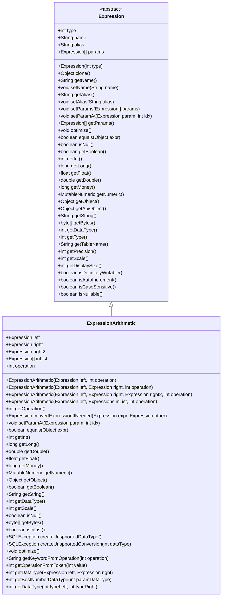
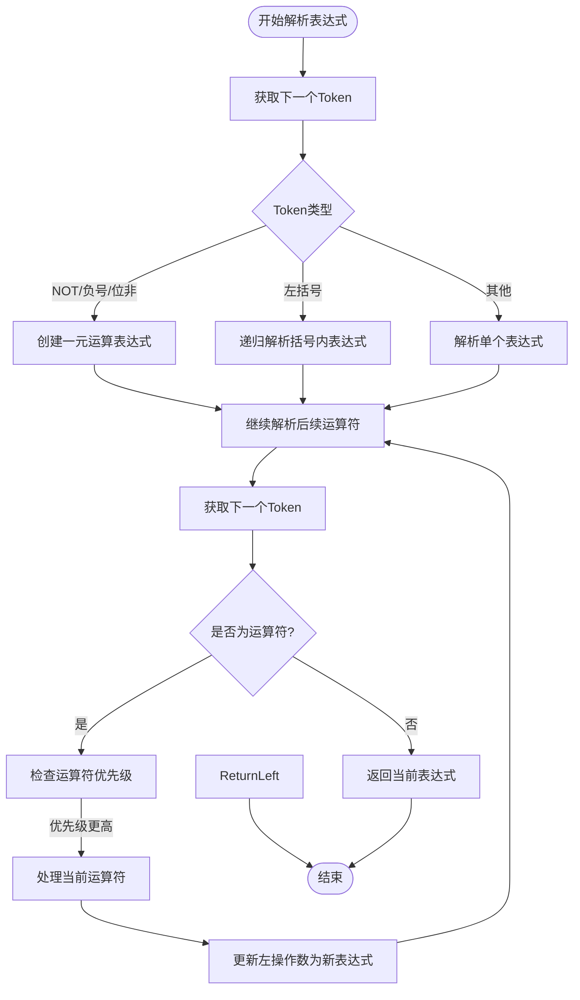

# 表达式处理

<cite>
**本文档中引用的文件**  
- [Expression.java](file://src/main/java/io/leavesfly/smallsql/rdb/sql/expression/Expression.java)
- [Expressions.java](file://src/main/java/io/leavesfly/smallsql/rdb/sql/expression/Expressions.java)
- [ColumnExpression.java](file://src/main/java/io/leavesfly/smallsql/rdb/sql/expression/ColumnExpression.java)
- [ExpressionValue.java](file://src/main/java/io/leavesfly/smallsql/rdb/sql/expression/ExpressionValue.java)
- [ExpressionArithmetic.java](file://src/main/java/io/leavesfly/smallsql/rdb/sql/expression/operator/ExpressionArithmetic.java)
- [ExpressionFunction.java](file://src/main/java/io/leavesfly/smallsql/rdb/sql/expression/function/ExpressionFunction.java)
- [SQLParser.java](file://src/main/java/io/leavesfly/smallsql/rdb/sql/SQLParser.java)
</cite>

## 目录
1. [引言](#引言)
2. [表达式接口与继承体系](#表达式接口与继承体系)
3. [Expressions工具类的作用](#expressions工具类的作用)
4. [列引用与常量值的表示](#列引用与常量值的表示)
5. [算术表达式处理机制](#算术表达式处理机制)
6. [函数表达式体系](#函数表达式体系)
7. [表达式树的构建与求值](#表达式树的构建与求值)
8. [结论](#结论)

## 引言
本文件全面解析SmallSQL数据库系统中SQL表达式处理的核心机制。重点阐述`Expression`接口作为所有SQL表达式统一抽象的设计原理，分析`Expressions`工具类在表达式管理中的作用，并详细说明列引用、常量值、算术运算和函数调用等各类表达式的实现方式。通过分析表达式树的构建过程和求值机制，揭示SQL查询中表达式处理的完整流程。

## 表达式接口与继承体系

`Expression`抽象类是所有SQL表达式类型的统一接口，为列引用、常量、运算符、函数调用等提供了统一的抽象基础。该类定义了表达式的基本属性和行为，包括名称、别名、参数列表以及各种数据类型的获取方法。

`Expression`类通过抽象方法`isNull()`、`getBoolean()`、`getInt()`、`getLong()`、`getFloat()`、`getDouble()`、`getMoney()`、`getNumeric()`、`getObject()`、`getString()`和`getBytes()`，为所有子类提供了统一的数据访问接口。这种设计模式使得上层代码可以以统一的方式处理不同类型的表达式，而无需关心具体的实现细节。

该类还定义了多种表达式类型常量，如`VALUE`（值表达式）、`NAME`（名称表达式）、`FUNCTION`（函数表达式）以及各种聚合函数类型，为表达式的类型识别和处理提供了基础支持。

**Section sources**
- [Expression.java](file://src/main/java/io/leavesfly/smallsql/rdb/sql/expression/Expression.java#L41-L246)

## Expressions工具类的作用

`Expressions`类是一个专门用于管理表达式集合的工具类，采用动态数组实现，为表达式列表的增删改查操作提供了高效的支持。该类内部维护一个`Expression`数组和当前大小，实现了自动扩容机制，当容量不足时会自动扩大数组大小。

该工具类提供了丰富的操作方法，包括`add()`（添加表达式）、`add(int, Expression)`（在指定位置插入表达式）、`addAll()`（批量添加表达式）、`get()`（获取指定位置的表达式）、`set()`（设置指定位置的表达式）、`remove()`（移除指定位置的表达式）和`clear()`（清空所有表达式）等。这些方法为SQL解析过程中表达式列表的构建和管理提供了便利。

`Expressions`类在处理`IN`操作符、函数参数列表、`SELECT`语句的字段列表等需要管理多个表达式的场景中发挥着重要作用，是表达式处理体系中的关键组件之一。

**Section sources**
- [Expressions.java](file://src/main/java/io/leavesfly/smallsql/rdb/sql/expression/Expressions.java#L38-L132)

## 列引用与常量值的表示

### ColumnExpression类
`ColumnExpression`类用于表示SQL查询中的列引用，继承自`Column`类并包含一个`Expression`类型的成员变量`expr`。该类通过委托模式，将大部分属性获取操作（如数据类型、显示大小、精度、小数位数等）转发给内部的`Expression`对象。

这种设计使得列引用可以透明地处理各种复杂的表达式，而不仅仅是简单的列名。例如，在`SELECT`语句中，一个列引用可以是一个简单的列名，也可以是一个复杂的表达式计算结果。`ColumnExpression`通过`getName()`方法返回内部表达式的别名，实现了列引用的统一表示。

**Section sources**
- [ColumnExpression.java](file://src/main/java/io/leavesfly/smallsql/rdb/sql/expression/ColumnExpression.java#L44-L92)

### ExpressionValue类
`ExpressionValue`类用于表示SQL中的常量值，如数字、字符串、布尔值等。该类继承自`Expression`，内部包含一个`Object`类型的`value`成员变量来存储实际的值，以及`dataType`和`length`成员变量来记录数据类型和长度信息。

`ExpressionValue`类提供了多种构造函数，支持不同场景下的使用：无参构造函数用于预编译语句中的参数占位符；带类型参数的构造函数用于聚合函数的初始化；带值和数据类型参数的构造函数用于静态表达式（如`0x23`、`67`、`23.8`、`'qwert'`）。

该类还实现了`accumulate()`方法，用于在分组查询中累积聚合函数的值，支持`COUNT`、`SUM`、`MAX`、`MIN`等聚合操作。通过重写`Expression`类的各种`get`方法，`ExpressionValue`能够根据存储的值和数据类型提供相应的数据访问。

**Section sources**
- [ExpressionValue.java](file://src/main/java/io/leavesfly/smallsql/rdb/sql/expression/ExpressionValue.java#L50-L733)

## 算术表达式处理机制

`ExpressionArithmetic`类是算术表达式的核心实现，用于处理各种算术运算符、比较运算符和逻辑运算符。该类通过`operation`成员变量记录运算类型，并通过`left`、`right`和`right2`成员变量分别表示左操作数、右操作数和第二个右操作数（用于`BETWEEN`操作符）。

该类提供了多个构造函数，支持不同运算符的需求：
- 一元运算符（如`NOT`、`NEGATIVE`、`BIT_NOT`）使用单操作数构造函数
- 二元运算符（如`+`、`-`、`*`、`/`）使用双操作数构造函数
- `BETWEEN`操作符使用三操作数构造函数
- `IN`操作符使用包含`Expressions`列表的构造函数

`ExpressionArithmetic`类通过重写`Expression`的各种`get`方法，实现了不同数据类型下的运算逻辑。例如，`getIntImpl()`方法实现了整数类型的加、减、乘、除、取模和位运算；`getDoubleImpl()`方法实现了浮点数类型的相应运算。对于比较运算符和逻辑运算符，`getBoolean()`方法根据运算类型和操作数的值返回相应的布尔结果。

该类还实现了`optimize()`方法，用于在查询编译后对表达式进行优化，如常量表达式的预计算。`getDataType()`静态方法用于确定两个操作数进行运算后的最佳数据类型，遵循类型提升规则。

**Diagram sources**
- [Expression.java](file://src/main/java/io/leavesfly/smallsql/rdb/sql/expression/Expression.java#L41-L246)
- [ExpressionArithmetic.java](file://src/main/java/io/leavesfly/smallsql/rdb/sql/expression/operator/ExpressionArithmetic.java#L49-L1099)

**Section sources**
- [ExpressionArithmetic.java](file://src/main/java/io/leavesfly/smallsql/rdb/sql/expression/operator/ExpressionArithmetic.java#L49-L1099)

## 函数表达式体系

`ExpressionFunction`是所有内置函数表达式的抽象基类，继承自`Expression`。该类定义了函数表达式的基本结构，包含`param1`、`param2`、`param3`和`param4`四个参数成员变量，用于存储函数的参数表达式。

每个具体的函数实现类（如`ExpressionFunctionAbs`、`ExpressionFunctionCos`等）都继承自`ExpressionFunction`，并实现`getFunction()`抽象方法，返回对应的函数编号（如`SQLTokenizer.ABS`）。这种设计模式使得系统可以通过统一的方式处理各种内置函数。

函数表达式体系按功能分为多个子包：
- **numeric**：数学函数，如`ABS`、`CEILING`、`FLOOR`、`ROUND`、`SQRT`、`SIN`、`COS`、`TAN`等
- **string**：字符串函数，如`UPPER`、`LOWER`、`LENGTH`、`SUBSTRING`、`TRIM`、`REPLACE`等
- **time**：时间函数，如`YEAR`、`MONTH`、`DAY`、`HOUR`、`MINUTE`、`TIMESTAMPADD`、`TIMESTAMPDIFF`等
- **system**：系统函数，如`CASE`、`IIF`、`CONVERT`等

`ConcreteFunctionFactory`和`FunctionFactory`类负责函数的创建和管理，根据函数名称和参数类型选择合适的函数实现。这种工厂模式的设计使得函数体系具有良好的扩展性，可以方便地添加新的内置函数。

**Section sources**
- [ExpressionFunction.java](file://src/main/java/io/leavesfly/smallsql/rdb/sql/expression/function/ExpressionFunction.java#L60-L142)

## 表达式树的构建与求值

### 表达式树的构建过程
表达式树的构建主要在`SQLParser`类的`expression()`方法中完成。该方法采用递归下降解析算法，根据运算符的优先级和结合性构建表达式树。

解析过程从最低优先级的运算符开始，逐步处理更高优先级的运算符。例如，对于表达式`salary * 1.1 + bonus`，解析器首先将`salary * 1.1`作为一个整体（乘法运算，优先级较高）处理，然后将其作为加法运算的左操作数。这种方法确保了表达式树的结构符合运算符优先级规则。

对于函数调用如`UPPER(name)`，解析器首先识别函数名，然后解析参数列表，最后创建相应的`ExpressionFunction`实例。对于复杂表达式，如`UPPER(name) + LOWER(surname)`，解析器会构建一个包含两个函数调用子树的算术表达式树。

**Diagram sources**
- [SQLParser.java](file://src/main/java/io/leavesfly/smallsql/rdb/sql/SQLParser.java#L1465-L1570)

### 表达式求值机制
表达式求值通过调用表达式树根节点的`get`系列方法（如`getInt()`、`getDouble()`、`getString()`等）实现。求值过程采用递归方式，从叶子节点开始，逐层向上计算。

对于`ExpressionValue`，求值直接返回存储的值。对于`ColumnExpression`，求值依赖于当前行的数据，通过内部的`Expression`对象获取列值。对于`ExpressionArithmetic`，求值首先递归计算左右操作数的值，然后根据运算类型执行相应的计算逻辑。

求值过程中会进行必要的类型转换，如将整数转换为浮点数进行除法运算，或将字符串转换为数值进行算术运算。`getDataType()`方法用于确定运算结果的数据类型，遵循SQL标准的类型提升规则。

在查询执行过程中，表达式树的求值通常在`CommandSelect`等命令执行器中进行，用于计算`SELECT`列表中的表达式、`WHERE`子句中的条件表达式、`ORDER BY`子句中的排序表达式等。通过表达式树的求值，SQL查询能够处理复杂的计算和逻辑判断。

**Section sources**
- [SQLParser.java](file://src/main/java/io/leavesfly/smallsql/rdb/sql/SQLParser.java#L1465-L1570)

## 结论
SmallSQL的表达式处理机制通过`Expression`接口的统一抽象，实现了对各种SQL表达式的灵活支持。`Expression`类作为所有表达式的基类，提供了统一的数据访问接口；`Expressions`工具类为表达式列表的管理提供了高效的支持；`ColumnExpression`和`ExpressionValue`分别优雅地处理了列引用和常量值的表示。

`ExpressionArithmetic`类通过丰富的构造函数和运算方法，全面支持了算术、比较和逻辑运算符的处理。函数表达式体系通过`ExpressionFunction`基类和工厂模式，实现了对各类内置函数的扩展支持。整个表达式处理体系通过递归下降解析构建表达式树，并通过递归求值机制执行表达式计算，为SQL查询的复杂计算需求提供了坚实的基础。

这种设计不仅保证了代码的可维护性和扩展性，还为SQL标准的完整实现提供了有力支持，体现了SmallSQL在表达式处理方面的精心设计和工程实现。