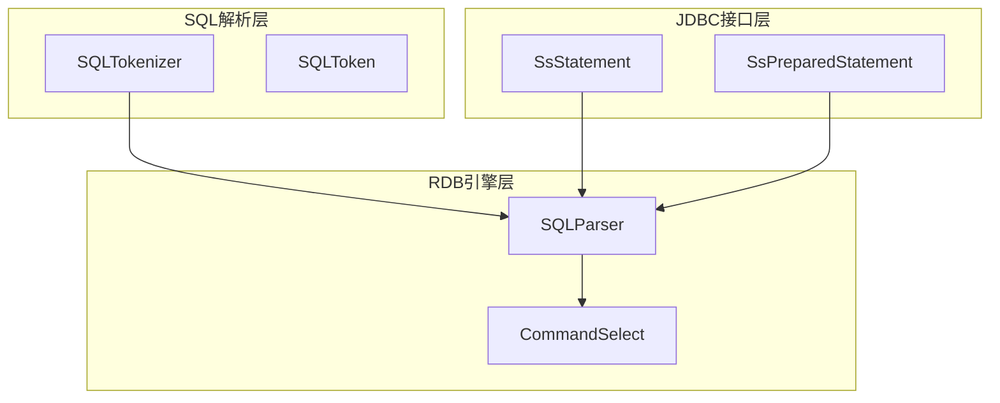
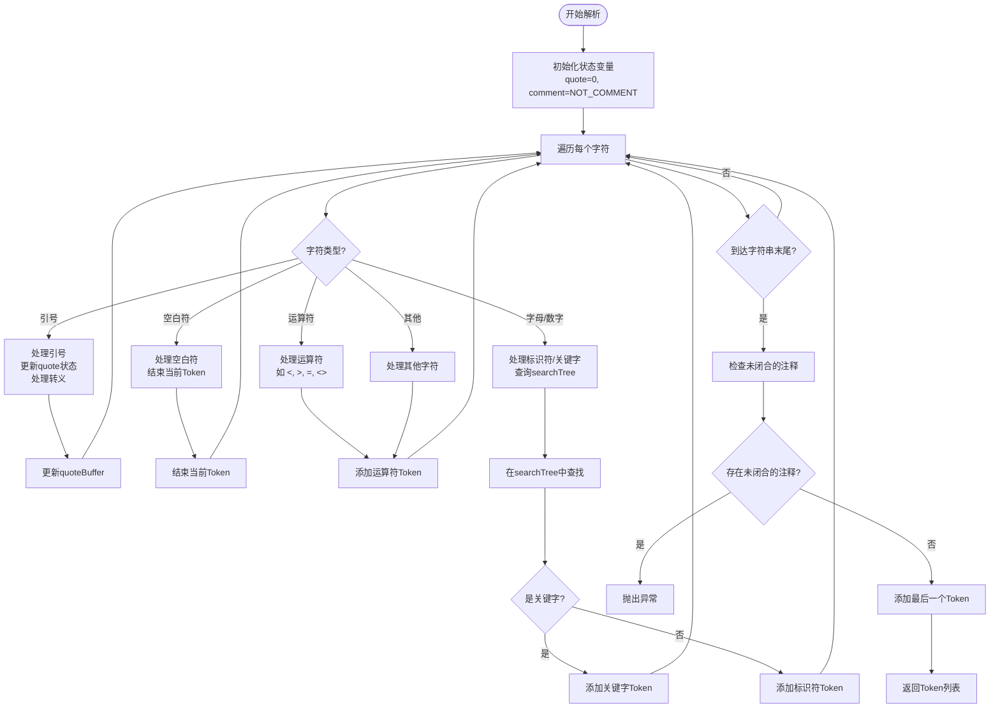
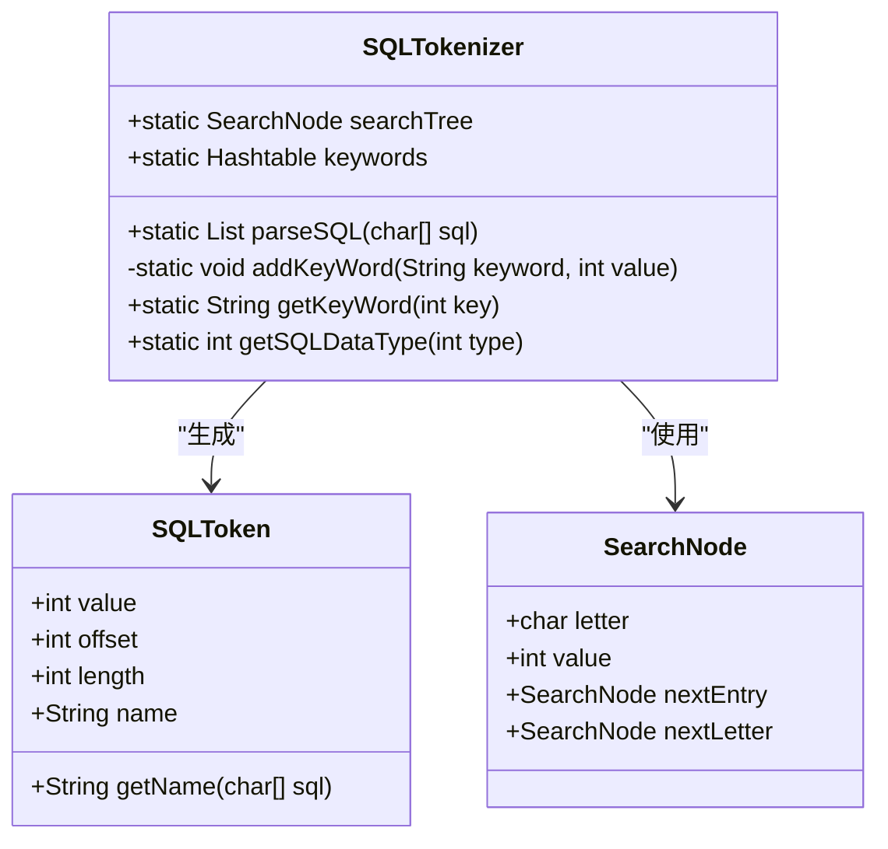
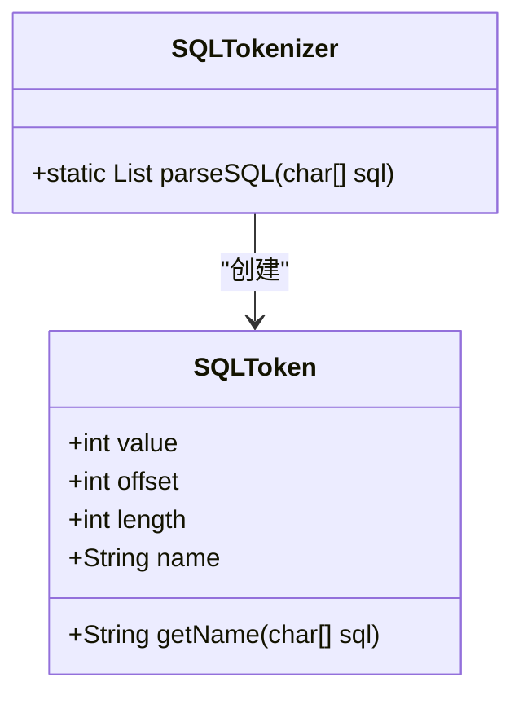

# 词法分析

<cite>
**本文档引用的文件**   
- [SQLToken.java](file://src/main/java/io/leavesfly/smallsql/rdb/sql/parser/SQLToken.java)
- [SQLTokenizer.java](file://src/main/java/io/leavesfly/smallsql/rdb/sql/parser/SQLTokenizer.java)
- [Database.java](file://src/main/java/io/leavesfly/smallsql/rdb/engine/Database.java)
- [CommandSelect.java](file://src/main/java/io/leavesfly/smallsql/rdb/command/dql/CommandSelect.java)
- [SsConnection.java](file://src/main/java/io/leavesfly/smallsql/jdbc/SsConnection.java)
</cite>

## 目录
1. [简介](#简介)
2. [项目结构](#项目结构)
3. [核心组件](#核心组件)
4. [架构概述](#架构概述)
5. [详细组件分析](#详细组件分析)
6. [依赖分析](#依赖分析)
7. [性能考虑](#性能考虑)
8. [故障排除指南](#故障排除指南)
9. [结论](#结论)

## 简介
本文档深入解析SmallSQL数据库系统中SQL词法分析器的实现机制。重点阐述SQLTokenizer如何将原始SQL字符串分解为有意义的词法单元（Token）流，以及SQLToken类的设计结构和类型分类。文档详细说明了SQL关键字（如SELECT、FROM、WHERE）的识别逻辑，标识符和字符串常量的解析规则，以及数字、日期、字符串等字面量的识别方式和状态机处理流程。通过结合具体代码示例，展示SQLTokenizer如何处理复杂SQL语句的分词过程，并讨论其在错误输入（如不匹配的引号）下的容错与报错机制。

## 项目结构
SmallSQL项目采用典型的Java分层架构，主要分为JDBC接口层、RDB（关系数据库）引擎层和SQL解析层。核心的词法分析功能位于`src/main/java/io/leavesfly/smallsql/rdb/sql/parser`包中，由`SQLTokenizer`和`SQLToken`两个核心类构成。`SQLTokenizer`负责将SQL字符串分解为Token流，而`SQLToken`则代表单个词法单元。该解析器被上层的`SQLParser`和`CommandSelect`等组件调用，用于执行SQL语句的编译和执行。



**图示来源**
- [SQLTokenizer.java](file://src/main/java/io/leavesfly/smallsql/rdb/sql/parser/SQLTokenizer.java#L1-L974)
- [SQLToken.java](file://src/main/java/io/leavesfly/smallsql/rdb/sql/parser/SQLToken.java#L1-L67)
- [CommandSelect.java](file://src/main/java/io/leavesfly/smallsql/rdb/command/dql/CommandSelect.java#L1-L588)

**本节来源**
- [SQLTokenizer.java](file://src/main/java/io/leavesfly/smallsql/rdb/sql/parser/SQLTokenizer.java#L1-L974)
- [SQLToken.java](file://src/main/java/io/leavesfly/smallsql/rdb/sql/parser/SQLToken.java#L1-L67)

## 核心组件
词法分析的核心组件是`SQLTokenizer`和`SQLToken`类。`SQLTokenizer`类通过`parseSQL`静态方法接收一个字符数组形式的SQL语句，利用状态机和搜索树（searchTree）技术，逐字符扫描并生成一个`SQLToken`对象的列表。`SQLToken`类则封装了每个词法单元的值、在原始SQL字符串中的偏移量和长度等信息。这种设计将词法分析的逻辑与数据结构分离，提高了代码的可维护性和复用性。

**本节来源**
- [SQLTokenizer.java](file://src/main/java/io/leavesfly/smallsql/rdb/sql/parser/SQLTokenizer.java#L1-L974)
- [SQLToken.java](file://src/main/java/io/leavesfly/smallsql/rdb/sql/parser/SQLToken.java#L1-L67)

## 架构概述
SmallSQL的词法分析器采用基于状态机的算法，其核心架构围绕`SQLTokenizer.parseSQL`方法构建。该方法维护多个状态变量，如`quote`（当前引号类型）、`comment`（注释状态）、`wasWhiteSpace`（前一个字符是否为空白）和`searchTree`（关键字搜索树）。通过一个主循环遍历SQL字符串的每个字符，并根据字符类型和当前状态，决定是将其作为关键字、标识符、字符串、数字还是运算符进行处理。整个过程高效且准确，能够正确处理嵌套引号、转义字符和各种SQL语法结构。



**图示来源**
- [SQLTokenizer.java](file://src/main/java/io/leavesfly/smallsql/rdb/sql/parser/SQLTokenizer.java#L50-L400)

## 详细组件分析

### SQLTokenizer分析
`SQLTokenizer`是词法分析的核心引擎，其`parseSQL`方法实现了复杂的字符扫描和状态管理逻辑。该方法能够精确区分SQL中的各种元素，如关键字、标识符、字符串常量、数字和运算符。

#### 对象导向组件


**图示来源**
- [SQLTokenizer.java](file://src/main/java/io/leavesfly/smallsql/rdb/sql/parser/SQLTokenizer.java#L1-L974)
- [SQLToken.java](file://src/main/java/io/leavesfly/smallsql/rdb/sql/parser/SQLToken.java#L1-L67)

#### 复杂逻辑组件
```mermaid
flowchart TD
Start([函数入口]) --> Init["初始化变量<br/>tokens, value, tokenStart等"]
Init --> Loop["for循环遍历每个字符"]
Loop --> Char{"当前字符 c"}
Char --> |c == '\"' or '\''| HandleQuote["处理引号"]
Char --> |c == '-'| HandleDash["处理减号/注释"]
Char --> |c == '/'| HandleSlash["处理除号/注释"]
Char --> |c == '<' or '>' or '='| HandleCompare["处理比较运算符"]
Char --> |c 是空白符或分隔符| HandleSeparator["处理分隔符"]
Char --> |其他字符| HandleDefault["默认处理"]
HandleQuote --> QuoteLogic["根据quote状态<br/>决定是开始、结束<br/>还是添加到buffer"]
HandleDash --> DashLogic["检查是否为--注释<br/>或负数"]
HandleSlash --> SlashLogic["检查是否为/*注释"]
HandleCompare --> CompareLogic["检查是否为<=, >=, <>"]
HandleSeparator --> SeparatorLogic["结束当前Token<br/>添加分隔符Token"]
HandleDefault --> DefaultLogic["在searchTree中查找<br/>判断是否为关键字"]
QuoteLogic --> Loop
DashLogic --> Loop
SlashLogic --> Loop
CompareLogic --> Loop
SeparatorLogic --> Loop
DefaultLogic --> Loop
Loop --> End{"循环结束?"}
End --> |否| Loop
End --> |是| CheckComment["检查未闭合的注释"]
CheckComment --> HasError{"存在错误?"}
HasError --> |是| ThrowException["抛出SmallSQLException"]
HasError --> |否| AddLastToken["添加最后一个Token"]
AddLastToken --> Return["返回tokens列表"]
Note over CheckComment,Return: 确保所有语法结构都正确闭合
```

**图示来源**
- [SQLTokenizer.java](file://src/main/java/io/leavesfly/smallsql/rdb/sql/parser/SQLTokenizer.java#L50-L400)

**本节来源**
- [SQLTokenizer.java](file://src/main/java/io/leavesfly/smallsql/rdb/sql/parser/SQLTokenizer.java#L1-L974)
- [SQLToken.java](file://src/main/java/io/leavesfly/smallsql/rdb/sql/parser/SQLToken.java#L1-L67)

### SQLToken分析
`SQLToken`类是词法分析的基本数据单元，用于表示从SQL字符串中识别出的一个有意义的词法单元。它通过`value`字段存储Token的类型（如关键字、标识符、字符串等），通过`offset`和`length`字段记录其在原始SQL字符串中的位置信息。对于字符串和标识符，它还使用`name`字段存储其实际内容。



**图示来源**
- [SQLToken.java](file://src/main/java/io/leavesfly/smallsql/rdb/sql/parser/SQLToken.java#L1-L67)

**本节来源**
- [SQLToken.java](file://src/main/java/io/leavesfly/smallsql/rdb/sql/parser/SQLToken.java#L1-L67)

## 依赖分析
词法分析模块是SmallSQL系统的基础组件，它被上层的SQL解析器和命令执行器所依赖。同时，它也依赖于JDBC异常处理和语言资源管理模块。

```mermaid
graph TD
SQLTokenizer --> SmallSQLException : "抛出异常"
SQLTokenizer --> Language : "获取错误信息"
SQLTokenizer --> Utils : "工具方法"
SQLParser --> SQLTokenizer : "调用parseSQL"
CommandSelect --> SQLParser : "依赖解析结果"
SsConnection --> SQLParser : "启动SQL执行"
subgraph "词法分析"
SQLTokenizer
SQLToken
end
subgraph "上层组件"
SQLParser
CommandSelect
SsConnection
end
subgraph "依赖模块"
SmallSQLException
Language
Utils
end
```

**图示来源**
- [SQLTokenizer.java](file://src/main/java/io/leavesfly/smallsql/rdb/sql/parser/SQLTokenizer.java#L1-L974)
- [CommandSelect.java](file://src/main/java/io/leavesfly/smallsql/rdb/command/dql/CommandSelect.java#L1-L588)
- [SsConnection.java](file://src/main/java/io/leavesfly/smallsql/jdbc/SsConnection.java#L1-L716)

**本节来源**
- [SQLTokenizer.java](file://src/main/java/io/leavesfly/smallsql/rdb/sql/parser/SQLTokenizer.java#L1-L974)
- [CommandSelect.java](file://src/main/java/io/leavesfly/smallsql/rdb/command/dql/CommandSelect.java#L1-L588)
- [SsConnection.java](file://src/main/java/io/leavesfly/smallsql/jdbc/SsConnection.java#L1-L716)

## 性能考虑
`SQLTokenizer`的设计充分考虑了性能。它使用一个预构建的`searchTree`（搜索树）来高效地识别SQL关键字，避免了对每个单词进行线性搜索。`searchTree`是一个基于字符的链表结构，能够以接近O(n)的时间复杂度完成关键字匹配，其中n是关键字的长度。此外，该类使用`ArrayList`来存储生成的Token，保证了动态添加的效率。对于字符串常量的处理，它使用`StringBuffer`来累积字符，避免了频繁的字符串拼接操作，从而提升了处理长字符串的性能。

## 故障排除指南
词法分析器在遇到语法错误时会抛出`SmallSQLException`异常。最常见的错误是未闭合的注释或引号。例如，当`parseSQL`方法结束时，如果`comment`状态仍为`MULTI_COMMENT`，则会抛出`Language.STXADD_COMMENT_OPEN`错误，提示存在未闭合的多行注释。同样，如果引号未正确闭合，也会在处理引号逻辑时抛出相应的异常。开发者在调试SQL语句时，应首先检查这些基本的语法结构是否完整。

**本节来源**
- [SQLTokenizer.java](file://src/main/java/io/leavesfly/smallsql/rdb/sql/parser/SQLTokenizer.java#L380-L385)
- [Language.java](file://src/main/java/io/leavesfly/smallsql/lang/Language.java)

## 结论
SmallSQL的词法分析器是一个设计精巧、性能高效的组件。它通过状态机和搜索树相结合的方式，准确地将SQL字符串分解为词法单元流。`SQLTokenizer`和`SQLToken`两个类的职责划分清晰，代码结构良好。该实现不仅能够正确处理标准的SQL语法，还具备良好的错误检测和报告能力。作为整个SQL解析流程的第一步，这个稳健的词法分析器为SmallSQL数据库系统的可靠运行奠定了坚实的基础。