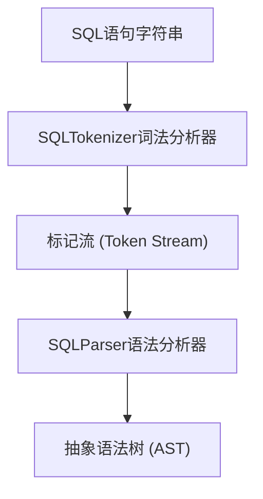
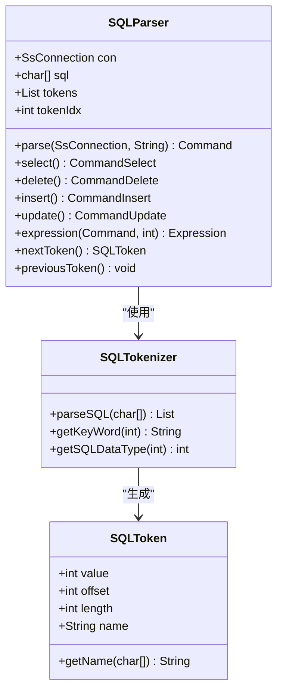
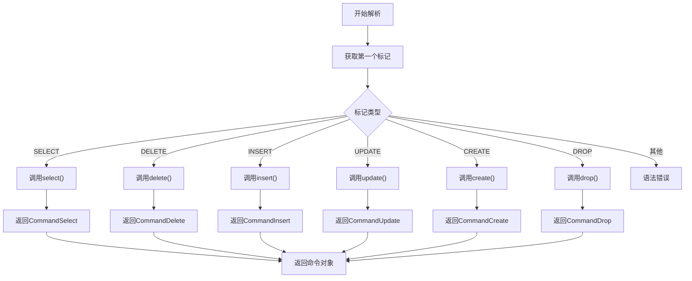
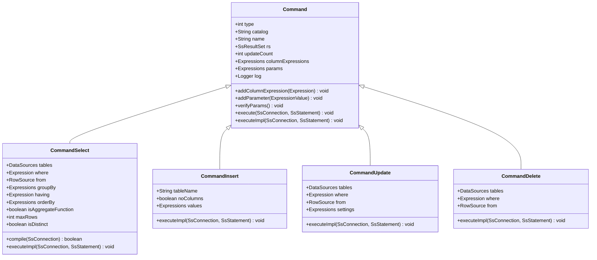
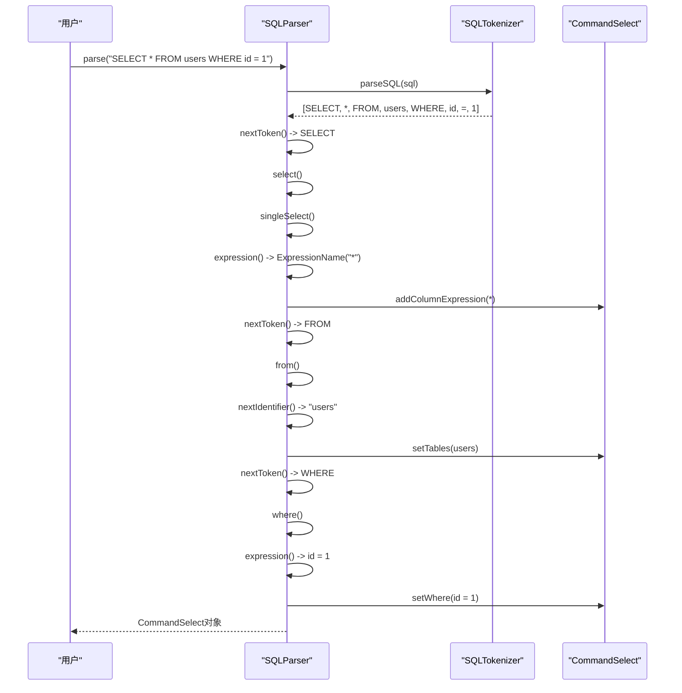
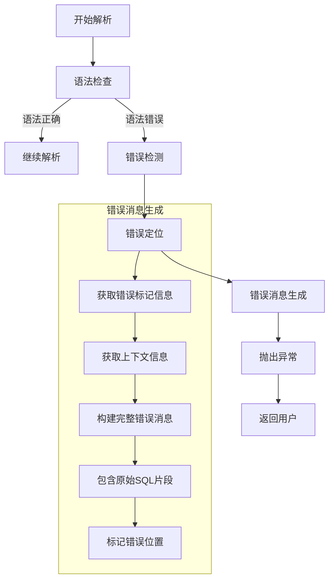

# 语法分析

<cite>
**本文档引用的文件**
- [SQLParser.java](file://src/main/java/io/leavesfly/smallsql/rdb/sql/SQLParser.java)
- [SQLTokenizer.java](file://src/main/java/io/leavesfly/smallsql/rdb/sql/parser/SQLTokenizer.java)
- [SQLToken.java](file://src/main/java/io/leavesfly/smallsql/rdb/sql/parser/SQLToken.java)
- [Command.java](file://src/main/java/io/leavesfly/smallsql/rdb/command/Command.java)
- [CommandSelect.java](file://src/main/java/io/leavesfly/smallsql/rdb/command/dql/CommandSelect.java)
</cite>

## 目录
1. [引言](#引言)
2. [词法分析与标记流生成](#词法分析与标记流生成)
3. [递归下降解析算法实现](#递归下降解析算法实现)
4. [SQL语句类型识别与分发](#sql语句类型识别与分发)
5. [抽象语法树构建与命令对象封装](#抽象语法树构建与命令对象封装)
6. [具体SQL语句解析流程示例](#具体sql语句解析流程示例)
7. [错误处理机制分析](#错误处理机制分析)
8. [总结](#总结)

## 引言
SQLParser是SmallSQL数据库系统中的核心组件，负责将用户输入的SQL语句字符串转换为可执行的命令对象。该组件采用递归下降算法实现语法分析，能够准确识别各种SQL语句类型（如SELECT、INSERT、UPDATE、DELETE等），并将其转换为相应的抽象语法树（AST）结构。通过与执行引擎的交互，这些命令对象最终被转换为实际的数据库操作。本文档将深入分析SQLParser的实现机制，重点阐述其语法分析过程、命令对象构建策略以及错误处理机制。

## 词法分析与标记流生成

SQLParser的语法分析过程始于词法分析阶段，该阶段由SQLTokenizer类负责完成。SQLTokenizer将输入的SQL语句字符串分解为一系列具有语义意义的标记（Token），为后续的语法分析提供基础。

**图源**
- [SQLTokenizer.java](file://src/main/java/io/leavesfly/smallsql/rdb/sql/parser/SQLTokenizer.java#L50-L150)
- [SQLToken.java](file://src/main/java/io/leavesfly/smallsql/rdb/sql/parser/SQLToken.java#L10-L30)

SQLTokenizer通过遍历输入字符数组，识别关键字、标识符、字符串、数字和操作符等不同类型的标记。每个SQLToken对象包含标记的类型值（value）、在原始SQL字符串中的偏移量（offset）和长度（length）等信息。对于引号包围的字符串或标识符，还会存储其实际名称。

**本节来源**
- [SQLTokenizer.java](file://src/main/java/io/leavesfly/smallsql/rdb/sql/parser/SQLTokenizer.java#L50-L200)
- [SQLToken.java](file://src/main/java/io/leavesfly/smallsql/rdb/sql/parser/SQLToken.java#L10-L40)

## 递归下降解析算法实现

SQLParser采用经典的递归下降算法实现语法分析。该算法通过一系列相互递归调用的方法，按照SQL语法规则自顶向下地分析标记流，构建抽象语法树。

**图源**
- [SQLParser.java](file://src/main/java/io/leavesfly/smallsql/rdb/sql/SQLParser.java#L50-L100)
- [SQLTokenizer.java](file://src/main/java/io/leavesfly/smallsql/rdb/sql/parser/SQLTokenizer.java#L50-L80)
- [SQLToken.java](file://src/main/java/io/leavesfly/smallsql/rdb/sql/parser/SQLToken.java#L10-L20)

递归下降算法的核心在于`parse`方法，该方法首先调用`SQLTokenizer.parseSQL`将SQL字符串转换为标记列表，然后根据第一个标记的类型决定调用哪个具体的解析方法。整个解析过程通过`tokenIdx`索引在标记列表中前进，`nextToken`和`previousToken`方法提供了标记流的导航功能。

**本节来源**
- [SQLParser.java](file://src/main/java/io/leavesfly/smallsql/rdb/sql/SQLParser.java#L100-L150)
- [SQLTokenizer.java](file://src/main/java/io/leavesfly/smallsql/rdb/sql/parser/SQLTokenizer.java#L50-L100)

## SQL语句类型识别与分发

SQLParser通过检查标记流中的第一个关键字来识别SQL语句的类型，并将其分发到相应的解析方法。这种基于关键字的分发机制简单高效，能够准确处理各种SQL语句。

**图源**
- [SQLParser.java](file://src/main/java/io/leavesfly/smallsql/rdb/sql/SQLParser.java#L150-L200)

在`parse`方法中，通过switch语句根据第一个标记的值（如SQLTokenizer.SELECT、SQLTokenizer.DELETE等）调用相应的解析方法。每种语句类型都有专门的解析方法，如`select()`处理SELECT语句，`delete()`处理DELETE语句等。这种设计使得代码结构清晰，易于维护和扩展。

**本节来源**
- [SQLParser.java](file://src/main/java/io/leavesfly/smallsql/rdb/sql/SQLParser.java#L150-L200)

## 抽象语法树构建与命令对象封装

SQLParser将解析结果封装为命令对象，这些对象构成了抽象语法树的节点。命令对象不仅包含语句的结构信息，还提供了与执行引擎交互的接口。

**图源**
- [Command.java](file://src/main/java/io/leavesfly/smallsql/rdb/command/Command.java#L10-L50)
- [CommandSelect.java](file://src/main/java/io/leavesfly/smallsql/rdb/command/dql/CommandSelect.java#L10-L50)

所有命令对象都继承自抽象基类Command，该类定义了命令执行的基本接口和公共属性。具体的命令类（如CommandSelect、CommandInsert等）则包含各自特有的属性和方法。例如，CommandSelect包含tables、where、groupBy等属性来表示SELECT语句的各个子句。

**本节来源**
- [Command.java](file://src/main/java/io/leavesfly/smallsql/rdb/command/Command.java#L10-L100)
- [CommandSelect.java](file://src/main/java/io/leavesfly/smallsql/rdb/command/dql/CommandSelect.java#L10-L100)

## 具体SQL语句解析流程示例

以典型的SELECT语句"SELECT * FROM users WHERE id = 1"为例，详细说明SQLParser的解析流程。

**图源**
- [SQLParser.java](file://src/main/java/io/leavesfly/smallsql/rdb/sql/SQLParser.java#L200-L500)
- [CommandSelect.java](file://src/main/java/io/leavesfly/smallsql/rdb/command/dql/CommandSelect.java#L100-L200)

解析过程从`parse`方法开始，首先将SQL字符串转换为标记流。然后识别第一个标记为SELECT，调用`select`方法。`select`方法进一步调用`singleSelect`处理基本的SELECT语句。在`singleSelect`中，首先解析选择列表，遇到*时创建ExpressionName对象并添加到columnExpressions中。接着处理FROM子句，通过`from`方法解析表名"users"并设置到CommandSelect对象中。最后处理WHERE子句，通过`where`方法解析条件表达式"id = 1"并设置到CommandSelect对象中。

**本节来源**
- [SQLParser.java](file://src/main/java/io/leavesfly/smallsql/rdb/sql/SQLParser.java#L200-L500)
- [CommandSelect.java](file://src/main/java/io/leavesfly/smallsql/rdb/command/dql/CommandSelect.java#L100-L200)

## 错误处理机制分析

SQLParser实现了完善的错误处理机制，能够在语法分析过程中及时检测、定位并报告错误，为用户提供有意义的错误提示。

**图源**
- [SQLParser.java](file://src/main/java/io/leavesfly/smallsql/rdb/sql/SQLParser.java#L500-L600)

当遇到语法错误时，SQLParser通过`createSyntaxError`方法生成详细的错误消息。该方法不仅包含错误类型和描述，还会提取错误位置附近的SQL代码片段，并用^符号标记具体的错误位置，帮助用户快速定位问题。错误消息的生成考虑了上下文信息，能够提供针对性的建议，如"需要FROM关键字"或"标识符不能为空"等。

**本节来源**
- [SQLParser.java](file://src/main/java/io/leavesfly/smallsql/rdb/sql/SQLParser.java#L500-L600)

## 总结
SQLParser通过递归下降算法实现了高效的语法分析，能够准确地将SQL语句转换为抽象语法树结构。其模块化的设计使得各种SQL语句类型的处理清晰分离，命令对象的封装为执行引擎提供了统一的接口。完善的错误处理机制确保了在语法错误发生时能够提供清晰、有用的反馈。整体实现体现了简洁、高效和可维护的设计原则，是SmallSQL数据库系统中不可或缺的核心组件。