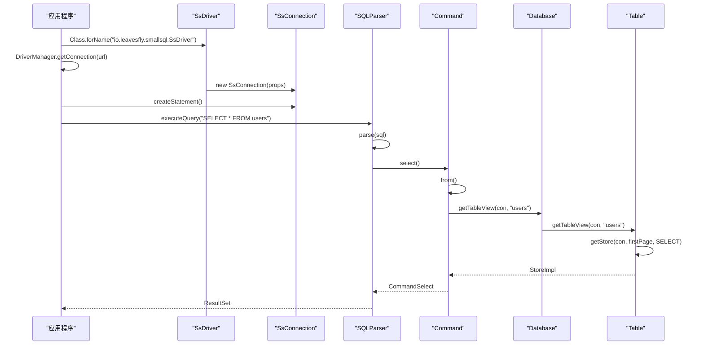

# 分层架构设计

<cite>
**本文档引用的文件**   
- [SsDriver.java](file://src/main/java/io/leavesfly/smallsql/SsDriver.java)
- [SQLParser.java](file://src/main/java/io/leavesfly/smallsql/rdb/sql/SQLParser.java)
- [Command.java](file://src/main/java/io/leavesfly/smallsql/rdb/command/Command.java)
- [Database.java](file://src/main/java/io/leavesfly/smallsql/rdb/engine/Database.java)
- [Table.java](file://src/main/java/io/leavesfly/smallsql/rdb/engine/Table.java)
- [SsConnection.java](file://src/main/java/io/leavesfly/smallsql/jdbc/SsConnection.java)
</cite>

## 目录
1. [引言](#引言)
2. [JDBC接口层](#jdbc接口层)
3. [SQL解析层](#sql解析层)
4. [命令执行层](#命令执行层)
5. [存储引擎层](#存储引擎层)
6. [分层架构图](#分层架构图)
7. [数据流与控制流分析](#数据流与控制流分析)
8. [设计原则与职责边界](#设计原则与职责边界)
9. [代码调用链示例](#代码调用链示例)
10. [结论](#结论)

## 引言
SmallSQL是一个轻量级的关系型数据库管理系统，采用分层架构设计，实现了从JDBC接口到存储引擎的完整数据处理流程。本技术文档深入分析其分层架构，详细描述从JDBC接口层到存储引擎层的数据流和控制流。文档重点阐述JDBC层如何与SQL解析层交互，SQLParser如何将SQL语句解析为Command对象，以及命令执行层如何将请求传递给存储引擎层。通过详细的架构图和代码调用链分析，全面展示各层之间的依赖关系和调用顺序，为理解SmallSQL的内部工作原理提供深入的技术参考。

## JDBC接口层
JDBC接口层是SmallSQL与外部应用程序交互的入口，实现了标准的JDBC 4.0接口规范。该层主要由SsDriver、SsConnection、SsStatement和SsResultSet等核心组件构成，为应用程序提供标准化的数据库访问接口。

SsDriver作为JDBC驱动程序的入口点，实现了java.sql.Driver接口，负责处理JDBC URL解析和驱动注册。驱动程序通过静态初始化块自动注册到DriverManager，确保应用程序可以通过标准的JDBC API进行连接。JDBC URL遵循"jdbc:smallsql:[database_path][?property=value...]"格式，驱动程序能够解析数据库路径和连接属性，为后续的连接建立提供必要的配置信息。

SsConnection类管理数据库连接，负责事务控制和连接状态管理。它作为JDBC层与下层组件的桥梁，将应用程序的请求传递给SQL解析层。连接对象维护了与特定数据库的会话状态，包括事务隔离级别、自动提交模式等属性。SsConnection还负责管理连接生命周期，处理连接的创建、使用和关闭过程。

SsStatement和SsPreparedStatement提供了SQL语句的执行接口，允许应用程序执行查询和更新操作。这些组件将SQL语句字符串传递给SQLParser进行解析，然后执行生成的命令对象。结果集处理由SsResultSet类负责，它封装了查询结果，提供标准的JDBC结果集访问方法。

该层的设计严格遵循JDBC规范，确保了与现有Java应用程序的兼容性。通过标准化接口，应用程序无需了解底层数据库实现细节，即可进行数据库操作。这种抽象层的设计提高了系统的可移植性和易用性，使SmallSQL能够无缝集成到各种Java应用环境中。

**Section sources**
- [SsDriver.java](file://src/main/java/io/leavesfly/smallsql/SsDriver.java#L52-L202)
- [SsConnection.java](file://src/main/java/io/leavesfly/smallsql/jdbc/SsConnection.java)

## SQL解析层
SQL解析层是SmallSQL的核心组件之一，负责将SQL语句字符串转换为可执行的命令对象。该层的核心是SQLParser类，它实现了完整的SQL语法分析器，能够处理各种SQL语句，包括DDL、DML和DQL操作。

SQLParser采用递归下降解析技术，将SQL语句分解为语法树结构。解析过程从词法分析开始，通过SQLTokenizer将SQL语句分解为标记序列，然后进行语法分析。解析器根据SQL语句的第一个关键字（如SELECT、INSERT、UPDATE等）确定语句类型，并调用相应的解析方法。例如，当遇到SELECT关键字时，调用select()方法处理查询语句；遇到INSERT关键字时，调用insert()方法处理插入语句。

解析器维护了当前处理的SQL语句字符数组、标记列表和当前处理的标记索引。它提供了丰富的解析方法，包括expression()用于解析表达式，from()用于解析FROM子句，where()用于解析WHERE子句等。这些方法协同工作，逐步构建出完整的命令对象。对于复杂的SQL语句，如包含JOIN、子查询或聚合函数的查询，解析器能够正确处理语法结构，生成相应的命令对象。

SQLParser的parse()方法是主要的入口点，接受SsConnection和SQL语句字符串作为参数，返回解析后的Command对象。该方法首先初始化解析状态，然后根据SQL语句的第一个关键字分发到相应的解析方法。解析完成后，会检查是否还有未处理的标记，确保整个SQL语句被完全解析。如果发现语法错误，解析器会生成详细的错误消息，包括错误位置和上下文信息，帮助用户定位问题。

该层的设计体现了单一职责原则，将SQL解析逻辑集中在一个类中，提高了代码的可维护性和可测试性。通过将SQL语句转换为命令对象，实现了语法与执行的分离，为上层提供了统一的接口。

**Section sources**
- [SQLParser.java](file://src/main/java/io/leavesfly/smallsql/rdb/sql/SQLParser.java#L137-L2527)

## 命令执行层
命令执行层位于SQL解析层和存储引擎层之间，负责执行由SQLParser生成的命令对象。该层的核心是Command抽象类及其具体实现，如CommandSelect、CommandInsert、CommandUpdate等，它们封装了各种SQL操作的执行逻辑。

Command类定义了命令执行的通用接口和基础功能。它包含execute()方法，该方法实现了命令执行的模板模式：首先保存当前保存点，然后调用具体的executeImpl()方法执行命令，如果发生异常则回滚到保存点，最后在自动提交模式下提交事务。这种设计确保了事务的原子性，即使在执行过程中发生错误，也能保持数据库的一致性状态。

具体的命令类继承Command类并实现executeImpl()方法。例如，CommandSelect负责执行SELECT语句，CommandInsert负责执行INSERT语句。这些命令对象包含了执行所需的所有信息，如列表达式、参数值、表名等。命令对象通过addColumnExpression()方法添加列表达式，通过addParameter()方法添加参数，形成完整的执行计划。

命令执行层与存储引擎层通过SsConnection进行交互。当执行命令时，命令对象会调用SsConnection的方法获取数据库实例，然后通过Database对象访问具体的表和索引。这种设计实现了命令执行与数据存储的解耦，使命令逻辑不依赖于具体的存储实现。

该层还负责参数验证和结果管理。verifyParams()方法检查所有参数是否已设置，确保预编译语句的正确执行。getQueryResult()方法返回查询结果集，getUpdateCount()方法返回更新计数。这些功能为上层提供了统一的结果访问接口，简化了应用程序的开发。

**Section sources**
- [Command.java](file://src/main/java/io/leavesfly/smallsql/rdb/command/Command.java#L47-L190)

## 存储引擎层
存储引擎层是SmallSQL的核心数据管理组件，负责数据的持久化存储和访问。该层主要包括Database、Table、Index等核心类，实现了数据库的物理存储结构和数据访问机制。

Database类是数据库实例的管理器，维护了数据库中所有表和视图的映射关系。它通过静态的HashMap管理多个数据库实例的共享，确保同一数据库在多个连接间共享同一个实例。Database类提供了getTableView()方法，根据表名获取对应的View对象，实现了表的懒加载机制。当表首次被访问时，才从磁盘加载其定义和数据，提高了系统性能。

Table类代表数据库中的表，继承自View类。它管理表的数据存储和索引结构，通过FileChannel直接操作磁盘文件。Table类实现了页式存储管理，将数据组织为固定大小的页面，提高了I/O效率。它还负责行级锁定和页级锁定，支持并发访问控制。Table类通过requestLock()方法获取页面锁，确保数据的一致性和完整性。

存储引擎层实现了基于文件通道的高效I/O操作，使用内存映射技术提高数据访问速度。数据存储采用页式结构，每个页面包含固定数量的记录，支持快速定位和读取。索引实现基于B+树结构，提供快速的数据检索能力。外键约束通过ForeignKeys类管理，确保数据的引用完整性。

该层还实现了事务支持和并发控制。通过锁管理机制，支持表级锁、行级锁和页级锁，满足不同粒度的并发需求。事务日志和恢复机制确保了ACID属性，即使在系统崩溃的情况下也能保证数据的一致性。

**Section sources**
- [Database.java](file://src/main/java/io/leavesfly/smallsql/rdb/engine/Database.java#L61-L564)
- [Table.java](file://src/main/java/io/leavesfly/smallsql/rdb/engine/Table.java#L59-L607)

## 分层架构图
```mermaid
graph TD
subgraph "JDBC接口层"
A[SsDriver] --> B[SsConnection]
B --> C[SsStatement]
C --> D[SsResultSet]
end
subgraph "SQL解析层"
E[SQLParser]
end
subgraph "命令执行层"
F[Command]
G[CommandSelect]
H[CommandInsert]
I[CommandUpdate]
J[CommandDelete]
end
subgraph "存储引擎层"
K[Database]
L[Table]
M[Index]
N[View]
end
A --> |Class.forName()| B
B --> |getConnection()| E
E --> |parse()| F
F --> |execute()| K
K --> |getTable()| L
L --> |getIndex()| M
G --> |setSource()| N
H --> |addColumnExpression()| F
I --> |addSetting()| F
J --> |from()| F
style A fill:#f9f,stroke:#333
style B fill:#f9f,stroke:#333
style C fill:#f9f,stroke:#333
style D fill:#f9f,stroke:#333
style E fill:#bbf,stroke:#333
style F fill:#ff9,stroke:#333
style G fill:#ff9,stroke:#333
style H fill:#ff9,stroke:#333
style I fill:#ff9,stroke:#333
style J fill:#ff9,stroke:#333
style K fill:#9f9,stroke:#333
style L fill:#9f9,stroke:#333
style M fill:#9f9,stroke:#333
style N fill:#9f9,stroke:#333
```

**Diagram sources**
- [SsDriver.java](file://src/main/java/io/leavesfly/smallsql/SsDriver.java#L52-L202)
- [SQLParser.java](file://src/main/java/io/leavesfly/smallsql/rdb/sql/SQLParser.java#L137-L2527)
- [Command.java](file://src/main/java/io/leavesfly/smallsql/rdb/command/Command.java#L47-L190)
- [Database.java](file://src/main/java/io/leavesfly/smallsql/rdb/engine/Database.java#L61-L564)
- [Table.java](file://src/main/java/io/leavesfly/smallsql/rdb/engine/Table.java#L59-L607)

## 数据流与控制流分析
SmallSQL的数据流和控制流从JDBC接口层开始，经过SQL解析层、命令执行层，最终到达存储引擎层。这个过程体现了清晰的分层架构和职责分离。

数据流始于应用程序调用JDBC API，如Class.forName()加载驱动程序，DriverManager.getConnection()建立数据库连接。连接建立后，应用程序通过SsStatement执行SQL语句。SQL语句字符串作为数据输入，从JDBC层传递到SQL解析层。SQLParser接收SQL语句，通过词法分析和语法分析，将其转换为命令对象。这个过程中，SQL语句被分解为语法树结构，生成相应的Command实例。

控制流在命令执行阶段体现得最为明显。当调用Command的execute()方法时，控制权从命令执行层转移到存储引擎层。execute()方法采用模板模式，首先保存当前事务状态，然后调用具体的executeImpl()方法。对于查询操作，控制流会调用Database的getTableView()方法获取表实例，然后通过Table的getStore()方法获取数据存储，最终返回结果集。对于更新操作，控制流会获取相应的锁，修改数据，然后提交事务。

在存储引擎层，数据流表现为从磁盘文件到内存的数据传输。Table类通过FileChannel读取和写入数据页面，Index类维护索引结构以加速数据访问。结果数据从存储引擎层返回，经过命令执行层的封装，最终通过SsResultSet返回给应用程序。

整个数据流和控制流的设计体现了单一职责原则和关注点分离。每层只负责特定的功能，通过明确定义的接口进行交互。这种设计提高了系统的可维护性和可扩展性，使各层可以独立演化和优化。

**Section sources**
- [SsDriver.java](file://src/main/java/io/leavesfly/smallsql/SsDriver.java#L52-L202)
- [SQLParser.java](file://src/main/java/io/leavesfly/smallsql/rdb/sql/SQLParser.java#L137-L2527)
- [Command.java](file://src/main/java/io/leavesfly/smallsql/rdb/command/Command.java#L47-L190)

## 设计原则与职责边界
SmallSQL的分层架构体现了多个重要的设计原则和清晰的职责边界。各层之间通过明确定义的接口进行交互，实现了高内聚、低耦合的设计目标。

JDBC接口层遵循标准化原则，严格实现JDBC 4.0规范。其职责是提供与外部应用程序的兼容接口，隐藏底层数据库实现细节。这一层不涉及具体的SQL解析或数据存储逻辑，只负责将应用程序的请求传递给下层，并将结果返回给应用程序。

SQL解析层体现了语法与执行分离的原则。其核心职责是将SQL语句字符串转换为命令对象，不涉及命令的执行或数据的访问。通过将SQL语法分析集中在一个组件中，提高了代码的可维护性和可测试性。解析器的设计遵循单一职责原则，每个方法只负责解析SQL语句的特定部分。

命令执行层采用命令模式，将操作封装为对象。其职责是执行由SQLParser生成的命令，管理执行过程中的事务和错误处理。这一层不直接操作数据文件，而是通过存储引擎层的接口访问数据。这种设计实现了执行逻辑与存储实现的解耦，使命令执行不依赖于具体的存储格式。

存储引擎层遵循数据抽象原则，提供统一的数据访问接口。其职责是管理数据的持久化存储，包括数据的读取、写入、索引和并发控制。这一层直接操作磁盘文件，实现高效的I/O操作和数据管理。通过封装物理存储细节，为上层提供逻辑数据视图。

各层之间的依赖关系是单向的，上层可以调用下层，但下层不能调用上层。这种依赖方向确保了架构的稳定性，使各层可以独立开发和测试。接口设计简洁明了，只暴露必要的方法，隐藏实现细节，提高了系统的可维护性和可扩展性。

**Section sources**
- [SsDriver.java](file://src/main/java/io/leavesfly/smallsql/SsDriver.java#L52-L202)
- [SQLParser.java](file://src/main/java/io/leavesfly/smallsql/rdb/sql/SQLParser.java#L137-L2527)
- [Command.java](file://src/main/java/io/leavesfly/smallsql/rdb/command/Command.java#L47-L190)

## 代码调用链示例
以下是一个典型的代码调用链示例，展示了从应用程序调用到存储引擎执行的完整过程：



这个调用链从Class.forName()开始，加载SsDriver类并自动注册到DriverManager。然后通过DriverManager.getConnection()创建SsConnection实例，建立数据库连接。应用程序获取Statement对象后，调用executeQuery()执行SQL查询。

控制流转移到SQLParser的parse()方法，解析SQL语句并创建CommandSelect对象。在from()方法中，通过Database的getTableView()获取表实例。Table类的getStore()方法获取数据存储，准备读取数据。最终，命令对象返回给解析器，结果集返回给应用程序。

这个调用链示例清晰地展示了各层之间的交互和数据流动。每个步骤都有明确的职责，通过接口进行通信，体现了分层架构的优势。异常处理贯穿整个调用链，确保任何环节的错误都能被正确捕获和处理。

**Diagram sources**
- [SsDriver.java](file://src/main/java/io/leavesfly/smallsql/SsDriver.java#L52-L202)
- [SQLParser.java](file://src/main/java/io/leavesfly/smallsql/rdb/sql/SQLParser.java#L137-L2527)
- [Command.java](file://src/main/java/io/leavesfly/smallsql/rdb/command/Command.java#L47-L190)

## 结论
SmallSQL的分层架构设计体现了良好的软件工程实践，通过清晰的层次划分和职责分离，实现了高内聚、低耦合的系统结构。从JDBC接口层到存储引擎层，每层都有明确的职责边界和设计原则，通过标准化接口进行交互。

JDBC接口层提供了与外部应用程序的兼容接口，隐藏了底层实现细节。SQL解析层将SQL语句转换为命令对象，实现了语法与执行的分离。命令执行层封装了各种SQL操作的执行逻辑，管理事务和错误处理。存储引擎层负责数据的持久化存储和访问，实现了高效的I/O操作和数据管理。

这种分层架构不仅提高了系统的可维护性和可扩展性，还增强了代码的可测试性。各层可以独立开发和测试，降低了系统的复杂性。通过明确定义的接口，实现了关注点分离，使开发人员可以专注于特定层的实现。

总体而言，SmallSQL的架构设计平衡了性能、可维护性和易用性，为轻量级数据库系统提供了一个优秀的参考实现。其清晰的分层结构和良好的设计原则，使其成为一个易于理解和扩展的数据库引擎。