# DDL命令系统

<cite>
**本文档中引用的文件**  
- [CommandCreateDatabase.java](file://src/main/java/io/leavesfly/smallsql/rdb/command/ddl/CommandCreateDatabase.java)
- [CommandCreateView.java](file://src/main/java/io/leavesfly/smallsql/rdb/command/ddl/CommandCreateView.java)
- [CommandDrop.java](file://src/main/java/io/leavesfly/smallsql/rdb/command/ddl/CommandDrop.java)
- [CommandTable.java](file://src/main/java/io/leavesfly/smallsql/rdb/command/ddl/CommandTable.java)
- [CommandSet.java](file://src/main/java/io/leavesfly/smallsql/rdb/command/ddl/CommandSet.java)
- [SQLParser.java](file://src/main/java/io/leavesfly/smallsql/rdb/sql/SQLParser.java)
- [Database.java](file://src/main/java/io/leavesfly/smallsql/rdb/engine/Database.java)
- [Table.java](file://src/main/java/io/leavesfly/smallsql/rdb/engine/Table.java)
</cite>

## 目录
1. [简介](#简介)
2. [DDL命令系统架构](#ddl命令系统架构)
3. [核心DDL命令实现机制](#核心ddl命令实现机制)
4. [SQL解析与命令生成](#sql解析与命令生成)
5. [元数据持久化流程](#元数据持久化流程)
6. [异常处理机制](#异常处理机制)
7. [调用序列图](#调用序列图)
8. [总结](#总结)

## 简介
DDL（数据定义语言）命令子系统是SmallSQL数据库管理系统的核心组件之一，负责数据库对象的创建、修改和删除操作。本系统实现了CREATE、DROP、ALTER等关键DDL操作，通过与Database和Table组件的协同工作，完成元数据的持久化存储。该子系统设计遵循面向对象原则，采用命令模式封装各类DDL操作，确保了系统的可扩展性和维护性。

**Section sources**
- [CommandCreateDatabase.java](file://src/main/java/io/leavesfly/smallsql/rdb/command/ddl/CommandCreateDatabase.java#L1-L67)
- [CommandCreateView.java](file://src/main/java/io/leavesfly/smallsql/rdb/command/ddl/CommandCreateView.java#L1-L68)
- [CommandDrop.java](file://src/main/java/io/leavesfly/smallsql/rdb/command/ddl/CommandDrop.java#L1-L84)

## DDL命令系统架构
DDL命令系统采用分层架构设计，主要包括命令解析层、命令执行层和存储管理层。命令解析层由SQLParser负责，将SQL语句解析为具体的命令对象；命令执行层由各类Command类实现，封装了具体的业务逻辑；存储管理层由Database和Table类构成，负责元数据的持久化和物理存储管理。

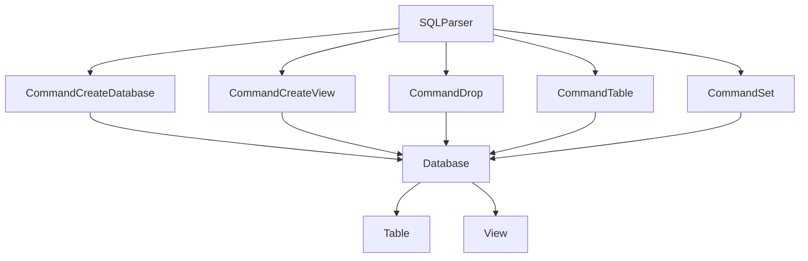

**Diagram sources**
- [SQLParser.java](file://src/main/java/io/leavesfly/smallsql/rdb/sql/SQLParser.java#L1-L2528)
- [CommandCreateDatabase.java](file://src/main/java/io/leavesfly/smallsql/rdb/command/ddl/CommandCreateDatabase.java#L1-L67)
- [CommandCreateView.java](file://src/main/java/io/leavesfly/smallsql/rdb/command/ddl/CommandCreateView.java#L1-L68)
- [CommandDrop.java](file://src/main/java/io/leavesfly/smallsql/rdb/command/ddl/CommandDrop.java#L1-L84)
- [CommandTable.java](file://src/main/java/io/leavesfly/smallsql/rdb/command/ddl/CommandTable.java#L1-L155)
- [CommandSet.java](file://src/main/java/io/leavesfly/smallsql/rdb/command/ddl/CommandSet.java#L1-L61)
- [Database.java](file://src/main/java/io/leavesfly/smallsql/rdb/engine/Database.java#L1-L564)
- [Table.java](file://src/main/java/io/leavesfly/smallsql/rdb/engine/Table.java#L1-L608)

**Section sources**
- [SQLParser.java](file://src/main/java/io/leavesfly/smallsql/rdb/sql/SQLParser.java#L1-L2528)
- [Database.java](file://src/main/java/io/leavesfly/smallsql/rdb/engine/Database.java#L1-L564)

## 核心DDL命令实现机制

### CommandCreateDatabase实现机制
CommandCreateDatabase类负责创建数据库元数据并初始化存储结构。当执行CREATE DATABASE命令时，系统首先检查连接是否为只读模式，若为只读则抛出异常。随后创建指定名称的目录，并在该目录下创建主文件（MASTER_FILENAME），若文件已存在则抛出"数据库已存在"异常。

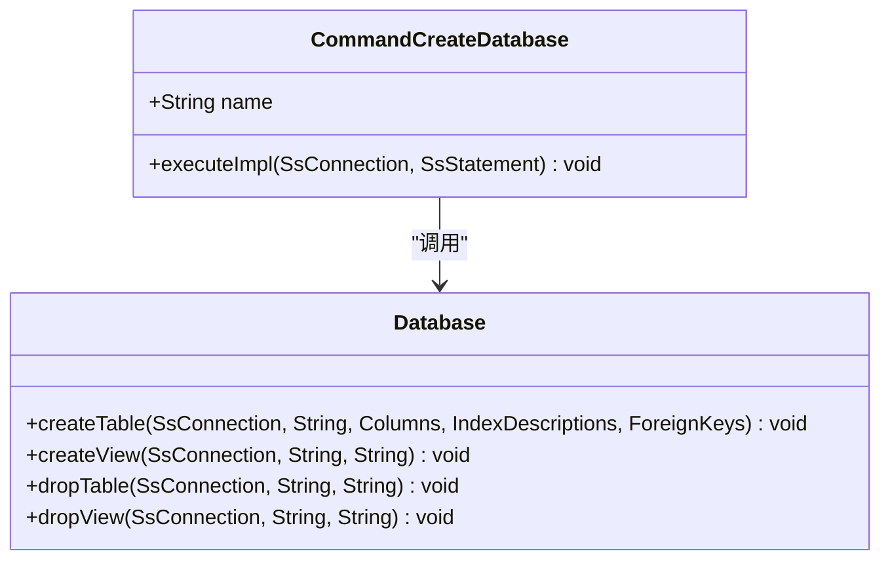

**Diagram sources**
- [CommandCreateDatabase.java](file://src/main/java/io/leavesfly/smallsql/rdb/command/ddl/CommandCreateDatabase.java#L1-L67)
- [Database.java](file://src/main/java/io/leavesfly/smallsql/rdb/engine/Database.java#L1-L564)

**Section sources**
- [CommandCreateDatabase.java](file://src/main/java/io/leavesfly/smallsql/rdb/command/ddl/CommandCreateDatabase.java#L1-L67)

### CommandCreateView实现机制
CommandCreateView类处理视图定义与依赖关系。系统通过addColumn方法添加列定义，这些方法在SQL解析过程中被调用。executeImpl方法通过调用Database的createView方法完成视图创建，将视图定义的SQL语句存储在元数据中。

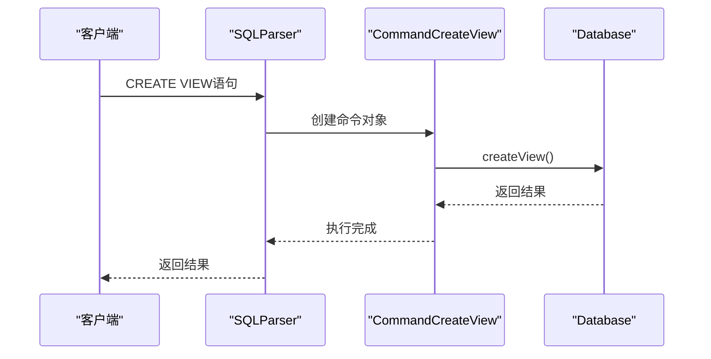

**Diagram sources**
- [CommandCreateView.java](file://src/main/java/io/leavesfly/smallsql/rdb/command/ddl/CommandCreateView.java#L1-L68)
- [Database.java](file://src/main/java/io/leavesfly/smallsql/rdb/engine/Database.java#L1-L564)
- [SQLParser.java](file://src/main/java/io/leavesfly/smallsql/rdb/sql/SQLParser.java#L1-L2528)

**Section sources**
- [CommandCreateView.java](file://src/main/java/io/leavesfly/smallsql/rdb/command/ddl/CommandCreateView.java#L1-L68)

### CommandDrop实现机制
CommandDrop类负责表、视图等对象的删除逻辑及级联处理。根据删除对象类型（DATABASE、TABLE、VIEW等）执行不同的删除策略。删除数据库时会递归删除目录下所有文件；删除表或视图时调用Database的静态方法进行处理。

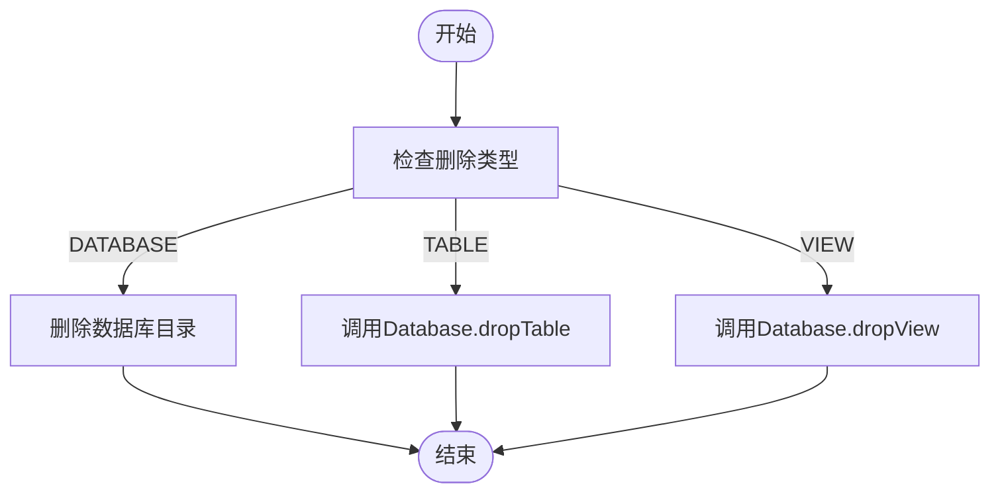

**Diagram sources**
- [CommandDrop.java](file://src/main/java/io/leavesfly/smallsql/rdb/command/ddl/CommandDrop.java#L1-L84)
- [Database.java](file://src/main/java/io/leavesfly/smallsql/rdb/engine/Database.java#L1-L564)

**Section sources**
- [CommandDrop.java](file://src/main/java/io/leavesfly/smallsql/rdb/command/ddl/CommandDrop.java#L1-L84)

### CommandTable实现机制
CommandTable类在ALTER TABLE操作中处理列结构变更与约束管理。对于ADD操作，系统创建临时表，复制数据后替换原表，确保数据完整性。addColumn方法用于添加列定义，在SQL解析过程中被调用。

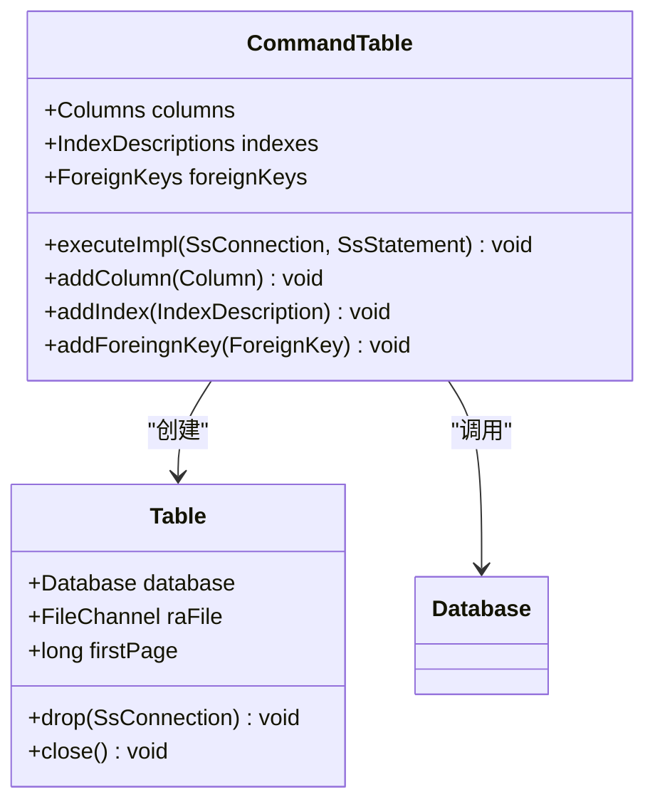

**Diagram sources**
- [CommandTable.java](file://src/main/java/io/leavesfly/smallsql/rdb/command/ddl/CommandTable.java#L1-L155)
- [Table.java](file://src/main/java/io/leavesfly/smallsql/rdb/engine/Table.java#L1-L608)
- [Database.java](file://src/main/java/io/leavesfly/smallsql/rdb/engine/Database.java#L1-L564)

**Section sources**
- [CommandTable.java](file://src/main/java/io/leavesfly/smallsql/rdb/command/ddl/CommandTable.java#L1-L155)

### CommandSet实现机制
CommandSet类负责数据库配置参数的动态调整。支持设置事务隔离级别和当前数据库目录，通过executeImpl方法中的switch语句分发不同类型的设置操作。

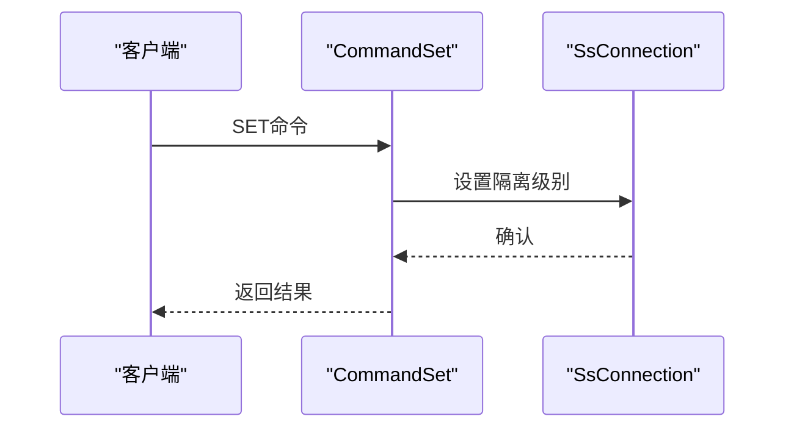

**Diagram sources**
- [CommandSet.java](file://src/main/java/io/leavesfly/smallsql/rdb/command/ddl/CommandSet.java#L1-L61)
- [SsConnection.java](file://src/main/java/io/leavesfly/smallsql/jdbc/SsConnection.java#L1-L100)

**Section sources**
- [CommandSet.java](file://src/main/java/io/leavesfly/smallsql/rdb/command/ddl/CommandSet.java#L1-L61)

## SQL解析与命令生成
SQLParser类负责将SQL语句解析为命令对象。通过parse方法分析SQL语句的第一个关键字，调用相应的创建方法生成具体的命令对象。例如，遇到CREATE关键字时调用create方法，根据后续关键字进一步分发到createDatabase、createTable等具体方法。

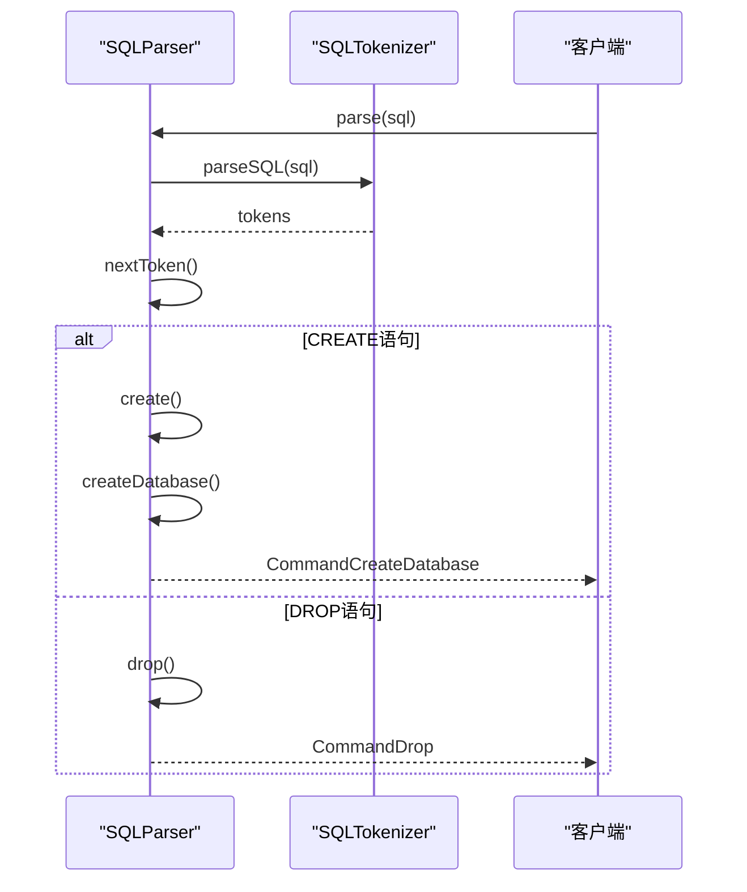

**Diagram sources**
- [SQLParser.java](file://src/main/java/io/leavesfly/smallsql/rdb/sql/SQLParser.java#L1-L2528)
- [SQLTokenizer.java](file://src/main/java/io/leavesfly/smallsql/rdb/sql/parser/SQLTokenizer.java#L1-L100)

**Section sources**
- [SQLParser.java](file://src/main/java/io/leavesfly/smallsql/rdb/sql/SQLParser.java#L1-L2528)

## 元数据持久化流程
DDL命令通过execute()方法调用Database和Table组件完成元数据持久化。整个流程包括：SQL解析生成命令对象、执行命令、调用底层存储组件、写入元数据文件等步骤。Database类作为核心管理组件，协调表、视图等对象的生命周期管理。

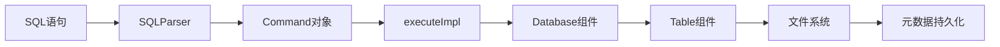

**Diagram sources**
- [SQLParser.java](file://src/main/java/io/leavesfly/smallsql/rdb/sql/SQLParser.java#L1-L2528)
- [Command.java](file://src/main/java/io/leavesfly/smallsql/rdb/command/Command.java#L1-L50)
- [Database.java](file://src/main/java/io/leavesfly/smallsql/rdb/engine/Database.java#L1-L564)
- [Table.java](file://src/main/java/io/leavesfly/smallsql/rdb/engine/Table.java#L1-L608)

**Section sources**
- [SQLParser.java](file://src/main/java/io/leavesfly/smallsql/rdb/sql/SQLParser.java#L1-L2528)
- [Database.java](file://src/main/java/io/leavesfly/smallsql/rdb/engine/Database.java#L1-L564)

## 异常处理机制
系统实现了完善的异常处理机制，针对对象已存在、依赖未解除等常见问题提供明确的错误信息。例如，创建已存在的数据库时抛出DB_EXISTENT异常，删除被引用的表时检查外键约束。所有异常通过SmallSQLException统一处理，确保错误信息的一致性和可读性。

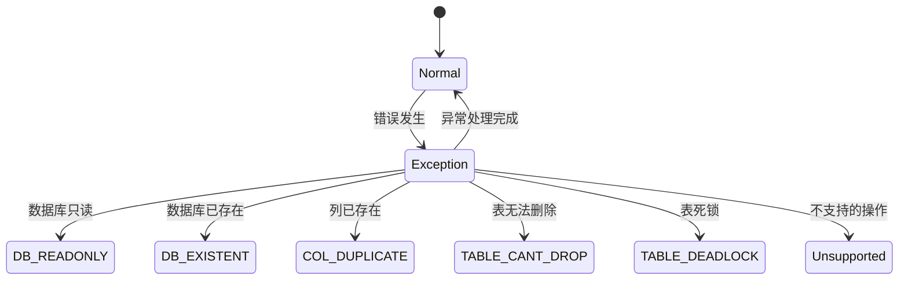

**Diagram sources**
- [SmallSQLException.java](file://src/main/java/io/leavesfly/smallsql/jdbc/SmallSQLException.java#L1-L50)
- [Language.java](file://src/main/java/io/leavesfly/smallsql/lang/Language.java#L1-L100)
- [CommandCreateDatabase.java](file://src/main/java/io/leavesfly/smallsql/rdb/command/ddl/CommandCreateDatabase.java#L1-L67)
- [CommandTable.java](file://src/main/java/io/leavesfly/smallsql/rdb/command/ddl/CommandTable.java#L1-L155)

**Section sources**
- [SmallSQLException.java](file://src/main/java/io/leavesfly/smallsql/jdbc/SmallSQLException.java#L1-L50)
- [Language.java](file://src/main/java/io/leavesfly/smallsql/lang/Language.java#L1-L100)

## 调用序列图

### CREATE DATABASE调用序列
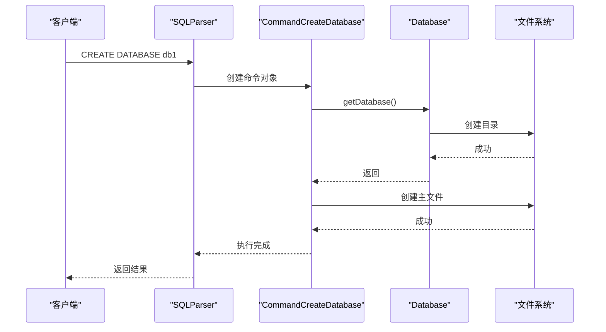

**Diagram sources**
- [SQLParser.java](file://src/main/java/io/leavesfly/smallsql/rdb/sql/SQLParser.java#L1-L2528)
- [CommandCreateDatabase.java](file://src/main/java/io/leavesfly/smallsql/rdb/command/ddl/CommandCreateDatabase.java#L1-L67)
- [Database.java](file://src/main/java/io/leavesfly/smallsql/rdb/engine/Database.java#L1-L564)

### DROP TABLE调用序列
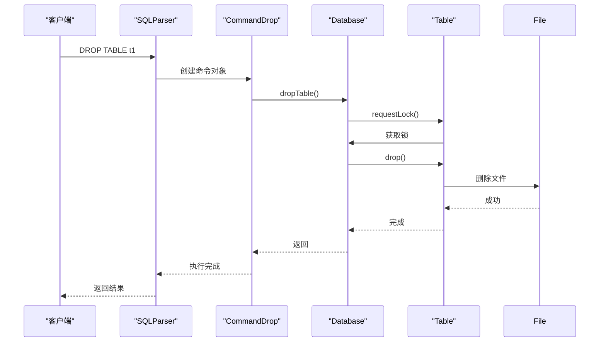

**Diagram sources**
- [SQLParser.java](file://src/main/java/io/leavesfly/smallsql/rdb/sql/SQLParser.java#L1-L2528)
- [CommandDrop.java](file://src/main/java/io/leavesfly/smallsql/rdb/command/ddl/CommandDrop.java#L1-L84)
- [Database.java](file://src/main/java/io/leavesfly/smallsql/rdb/engine/Database.java#L1-L564)
- [Table.java](file://src/main/java/io/leavesfly/smallsql/rdb/engine/Table.java#L1-L608)

## 总结
DDL命令子系统通过清晰的分层架构和命令模式设计，实现了数据库对象的全生命周期管理。系统将SQL解析、命令执行和存储管理分离，提高了代码的可维护性和扩展性。通过Database和Table组件的协同工作，确保了元数据的一致性和完整性。异常处理机制完善，能够有效应对各种边界情况和错误场景。整个系统设计简洁高效，体现了良好的面向对象设计原则。