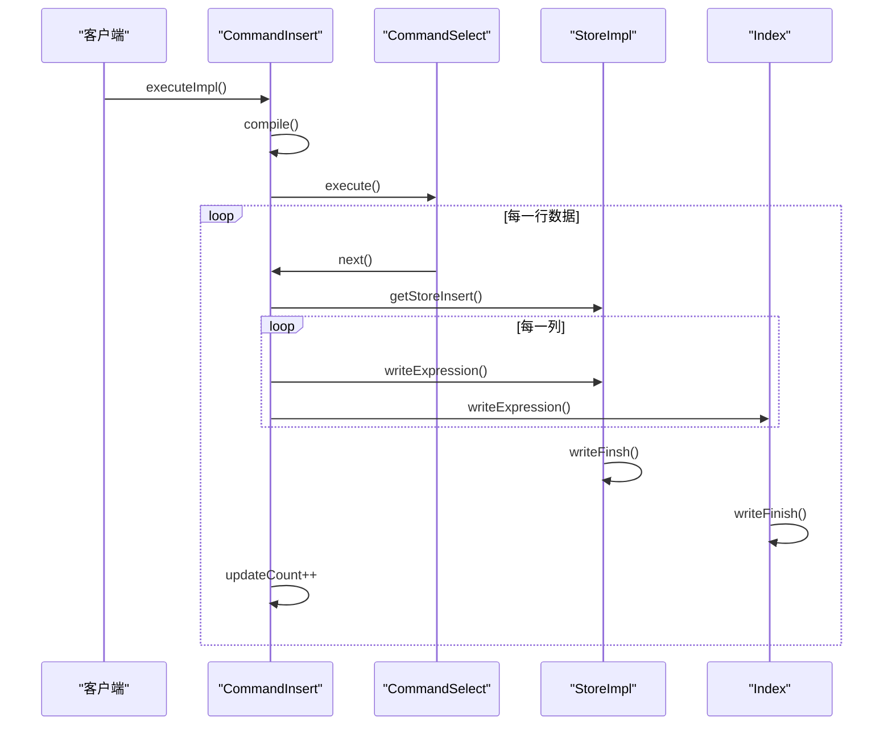
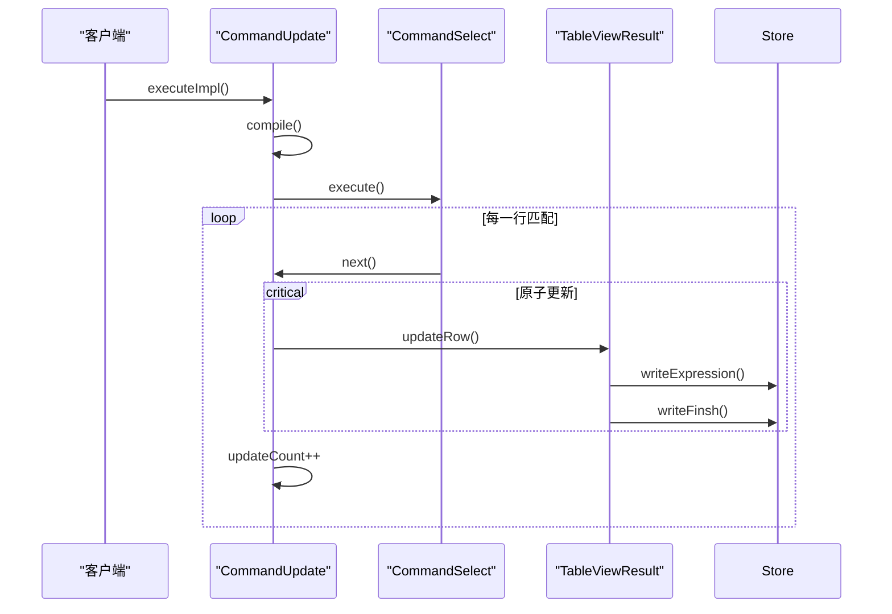
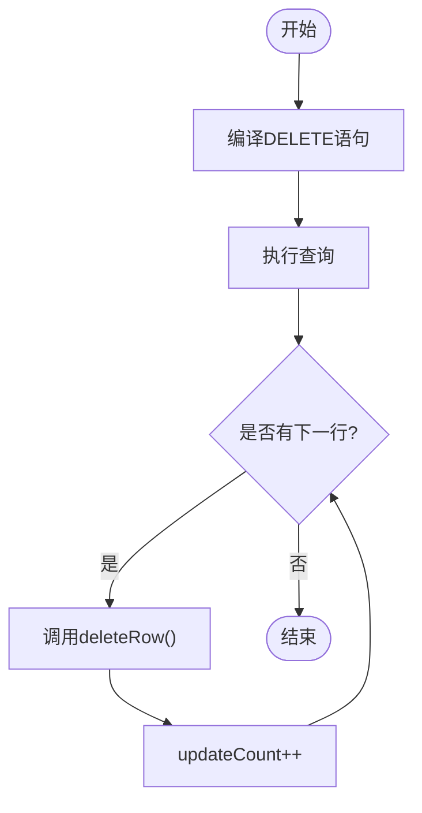
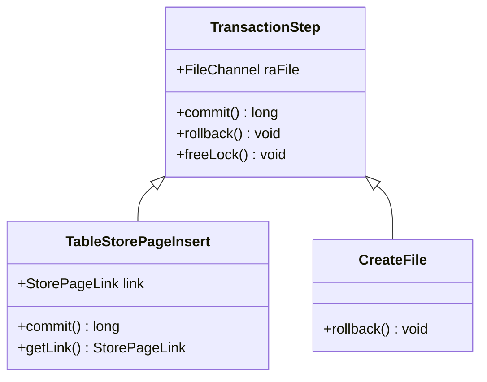
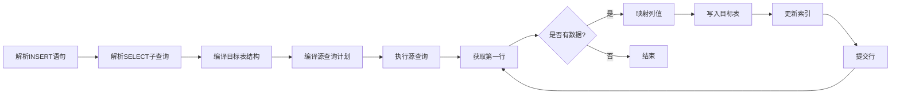
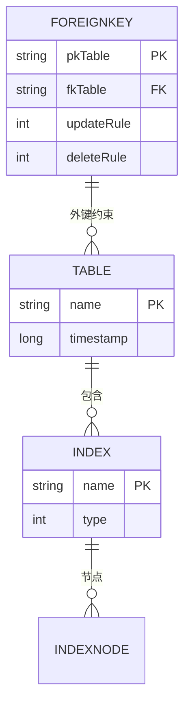

# DML命令系统

<cite>
**本文档引用的文件**  
- [CommandInsert.java](file://src/main/java/io/leavesfly/smallsql/rdb/command/dml/CommandInsert.java)
- [CommandUpdate.java](file://src/main/java/io/leavesfly/smallsql/rdb/command/dml/CommandUpdate.java)
- [CommandDelete.java](file://src/main/java/io/leavesfly/smallsql/rdb/command/dml/CommandDelete.java)
- [CommandSelect.java](file://src/main/java/io/leavesfly/smallsql/rdb/command/dql/CommandSelect.java)
- [TransactionStep.java](file://src/main/java/io/leavesfly/smallsql/rdb/engine/TransactionStep.java)
- [StoreImpl.java](file://src/main/java/io/leavesfly/smallsql/rdb/engine/store/StoreImpl.java)
- [TableViewResult.java](file://src/main/java/io/leavesfly/smallsql/rdb/engine/selector/result/TableViewResult.java)
- [TableStorePageInsert.java](file://src/main/java/io/leavesfly/smallsql/rdb/engine/store/TableStorePageInsert.java)
- [View.java](file://src/main/java/io/leavesfly/smallsql/rdb/engine/View.java)
</cite>

## 目录
1. [DML命令执行流程概述](#dml命令执行流程概述)
2. [INSERT命令实现机制](#insert命令实现机制)
3. [UPDATE命令实现机制](#update命令实现机制)
4. [DELETE命令实现机制](#delete命令实现机制)
5. [事务支持与变更日志](#事务支持与变更日志)
6. [索引维护机制](#索引维护机制)
7. [INSERT INTO ... SELECT执行流程](#insert-into---select执行流程)
8. [批量操作性能优化](#批量操作性能优化)
9. [完整性约束检查](#完整性约束检查)

## DML命令执行流程概述

DML（数据操作语言）命令子系统由`CommandInsert`、`CommandUpdate`和`CommandDelete`三个核心类组成，它们均继承自`Command`基类并实现了`executeImpl`方法。所有DML操作都遵循编译-执行两阶段模型：首先通过`compile`方法解析SQL语句并建立与表结构的映射关系，然后在`executeImpl`中执行实际的数据操作。

这些命令通过`CommandSelect`的查询结果作为数据源，利用`TableViewResult`抽象类统一处理表和视图的操作接口。在执行过程中，系统通过`StoreImpl`类实现底层数据存储的读写操作，并通过`TransactionStep`机制记录变更以支持事务回滚。

**Section sources**
- [CommandInsert.java](file://src/main/java/io/leavesfly/smallsql/rdb/command/dml/CommandInsert.java#L1-L207)
- [CommandUpdate.java](file://src/main/java/io/leavesfly/smallsql/rdb/command/dml/CommandUpdate.java#L1-L116)
- [CommandDelete.java](file://src/main/java/io/leavesfly/smallsql/rdb/command/dml/CommandDelete.java#L1-L66)

## INSERT命令实现机制

`CommandInsert`类负责处理INSERT语句的执行，支持两种数据源：VALUES子句直接提供的值列表和SELECT子查询返回的结果集。当解析INSERT语句时，系统首先通过`addColumnExpression`方法收集目标列信息，并通过`addValues`方法设置数据源。

在编译阶段，`compile`方法建立目标表与插入数据之间的列映射矩阵`matrix`。如果INSERT语句未指定列名（`noColumns=true`），则按表中列的默认顺序进行映射；否则根据显式指定的列名查找对应位置。该矩阵将源数据的列索引映射到目标表的物理列位置。

执行阶段通过`executeImpl`方法实现，其核心流程如下：
1. 获取目标表的写入存储实例`StoreImpl`
2. 遍历源数据的每一行
3. 对于每一列，根据映射矩阵确定源表达式
4. 若目标列为NULL且有默认值，则使用默认值表达式
5. 调用`store.writeExpression`将值写入存储
6. 同步更新所有相关索引
7. 调用`writeFinsh`完成行写入



**Diagram sources**
- [CommandInsert.java](file://src/main/java/io/leavesfly/smallsql/rdb/command/dml/CommandInsert.java#L1-L207)
- [StoreImpl.java](file://src/main/java/io/leavesfly/smallsql/rdb/engine/store/StoreImpl.java#L1-L799)

**Section sources**
- [CommandInsert.java](file://src/main/java/io/leavesfly/smallsql/rdb/command/dml/CommandInsert.java#L1-L207)
- [StoreImpl.java](file://src/main/java/io/leavesfly/smallsql/rdb/engine/store/StoreImpl.java#L1-L799)

## UPDATE命令实现机制

`CommandUpdate`类继承自`CommandSelect`，复用其查询能力来定位需要更新的行。通过`addSetting`方法添加"列=值"的更新对，其中`dest`参数为目标列，`source`参数为更新表达式。

执行流程在`executeImpl`方法中实现：
1. 将更新表达式临时添加到`columnExpressions`中以便编译
2. 调用`compile`方法解析查询条件
3. 恢复`columnExpressions`原始状态，提取更新表达式数组`newRowSources`
4. 执行查询并获取结果集
5. 对每个匹配行，在同步块中调用`updateRow`方法进行更新

`updateRow`方法是更新操作的核心，它遍历所有参与查询的表，为每个表构建对应的更新值数组。系统检查目标列是否可写，并将更新表达式按表内列顺序排列。更新操作通过`TableViewResult.updateRow`方法委托给具体实现。



**Diagram sources**
- [CommandUpdate.java](file://src/main/java/io/leavesfly/smallsql/rdb/command/dml/CommandUpdate.java#L1-L116)
- [CommandSelect.java](file://src/main/java/io/leavesfly/smallsql/rdb/command/dql/CommandSelect.java#L1-L587)

**Section sources**
- [CommandUpdate.java](file://src/main/java/io/leavesfly/smallsql/rdb/command/dml/CommandUpdate.java#L1-L116)
- [CommandSelect.java](file://src/main/java/io/leavesfly/smallsql/rdb/command/dql/CommandSelect.java#L1-L587)

## DELETE命令实现机制

`CommandDelete`类通过继承`CommandSelect`来复用其行定位能力。其执行流程相对简单：
1. 调用`compile`方法解析DELETE语句的WHERE条件
2. 通过`TableViewResult.getTableViewResult`获取目标表的结果集
3. 执行查询并遍历所有匹配行
4. 对每一行调用`deleteRow`方法删除

删除操作的原子性由`TableViewResult.deleteRow`保证，该方法在内部处理行删除的底层细节。系统通过`updateCount`统计实际删除的行数。



**Diagram sources**
- [CommandDelete.java](file://src/main/java/io/leavesfly/smallsql/rdb/command/dml/CommandDelete.java#L1-L66)
- [CommandSelect.java](file://src/main/java/io/leavesfly/smallsql/rdb/command/dql/CommandSelect.java#L1-L587)

**Section sources**
- [CommandDelete.java](file://src/main/java/io/leavesfly/smallsql/rdb/command/dml/CommandDelete.java#L1-L66)

## 事务支持与变更日志

DML操作通过`TransactionStep`抽象类实现事务支持。每个数据变更操作都会创建相应的`TransactionStep`实例并注册到当前连接的事务管理器中。`TransactionStep`定义了`commit`和`rollback`两个抽象方法，分别用于提交和回滚变更。

在INSERT操作中，`TableStorePageInsert`类继承自`TableStorePage`并重写了`commit`方法，在提交时更新内部链接信息，确保未提交的页面可以被正确追踪。对于UPDATE和DELETE操作，系统在执行前创建保存点，若操作失败则回滚到该保存点。

事务管理的关键机制包括：
- 通过`SsConnection.getSavepoint()`创建保存点
- 在try-catch块中执行数据操作
- 异常发生时调用`con.rollback(savepoint)`回滚
- 自动提交模式下执行后立即调用`con.commit()`



**Diagram sources**
- [TransactionStep.java](file://src/main/java/io/leavesfly/smallsql/rdb/engine/TransactionStep.java#L1-L57)
- [TableStorePageInsert.java](file://src/main/java/io/leavesfly/smallsql/rdb/engine/store/TableStorePageInsert.java#L1-L75)

**Section sources**
- [TransactionStep.java](file://src/main/java/io/leavesfly/smallsql/rdb/engine/TransactionStep.java#L1-L57)
- [TableStorePageInsert.java](file://src/main/java/io/leavesfly/smallsql/rdb/engine/store/TableStorePageInsert.java#L1-L75)

## 索引维护机制

索引维护由`Index`和`IndexDescriptions`类协同完成。每当执行DML操作时，系统会遍历目标表的所有索引并同步更新。在INSERT操作中，`CommandInsert.executeImpl`方法在写入每列数据后立即调用`indexes.get(i).writeExpression`方法更新索引。

索引更新流程：
1. 在`StoreImpl.writeExpression`写入数据后
2. 遍历所有相关索引
3. 调用`Index.writeExpression`更新索引条目
4. 在行写入完成时调用`Index.writeFinish`提交索引变更

这种设计确保了数据与索引的一致性，避免了索引滞后或不一致的问题。系统通过`IndexNode`结构管理索引节点，并使用`FileIndexNode`实现持久化存储。

**Section sources**
- [CommandInsert.java](file://src/main/java/io/leavesfly/smallsql/rdb/command/dml/CommandInsert.java#L1-L207)
- [StoreImpl.java](file://src/main/java/io/leavesfly/smallsql/rdb/engine/store/StoreImpl.java#L1-L799)

## INSERT INTO ... SELECT执行流程

`INSERT INTO ... SELECT`语句的执行流程结合了查询和插入两个操作：
1. `CommandInsert.addValues(CommandSelect)`设置SELECT作为数据源
2. 编译阶段同时编译INSERT目标和SELECT源
3. 执行时先执行SELECT查询的`from.execute()`
4. 通过`cmdSel.next()`逐行获取源数据
5. 对每行数据调用`table.getStoreInsert()`获取写入器
6. 使用`writeExpression`将源列值写入目标表

关键衔接机制在于列映射矩阵`matrix`，它将SELECT结果集的列索引映射到目标表的物理列位置。当列名不匹配时，系统根据INSERT语句中指定的列顺序进行位置对应。



**Diagram sources**
- [CommandInsert.java](file://src/main/java/io/leavesfly/smallsql/rdb/command/dml/CommandInsert.java#L1-L207)
- [CommandSelect.java](file://src/main/java/io/leavesfly/smallsql/rdb/command/dql/CommandSelect.java#L1-L587)

**Section sources**
- [CommandInsert.java](file://src/main/java/io/leavesfly/smallsql/rdb/command/dml/CommandInsert.java#L1-L207)

## 批量操作性能优化

系统通过多种机制优化批量DML操作的性能：
1. **批量编译**：在执行前一次性完成所有语句的编译，避免重复解析
2. **连接复用**：在同一个连接中执行多个操作，减少连接开销
3. **存储优化**：`StoreImpl`类使用页面缓存机制，减少I/O操作
4. **批量提交**：支持手动控制事务边界，减少日志写入次数

对于大量数据插入，建议使用PreparedStatement配合批处理：
```java
PreparedStatement pstmt = connection.prepareStatement("INSERT INTO table VALUES(?)");
for (int i = 0; i < batchSize; i++) {
    pstmt.setObject(1, data[i]);
    pstmt.addBatch();
}
pstmt.executeBatch();
```

此外，系统通过`TableStorePageInsert`的链接机制优化插入性能，避免了未提交页面的定位开销。

**Section sources**
- [CommandInsert.java](file://src/main/java/io/leavesfly/smallsql/rdb/command/dml/CommandInsert.java#L1-L207)
- [StoreImpl.java](file://src/main/java/io/leavesfly/smallsql/rdb/engine/store/StoreImpl.java#L1-L799)

## 完整性约束检查

系统在DML操作中实施多层次的完整性检查：

### 主键冲突处理
当插入或更新操作导致主键冲突时，系统会抛出唯一性约束异常。主键由`IndexDescription`标记为`PRIMARY`或`UNIQUE`类型，通过索引查找检测重复值。

### 外键约束检查
外键约束由`ForeignKey`类表示，包含引用的主表和从表索引。在INSERT或UPDATE从表时，系统验证外键值在主表中存在；在DELETE主表行时，检查是否有从表引用。



**Diagram sources**
- [ForeignKey.java](file://src/main/java/io/leavesfly/smallsql/rdb/engine/table/ForeignKey.java#L1-L54)
- [Database.java](file://src/main/java/io/leavesfly/smallsql/rdb/engine/Database.java#L418-L459)

**Section sources**
- [ForeignKey.java](file://src/main/java/io/leavesfly/smallsql/rdb/engine/table/ForeignKey.java#L1-L54)
- [Database.java](file://src/main/java/io/leavesfly/smallsql/rdb/engine/Database.java#L418-L459)