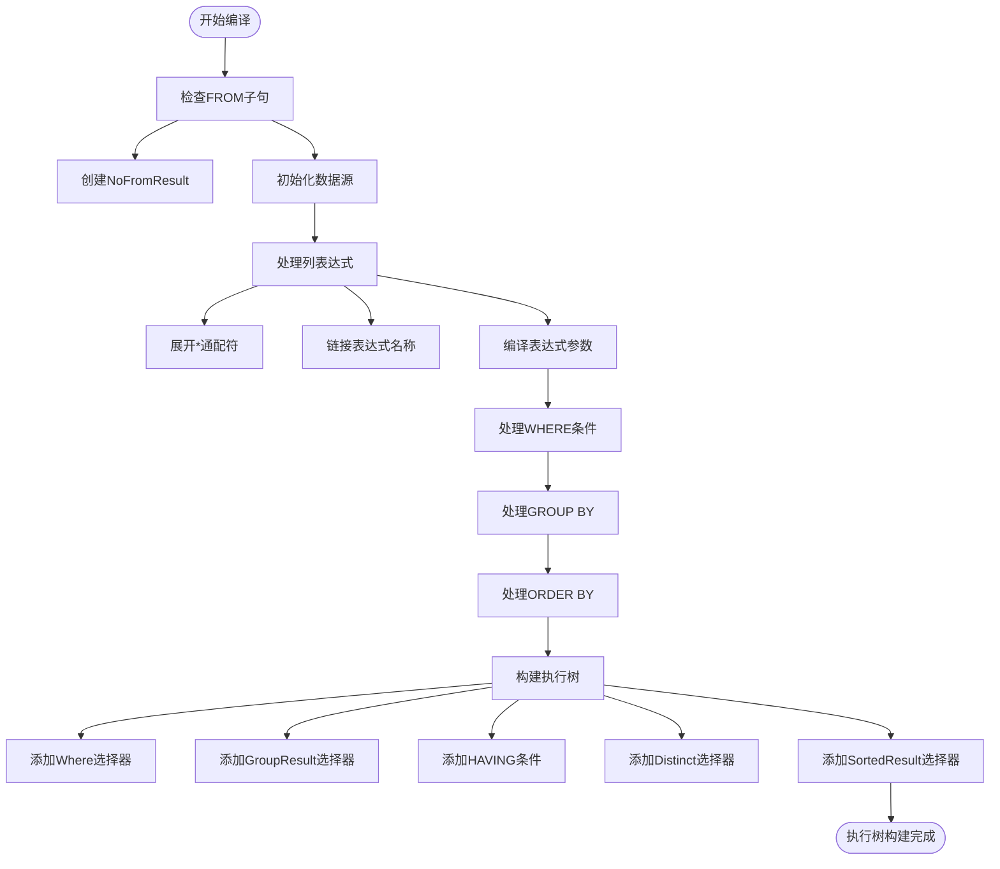
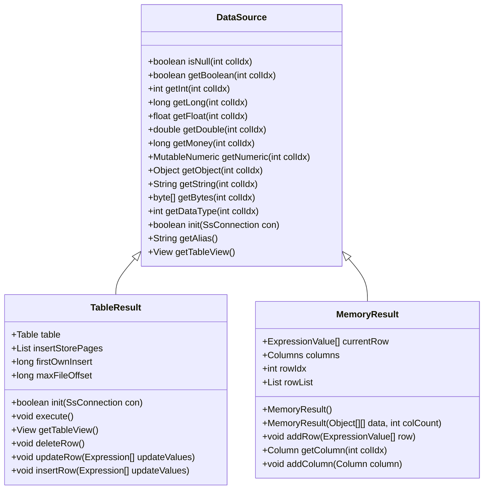
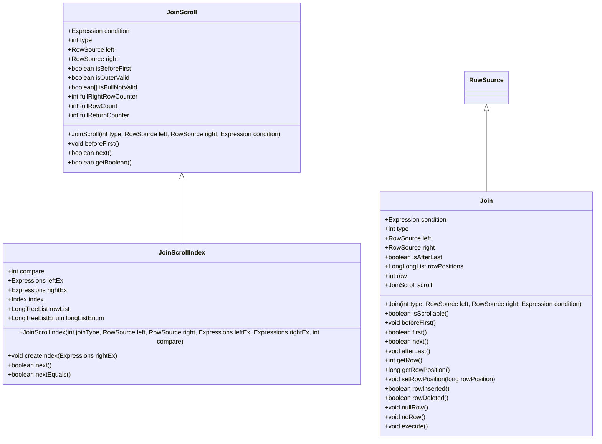
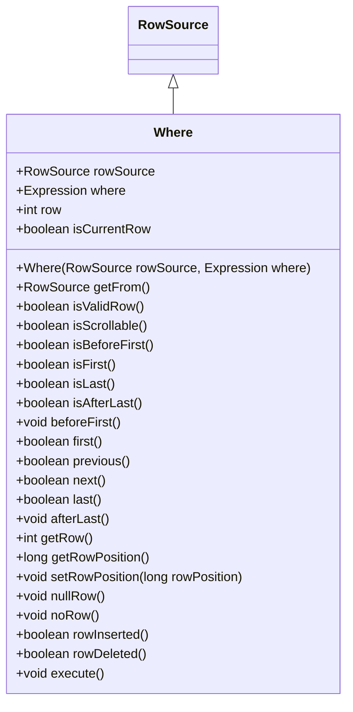
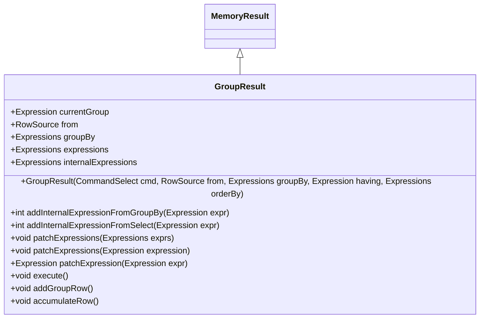
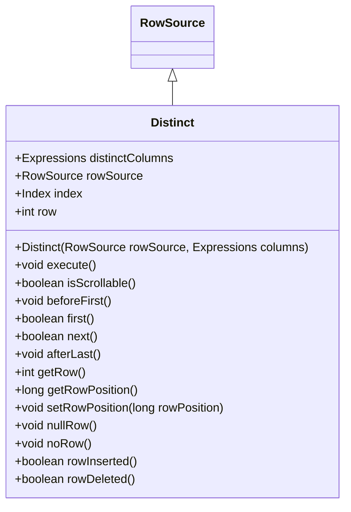
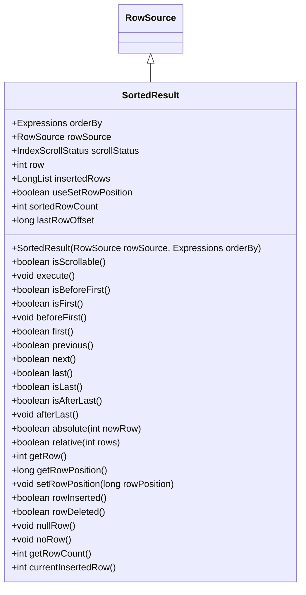
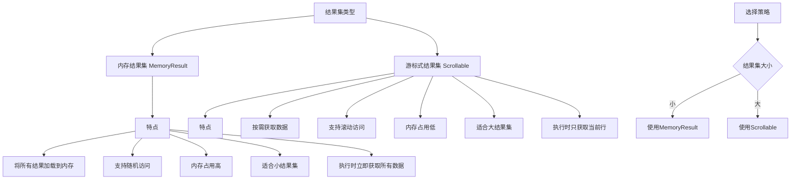
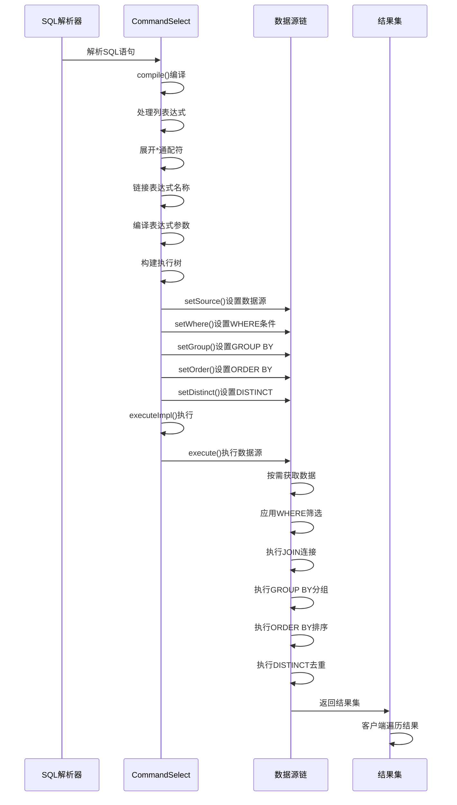
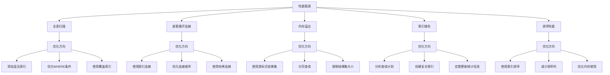

# DQL命令系统

<cite>
**本文档引用的文件**   
- [CommandSelect.java](file://src/main/java/io/leavesfly/smallsql/rdb/command/dql/CommandSelect.java)
- [DataSource.java](file://src/main/java/io/leavesfly/smallsql/rdb/engine/selector/DataSource.java)
- [TableResult.java](file://src/main/java/io/leavesfly/smallsql/rdb/engine/selector/result/TableResult.java)
- [MemoryResult.java](file://src/main/java/io/leavesfly/smallsql/rdb/engine/selector/result/MemoryResult.java)
- [Scrollable.java](file://src/main/java/io/leavesfly/smallsql/rdb/engine/selector/Scrollable.java)
- [Join.java](file://src/main/java/io/leavesfly/smallsql/rdb/engine/selector/multioper/Join.java)
- [Where.java](file://src/main/java/io/leavesfly/smallsql/rdb/engine/selector/multioper/Where.java)
- [GroupResult.java](file://src/main/java/io/leavesfly/smallsql/rdb/engine/selector/multioper/GroupResult.java)
- [Distinct.java](file://src/main/java/io/leavesfly/smallsql/rdb/engine/selector/multioper/Distinct.java)
- [SortedResult.java](file://src/main/java/io/leavesfly/smallsql/rdb/engine/selector/multioper/SortedResult.java)
</cite>

## 目录
1. [引言](#引言)
2. [核心组件](#核心组件)
3. [执行树构建流程](#执行树构建流程)
4. [数据源链构建](#数据源链构建)
5. [选择器组件分析](#选择器组件分析)
6. [结果集类型对比](#结果集类型对比)
7. [查询执行全流程](#查询执行全流程)
8. [复杂查询执行示例](#复杂查询执行示例)
9. [性能瓶颈与优化方向](#性能瓶颈与优化方向)

## 引言
本文档全面解析SmallSQL数据库系统中DQL（数据查询语言）命令的核心实现机制。重点阐述SELECT语句从解析到结果集生成的完整流程，包括查询计划转换、执行树构建、数据源链形成以及各种选择器组件的协同工作。文档详细说明了内存结果集与游标式结果集的区别与应用场景，并通过复杂查询示例分析性能瓶颈与优化方向。

## 核心组件

DQL命令系统的核心组件包括CommandSelect、DataSource、TableResult、MemoryResult、Scrollable以及各种选择器组件（Join、Where、GroupResult、Distinct、SortedResult）。这些组件共同协作，实现了SQL查询的解析、执行和结果返回。

**核心组件**
- [CommandSelect.java](file://src/main/java/io/leavesfly/smallsql/rdb/command/dql/CommandSelect.java#L1-L587)
- [DataSource.java](file://src/main/java/io/leavesfly/smallsql/rdb/engine/selector/DataSource.java#L1-L101)
- [TableResult.java](file://src/main/java/io/leavesfly/smallsql/rdb/engine/selector/result/TableResult.java#L1-L419)

## 执行树构建流程

CommandSelect类负责将解析后的查询计划转换为执行树。执行树的构建过程在compile方法中完成，通过一系列选择器组件的嵌套组合，形成最终的执行计划。



**图示来源**
- [CommandSelect.java](file://src/main/java/io/leavesfly/smallsql/rdb/command/dql/CommandSelect.java#L100-L300)

**核心组件**
- [CommandSelect.java](file://src/main/java/io/leavesfly/smallsql/rdb/command/dql/CommandSelect.java#L100-L300)

## 数据源链构建

数据源链是通过DataSource及其子类构建的。TableResult作为基础数据源，代表单个表或视图的数据访问。多个TableResult可以通过Join组件连接，形成复杂的数据源链。



**图示来源**
- [DataSource.java](file://src/main/java/io/leavesfly/smallsql/rdb/engine/selector/DataSource.java#L1-L101)
- [TableResult.java](file://src/main/java/io/leavesfly/smallsql/rdb/engine/selector/result/TableResult.java#L1-L419)
- [MemoryResult.java](file://src/main/java/io/leavesfly/smallsql/rdb/engine/selector/result/MemoryResult.java#L1-L330)

**核心组件**
- [DataSource.java](file://src/main/java/io/leavesfly/smallsql/rdb/engine/selector/DataSource.java#L1-L101)
- [TableResult.java](file://src/main/java/io/leavesfly/smallsql/rdb/engine/selector/result/TableResult.java#L1-L419)

## 选择器组件分析

选择器组件是执行树的核心构建块，每个组件负责特定的查询操作。这些组件通过装饰器模式组合，形成完整的查询执行计划。

### Join组件分析
Join组件负责实现表连接操作，支持内连接、左连接、右连接和全连接等多种连接类型。



**图示来源**
- [Join.java](file://src/main/java/io/leavesfly/smallsql/rdb/engine/selector/multioper/Join.java#L1-L463)

**核心组件**
- [Join.java](file://src/main/java/io/leavesfly/smallsql/rdb/engine/selector/multioper/Join.java#L1-L463)

### Where组件分析
Where组件负责实现WHERE条件筛选，只允许满足条件的行通过。



**图示来源**
- [Where.java](file://src/main/java/io/leavesfly/smallsql/rdb/engine/selector/multioper/Where.java#L1-L176)

**核心组件**
- [Where.java](file://src/main/java/io/leavesfly/smallsql/rdb/engine/selector/multioper/Where.java#L1-L176)

### GroupResult组件分析
GroupResult组件负责实现GROUP BY分组聚合操作，将结果集按指定列分组并计算聚合函数。



**图示来源**
- [GroupResult.java](file://src/main/java/io/leavesfly/smallsql/rdb/engine/selector/multioper/GroupResult.java#L1-L284)

**核心组件**
- [GroupResult.java](file://src/main/java/io/leavesfly/smallsql/rdb/engine/selector/multioper/GroupResult.java#L1-L284)

### Distinct组件分析
Distinct组件负责实现DISTINCT去重操作，确保结果集中没有重复的行。



**图示来源**
- [Distinct.java](file://src/main/java/io/leavesfly/smallsql/rdb/engine/selector/multioper/Distinct.java#L1-L134)

**核心组件**
- [Distinct.java](file://src/main/java/io/leavesfly/smallsql/rdb/engine/selector/multioper/Distinct.java#L1-L134)

### SortedResult组件分析
SortedResult组件负责实现ORDER BY排序操作，对结果集进行排序。



**图示来源**
- [SortedResult.java](file://src/main/java/io/leavesfly/smallsql/rdb/engine/selector/multioper/SortedResult.java#L1-L307)

**核心组件**
- [SortedResult.java](file://src/main/java/io/leavesfly/smallsql/rdb/engine/selector/multioper/SortedResult.java#L1-L307)

## 结果集类型对比

SmallSQL提供了两种主要的结果集类型：内存结果集（MemoryResult）和游标式结果集（Scrollable）。这两种类型在内存使用、性能特性和应用场景上有显著差异。



**图示来源**
- [MemoryResult.java](file://src/main/java/io/leavesfly/smallsql/rdb/engine/selector/result/MemoryResult.java#L1-L330)
- [Scrollable.java](file://src/main/java/io/leavesfly/smallsql/rdb/engine/selector/Scrollable.java#L1-L235)

**核心组件**
- [MemoryResult.java](file://src/main/java/io/leavesfly/smallsql/rdb/engine/selector/result/MemoryResult.java#L1-L330)
- [Scrollable.java](file://src/main/java/io/leavesfly/smallsql/rdb/engine/selector/Scrollable.java#L1-L235)

## 查询执行全流程

SELECT语句的执行流程包括列解析、表绑定、WHERE条件评估、GROUP BY分组聚合、ORDER BY排序等多个阶段的协同工作。



**图示来源**
- [CommandSelect.java](file://src/main/java/io/leavesfly/smallsql/rdb/command/dql/CommandSelect.java#L300-L500)
- [DataSource.java](file://src/main/java/io/leavesfly/smallsql/rdb/engine/selector/DataSource.java#L1-L101)

**核心组件**
- [CommandSelect.java](file://src/main/java/io/leavesfly/smallsql/rdb/command/dql/CommandSelect.java#L300-L500)

## 复杂查询执行示例

以下是一个包含JOIN和子查询的复杂查询执行示例，展示了各个组件如何协同工作。

```sql
SELECT DISTINCT t1.name, t2.salary 
FROM employees t1 
INNER JOIN salaries t2 ON t1.id = t2.emp_id 
WHERE t2.salary > (SELECT AVG(salary) FROM salaries) 
GROUP BY t1.department 
HAVING COUNT(*) > 5 
ORDER BY t2.salary DESC
```

该查询的执行树构建过程如下：

```mermaid
graph TD
A[SortedResult] --> B[Distinct]
B --> C[GroupResult]
C --> D[Where]
D --> E[Join]
E --> F[TableResult: employees]
E --> G[TableResult: salaries]
D --> H[子查询: AVG(salary)]
```

执行步骤：
1. 首先执行子查询，计算平均工资
2. 构建employees和salaries表的Join连接
3. 应用WHERE条件，筛选工资高于平均值的记录
4. 按部门进行GROUP BY分组
5. 应用HAVING条件，只保留员工数大于5的部门
6. 使用Distinct去除重复记录
7. 使用SortedResult按工资降序排列
8. 返回最终结果集

**图示来源**
- [CommandSelect.java](file://src/main/java/io/leavesfly/smallsql/rdb/command/dql/CommandSelect.java#L100-L300)
- [Join.java](file://src/main/java/io/leavesfly/smallsql/rdb/engine/selector/multioper/Join.java#L1-L463)
- [GroupResult.java](file://src/main/java/io/leavesfly/smallsql/rdb/engine/selector/multioper/GroupResult.java#L1-L284)

**核心组件**
- [CommandSelect.java](file://src/main/java/io/leavesfly/smallsql/rdb/command/dql/CommandSelect.java#L100-L300)
- [Join.java](file://src/main/java/io/leavesfly/smallsql/rdb/engine/selector/multioper/Join.java#L1-L463)

## 性能瓶颈与优化方向

DQL查询执行过程中可能存在多个性能瓶颈，需要针对性地进行优化。



关键优化策略：
1. **索引优化**：为经常用于WHERE、JOIN、ORDER BY和GROUP BY的列创建适当的索引
2. **连接优化**：优先使用索引连接而非嵌套循环连接，优化连接顺序
3. **内存管理**：对于大结果集，使用游标式结果集而非内存结果集
4. **查询重写**：将复杂的子查询重写为JOIN操作，提高执行效率
5. **分页处理**：对于大数据集，使用LIMIT/OFFSET进行分页查询
6. **统计信息**：定期更新表的统计信息，帮助查询优化器选择最佳执行计划

**图示来源**
- [Join.java](file://src/main/java/io/leavesfly/smallsql/rdb/engine/selector/multioper/Join.java#L300-L400)
- [SortedResult.java](file://src/main/java/io/leavesfly/smallsql/rdb/engine/selector/multioper/SortedResult.java#L100-L200)
- [MemoryResult.java](file://src/main/java/io/leavesfly/smallsql/rdb/engine/selector/result/MemoryResult.java#L100-L200)

**核心组件**
- [Join.java](file://src/main/java/io/leavesfly/smallsql/rdb/engine/selector/multioper/Join.java#L300-L400)
- [SortedResult.java](file://src/main/java/io/leavesfly/smallsql/rdb/engine/selector/multioper/SortedResult.java#L100-L200)