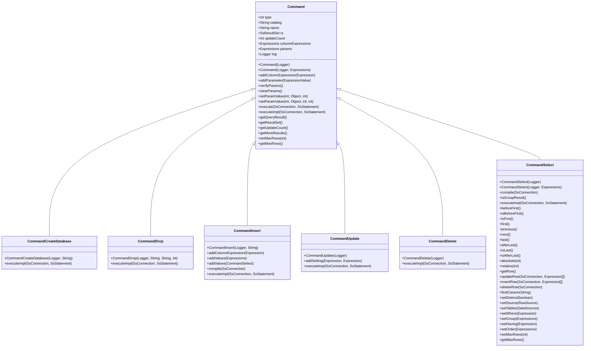
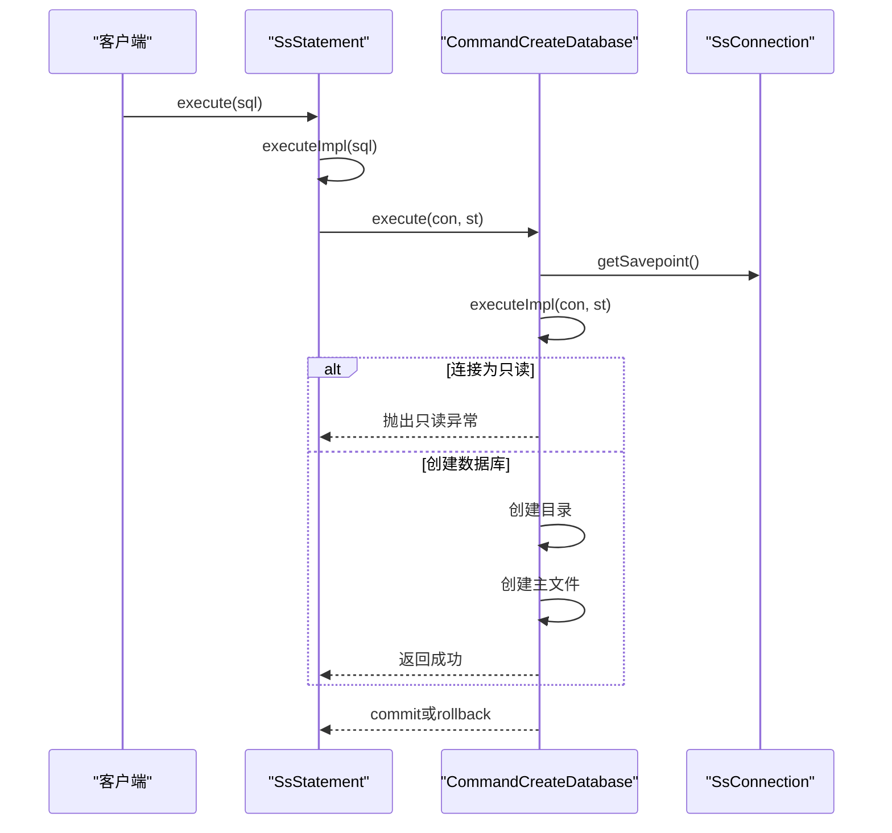
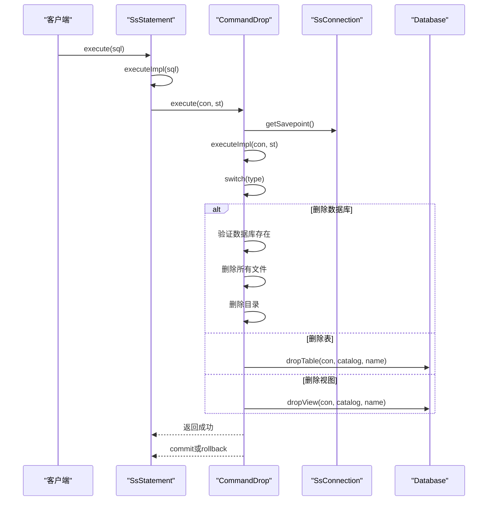
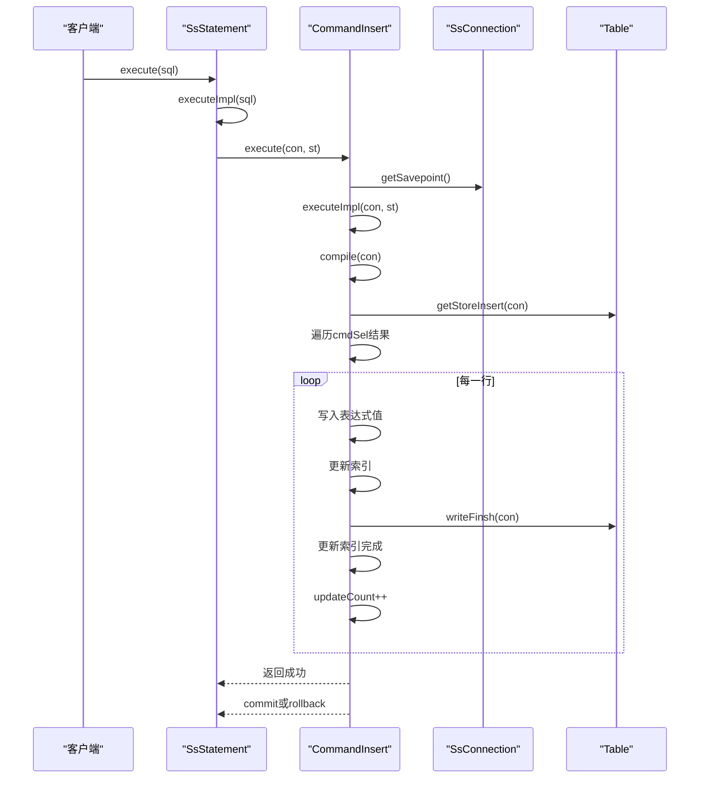
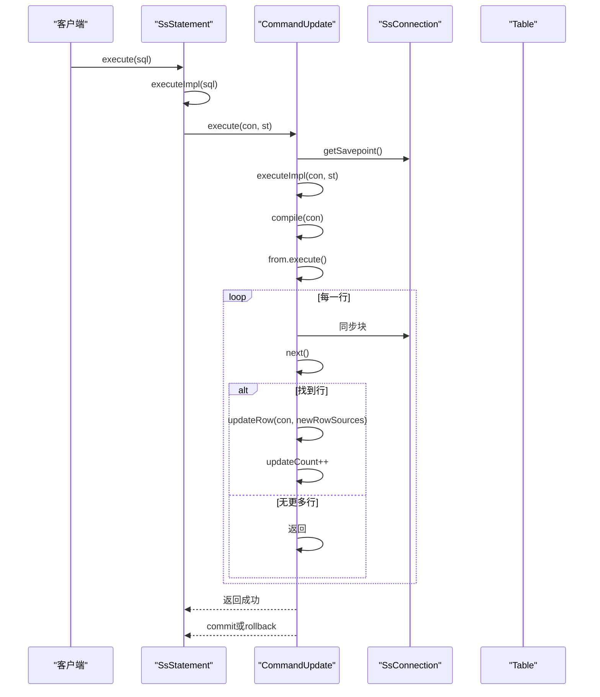
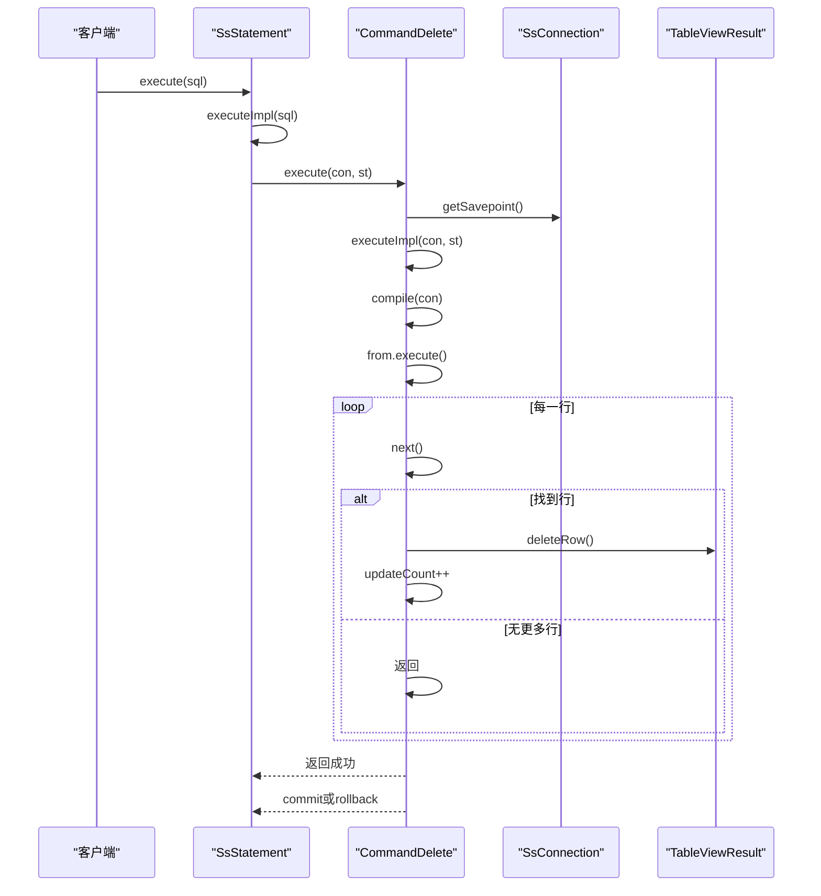
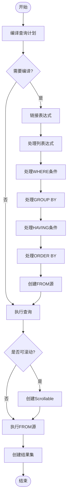
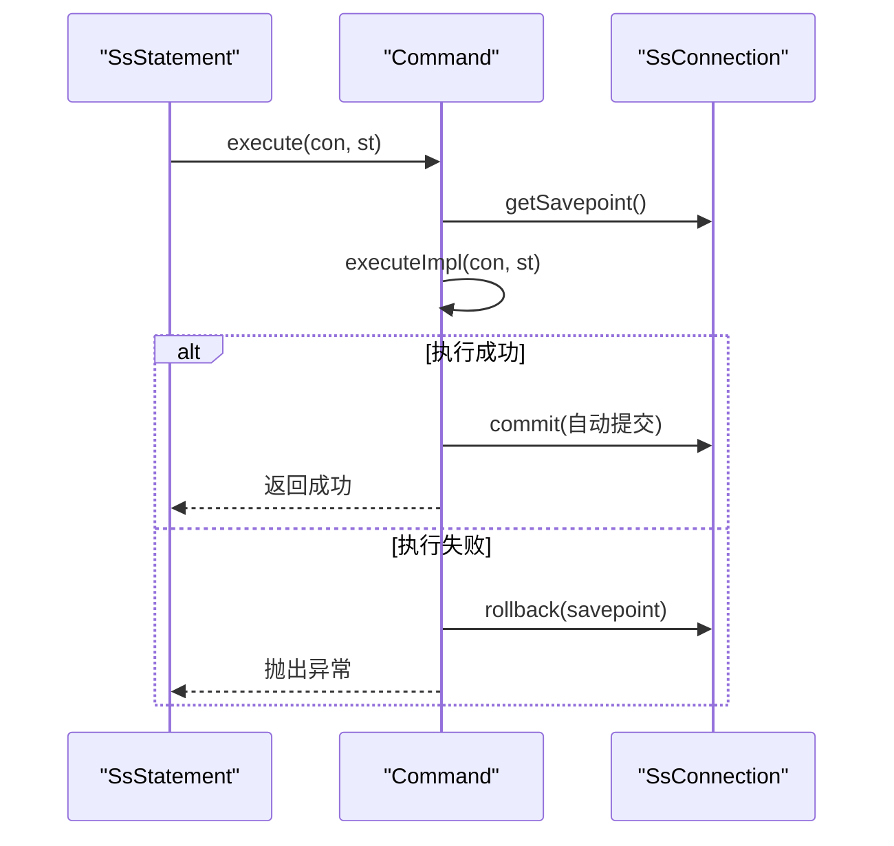
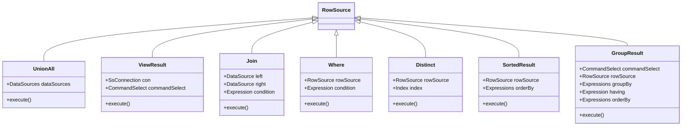
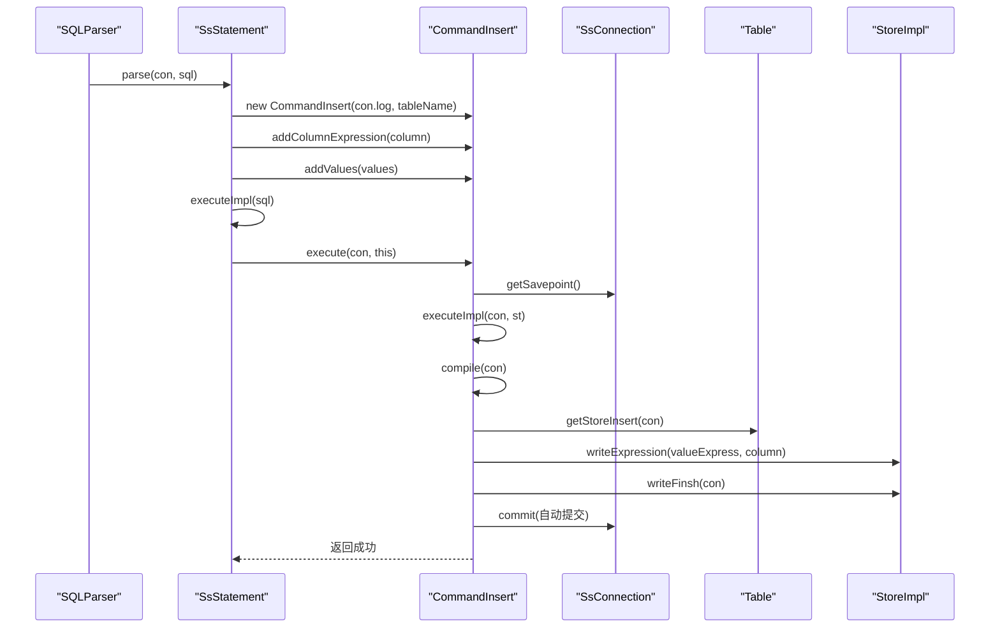

# 命令执行层

<cite>
**本文档中引用的文件**  
- [Command.java](file://src/main/java/io/leavesfly/smallsql/rdb/command/Command.java)
- [CommandCreateDatabase.java](file://src/main/java/io/leavesfly/smallsql/rdb/command/ddl/CommandCreateDatabase.java)
- [CommandDrop.java](file://src/main/java/io/leavesfly/smallsql/rdb/command/ddl/CommandDrop.java)
- [CommandInsert.java](file://src/main/java/io/leavesfly/smallsql/rdb/command/dml/CommandInsert.java)
- [CommandUpdate.java](file://src/main/java/io/leavesfly/smallsql/rdb/command/dml/CommandUpdate.java)
- [CommandDelete.java](file://src/main/java/io/leavesfly/smallsql/rdb/command/dml/CommandDelete.java)
- [CommandSelect.java](file://src/main/java/io/leavesfly/smallsql/rdb/command/dql/CommandSelect.java)
- [SQLParser.java](file://src/main/java/io/leavesfly/smallsql/rdb/sql/SQLParser.java)
- [SsStatement.java](file://src/main/java/io/leavesfly/smallsql/jdbc/statement/SsStatement.java)
- [SsConnection.java](file://src/main/java/io/leavesfly/smallsql/jdbc/SsConnection.java)
</cite>

## 目录
1. [引言](#引言)
2. [命令模式与统一执行契约](#命令模式与统一执行契约)
3. [DDL命令执行](#ddl命令执行)
4. [DML命令执行](#dml命令执行)
5. [DQL命令执行](#dql命令执行)
6. [命令执行流程协调](#命令执行流程协调)
7. [命令链式处理与嵌套支持](#命令链式处理与嵌套支持)
8. [命令执行调用栈示例](#命令执行调用栈示例)
9. [结论](#结论)

## 引言
命令执行层是数据库系统的核心组件，负责将SQL语句解析后的命令对象转换为实际的数据库操作。本系统基于命令模式（Command Pattern）设计，通过统一的执行契约实现对DDL、DML和DQL等各类SQL命令的处理。该设计不仅提供了清晰的职责分离，还确保了事务管理、连接上下文和存储引擎调用的协调一致。

## 命令模式与统一执行契约
命令模式在本系统中通过`Command`抽象类实现，为所有SQL命令提供了统一的执行契约。该类定义了命令执行的核心接口和通用功能，包括参数管理、事务控制和结果处理。

**图表来源**  
- [Command.java](file://src/main/java/io/leavesfly/smallsql/rdb/command/Command.java#L47-L190)

**本节来源**  
- [Command.java](file://src/main/java/io/leavesfly/smallsql/rdb/command/Command.java#L47-L190)

## DDL命令执行
DDL命令负责数据库元数据的变更操作，包括数据库、表、视图等对象的创建和删除。这些命令通过`Command`类的子类实现，每个子类重写`executeImpl`方法来执行特定的元数据操作。

### CommandCreateDatabase
`CommandCreateDatabase`类负责创建新的数据库。它在执行时会检查连接是否为只读模式，然后创建相应的目录结构和主文件。

**图表来源**  
- [CommandCreateDatabase.java](file://src/main/java/io/leavesfly/smallsql/rdb/command/ddl/CommandCreateDatabase.java#L45-L67)

**本节来源**  
- [CommandCreateDatabase.java](file://src/main/java/io/leavesfly/smallsql/rdb/command/ddl/CommandCreateDatabase.java#L45-L67)

### CommandDrop
`CommandDrop`类负责删除数据库对象，支持数据库、表和视图的删除操作。根据命令类型，它会执行不同的删除逻辑。

**图表来源**  
- [CommandDrop.java](file://src/main/java/io/leavesfly/smallsql/rdb/command/ddl/CommandDrop.java#L65-L84)

**本节来源**  
- [CommandDrop.java](file://src/main/java/io/leavesfly/smallsql/rdb/command/ddl/CommandDrop.java#L65-L84)

## DML命令执行
DML命令负责数据的修改操作，包括插入、更新和删除。这些命令通过`Command`类的子类实现，每个子类重写`executeImpl`方法来执行特定的数据修改逻辑。

### CommandInsert
`CommandInsert`类负责插入数据到表中。它支持两种插入方式：直接值插入和从SELECT语句插入。

**图表来源**  
- [CommandInsert.java](file://src/main/java/io/leavesfly/smallsql/rdb/command/dml/CommandInsert.java#L185-L207)

**本节来源**  
- [CommandInsert.java](file://src/main/java/io/leavesfly/smallsql/rdb/command/dml/CommandInsert.java#L185-L207)

### CommandUpdate
`CommandUpdate`类负责更新表中的数据。它通过`CommandSelect`的机制来定位需要更新的行，然后应用新的值。

**图表来源**  
- [CommandUpdate.java](file://src/main/java/io/leavesfly/smallsql/rdb/command/dml/CommandUpdate.java#L98-L116)

**本节来源**  
- [CommandUpdate.java](file://src/main/java/io/leavesfly/smallsql/rdb/command/dml/CommandUpdate.java#L98-L116)

### CommandDelete
`CommandDelete`类负责删除表中的数据。它通过`CommandSelect`的机制来定位需要删除的行，然后执行删除操作。

**图表来源**  
- [CommandDelete.java](file://src/main/java/io/leavesfly/smallsql/rdb/command/dml/CommandDelete.java#L58-L66)

**本节来源**  
- [CommandDelete.java](file://src/main/java/io/leavesfly/smallsql/rdb/command/dml/CommandDelete.java#L58-L66)

## DQL命令执行
DQL命令负责查询数据，主要由`CommandSelect`类实现。它通过复杂的执行计划来处理SELECT语句，包括WHERE条件、GROUP BY、ORDER BY等子句。

### CommandSelect执行流程
`CommandSelect`类的执行流程包括编译和执行两个阶段。编译阶段解析查询计划，执行阶段实际执行查询并返回结果。

**图表来源**  
- [CommandSelect.java](file://src/main/java/io/leavesfly/smallsql/rdb/command/dql/CommandSelect.java#L565-L587)

**本节来源**  
- [CommandSelect.java](file://src/main/java/io/leavesfly/smallsql/rdb/command/dql/CommandSelect.java#L565-L587)

## 命令执行流程协调
命令执行流程的协调是通过`Command.execute()`方法实现的，该方法负责协调连接上下文、事务管理和下层存储引擎调用。

### execute方法实现
`Command.execute()`方法是命令执行的核心，它确保了事务的一致性和原子性。

**图表来源**  
- [Command.java](file://src/main/java/io/leavesfly/smallsql/rdb/command/Command.java#L150-L165)

**本节来源**  
- [Command.java](file://src/main/java/io/leavesfly/smallsql/rdb/command/Command.java#L150-L165)

## 命令链式处理与嵌套命令支持
系统支持命令的链式处理和嵌套命令，通过`CommandSelect`类的`compile`方法实现复杂的查询计划。

### 命令链式处理
命令链式处理允许将多个命令组合成一个执行计划，如UNION操作。

**图表来源**  
- [CommandSelect.java](file://src/main/java/io/leavesfly/smallsql/rdb/command/dql/CommandSelect.java#L100-L150)

**本节来源**  
- [CommandSelect.java](file://src/main/java/io/leavesfly/smallsql/rdb/command/dql/CommandSelect.java#L100-L150)

## 命令执行调用栈示例
以下是从SQLParser返回Command到最终存储层操作的完整调用栈示例。

### INSERT命令调用栈

**图表来源**  
- [SQLParser.java](file://src/main/java/io/leavesfly/smallsql/rdb/sql/SQLParser.java#L350-L400)
- [SsStatement.java](file://src/main/java/io/leavesfly/smallsql/jdbc/statement/SsStatement.java#L220-L240)
- [CommandInsert.java](file://src/main/java/io/leavesfly/smallsql/rdb/command/dml/CommandInsert.java#L185-L207)

**本节来源**  
- [SQLParser.java](file://src/main/java/io/leavesfly/smallsql/rdb/sql/SQLParser.java#L350-L400)
- [SsStatement.java](file://src/main/java/io/leavesfly/smallsql/jdbc/statement/SsStatement.java#L220-L240)
- [CommandInsert.java](file://src/main/java/io/leavesfly/smallsql/rdb/command/dml/CommandInsert.java#L185-L207)

## 结论
命令执行层通过命令模式实现了统一的执行契约，为DDL、DML和DQL命令提供了清晰的执行框架。`Command.execute()`方法有效地协调了连接上下文、事务管理和存储引擎调用，确保了操作的原子性和一致性。系统支持复杂的命令链式处理和嵌套命令，通过`CommandSelect`类的编译和执行机制实现了高效的查询处理。整体设计体现了良好的职责分离和可扩展性，为数据库系统的稳定运行提供了坚实的基础。