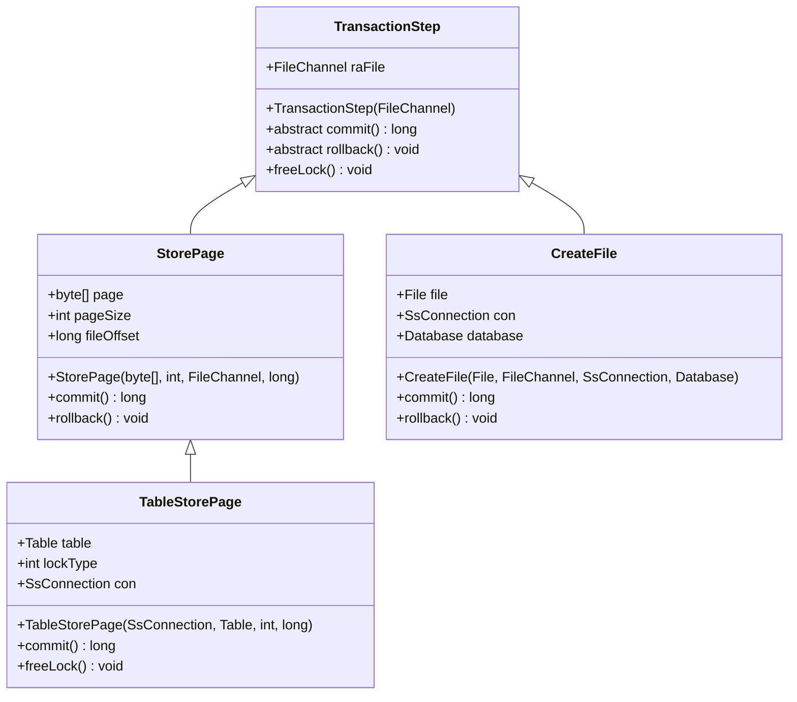
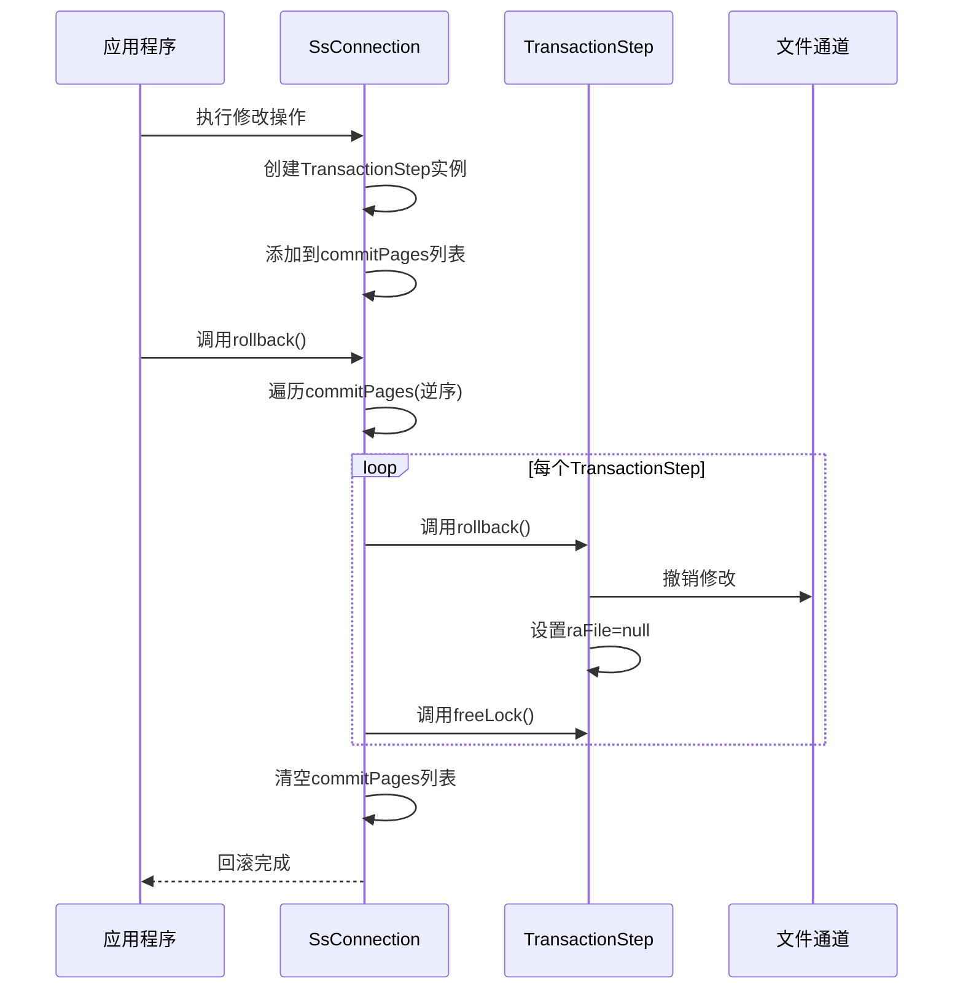
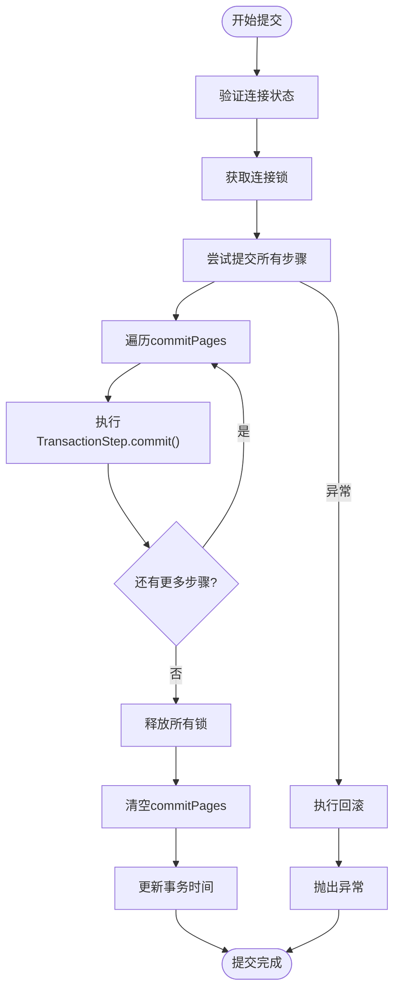
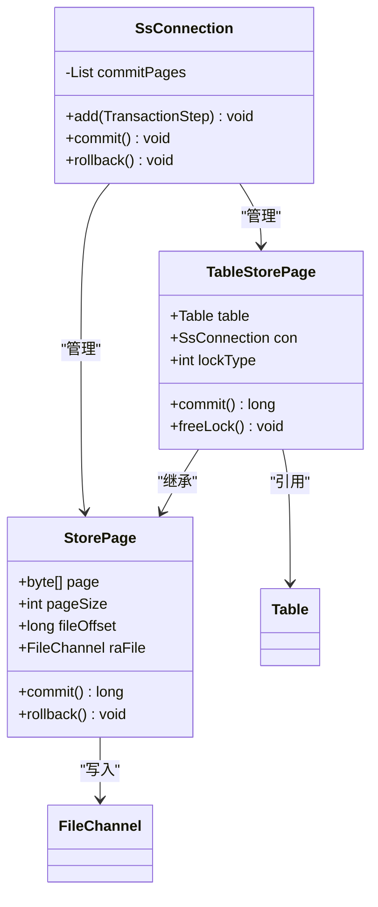
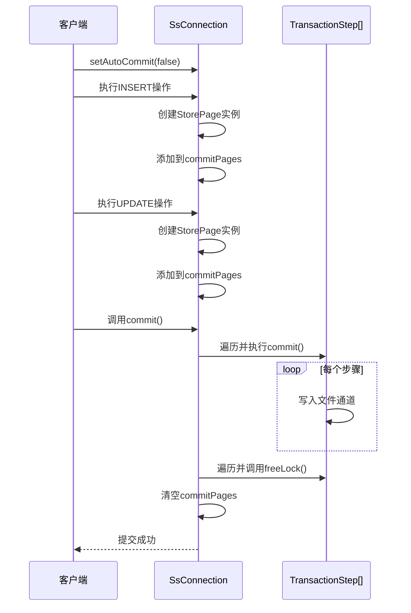

# 事务组件

<cite>
**本文档中引用的文件**   
- [TransactionStep.java](file://src/main/java/io/leavesfly/smallsql/rdb/engine/TransactionStep.java)
- [SsConnection.java](file://src/main/java/io/leavesfly/smallsql/jdbc/SsConnection.java)
- [StorePage.java](file://src/main/java/io/leavesfly/smallsql/rdb/engine/store/StorePage.java)
- [TableStorePage.java](file://src/main/java/io/leavesfly/smallsql/rdb/engine/store/TableStorePage.java)
- [CreateFile.java](file://src/main/java/io/leavesfly/smallsql/rdb/engine/store/CreateFile.java)
- [TestTransactions.java](file://src/test/java/io/leavesfly/smallsql/junit/sql/tpl/TestTransactions.java)
</cite>

## 目录
1. [事务机制概述](#事务机制概述)
2. [TransactionStep类详解](#transactionstep类详解)
3. [事务日志与回滚机制](#事务日志与回滚机制)
4. [SsConnection事务协调](#ssconnection事务协调)
5. [StorePage交互机制](#storepage交互机制)
6. [事务案例分析](#事务案例分析)
7. [事务隔离级别影响](#事务隔离级别影响)

## 事务机制概述

SmallSQL数据库系统实现了完整的事务支持机制，通过TransactionStep类记录单个事务操作的修改详情，确保数据的原子性和持久性。事务管理采用两阶段提交模式，将修改操作记录在事务步骤中，直到commit时才真正写入磁盘。这种设计既保证了事务的ACID特性，又提高了系统的并发性能。

**Section sources**
- [SsConnection.java](file://src/main/java/io/leavesfly/smallsql/jdbc/SsConnection.java#L256-L317)
- [TransactionStep.java](file://src/main/java/io/leavesfly/smallsql/rdb/engine/TransactionStep.java#L35-L56)

## TransactionStep类详解

TransactionStep是事务支持的核心抽象类，作为所有事务步骤的基类。该类通过FileChannel字段raFile关联到具体的文件通道，记录了需要修改的文件信息。构造函数接收FileChannel参数并初始化raFile字段，为后续的提交和回滚操作提供基础。

该类定义了三个关键的抽象方法：commit()用于提交事务修改，rollback()用于回滚事务操作，freeLock()用于释放事务锁。这些方法的具体实现由子类完成，形成了灵活的事务处理框架。

**Diagram sources **
- [TransactionStep.java](file://src/main/java/io/leavesfly/smallsql/rdb/engine/TransactionStep.java#L35-L56)
- [StorePage.java](file://src/main/java/io/leavesfly/smallsql/rdb/engine/store/StorePage.java#L45-L90)
- [TableStorePage.java](file://src/main/java/io/leavesfly/smallsql/rdb/engine/store/TableStorePage.java#L45-L78)
- [CreateFile.java](file://src/main/java/io/leavesfly/smallsql/rdb/engine/store/CreateFile.java#L44-L95)

**Section sources**
- [TransactionStep.java](file://src/main/java/io/leavesfly/smallsql/rdb/engine/TransactionStep.java#L35-L56)
- [StorePage.java](file://src/main/java/io/leavesfly/smallsql/rdb/engine/store/StorePage.java#L45-L90)

## 事务日志与回滚机制

事务日志的生成和管理是通过SsConnection类中的commitPages列表实现的。当执行数据库修改操作时，相应的TransactionStep实例会被添加到commitPages列表中，形成事务日志。这些步骤记录了所有待提交的修改，包括数据页的变更、文件创建等操作。

回滚时的逆向执行过程通过遍历commitPages列表并调用每个TransactionStep的rollback()方法实现。系统采用从后往前的顺序执行回滚，确保操作的逆序正确性。在回滚完成后，会调用freeLock()方法释放相关资源，最后清空commitPages列表。

**Diagram sources **
- [SsConnection.java](file://src/main/java/io/leavesfly/smallsql/jdbc/SsConnection.java#L285-L317)
- [TransactionStep.java](file://src/main/java/io/leavesfly/smallsql/rdb/engine/TransactionStep.java#L50-L56)

**Section sources**
- [SsConnection.java](file://src/main/java/io/leavesfly/smallsql/jdbc/SsConnection.java#L285-L317)
- [TransactionStep.java](file://src/main/java/io/leavesfly/smallsql/rdb/engine/TransactionStep.java#L50-L56)

## SsConnection事务协调

SsConnection类作为数据库连接的实现，负责协调事务的commit和rollback操作。通过commitPages列表管理所有待提交的事务步骤，实现了事务的集中管理。当调用commit()方法时，系统会按顺序执行所有TransactionStep的commit()方法，然后调用freeLock()释放锁资源，最后清空事务列表。

在commit过程中，系统采用保护性编程模式：先尝试提交所有修改，如果任何步骤失败，则自动执行回滚操作，确保数据一致性。这种设计避免了部分提交导致的数据不一致问题。

**Diagram sources **
- [SsConnection.java](file://src/main/java/io/leavesfly/smallsql/jdbc/SsConnection.java#L256-L283)
- [TransactionStep.java](file://src/main/java/io/leavesfly/smallsql/rdb/engine/TransactionStep.java#L45-L49)

**Section sources**
- [SsConnection.java](file://src/main/java/io/leavesfly/smallsql/jdbc/SsConnection.java#L256-L283)

## StorePage交互机制

TransactionStep与StorePage之间的交互确保了事务的原子性和持久性。StorePage作为TransactionStep的具体实现，直接操作数据页的物理存储。当数据修改发生时，StorePage会缓存修改后的页面数据，在commit时才将数据写入文件通道。

这种设计实现了写前日志（Write-Ahead Logging）机制：所有修改先记录在事务日志中，只有在commit确认后才真正写入磁盘。StorePage通过fileOffset字段记录数据页在文件中的位置，确保修改能准确写入正确位置。

**Diagram sources **
- [StorePage.java](file://src/main/java/io/leavesfly/smallsql/rdb/engine/store/StorePage.java#L45-L90)
- [TableStorePage.java](file://src/main/java/io/leavesfly/smallsql/rdb/engine/store/TableStorePage.java#L45-L78)
- [SsConnection.java](file://src/main/java/io/leavesfly/smallsql/jdbc/SsConnection.java#L100-L105)

**Section sources**
- [StorePage.java](file://src/main/java/io/leavesfly/smallsql/rdb/engine/store/StorePage.java#L45-L90)
- [TableStorePage.java](file://src/main/java/io/leavesfly/smallsql/rdb/engine/store/TableStorePage.java#L45-L78)

## 事务案例分析

通过具体事务案例可以清晰展示多步操作的记录、提交和回滚全过程。以testCommit()测试用例为例，事务包含创建表、插入数据等多步操作。每步操作都会创建相应的TransactionStep并添加到commitPages列表中。

当调用commit()时，系统按顺序提交所有步骤：首先将数据页写入文件，然后释放锁资源，最后清空事务列表。若在过程中调用rollback()，则会逆序执行所有步骤的回滚操作，恢复到事务开始前的状态。

**Diagram sources **
- [TestTransactions.java](file://src/test/java/io/leavesfly/smallsql/junit/sql/tpl/TestTransactions.java#L80-L119)
- [SsConnection.java](file://src/main/java/io/leavesfly/smallsql/jdbc/SsConnection.java#L256-L283)

**Section sources**
- [TestTransactions.java](file://src/test/java/io/leavesfly/smallsql/junit/sql/tpl/TestTransactions.java#L80-L119)

## 事务隔离级别影响

事务隔离级别对TransactionStep管理策略有重要影响。在TRANSACTION_READ_UNCOMMITTED级别下，其他事务可以读取未提交的修改，这要求TransactionStep在记录修改时不需要额外的读锁。而在TRANSACTION_SERIALIZABLE级别下，需要更严格的锁管理策略。

SsConnection通过isolationLevel字段管理当前隔离级别，并在执行操作时根据级别调整锁策略。高隔离级别会导致更多的锁竞争，可能引发超时异常，如testReadWriteLock()用例所示。系统通过合理的锁管理，在保证数据一致性的同时尽量提高并发性能。

**Section sources**
- [SsConnection.java](file://src/main/java/io/leavesfly/smallsql/jdbc/SsConnection.java#L103-L104)
- [TestTransactions.java](file://src/test/java/io/leavesfly/smallsql/junit/sql/tpl/TestTransactions.java#L493-L511)