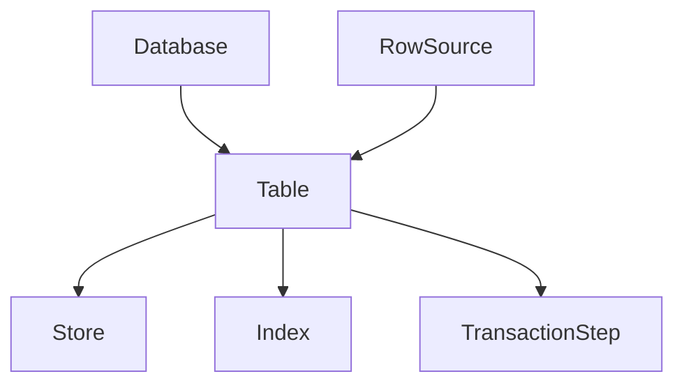
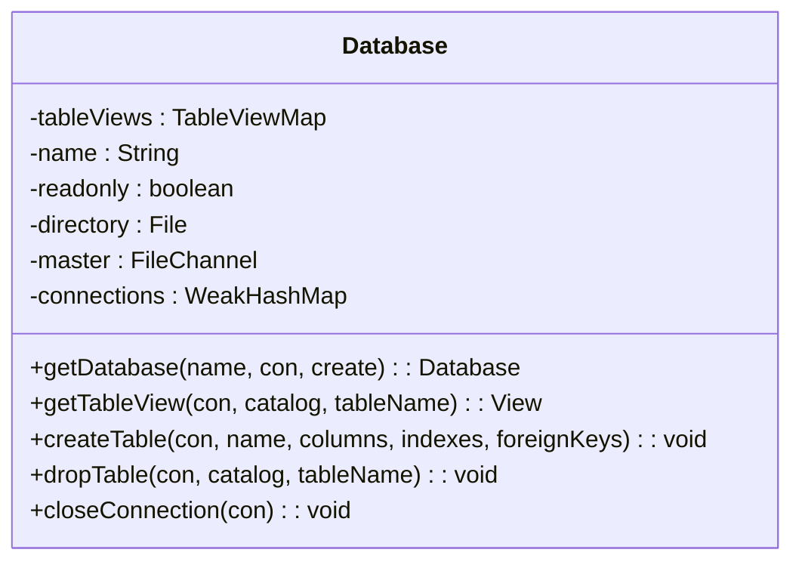
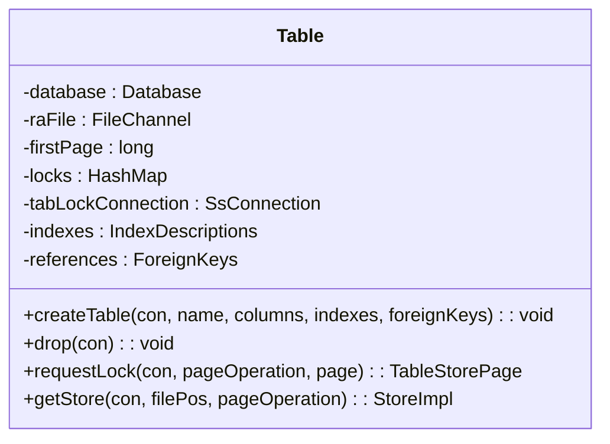
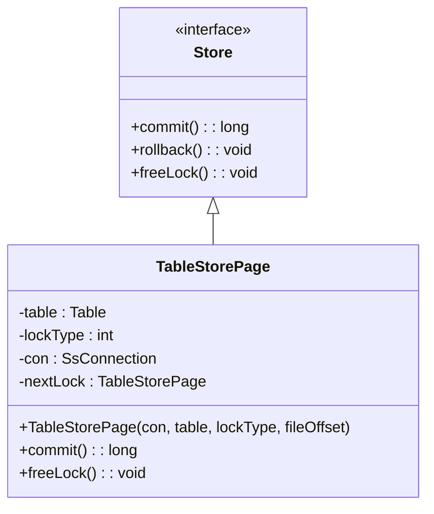
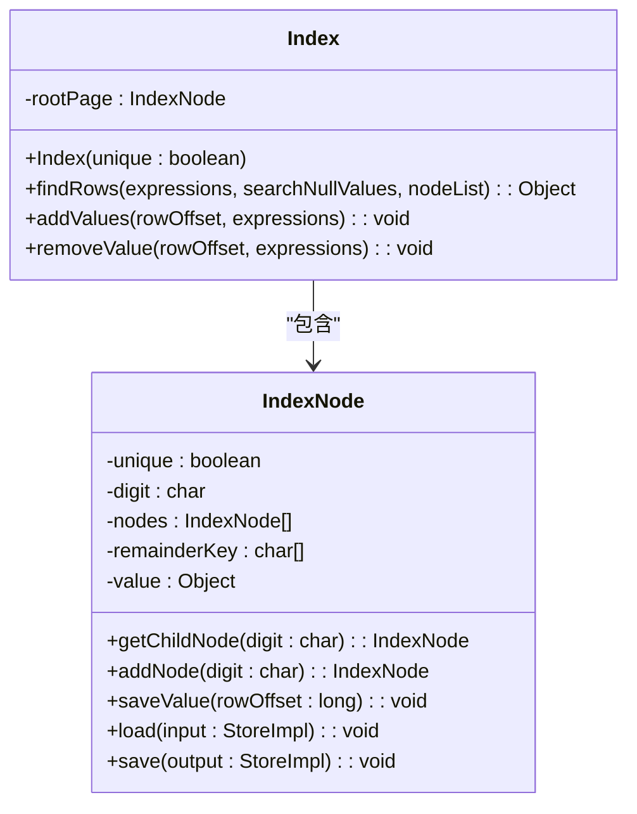
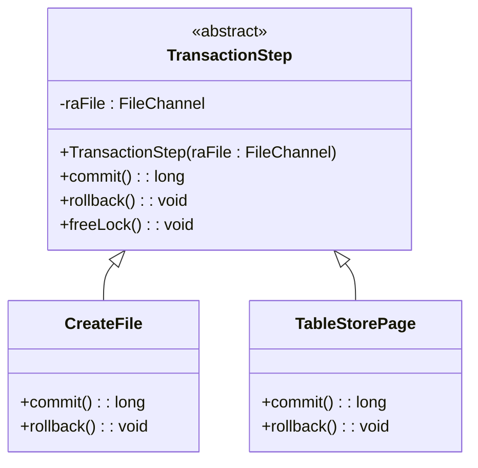
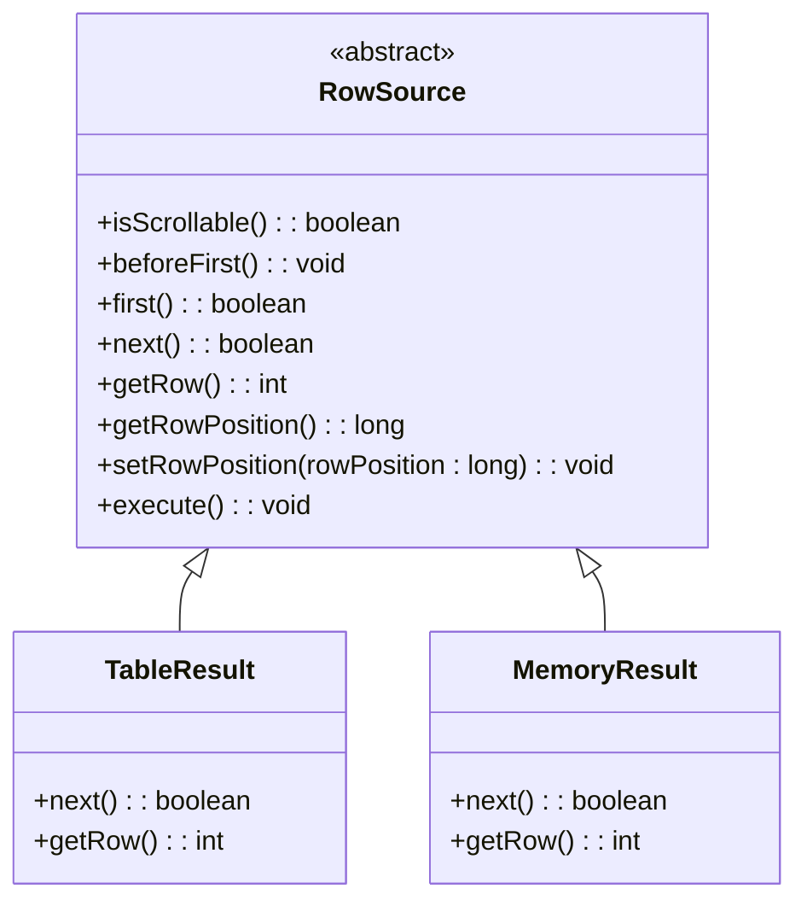
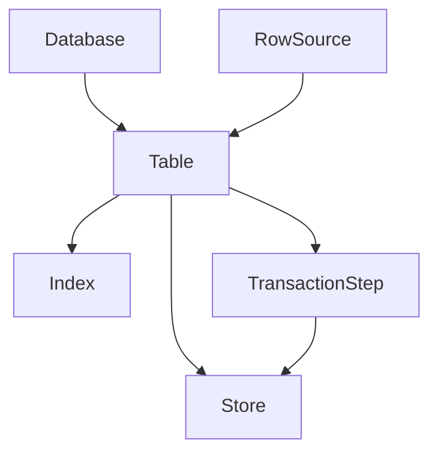

# 存储引擎层

<cite>
**本文档中引用的文件**  
- [Database.java](file://src/main/java/io/leavesfly/smallsql/rdb/engine/Database.java)
- [Table.java](file://src/main/java/io/leavesfly/smallsql/rdb/engine/Table.java)
- [Store.java](file://src/main/java/io/leavesfly/smallsql/rdb/engine/Store.java)
- [TableStorePage.java](file://src/main/java/io/leavesfly/smallsql/rdb/engine/store/TableStorePage.java)
- [Index.java](file://src/main/java/io/leavesfly/smallsql/rdb/engine/Index.java)
- [IndexNode.java](file://src/main/java/io/leavesfly/smallsql/rdb/engine/IndexNode.java)
- [TransactionStep.java](file://src/main/java/io/leavesfly/smallsql/rdb/engine/TransactionStep.java)
- [RowSource.java](file://src/main/java/io/leavesfly/smallsql/rdb/engine/RowSource.java)
</cite>

## 目录
1. [引言](#引言)
2. [项目结构](#项目结构)
3. [核心组件](#核心组件)
4. [架构概述](#架构概述)
5. [详细组件分析](#详细组件分析)
6. [依赖分析](#依赖分析)
7. [性能考虑](#性能考虑)
8. [故障排除指南](#故障排除指南)
9. [结论](#结论)

## 引言
本文档深入解析SmallSQL数据库的存储引擎层，重点描述其核心类之间的关系与工作机制。文档涵盖Database类如何管理多个Table对象和全局状态，Table类的结构及其元数据组件，Store接口及其实现类如何管理数据页，Index和IndexNode如何实现B+树索引，TransactionStep如何支持事务回滚，以及RowSource接口在数据检索中的作用。同时，文档将提供数据持久化流程的完整调用链示例。

## 项目结构
存储引擎层位于`src/main/java/io/leavesfly/smallsql/rdb/engine`目录下，其核心组件包括数据库管理、表管理、索引管理、存储管理和事务管理。该层通过清晰的类层次结构和接口定义，实现了数据的持久化、查询优化和事务控制。

```mermaid
graph TD
subgraph "存储引擎层"
Database[Database]
Table[Table]
Store[Store]
Index[Index]
TransactionStep[TransactionStep]
RowSource[RowSource]
end
Database --> Table : "管理"
Table --> Store : "使用"
Table --> Index : "包含"
Table --> TransactionStep : "记录"
RowSource --> Table : "访问"
```

**图示来源**
- [Database.java](file://src/main/java/io/leavesfly/smallsql/rdb/engine/Database.java#L1-L564)
- [Table.java](file://src/main/java/io/leavesfly/smallsql/rdb/engine/Table.java#L1-L608)
- [Store.java](file://src/main/java/io/leavesfly/smallsql/rdb/engine/Store.java#L1-L100)
- [Index.java](file://src/main/java/io/leavesfly/smallsql/rdb/engine/Index.java#L1-L553)
- [TransactionStep.java](file://src/main/java/leavesfly/smallsql/rdb/engine/TransactionStep.java#L1-L57)
- [RowSource.java](file://src/main/java/io/leavesfly/smallsql/rdb/engine/RowSource.java#L1-L189)

## 核心组件
存储引擎层的核心组件包括Database、Table、Store、Index、TransactionStep和RowSource。这些组件协同工作，提供了数据库的持久化存储、高效查询和事务支持。

**章节来源**
- [Database.java](file://src/main/java/io/leavesfly/smallsql/rdb/engine/Database.java#L1-L564)
- [Table.java](file://src/main/java/io/leavesfly/smallsql/rdb/engine/Table.java#L1-L608)
- [Store.java](file://src/main/java/io/leavesfly/smallsql/rdb/engine/Store.java#L1-L100)
- [Index.java](file://src/main/java/io/leavesfly/smallsql/rdb/engine/Index.java#L1-L553)
- [TransactionStep.java](file://src/main/java/io/leavesfly/smallsql/rdb/engine/TransactionStep.java#L1-L57)
- [RowSource.java](file://src/main/java/io/leavesfly/smallsql/rdb/engine/RowSource.java#L1-L189)

## 架构概述
存储引擎层采用分层架构，从上至下分别为数据库管理层、表管理层、存储管理层和索引管理层。Database类作为顶层管理者，负责维护所有Table对象的生命周期和全局状态。Table类封装了表的元数据和数据存储逻辑，通过Store接口与底层存储交互。Index类实现了B+树索引结构，支持高效的数据查询。TransactionStep类用于记录事务的修改步骤，支持回滚操作。RowSource接口为数据检索提供了统一的抽象。



**图示来源**
- [Database.java](file://src/main/java/io/leavesfly/smallsql/rdb/engine/Database.java#L1-L564)
- [Table.java](file://src/main/java/io/leavesfly/smallsql/rdb/engine/Table.java#L1-L608)
- [Store.java](file://src/main/java/io/leavesfly/smallsql/rdb/engine/Store.java#L1-L100)
- [Index.java](file://src/main/java/io/leavesfly/smallsql/rdb/engine/Index.java#L1-L553)
- [TransactionStep.java](file://src/main/java/io/leavesfly/smallsql/rdb/engine/TransactionStep.java#L1-L57)
- [RowSource.java](file://src/main/java/io/leavesfly/smallsql/rdb/engine/RowSource.java#L1-L189)

## 详细组件分析

### Database类分析
Database类是数据库的单例管理器，负责管理多个Table对象和全局状态。它通过`tableViews`字段缓存所有已加载的表和视图，并提供线程安全的访问机制。



**图示来源**
- [Database.java](file://src/main/java/io/leavesfly/smallsql/rdb/engine/Database.java#L1-L564)

**章节来源**
- [Database.java](file://src/main/java/io/leavesfly/smallsql/rdb/engine/Database.java#L1-L564)

### Table类分析
Table类封装了表的元数据和数据存储逻辑。它包含Columns、Indexes、ForeignKeys等元数据组件，并通过Store接口与底层存储交互。



**图示来源**
- [Table.java](file://src/main/java/io/leavesfly/smallsql/rdb/engine/Table.java#L1-L608)

**章节来源**
- [Table.java](file://src/main/java/io/leavesfly/smallsql/rdb/engine/Table.java#L1-L608)

### Store接口及其实现分析
Store接口及其实现类（如TableStorePage）负责管理数据页的读写、缓存和链接。TableStorePage类作为Store接口的具体实现，提供了对数据页的访问和锁定机制。



**图示来源**
- [Store.java](file://src/main/java/io/leavesfly/smallsql/rdb/engine/Store.java#L1-L100)
- [TableStorePage.java](file://src/main/java/io/leavesfly/smallsql/rdb/engine/store/TableStorePage.java#L1-L78)

**章节来源**
- [Store.java](file://src/main/java/io/leavesfly/smallsql/rdb/engine/Store.java#L1-L100)
- [TableStorePage.java](file://src/main/java/io/leavesfly/smallsql/rdb/engine/store/TableStorePage.java#L1-L78)

### Index和IndexNode类分析
Index和IndexNode类共同实现了B+树索引结构，支持高效的数据查询。Index类作为索引的根节点，管理整个索引树的结构。IndexNode类作为索引树的节点，存储索引键值和指向子节点或数据行的指针。



**图示来源**
- [Index.java](file://src/main/java/io/leavesfly/smallsql/rdb/engine/Index.java#L1-L553)
- [IndexNode.java](file://src/main/java/io/leavesfly/smallsql/rdb/engine/IndexNode.java#L1-L468)

**章节来源**
- [Index.java](file://src/main/java/io/leavesfly/smallsql/rdb/engine/Index.java#L1-L553)
- [IndexNode.java](file://src/main/java/io/leavesfly/smallsql/rdb/engine/IndexNode.java#L1-L468)

### TransactionStep类分析
TransactionStep类用于记录事务的修改步骤，支持回滚操作。它是一个抽象类，具体的实现类（如CreateFile、TableStorePage等）负责记录不同类型的事务操作。



**图示来源**
- [TransactionStep.java](file://src/main/java/io/leavesfly/smallsql/rdb/engine/TransactionStep.java#L1-L57)
- [CreateFile.java](file://src/main/java/io/leavesfly/smallsql/rdb/engine/store/CreateFile.java#L1-L50)
- [TableStorePage.java](file://src/main/java/io/leavesfly/smallsql/rdb/engine/store/TableStorePage.java#L1-L78)

**章节来源**
- [TransactionStep.java](file://src/main/java/io/leavesfly/smallsql/rdb/engine/TransactionStep.java#L1-L57)

### RowSource接口分析
RowSource接口为数据检索提供了统一的抽象。它定义了导航数据行的方法，如`next()`、`previous()`、`first()`等，支持各种数据源（如表、视图、内存结果集等）的统一访问。



**图示来源**
- [RowSource.java](file://src/main/java/io/leavesfly/smallsql/rdb/engine/RowSource.java#L1-L189)
- [TableResult.java](file://src/main/java/io/leavesfly/smallsql/rdb/engine/selector/result/TableResult.java#L1-L50)
- [MemoryResult.java](file://src/main/java/io/leavesfly/smallsql/rdb/engine/selector/result/MemoryResult.java#L1-L50)

**章节来源**
- [RowSource.java](file://src/main/java/io/leavesfly/smallsql/rdb/engine/RowSource.java#L1-L189)

## 依赖分析
存储引擎层的组件之间存在紧密的依赖关系。Database类依赖于Table类来管理表对象，Table类依赖于Store接口和Index类来实现数据存储和查询，TransactionStep类依赖于Store接口来记录事务操作，RowSource接口依赖于Table类来访问数据。



**图示来源**
- [Database.java](file://src/main/java/io/leavesfly/smallsql/rdb/engine/Database.java#L1-L564)
- [Table.java](file://src/main/java/io/leavesfly/smallsql/rdb/engine/Table.java#L1-L608)
- [Store.java](file://src/main/java/io/leavesfly/smallsql/rdb/engine/Store.java#L1-L100)
- [Index.java](file://src/main/java/io/leavesfly/smallsql/rdb/engine/Index.java#L1-L553)
- [TransactionStep.java](file://src/main/java/io/leavesfly/smallsql/rdb/engine/TransactionStep.java#L1-L57)
- [RowSource.java](file://src/main/java/io/leavesfly/smallsql/rdb/engine/RowSource.java#L1-L189)

**章节来源**
- [Database.java](file://src/main/java/io/leavesfly/smallsql/rdb/engine/Database.java#L1-L564)
- [Table.java](file://src/main/java/io/leavesfly/smallsql/rdb/engine/Table.java#L1-L608)
- [Store.java](file://src/main/java/io/leavesfly/smallsql/rdb/engine/Store.java#L1-L100)
- [Index.java](file://src/main/java/io/leavesfly/smallsql/rdb/engine/Index.java#L1-L553)
- [TransactionStep.java](file://src/main/java/io/leavesfly/smallsql/rdb/engine/TransactionStep.java#L1-L57)
- [RowSource.java](file://src/main/java/io/leavesfly/smallsql/rdb/engine/RowSource.java#L1-L189)

## 性能考虑
存储引擎层在设计时充分考虑了性能因素。通过使用B+树索引结构，实现了高效的数据查询。通过使用数据页缓存和链接机制，减少了磁盘I/O操作。通过使用事务日志和回滚机制，保证了数据的一致性和可靠性。

## 故障排除指南
在使用存储引擎层时，可能会遇到一些常见问题，如数据库连接失败、表锁定超时、索引损坏等。这些问题通常可以通过检查数据库文件权限、调整事务隔离级别、重建索引等方式解决。

**章节来源**
- [Database.java](file://src/main/java/io/leavesfly/smallsql/rdb/engine/Database.java#L1-L564)
- [Table.java](file://src/main/java/io/leavesfly/smallsql/rdb/engine/Table.java#L1-L608)
- [Index.java](file://src/main/java/io/leavesfly/smallsql/rdb/engine/Index.java#L1-L553)

## 结论
SmallSQL的存储引擎层通过精心设计的类层次结构和接口定义，实现了数据库的持久化存储、高效查询和事务支持。其核心组件协同工作，提供了稳定、可靠、高效的数据库服务。