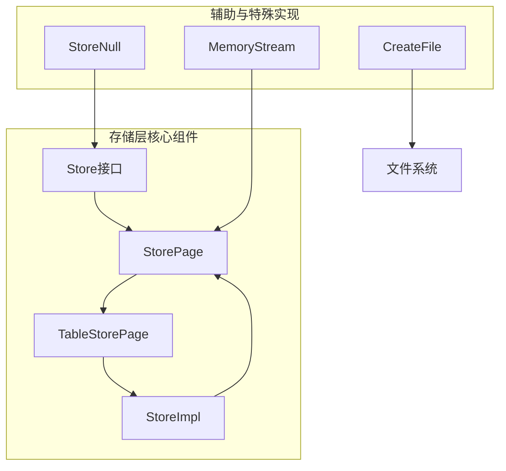
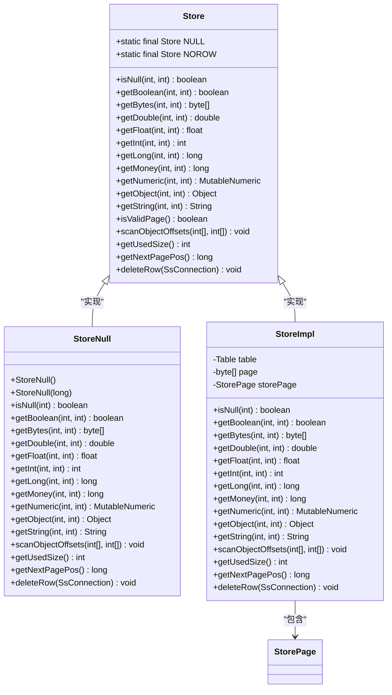
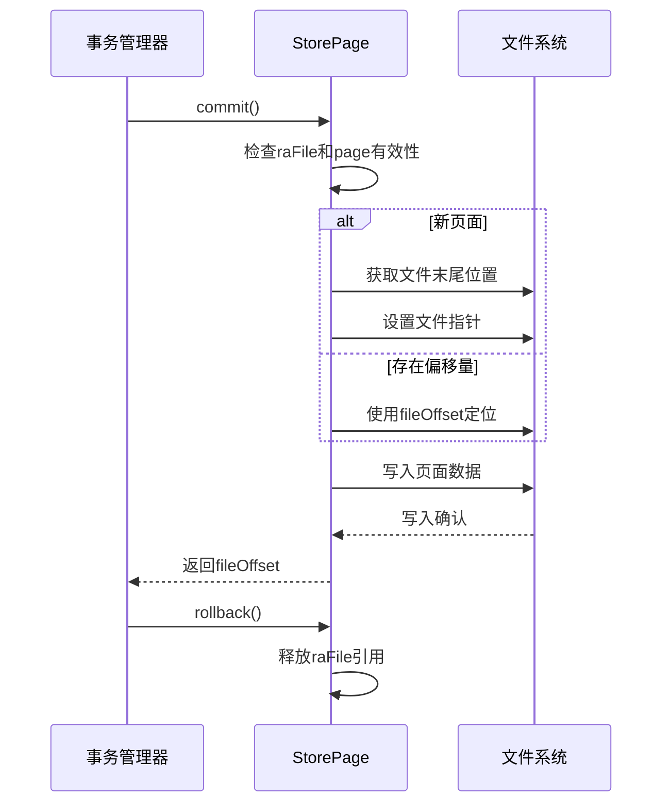
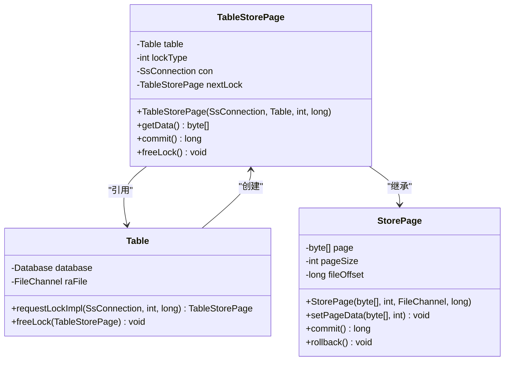
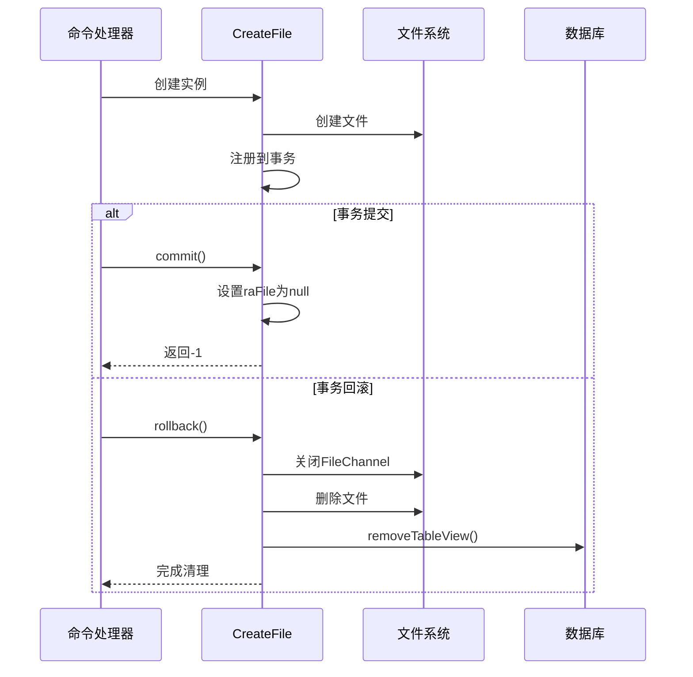
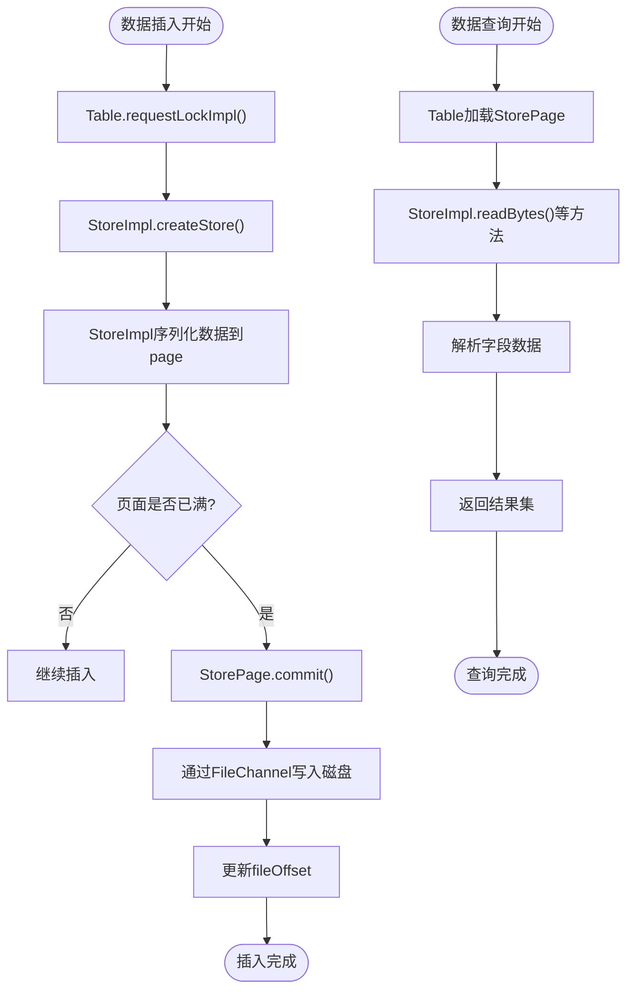
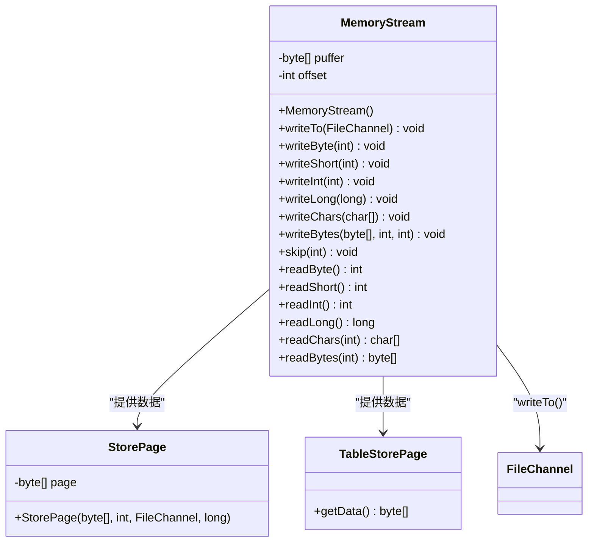
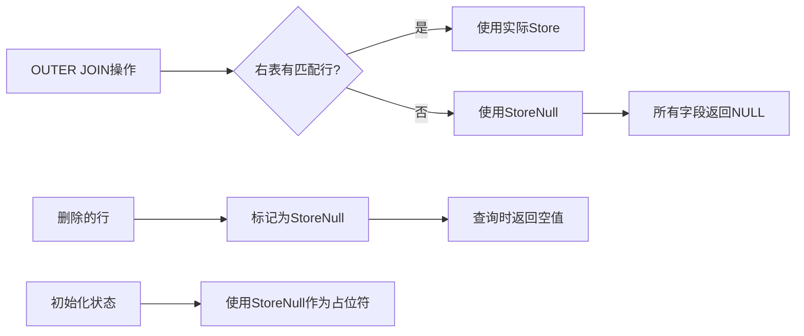

# 存储组件

<cite>
**本文档中引用的文件**  
- [Store.java](file://src/main/java/io/leavesfly/smallsql/rdb/engine/Store.java)
- [StorePage.java](file://src/main/java/io/leavesfly/smallsql/rdb/engine/store/StorePage.java)
- [TableStorePage.java](file://src/main/java/io/leavesfly/smallsql/rdb/engine/store/TableStorePage.java)
- [CreateFile.java](file://src/main/java/io/leavesfly/smallsql/rdb/engine/store/CreateFile.java)
- [MemoryStream.java](file://src/main/java/io/leavesfly/smallsql/rdb/engine/store/MemoryStream.java)
- [StoreNull.java](file://src/main/java/io/leavesfly/smallsql/rdb/engine/store/StoreNull.java)
</cite>

## 目录
1. [引言](#引言)
2. [存储层架构设计](#存储层架构设计)
3. [Store接口与数据访问契约](#store接口与数据访问契约)
4. [StorePage页式管理机制](#storepage页式管理机制)
5. [TableStorePage物理存储布局](#tablestorepage物理存储布局)
6. [CreateFile在文件创建中的角色](#createfile在文件创建中的角色)
7. [数据流动：从Table到StorePage](#数据流动从table到storepage)
8. [MemoryStream与内存表支持](#memorystream与内存表支持)
9. [StoreNull特殊实现的应用场景](#storenull特殊实现的应用场景)
10. [结论](#结论)

## 引言
本文档系统阐述smallsql数据库系统的存储层架构设计，重点解析其核心组件之间的协作机制。通过分析Store接口、页式管理、物理存储布局等关键设计，揭示数据从逻辑表到物理文件的完整流动路径。文档将深入探讨存储层如何实现高效的数据访问、事务支持和资源管理，为理解数据库内部工作机制提供全面的技术参考。

## 存储层架构设计
smallsql的存储层采用分层架构设计，核心组件包括抽象的Store接口、具体的页式存储实现（StorePage）、表级存储封装（TableStorePage）以及辅助工具类。该架构通过接口与实现分离的设计模式，实现了数据访问的统一契约与多样化存储策略的灵活结合。存储层与事务管理、索引引擎等模块紧密协作，共同构成数据库的核心数据处理能力。

**图示来源**  
- [Store.java](file://src/main/java/io/leavesfly/smallsql/rdb/engine/Store.java#L45-L90)
- [StorePage.java](file://src/main/java/io/leavesfly/smallsql/rdb/engine/store/StorePage.java#L45-L89)
- [TableStorePage.java](file://src/main/java/io/leavesfly/smallsql/rdb/engine/store/TableStorePage.java#L40-L78)

**本节来源**  
- [Store.java](file://src/main/java/io/leavesfly/smallsql/rdb/engine/Store.java#L45-L90)
- [StorePage.java](file://src/main/java/io/leavesfly/smallsql/rdb/engine/store/StorePage.java#L45-L89)
- [TableStorePage.java](file://src/main/java/io/leavesfly/smallsql/rdb/engine/store/TableStorePage.java#L40-L78)

## Store接口与数据访问契约
Store接口定义了数据访问的核心契约，作为逻辑表与物理存储之间的桥梁。该接口通过一系列抽象方法规范了不同类型数据的读取操作，包括布尔值、整数、浮点数、字符串等基本类型。接口的`isNull`方法用于检测字段是否为空值，而`getUsedSize`和`getNextPagePos`方法则提供了页面使用情况和下一页位置的元数据信息。这种设计使得上层查询引擎可以统一方式访问不同存储实现的数据，实现了逻辑与物理的解耦。

**图示来源**  
- [Store.java](file://src/main/java/io/leavesfly/smallsql/rdb/engine/Store.java#L45-L90)
- [StoreNull.java](file://src/main/java/io/leavesfly/smallsql/rdb/engine/store/StoreNull.java#L50-L128)
- [StoreImpl.java](file://src/main/java/io/leavesfly/smallsql/rdb/engine/store/StoreImpl.java#L82-L84)

**本节来源**  
- [Store.java](file://src/main/java/io/leavesfly/smallsql/rdb/engine/Store.java#L45-L90)
- [StoreNull.java](file://src/main/java/io/leavesfly/smallsql/rdb/engine/store/StoreNull.java#L50-L128)
- [StoreImpl.java](file://src/main/java/io/leavesfly/smallsql/rdb/engine/store/StoreImpl.java#L82-L84)

## StorePage页式管理机制
StorePage类实现了页式存储管理的核心机制，负责管理固定大小的数据页面。每个StorePage实例包含一个字节数组（page）用于存储实际数据，以及pageSize和fileOffset字段记录页面大小和文件偏移量。在事务提交时，StorePage通过FileChannel将页面数据写入文件系统，采用追加写入策略以提高性能。页面链接通过getNextPagePos方法实现，形成链式存储结构。缓存策略体现在页面数据在内存中的驻留，直到被事务管理器回收。

**图示来源**  
- [StorePage.java](file://src/main/java/io/leavesfly/smallsql/rdb/engine/store/StorePage.java#L45-L89)
- [TransactionStep.java](file://src/main/java/io/leavesfly/smallsql/rdb/engine/TransactionStep.java)

**本节来源**  
- [StorePage.java](file://src/main/java/io/leavesfly/smallsql/rdb/engine/store/StorePage.java#L45-L89)

## TableStorePage物理存储布局
TableStorePage继承自StorePage，专门用于表数据的物理存储布局。它通过持有Table对象的引用来关联具体的表结构，并维护锁类型、连接对象和锁链等事务相关状态。TableStorePage的commit方法实现了版本控制逻辑：当存在后续锁时，会递归提交并释放当前锁，确保只保存最后版本的数据。这种设计支持了MVCC（多版本并发控制）的基本需求。物理存储布局遵循紧凑的二进制格式，通过偏移量直接访问字段数据，提高了读取效率。

**图示来源**  
- [TableStorePage.java](file://src/main/java/io/leavesfly/smallsql/rdb/engine/store/TableStorePage.java#L40-L78)
- [Table.java](file://src/main/java/io/leavesfly/smallsql/rdb/engine/Table.java#L63)

**本节来源**  
- [TableStorePage.java](file://src/main/java/io/leavesfly/smallsql/rdb/engine/store/TableStorePage.java#L40-L78)
- [Table.java](file://src/main/java/io/leavesfly/smallsql/rdb/engine/Table.java#L63)

## CreateFile在文件创建中的角色
CreateFile类在数据库文件创建过程中扮演关键角色，作为事务性文件创建操作的封装。它继承自TransactionStep，确保文件创建操作具有原子性。在事务回滚时，CreateFile会删除已创建的文件并从数据库元数据中移除相关视图，维护系统的一致性状态。该类通过持有File、FileChannel、SsConnection和Database的引用来协调文件系统操作与数据库状态管理。其commit方法返回-1表示操作完成，而rollback方法则执行清理工作，体现了典型的资源管理设计模式。

**图示来源**  
- [CreateFile.java](file://src/main/java/io/leavesfly/smallsql/rdb/engine/store/CreateFile.java#L44-L94)
- [Database.java](file://src/main/java/io/leavesfly/smallsql/rdb/engine/Database.java)
- [SsConnection.java](file://src/main/java/io/leavesfly/smallsql/jdbc/SsConnection.java)

**本节来源**  
- [CreateFile.java](file://src/main/java/io/leavesfly/smallsql/rdb/engine/store/CreateFile.java#L44-L94)

## 数据流动：从Table到StorePage
数据插入和查询的完整流程展示了从Table到StorePage的数据流动机制。在插入操作中，Table对象首先通过requestLockImpl方法获取TableStorePage锁，然后StoreImpl将数据序列化到页面缓冲区。当页面填满或事务提交时，StorePage通过FileChannel将数据持久化到磁盘。查询流程则相反，Table根据文件偏移量加载StorePage，StoreImpl解析页面数据并提供给上层结果集。整个流程通过Store接口的统一契约实现，确保了数据访问的一致性和高效性。

**图示来源**  
- [Table.java](file://src/main/java/io/leavesfly/smallsql/rdb/engine/Table.java#L63)
- [StoreImpl.java](file://src/main/java/io/leavesfly/smallsql/rdb/engine/store/StoreImpl.java#L82-L84)
- [StorePage.java](file://src/main/java/io/leavesfly/smallsql/rdb/engine/store/StorePage.java#L45-L89)

**本节来源**  
- [Table.java](file://src/main/java/io/leavesfly/smallsql/rdb/engine/Table.java#L63)
- [StoreImpl.java](file://src/main/java/io/leavesfly/smallsql/rdb/engine/store/StoreImpl.java#L82-L84)
- [StorePage.java](file://src/main/java/io/leavesfly/smallsql/rdb/engine/store/StorePage.java#L45-L89)

## MemoryStream与内存表支持
MemoryStream类为内存表提供了高效的字节流操作支持。它采用动态扩展的字节数组作为缓冲区，初始大小为256字节，当空间不足时自动扩容。该类提供了丰富的读写方法，包括writeByte、writeInt、writeLong等，支持基本数据类型的序列化。writeTo方法可以将整个缓冲区内容写入FileChannel，实现了内存到磁盘的高效传输。在表创建和数据加载过程中，MemoryStream被用于临时存储和格式化数据，为内存表操作提供了基础支持。

**图示来源**  
- [MemoryStream.java](file://src/main/java/io/leavesfly/smallsql/rdb/engine/store/MemoryStream.java#L42-L162)
- [StorePage.java](file://src/main/java/io/leavesfly/smallsql/rdb/engine/store/StorePage.java#L45-L89)

**本节来源**  
- [MemoryStream.java](file://src/main/java/io/leavesfly/smallsql/rdb/engine/store/MemoryStream.java#L42-L162)

## StoreNull特殊实现的应用场景
StoreNull是Store接口的一个特殊实现，用于处理空值场景。它被设计为单例模式，通过静态常量NULL和NOROW提供全局访问。StoreNull的主要应用场景包括：在OUTER JOIN操作中，当关联表没有匹配行时返回全空值；表示无效或删除的行状态；作为初始化占位符。该实现的所有get方法都返回对应类型的默认值（如0、false、null），而isNull方法始终返回true。这种设计简化了空值处理逻辑，避免了空指针异常，提高了系统的健壮性。

**图示来源**  
- [StoreNull.java](file://src/main/java/io/leavesfly/smallsql/rdb/engine/store/StoreNull.java#L50-L128)
- [Store.java](file://src/main/java/io/leavesfly/smallsql/rdb/engine/Store.java#L45-L90)

**本节来源**  
- [StoreNull.java](file://src/main/java/io/leavesfly/smallsql/rdb/engine/store/StoreNull.java#L50-L128)
- [Store.java](file://src/main/java/io/leavesfly/smallsql/rdb/engine/Store.java#L45-L90)

## 结论
smallsql的存储组件通过精心设计的分层架构和接口契约，实现了高效、可靠的数据管理。Store接口作为核心抽象，统一了数据访问方式；StorePage和TableStorePage提供了灵活的页式存储机制；CreateFile确保了文件操作的事务性；MemoryStream支持了内存表的高效操作；而StoreNull则优雅地处理了空值场景。这些组件协同工作，构成了一个完整、健壮的存储子系统，为数据库的高性能运行提供了坚实基础。整体设计体现了接口与实现分离、关注点分离等优秀软件工程原则，具有良好的可维护性和扩展性。