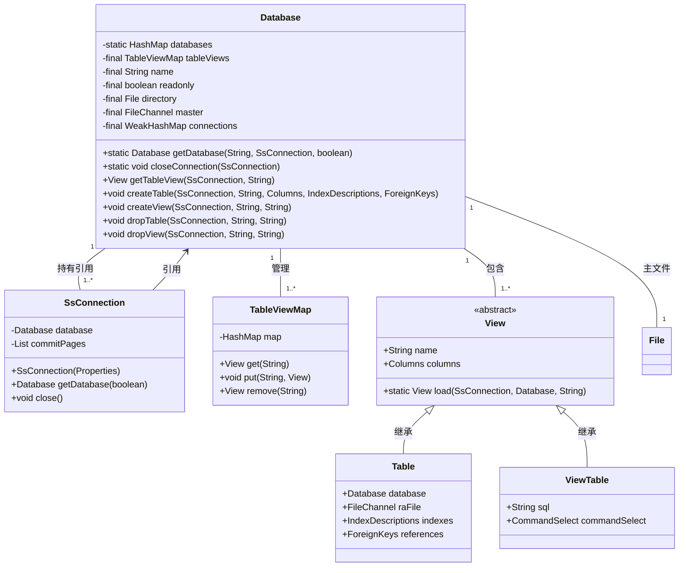
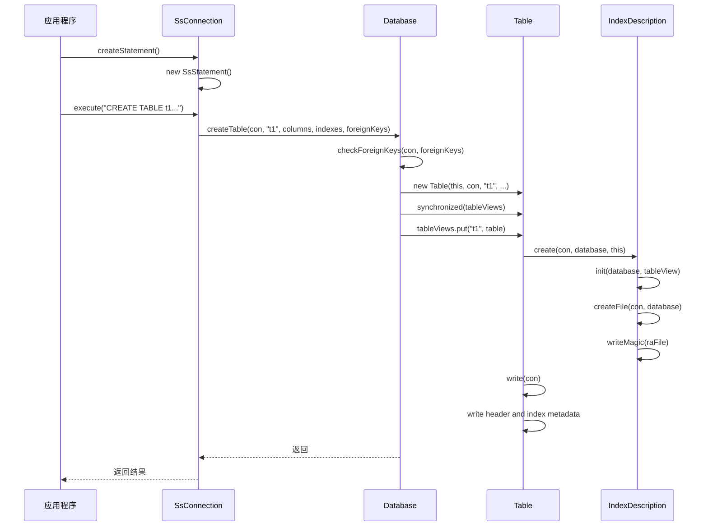
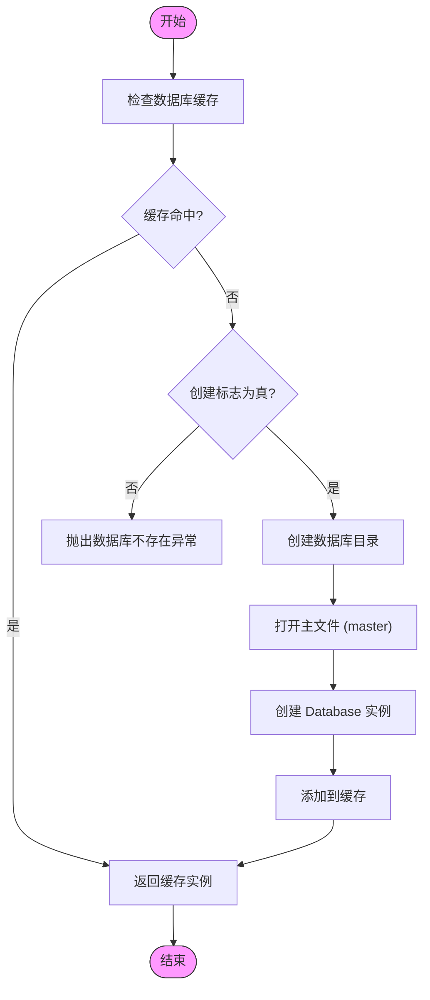

# 数据库组件

<cite>
**本文档中引用的文件**  
- [Database.java](file://src/main/java/io/leavesfly/smallsql/rdb/engine/Database.java)
- [SsConnection.java](file://src/main/java/io/leavesfly/smallsql/jdbc/SsConnection.java)
- [Table.java](file://src/main/java/io/leavesfly/smallsql/rdb/engine/Table.java)
- [View.java](file://src/main/java/io/leavesfly/smallsql/rdb/engine/View.java)
- [TableViewMap.java](file://src/main/java/io/leavesfly/smallsql/rdb/engine/table/TableViewMap.java)
- [IndexDescription.java](file://src/main/java/io/leavesfly/smallsql/rdb/engine/index/IndexDescription.java)
- [IndexDescriptions.java](file://src/main/java/io/leavesfly/smallsql/rdb/engine/index/IndexDescriptions.java)
- [ViewTable.java](file://src/main/java/io/leavesfly/smallsql/rdb/engine/ViewTable.java)
</cite>

## 目录
1. [引言](#引言)
2. [核心组件分析](#核心组件分析)
3. [数据库生命周期管理](#数据库生命周期管理)
4. [与SsConnection的交互机制](#与ssconnection的交互机制)
5. [并发控制与线程安全性](#并发控制与线程安全性)
6. [元数据管理与查询支持](#元数据管理与查询支持)
7. [结论](#结论)

## 引言

`Database`类是SmallSQL数据库引擎的核心容器，负责管理数据库的全局状态、表和视图的元数据、索引描述符以及事务上下文。作为数据库实例的单一入口点，它在多个连接和线程之间共享，因此其设计必须保证线程安全。该类不仅管理数据库的创建、加载和关闭过程，还协调与`SsConnection`对象的交互，确保连接上下文的正确传递和元数据的维护。本文档将深入解析`Database`类的设计与实现，阐述其在存储引擎中的核心作用。

**Section sources**
- [Database.java](file://src/main/java/io/leavesfly/smallsql/rdb/engine/Database.java#L1-L50)

## 核心组件分析

`Database`类是整个数据库系统的中心枢纽，其主要职责是作为存储引擎的核心容器，管理数据库中的所有表、视图、索引和连接。它通过一个静态的`HashMap`来缓存所有已打开的数据库实例，确保每个数据库在内存中只有一个`Database`对象，从而实现高效的资源共享。

### 数据库实例管理

`Database`类通过`getDatabase`静态方法来获取或创建数据库实例。该方法接收数据库名称、连接对象和创建标志作为参数。当请求一个数据库时，它会首先检查静态缓存中是否已存在该数据库的实例。如果不存在，且`create`标志为真，则会执行`CommandCreateDatabase`命令来创建新的数据库目录和主文件，然后创建一个新的`Database`实例并将其放入缓存。数据库的唯一性由其文件名和只读模式共同决定，这允许同一个数据库以不同的模式（读/写）被打开。

**Diagram sources**
- [Database.java](file://src/main/java/io/leavesfly/smallsql/rdb/engine/Database.java#L61-L564)
- [SsConnection.java](file://src/main/java/io/leavesfly/smallsql/jdbc/SsConnection.java#L74-L715)
- [TableViewMap.java](file://src/main/java/io/leavesfly/smallsql/rdb/engine/table/TableViewMap.java#L0-L79)
- [View.java](file://src/main/java/io/leavesfly/smallsql/rdb/engine/View.java#L0-L205)
- [Table.java](file://src/main/java/io/leavesfly/smallsql/rdb/engine/Table.java#L0-L608)
- [ViewTable.java](file://src/main/java/io/leavesfly/smallsql/rdb/engine/ViewTable.java#L0-L157)

**Section sources**
- [Database.java](file://src/main/java/io/leavesfly/smallsql/rdb/engine/Database.java#L61-L150)
- [SsConnection.java](file://src/main/java/io/leavesfly/smallsql/jdbc/SsConnection.java#L74-L150)

### 表与视图管理

`Database`类使用`TableViewMap`来管理所有已加载的表和视图。`TableViewMap`是一个线程安全的映射，它将表/视图名称映射到对应的`View`对象。`View`是一个抽象基类，`Table`和`ViewTable`都继承自它。当通过`getTableView`方法请求一个表或视图时，`Database`会首先在`tableViews`映射中查找。如果未找到，它会调用`View.load`方法从磁盘加载该对象，并将其缓存到映射中。这种懒加载机制确保了只有在需要时才会创建和初始化表对象，从而优化了内存使用。

### 索引与外键管理

索引和外键的管理是`Database`类的重要职责。`IndexDescriptions`类是一个专门用于管理`IndexDescription`对象的集合。`IndexDescription`类封装了索引的元数据，如索引名称、类型（主键、唯一、普通索引）和所包含的列。当创建一个新表时，`Database.createTable`方法会先验证外键约束，然后创建`Table`对象，并将其添加到`tableViews`映射中。索引的物理文件创建是在`IndexDescription.create`方法中完成的，该方法会为每个索引创建一个独立的文件。

**Diagram sources**
- [Database.java](file://src/main/java/io/leavesfly/smallsql/rdb/engine/Database.java#L370-L405)
- [Table.java](file://src/main/java/io/leavesfly/smallsql/rdb/engine/Table.java#L100-L150)
- [IndexDescription.java](file://src/main/java/io/leavesfly/smallsql/rdb/engine/index/IndexDescription.java#L100-L150)

**Section sources**
- [Database.java](file://src/main/java/io/leavesfly/smallsql/rdb/engine/Database.java#L370-L405)
- [Table.java](file://src/main/java/io/leavesfly/smallsql/rdb/engine/Table.java#L100-L200)
- [IndexDescription.java](file://src/main/java/io/leavesfly/smallsql/rdb/engine/index/IndexDescription.java#L100-L200)

## 数据库生命周期管理

`Database`类的生命周期管理是其核心功能之一，涵盖了数据库的创建、加载和关闭全过程。

### 创建与加载

数据库的创建和加载由`getDatabase`方法统一处理。当`create`参数为`true`且数据库目录不存在时，系统会自动创建一个新的数据库。创建过程包括创建目录、生成主文件（master file）以及初始化`Database`对象。加载过程则更为直接：它会验证指定路径是否为一个有效的目录，并检查主文件是否存在。一旦验证通过，它会使用`Utils.openRaFile`方法打开主文件的`FileChannel`，该通道用于后续的元数据读写操作。

### 关闭与资源释放

数据库的关闭由`closeConnection`静态方法触发。当一个`SsConnection`对象被关闭时，它会调用`Database.closeConnection`方法。该方法会遍历所有已缓存的`Database`实例，从其`connections`弱引用映射中移除该连接。当某个`Database`实例的`connections`映射为空时，意味着没有连接再引用它，此时该数据库实例将从缓存中移除，并调用其私有的`close`方法。`close`方法会同步遍历`tableViews`映射，关闭所有已加载的表和视图，并最终关闭主文件的`FileChannel`，释放所有系统资源。

**Diagram sources**
- [Database.java](file://src/main/java/io/leavesfly/smallsql/rdb/engine/Database.java#L150-L200)
- [Database.java](file://src/main/java/io/leavesfly/smallsql/rdb/engine/Database.java#L200-L250)

**Section sources**
- [Database.java](file://src/main/java/io/leavesfly/smallsql/rdb/engine/Database.java#L150-L250)

## 与SsConnection的交互机制

`Database`类与`SsConnection`类之间存在着紧密的交互关系，这种关系是数据库功能得以实现的基础。

### 连接上下文传递

`SsConnection`对象在创建时，会通过`Database.getDatabase`方法获取一个`Database`实例的引用，并将其存储在`database`字段中。这个引用是连接执行所有数据库操作的基础。例如，当执行一个`SELECT`语句时，`SsStatement`会通过`SsConnection`获取`Database`实例，然后调用`Database.getTableView`来加载目标表的元数据，从而构建查询计划。这种设计将连接的上下文（如事务状态、隔离级别）与数据库的全局状态（如表结构）有效地结合在一起。

### 元数据维护

`Database`类提供了丰富的元数据查询方法，这些方法被`SsDatabaseMetaData`类所调用，以支持JDBC元数据接口。例如，`getTables`方法会扫描数据库目录，返回所有匹配模式的表名；`getColumns`方法会遍历所有表，获取其列的详细信息；`getPrimaryKeys`和`getIndexInfo`方法则会查询表的索引描述符，返回主键和索引的元数据。这些方法确保了应用程序可以通过标准的JDBC API来探索数据库的结构。

**Section sources**
- [Database.java](file://src/main/java/io/leavesfly/smallsql/rdb/engine/Database.java#L405-L564)
- [SsConnection.java](file://src/main/java/io/leavesfly/smallsql/jdbc/SsConnection.java#L150-L250)

## 并发控制与线程安全性

`Database`类的设计充分考虑了多连接环境下的并发控制和线程安全性。

### 线程安全设计

`Database`类本身是线程安全的，这主要通过`synchronized`关键字来实现。对`databases`静态缓存和`tableViews`实例映射的所有访问都被同步块保护。例如，在`getDatabase`方法中，对`databases`的访问是同步的，防止了多个线程同时创建同一个数据库实例。同样，在`getTableView`、`createTable`、`dropTable`等方法中，对`tableViews`的访问也是同步的，确保了表的加载、创建和删除操作的原子性。

### 全局锁管理

`Database`类通过`connections`字段（一个`WeakHashMap`）来管理对数据库实例的引用。`WeakHashMap`的使用是关键，它允许`Database`实例在没有强引用时被垃圾回收。当一个`SsConnection`被关闭时，它会从所有`Database`实例的`connections`映射中移除自身。一旦某个`Database`的`connections`映射为空，该实例就会被从缓存中移除并关闭。这种机制实现了数据库实例的自动卸载，避免了内存泄漏。

**Section sources**
- [Database.java](file://src/main/java/io/leavesfly/smallsql/rdb/engine/Database.java#L61-L100)
- [Database.java](file://src/main/java/io/leavesfly/smallsql/rdb/engine/Database.java#L250-L300)

## 元数据管理与查询支持

`Database`类提供了全面的元数据管理功能，支持JDBC标准的元数据查询。

### 元数据查询方法

`Database`类实现了一系列以`get`开头的方法，用于查询数据库的元数据：
- `getCatalogs`: 返回所有可用的数据库目录。
- `getTables`: 返回符合指定模式的所有表名。
- `getColumns`: 返回指定表的所有列的详细信息。
- `getPrimaryKeys`: 返回指定表的主键信息。
- `getIndexInfo`: 返回指定表的所有索引信息。
- `getReferenceKeys`: 返回指定表的外键约束信息。
- `getBestRowIdentifier`: 返回可用于唯一标识一行的最佳列。

这些方法构成了`SsDatabaseMetaData`类的基础，使得应用程序可以动态地发现数据库的结构。

**Section sources**
- [Database.java](file://src/main/java/io/leavesfly/smallsql/rdb/engine/Database.java#L405-L564)

## 结论

`Database`类是SmallSQL存储引擎的核心，它成功地扮演了数据库实例的单一容器角色。通过精心设计的静态缓存和懒加载机制，它高效地管理着表、视图、索引等核心组件。其生命周期管理确保了资源的正确创建和释放。与`SsConnection`的交互机制实现了连接上下文与数据库全局状态的无缝集成。通过`synchronized`块和`WeakHashMap`，它在多线程环境下保证了线程安全和资源的自动回收。最后，丰富的元数据查询方法为JDBC兼容性提供了坚实的基础。总体而言，`Database`类的设计体现了简洁、高效和健壮的工程原则。