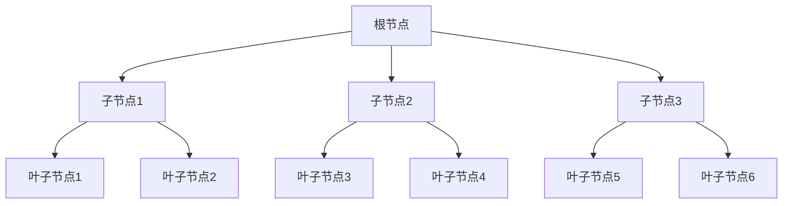
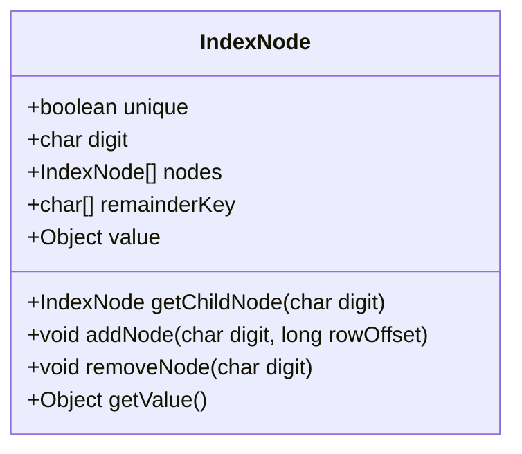
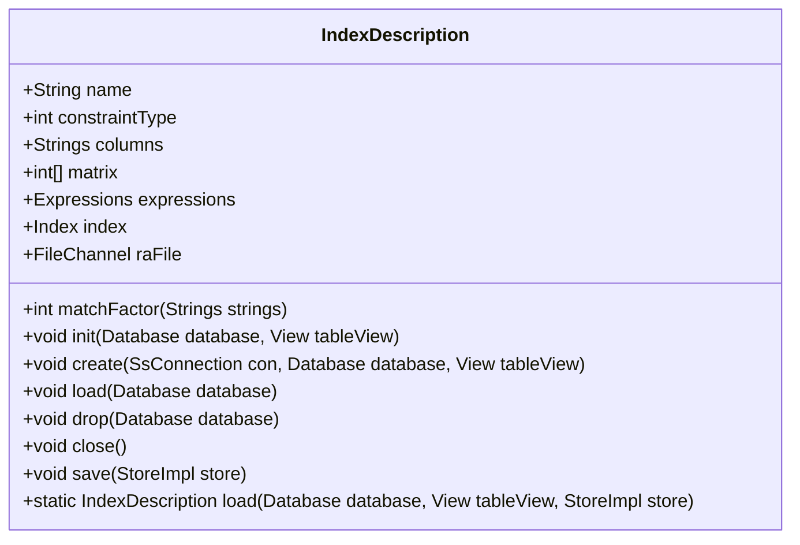
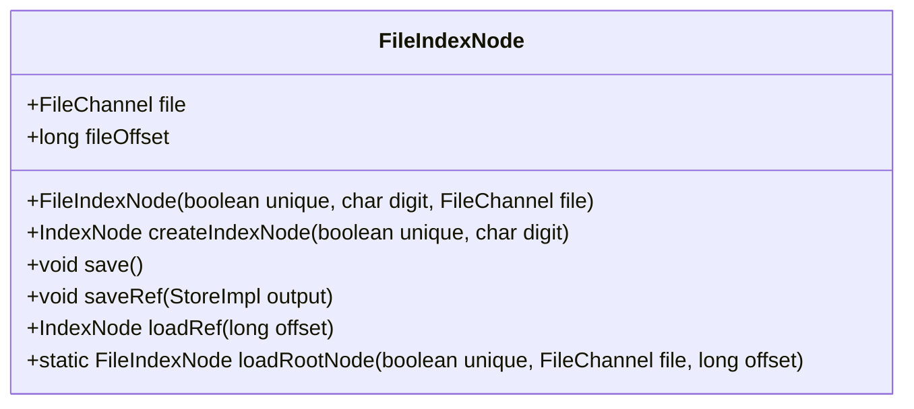
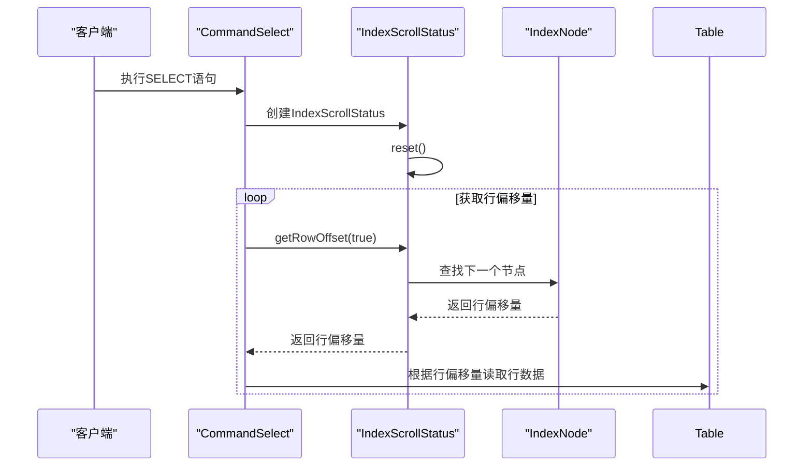

# 索引组件

<cite>
**本文档中引用的文件**  
- [Index.java](file://src/main/java/io/leavesfly/smallsql/rdb/engine/Index.java)
- [IndexNode.java](file://src/main/java/io/leavesfly/smallsql/rdb/engine/IndexNode.java)
- [IndexDescription.java](file://src/main/java/io/leavesfly/smallsql/rdb/engine/index/IndexDescription.java)
- [FileIndexNode.java](file://src/main/java/io/leavesfly/smallsql/rdb/engine/index/FileIndexNode.java)
- [IndexScrollStatus.java](file://src/main/java/io/leavesfly/smallsql/rdb/engine/IndexScrollStatus.java)
- [StoreImpl.java](file://src/main/java/io/leavesfly/smallsql/rdb/engine/store/StoreImpl.java)
</cite>

## 目录
1. [引言](#引言)
2. [索引结构与层级管理](#索引结构与层级管理)
3. [索引节点的内部组织](#索引节点的内部组织)
4. [索引描述与列定义](#索引描述与列定义)
5. [持久化索引节点支持](#持久化索引节点支持)
6. [查询执行路径分析](#查询执行路径分析)
7. [索引操作的性能影响与优化](#索引操作的性能影响与优化)

## 引言
本节深入解析SmallSQL数据库中B+树索引的实现机制。重点阐述`Index`类如何管理索引元数据和索引节点的层级结构，详细说明`IndexNode`的内部组织方式，包括键值对存储、子节点链接和分裂合并逻辑。同时，解释`IndexDescription`如何定义索引的列和排序规则，并描述`FileIndexNode`对持久化索引节点的支持。通过查询执行路径示例，展示索引查找、范围扫描和游标定位的具体实现，最后讨论索引构建、更新和删除操作对性能的影响及优化策略。

## 索引结构与层级管理
`Index`类是B+树索引的核心管理器，负责维护整个索引树的元数据和层级结构。它通过一个根节点（`rootPage`）来启动和管理整个索引树。索引树的构建基于内存中的多层节点结构，每个节点代表树的一个层级。

`Index`类在初始化时创建一个根节点，该节点是`IndexNode`的实例。所有对索引的操作（如查找、插入、删除）都从这个根节点开始，逐层向下遍历。索引支持唯一索引和非唯一索引两种模式，通过构造函数的`unique`参数进行区分。对于非唯一索引，一个键值可以对应多个行偏移量，这些行偏移量被存储在一个`LongTreeList`中。

索引的查找操作通过`findRows`方法实现。该方法接收一个表达式列表（`Expressions`），并根据这些表达式的值在索引树中进行逐层查找。查找过程从根节点开始，根据当前表达式的值计算出对应的“数字”（digit），然后在当前节点的子节点数组中查找对应的子节点。如果找到，则继续下一层的查找，直到到达叶子节点。如果在任何一层找不到对应的子节点，则说明该值不存在于索引中。

**图示来源**
- [Index.java](file://src/main/java/io/leavesfly/smallsql/rdb/engine/Index.java#L25-L50)
- [IndexNode.java](file://src/main/java/io/leavesfly/smallsql/rdb/engine/IndexNode.java#L45-L80)

**本节来源**
- [Index.java](file://src/main/java/io/leavesfly/smallsql/rdb/engine/Index.java#L1-L100)

## 索引节点的内部组织
`IndexNode`类是索引树中每个节点的具体实现，负责存储键值对、管理子节点链接以及处理节点的分裂和合并逻辑。每个`IndexNode`包含一个`digit`字段，表示该节点在父节点中的位置（即“数字”）。节点内部通过一个`nodes`数组来存储其子节点，通过`value`字段来存储该节点的值（可以是行偏移量、`LongTreeList`或下一个根节点）。

节点的内部状态由`nodes`、`value`和`remainderKey`三个字段共同决定。`remainderKey`用于存储键值的剩余部分，当键值的前缀相同但后缀不同时，可以将后缀部分存储在`remainderKey`中，从而减少树的深度。这种设计特别适用于处理长字符串等数据类型，可以显著提高索引的效率。

当向索引中添加新值时，`IndexNode`会根据键值的“数字”将其插入到相应的位置。如果该位置已经存在子节点，则递归地在子节点中继续插入。如果插入过程中发现节点已满，则会触发节点的分裂操作。分裂操作会创建一个新的兄弟节点，并将部分子节点和键值对移动到新节点中，然后将新节点的引用添加到父节点中。

**图示来源**
- [IndexNode.java](file://src/main/java/io/leavesfly/smallsql/rdb/engine/IndexNode.java#L15-L45)

**本节来源**
- [IndexNode.java](file://src/main/java/io/leavesfly/smallsql/rdb/engine/IndexNode.java#L1-L100)

## 索引描述与列定义
`IndexDescription`类用于定义索引的元数据，包括索引的名称、约束类型、列列表和表达式。它通过`columns`字段存储索引所涉及的列名列表，并通过`expressions`字段存储这些列对应的表达式。`IndexDescription`还提供了`matchFactor`方法，用于评估索引与给定列列表的匹配程度。

`IndexDescription`的`init`方法用于初始化索引描述，将列名映射到表中的实际列索引。`create`方法用于创建索引文件，并将索引描述信息写入文件。`load`方法用于从文件中加载索引描述信息。`save`和`load`方法分别用于将索引描述信息保存到和从`StoreImpl`对象中读取。

**图示来源**
- [IndexDescription.java](file://src/main/java/io/leavesfly/smallsql/rdb/engine/index/IndexDescription.java#L5-L20)

**本节来源**
- [IndexDescription.java](file://src/main/java/io/leavesfly/smallsql/rdb/engine/index/IndexDescription.java#L1-L100)

## 持久化索引节点支持
`FileIndexNode`类是`IndexNode`的子类，用于支持持久化索引节点。它通过`file`字段存储文件通道，并通过`fileOffset`字段存储节点在文件中的偏移量。`FileIndexNode`的`save`方法用于将节点数据写入文件，`saveRef`方法用于将节点引用写入输出流，`loadRef`方法用于从输入流中加载节点引用。

`FileIndexNode`的`loadRootNode`静态方法用于从文件中加载根节点。该方法首先创建一个`StorePage`对象，然后使用`StoreImpl`对象从文件中读取节点数据，并创建一个新的`FileIndexNode`实例。`FileIndexNode`的`save`方法会将节点数据写入文件，并更新`fileOffset`字段。

**图示来源**
- [FileIndexNode.java](file://src/main/java/io/leavesfly/smallsql/rdb/engine/index/FileIndexNode.java#L15-L45)

**本节来源**
- [FileIndexNode.java](file://src/main/java/io/leavesfly/smallsql/rdb/engine/index/FileIndexNode.java#L1-L100)

## 查询执行路径分析
索引的查询执行路径通过`IndexScrollStatus`类来管理。`IndexScrollStatus`类保存了在索引树中滚动的状态，类似于游标。它通过`nodeStack`栈来保存当前的节点路径，通过`longList`和`longListEnum`来缓存当前节点的行偏移量列表。

`IndexScrollStatus`的`reset`方法用于重置索引状态，准备开始新的扫描。`getRowOffset`方法用于获取下一个行偏移量，根据`scroll`参数决定是向前还是向后滚动。`afterLast`方法用于将索引移动到末尾位置。

查询执行路径的示例：当执行一个`SELECT`语句时，`CommandSelect`类会创建一个`IndexScrollStatus`对象，并调用其`reset`方法。然后，通过循环调用`getRowOffset`方法，逐个获取满足条件的行偏移量，并根据这些行偏移量从表中读取相应的行数据。

**图示来源**
- [IndexScrollStatus.java](file://src/main/java/io/leavesfly/smallsql/rdb/engine/IndexScrollStatus.java#L20-L60)
- [IndexNode.java](file://src/main/java/io/leavesfly/smallsql/rdb/engine/IndexNode.java#L30-L80)

**本节来源**
- [IndexScrollStatus.java](file://src/main/java/io/leavesfly/smallsql/rdb/engine/IndexScrollStatus.java#L1-L100)

## 索引操作的性能影响与优化
索引的构建、更新和删除操作对性能有显著影响。构建索引时，需要将所有数据插入到索引树中，这通常是一个耗时的过程。更新和删除操作可能会导致节点的分裂和合并，从而影响索引的性能。

为了优化索引性能，可以采取以下策略：
1. **批量插入**：在构建索引时，尽量使用批量插入的方式，减少单个插入操作的开销。
2. **预分配空间**：为索引文件预分配足够的空间，避免频繁的文件扩展操作。
3. **定期重建索引**：定期重建索引可以消除碎片，提高查询性能。
4. **选择合适的索引类型**：根据查询需求选择合适的索引类型，例如唯一索引、非唯一索引或复合索引。

此外，`Index`类中的`clear`方法可以快速清空整个索引，这对于需要频繁重建索引的场景非常有用。`removeValue`方法在删除索引项时，会检查节点是否为空，如果为空则从父节点中移除该节点，从而保持索引树的紧凑性。

**本节来源**
- [Index.java](file://src/main/java/io/leavesfly/smallsql/rdb/engine/Index.java#L500-L550)
- [IndexNode.java](file://src/main/java/io/leavesfly/smallsql/rdb/engine/IndexNode.java#L400-L450)