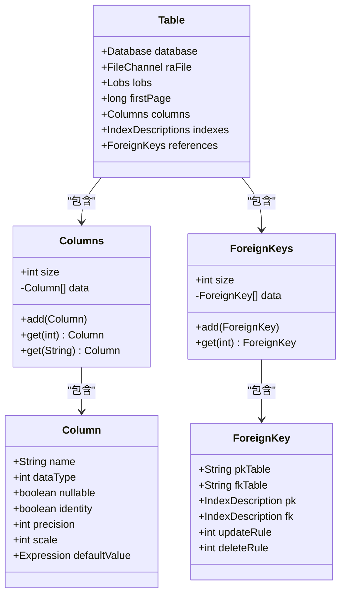
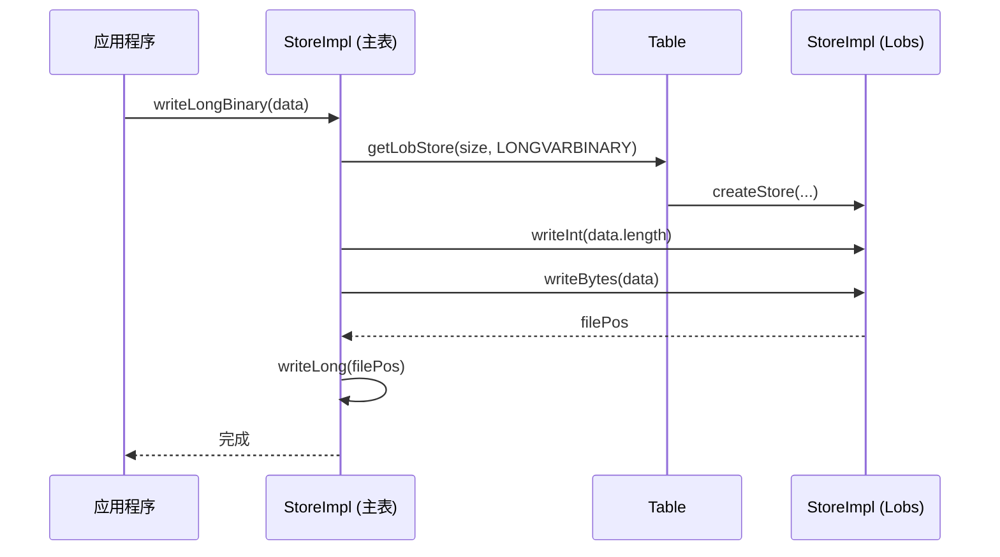
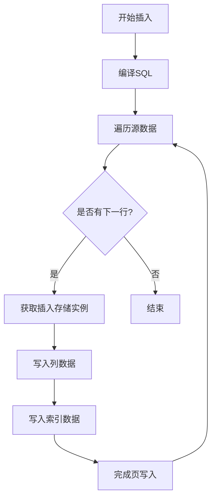

# 表组件

<cite>
**本文档中引用的文件**  
- [Table.java](file://src/main/java/io/leavesfly/smallsql/rdb/engine/Table.java)
- [Columns.java](file://src/main/java/io/leavesfly/smallsql/rdb/engine/table/Columns.java)
- [Column.java](file://src/main/java/io/leavesfly/smallsql/rdb/engine/table/Column.java)
- [ForeignKey.java](file://src/main/java/io/leavesfly/smallsql/rdb/engine/table/ForeignKey.java)
- [ForeignKeys.java](file://src/main/java/io/leavesfly/smallsql/rdb/engine/table/ForeignKeys.java)
- [Lobs.java](file://src/main/java/io/leavesfly/smallsql/rdb/engine/table/Lobs.java)
- [StoreImpl.java](file://src/main/java/io/leavesfly/smallsql/rdb/engine/store/StoreImpl.java)
- [TableStorePage.java](file://src/main/java/io/leavesfly/smallsql/rdb/engine/store/TableStorePage.java)
- [CommandInsert.java](file://src/main/java/io/leavesfly/smallsql/rdb/command/dml/CommandInsert.java)
- [CommandUpdate.java](file://src/main/java/io/leavesfly/smallsql/rdb/command/dml/CommandUpdate.java)
- [CommandDelete.java](file://src/main/java/io/leavesfly/smallsql/rdb/command/dml/CommandDelete.java)
</cite>

## 目录
1. [引言](#引言)
2. [核心结构与元数据封装](#核心结构与元数据封装)
3. [列集合管理机制](#列集合管理机制)
4. [外键关系维护](#外键关系维护)
5. [大对象数据支持](#大对象数据支持)
6. [与存储实现的交互协议](#与存储实现的交互协议)
7. [表级操作执行流程](#表级操作执行流程)
8. [编程示例与性能分析](#编程示例与性能分析)

## 引言
`Table` 类是 SmallSQL 数据库引擎中的核心组件，负责封装数据库表的完整元数据和数据存储逻辑。它不仅管理表的列定义、主键、外键和约束等结构信息，还通过与底层存储机制的紧密协作，实现高效的数据存取。本文档深入解析 `Table` 类的设计与行为，涵盖其元数据管理、列集合操作、外键维护、大对象（LOB）支持以及与存储实现类的交互协议。同时，通过分析插入、更新、删除等操作的调用链，揭示表级操作的执行流程，并提供编程示例与性能特征分析。

## 核心结构与元数据封装

`Table` 类继承自 `View`，是数据库中物理表的具体实现。它通过一系列字段和集合来封装表的完整元数据。

- **数据库与文件引用**：`database` 字段持有对所属 `Database` 对象的引用，`raFile` 是指向表数据文件的 `FileChannel`，用于直接的 I/O 操作。
- **元数据集合**：`columns` 字段（类型为 `Columns`）存储了表中所有列的定义。`indexes` 字段（类型为 `IndexDescriptions`）管理所有索引的描述信息。`references` 字段（类型为 `ForeignKeys`）则负责维护该表作为外键或主键的引用关系。
- **存储布局**：`firstPage` 记录了数据页的起始文件偏移量。`lobs` 字段（类型为 `Lobs`）是专门用于存储大对象数据的子组件。

`Table` 类提供了多个构造函数来处理不同场景：
- **读取现有表**：从文件中读取元数据，包括列、索引和外键信息。
- **创建新表**：根据传入的 `Columns`、`IndexDescriptions` 和 `ForeignKeys` 对象初始化新表。
- **修改现有表**：在表结构变更时使用，可以合并新旧索引信息。

**Section sources**
- [Table.java](file://src/main/java/io/leavesfly/smallsql/rdb/engine/Table.java#L59-L607)

## 列集合管理机制

列的元数据由 `Columns` 类进行管理，它是一个专为 `Column` 对象设计的类型化列表。

### Columns 类设计
`Columns` 类内部使用一个 `Column` 数组（`data`）和一个整型 `size` 来跟踪当前元素数量。其设计特点如下：
- **动态扩容**：当添加元素导致数组容量不足时，`add` 方法会调用 `resize` 方法将数组大小翻倍，确保添加操作的平均时间复杂度为 O(1)。
- **高效查找**：`get(String name)` 方法通过遍历数组，以不区分大小写的方式查找指定名称的列，时间复杂度为 O(n)。
- **内存效率**：`copy` 方法创建一个深拷贝，确保元数据的独立性。

### Column 类属性
`Column` 类封装了单个列的详细信息，包括：
- **名称与类型**：`name` 和 `dataType` 分别存储列名和 SQL 数据类型。
- **约束信息**：`nullable` 标记列是否允许空值，`identity` 标记是否为自增列。
- **精度与小数位**：`precision` 和 `scale` 用于数值类型（如 DECIMAL）。
- **默认值**：`defaultValue` 是一个 `Expression` 对象，表示插入时的默认值。`defaultDefinition` 是其字符串表示形式。

**Section sources**
- [Columns.java](file://src/main/java/io/leavesfly/smallsql/rdb/engine/table/Columns.java#L0-L140)
- [Column.java](file://src/main/java/io/leavesfly/smallsql/rdb/engine/table/Column.java#L0-L191)

## 外键关系维护

外键关系由 `ForeignKey` 和 `ForeignKeys` 两个类共同维护。

### ForeignKey 类
`ForeignKey` 类代表一个具体的外键约束，其核心属性包括：
- **主键表与外键表**：`pkTable` 和 `fkTable` 存储了主键表和外键表的名称。
- **索引描述**：`pk` 和 `fk` 是 `IndexDescription` 对象，分别指向主键和外键所依赖的索引。
- **参照动作**：`updateRule` 和 `deleteRule` 定义了更新和删除主键时的行为（当前固定为 `NO ACTION`）。

### ForeignKeys 类
`ForeignKeys` 类是一个 `ForeignKey` 对象的容器，其行为类似于 `Columns`，提供添加、查找和遍历等操作。当创建一个新表并包含外键时，`Table` 的构造函数会将该外键反向注册到主键表的 `references` 集合中，从而建立双向引用。



**Diagram sources**
- [Table.java](file://src/main/java/io/leavesfly/smallsql/rdb/engine/Table.java#L59-L607)
- [Columns.java](file://src/main/java/io/leavesfly/smallsql/rdb/engine/table/Columns.java#L0-L140)
- [Column.java](file://src/main/java/io/leavesfly/smallsql/rdb/engine/table/Column.java#L0-L191)
- [ForeignKeys.java](file://src/main/java/io/leavesfly/smallsql/rdb/engine/table/ForeignKeys.java#L0-L55)
- [ForeignKey.java](file://src/main/java/io/leavesfly/smallsql/rdb/engine/table/ForeignKey.java#L0-L55)

**Section sources**
- [ForeignKey.java](file://src/main/java/io/leavesfly/smallsql/rdb/engine/table/ForeignKey.java#L0-L55)
- [ForeignKeys.java](file://src/main/java/io/leavesfly/smallsql/rdb/engine/table/ForeignKeys.java#L0-L55)

## 大对象数据支持

对于 `BLOB` 和 `CLOB` 等大对象数据，`Table` 类通过 `Lobs` 组件进行支持。

### Lobs 组件
`Lobs` 类本身也继承自 `Table`，但它不存储常规行数据，而是专门用于存储大对象的二进制内容。它拥有独立的数据文件，文件名由主表名派生而来（通过 `Utils.createLobFileName` 方法）。

### 交互协议
当需要写入大对象时，`StoreImpl` 类的 `writeLongBinary` 或 `writeLongString` 方法会被调用。这些方法会：
1.  调用 `Table.getLobStore` 方法，为大对象数据请求一个 `StoreImpl` 实例。
2.  将大对象的实际数据写入 `Lobs` 组件的文件中。
3.  将 `Lobs` 文件中的偏移量（`filePos`）作为“指针”写入主表的行数据中。

读取时，`readLongBinary` 或 `readLongString` 方法会先从主表行中读取这个“指针”，然后使用它从 `Lobs` 文件中加载实际的大对象数据。



**Diagram sources**
- [Lobs.java](file://src/main/java/io/leavesfly/smallsql/rdb/engine/table/Lobs.java#L0-L60)
- [Table.java](file://src/main/java/io/leavesfly/smallsql/rdb/engine/Table.java#L59-L607)
- [StoreImpl.java](file://src/main/java/io/leavesfly/smallsql/rdb/engine/store/StoreImpl.java#L0-L799)

**Section sources**
- [Lobs.java](file://src/main/java/io/leavesfly/smallsql/rdb/engine/table/Lobs.java#L0-L60)

## 与存储实现的交互协议

`Table` 类与 `StoreImpl` 类之间通过一套清晰的协议进行交互，以实现数据的读写和事务控制。

### 获取存储实例
`Table` 提供了多个 `getStore*` 方法来获取 `StoreImpl` 实例，这些方法是交互的入口：
- `getStore(con, filePos, pageOperation)`：用于读取或更新指定位置的页。
- `getStoreInsert(con)`：用于获取一个用于插入新行的 `StoreImpl`。
- `getLobStore(con, filePos, pageOperation)`：用于访问大对象数据。

这些方法内部会调用 `requestLock` 来获取一个 `TableStorePage` 锁，然后基于此锁创建 `StoreImpl` 实例。

### 锁定与事务
`Table` 类维护了多个锁集合（`locks`, `locksInsert`），以支持多版本并发控制（MVCC）和行级锁。`requestLock` 方法根据连接的隔离级别和操作类型（SELECT, INSERT, UPDATE, DELETE）来决定是否授予锁，从而保证数据的一致性。

### 数据写入流程
当 `StoreImpl` 完成数据写入后，调用 `writeFinsh(con)` 方法。如果 `con` 不为 `null`，该操作会被加入到连接的提交队列中，等待事务提交；如果 `con` 为 `null`，则数据会立即写入文件。

**Section sources**
- [Table.java](file://src/main/java/io/leavesfly/smallsql/rdb/engine/Table.java#L59-L607)
- [StoreImpl.java](file://src/main/java/io/leavesfly/smallsql/rdb/engine/store/StoreImpl.java#L0-L799)
- [TableStorePage.java](file://src/main/java/io/leavesfly/smallsql/rdb/engine/store/TableStorePage.java#L0-L78)

## 表级操作执行流程

插入、更新和删除操作的执行流程清晰地展示了 `Table` 及其相关组件的协作。

### 插入操作 (INSERT)
1.  **编译**：`CommandInsert.compile` 方法解析 SQL，建立目标列与源值的映射矩阵 `matrix`。
2.  **执行**：`CommandInsert.executeImpl` 方法遍历 `SELECT` 命令的结果集。
3.  **获取存储**：对每一行，调用 `table.getStoreInsert(con)` 获取一个用于插入的 `StoreImpl`。
4.  **写入数据**：根据 `matrix`，将源值写入 `StoreImpl`，并同时写入索引。
5.  **完成写入**：调用 `store.writeFinsh(con)` 将页标记为待提交，并调用索引的 `writeFinish`。
6.  **提交**：在事务提交时，`TableStorePage.commit()` 方法将数据写入文件。



**Diagram sources**
- [CommandInsert.java](file://src/main/java/io/leavesfly/smallsql/rdb/command/dml/CommandInsert.java#L0-L207)

### 更新操作 (UPDATE)
1.  **执行查询**：`CommandUpdate.executeImpl` 首先执行 `SELECT` 查询以定位需要更新的行。
2.  **升级锁**：将所有涉及的 `TableResult` 的锁从 `SELECT` 升级为 `UPDATE`，防止读写冲突。
3.  **原子更新**：在 `synchronized` 块中，调用 `updateRow(con, newRowSources)` 方法。
4.  **获取写锁**：`updateRow` 内部会调用 `Table.requestWriteLock` 来获取该行的写锁。
5.  **写入新值**：创建一个新的 `StoreImpl` 来写入新数据。
6.  **处理页大小**：如果新数据过大，旧页会被标记为 `UPDATE_POINTER`，新数据写入新页。

### 删除操作 (DELETE)
1.  **执行查询**：`CommandDelete.executeImpl` 执行 `SELECT` 查询以定位要删除的行。
2.  **删除行**：对每一行，调用 `TableViewResult.deleteRow()` 方法。
3.  **标记删除**：`deleteRow` 方法最终会将对应页的状态标记为 `DELETED`。

**Section sources**
- [CommandInsert.java](file://src/main/java/io/leavesfly/smallsql/rdb/command/dml/CommandInsert.java#L0-L207)
- [CommandUpdate.java](file://src/main/java/io/leavesfly/smallsql/rdb/command/dml/CommandUpdate.java#L0-L116)
- [CommandDelete.java](file://src/main/java/io/leavesfly/smallsql/rdb/command/dml/CommandDelete.java#L0-L66)

## 编程示例与性能分析

### 元数据查询示例
```java
// 获取表的列信息
Table table = (Table) database.getTableView(con, "my_table");
for (int i = 0; i < table.columns.size(); i++) {
    Column col = table.columns.get(i);
    System.out.println("列名: " + col.getName() + ", 类型: " + col.getDataType());
}
```

### 数据访问示例
```java
// 插入一行数据
StoreImpl store = table.getStoreInsert(con);
store.writeBoolean(false); // not null
store.writeInt(123); // id
store.writeString("John Doe"); // name
store.writeFinsh(con); // 加入提交队列
```

### 性能特征分析
- **列查找**：`Columns.get(String)` 方法的时间复杂度为 O(n)，对于列数非常多的表，这可能成为瓶颈。建议在应用层缓存列索引。
- **动态扩容**：`Columns` 和 `ForeignKeys` 的动态扩容策略（翻倍）保证了添加操作的摊还时间复杂度为 O(1)。
- **大对象访问**：大对象的读写涉及两次 I/O（主表指针 + LOB 文件数据），且数据需要在内存中完整加载，对内存和 I/O 性能要求较高。
- **锁竞争**：`requestLock` 方法有 5 秒的超时限制，高并发场景下可能出现锁竞争和超时异常。

**Section sources**
- [Table.java](file://src/main/java/io/leavesfly/smallsql/rdb/engine/Table.java#L59-L607)
- [Columns.java](file://src/main/java/io/leavesfly/smallsql/rdb/engine/table/Columns.java#L0-L140)
- [StoreImpl.java](file://src/main/java/io/leavesfly/smallsql/rdb/engine/store/StoreImpl.java#L0-L799)