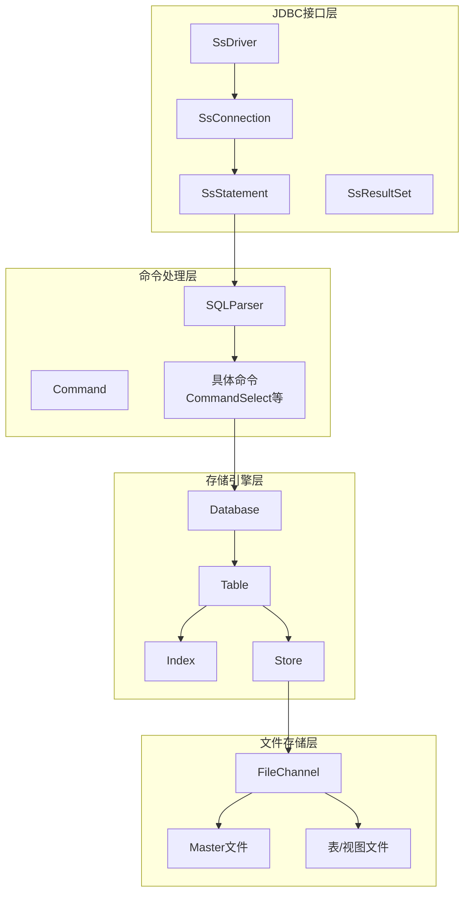
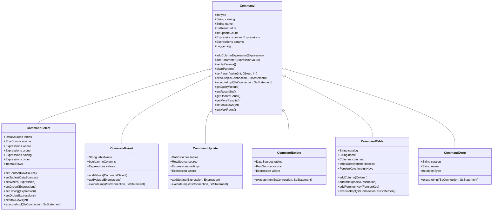
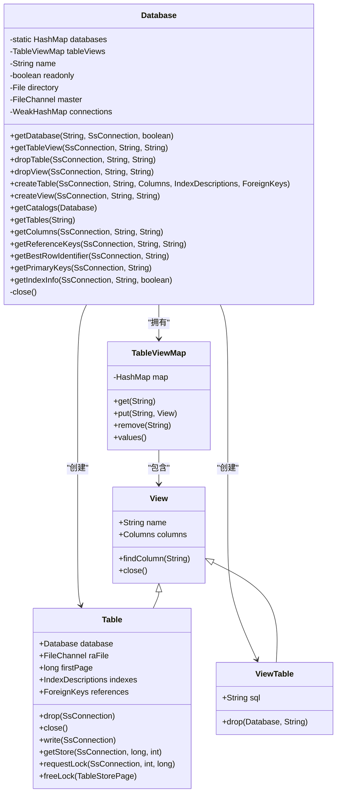
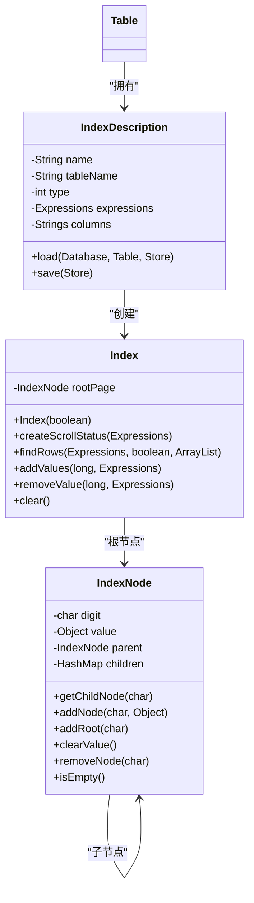
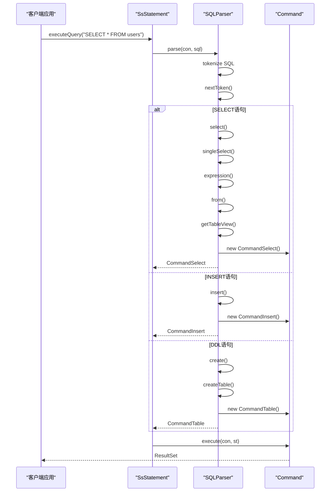
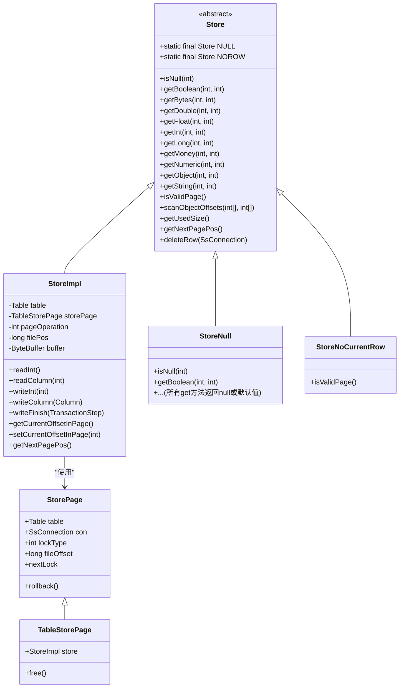
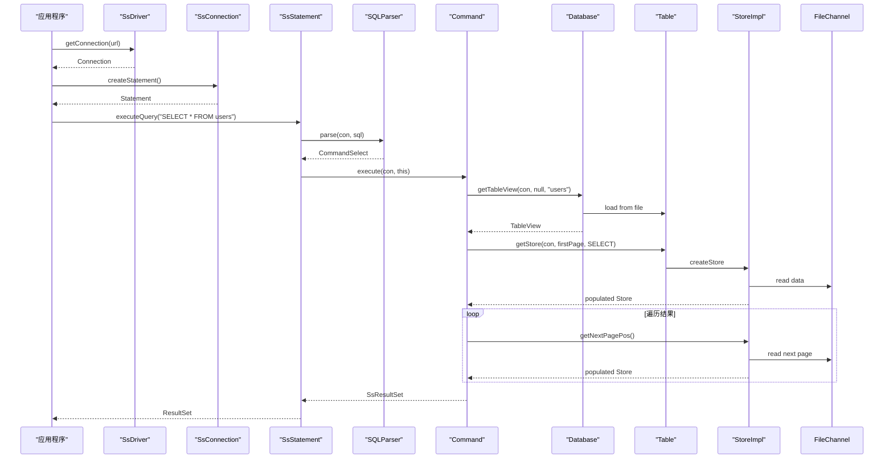

# 核心架构设计

<cite>
**本文档引用的文件**  
- [Command.java](file://src/main/java/io/leavesfly/smallsql/rdb/command/Command.java)
- [SQLParser.java](file://src/main/java/io/leavesfly/smallsql/rdb/sql/SQLParser.java)
- [Database.java](file://src/main/java/io/leavesfly/smallsql/rdb/engine/Database.java)
- [Table.java](file://src/main/java/io/leavesfly/smallsql/rdb/engine/Table.java)
- [Index.java](file://src/main/java/io/leavesfly/smallsql/rdb/engine/Index.java)
- [Store.java](file://src/main/java/io/leavesfly/smallsql/rdb/engine/Store.java)
- [StoreImpl.java](file://src/main/java/io/leavesfly/smallsql/rdb/engine/store/StoreImpl.java)
- [SsConnection.java](file://src/main/java/io/leavesfly/smallsql/jdbc/SsConnection.java)
- [SsStatement.java](file://src/main/java/io/leavesfly/smallsql/jdbc/statement/SsStatement.java)
- [SsDriver.java](file://src/main/java/io/leavesfly/smallsql/SsDriver.java)
</cite>

## 目录
1. [引言](#引言)
2. [分层架构概述](#分层架构概述)
3. [命令模式实现](#命令模式实现)
4. [核心组件分析](#核心组件分析)
5. [工厂模式在SQL解析中的应用](#工厂模式在sql解析中的应用)
6. [装饰器模式在存储层的应用](#装饰器模式在存储层的应用)
7. [数据流与控制流](#数据流与控制流)
8. [架构权衡与设计决策](#架构权衡与设计决策)
9. [结论](#结论)

## 引言
SmallSQL是一个轻量级的纯Java实现的关系型数据库管理系统，其设计遵循JDBC规范，提供完整的SQL支持。本文档深入分析其核心架构，重点阐述其分层设计、关键设计模式和组件间的交互机制。通过UML类图和序列图，我们将可视化关键的交互流程，并探讨架构决策背后的权衡。

## 分层架构概述
SmallSQL采用清晰的分层架构，将系统划分为多个职责明确的层次，确保了代码的可维护性和扩展性。从上至下，主要分为JDBC接口层、命令处理层、存储引擎层和文件存储层。

**图示来源**
- [SsDriver.java](file://src/main/java/io/leavesfly/smallsql/SsDriver.java)
- [SsConnection.java](file://src/main/java/io/leavesfly/smallsql/jdbc/SsConnection.java)
- [SsStatement.java](file://src/main/java/io/leavesfly/smallsql/jdbc/statement/SsStatement.java)
- [SQLParser.java](file://src/main/java/io/leavesfly/smallsql/rdb/sql/SQLParser.java)
- [Command.java](file://src/main/java/io/leavesfly/smallsql/rdb/command/Command.java)
- [Database.java](file://src/main/java/io/leavesfly/smallsql/rdb/engine/Database.java)
- [Table.java](file://src/main/java/io/leavesfly/smallsql/rdb/engine/Table.java)
- [Index.java](file://src/main/java/leavesfly/smallsql/rdb/engine/Index.java)
- [Store.java](file://src/main/java/leavesfly/smallsql/rdb/engine/Store.java)

## 命令模式实现
命令模式是SmallSQL架构的核心，它将SQL语句的执行封装为对象，实现了请求的发送者和接收者之间的解耦。`Command`抽象类是所有具体命令的基类。

**图示来源**
- [Command.java](file://src/main/java/io/leavesfly/smallsql/rdb/command/Command.java)
- [CommandSelect.java](file://src/main/java/io/leavesfly/smallsql/rdb/command/dql/CommandSelect.java)
- [CommandInsert.java](file://src/main/java/io/leavesfly/smallsql/rdb/command/dml/CommandInsert.java)
- [CommandUpdate.java](file://src/main/java/io/leavesfly/smallsql/rdb/command/dml/CommandUpdate.java)
- [CommandDelete.java](file://src/main/java/io/leavesfly/smallsql/rdb/command/dml/CommandDelete.java)
- [CommandTable.java](file://src/main/java/io/leavesfly/smallsql/rdb/command/ddl/CommandTable.java)
- [CommandDrop.java](file://src/main/java/io/leavesfly/smallsql/rdb/command/ddl/CommandDrop.java)

`Command`类定义了所有命令的公共接口和行为。`execute`方法是命令的入口点，它提供了一个模板方法，首先保存当前的保存点，然后调用抽象的`executeImpl`方法执行具体逻辑，最后根据事务的自动提交状态进行提交或回滚。`executeImpl`方法由各个子类实现，负责具体的数据库操作。

`columnExpressions`和`params`字段分别用于存储SELECT语句的列表达式和预编译语句的参数。`verifyParams`方法确保所有参数都已设置，`clearParams`方法用于清除参数，为下一次执行做准备。

## 核心组件分析

### Database组件
`Database`类是整个数据库实例的管理核心，负责管理表、视图和连接。它采用单例模式（通过静态`HashMap`）来管理所有打开的数据库实例。

**图示来源**
- [Database.java](file://src/main/java/io/leavesfly/smallsql/rdb/engine/Database.java)
- [TableViewMap.java](file://src/main/java/io/leavesfly/smallsql/rdb/engine/table/TableViewMap.java)
- [View.java](file://src/main/java/io/leavesfly/smallsql/rdb/engine/View.java)
- [Table.java](file://src/main/java/io/leavesfly/smallsql/rdb/engine/Table.java)
- [ViewTable.java](file://src/main/java/io/leavesfly/smallsql/rdb/engine/View.java)

`Database`的生命周期由连接管理。当一个`SsConnection`请求一个数据库时，`getDatabase`方法会检查该数据库是否已打开，如果未打开则创建一个新的实例。`connections`字段使用`WeakHashMap`来跟踪所有引用该数据库的连接。当所有连接都关闭后，`closeConnection`方法会将该数据库实例从`databases`映射中移除并调用`close`方法，释放所有资源。

`tableViews`字段是一个`TableViewMap`，它缓存了所有已加载的表和视图对象。`getTableView`方法是访问表或视图的主要入口，它首先检查缓存，如果不存在则从磁盘加载。`createTable`和`createView`方法负责创建新的表或视图，并将其添加到缓存中。

### Table组件
`Table`类继承自`View`，代表一个具体的数据库表。它管理表的物理存储、索引和外键约束。

`Table`的构造函数分为三种：用于读取现有表、创建新表和修改现有表。当创建新表时，`write`方法会将表的元数据（列定义、索引等）写入文件的头部。`raFile`字段是`FileChannel`，直接与表的物理文件关联。

`requestLock`方法是并发控制的核心。它实现了行级和表级锁，确保在多线程环境下的数据一致性。锁的类型包括`LOCK_TAB`（表锁）、`LOCK_INSERT`（插入锁）、`LOCK_READ`（读锁）和`LOCK_WRITE`（写锁）。该方法会阻塞直到获取锁或超时。

### Index组件
`Index`类实现了B+树索引，用于加速数据检索。它是一个内存中的数据结构，其持久化由`IndexNode`类负责。

**图示来源**
- [Index.java](file://src/main/java/io/leavesfly/smallsql/rdb/engine/Index.java)
- [IndexNode.java](file://src/main/java/io/leavesfly/smallsql/rdb/engine/IndexNode.java)
- [IndexDescription.java](file://src/main/java/io/leavesfly/smallsql/rdb/engine/index/IndexDescription.java)
- [Table.java](file://src/main/java/io/leavesfly/smallsql/rdb/engine/Table.java)

`Index`的`findRows`方法是查询的核心。它根据表达式列表在B+树中进行搜索，返回匹配的行偏移量。`addValues`和`removeValue`方法分别用于插入和删除索引条目。为了支持不同数据类型的排序，SmallSQL实现了`floatToBinarySortOrder`、`doubleToBinarySortOrder`等静态方法，将原始值转换为具有相同排序顺序的二进制表示。

## 工厂模式在SQL解析中的应用
`SQLParser`类是工厂模式的典型应用，它根据SQL语句的类型动态创建相应的`Command`对象。

**图示来源**
- [SsStatement.java](file://src/main/java/io/leavesfly/smallsql/jdbc/statement/SsStatement.java)
- [SQLParser.java](file://src/main/java/io/leavesfly/smallsql/rdb/sql/SQLParser.java)
- [CommandSelect.java](file://src/main/java/io/leavesfly/smallsql/rdb/command/dql/CommandSelect.java)
- [CommandInsert.java](file://src/main/java/io/leavesfly/smallsql/rdb/command/dml/CommandInsert.java)
- [CommandTable.java](file://src/main/java/io/leavesfly/smallsql/rdb/command/ddl/CommandTable.java)

`SQLParser`的`parse`方法是工厂的入口。它首先将SQL字符串标记化，然后读取第一个关键字。根据关键字的值，它使用`switch`语句调用相应的解析方法（如`select`、`insert`、`create`等）。这些方法负责解析SQL语句的其余部分，并最终创建并返回一个具体的`Command`对象。

例如，`create`方法会进一步检查`CREATE`后的关键字，以确定是创建数据库、表还是视图，并调用`createDatabase`、`createTable`或`createView`。这种分层的工厂模式使得代码结构清晰，易于扩展新的SQL语句类型。

## 装饰器模式在存储层的应用
`Store`类及其子类是装饰器模式的应用，用于处理表文件中的数据页。

**图示来源**
- [Store.java](file://src/main/java/io/leavesfly/smallsql/rdb/engine/Store.java)
- [StoreImpl.java](file://src/main/java/io/leavesfly/smallsql/rdb/engine/store/StoreImpl.java)
- [StoreNull.java](file://src/main/java/io/leavesfly/smallsql/rdb/engine/store/StoreNull.java)
- [StoreNoCurrentRow.java](file://src/main/java/io/leavesfly/smallsql/rdb/engine/store/StoreNoCurrentRow.java)
- [TableStorePage.java](file://src/main/java/io/leavesfly/smallsql/rdb/engine/store/TableStorePage.java)

`Store`是一个抽象类，定义了访问数据页的接口。`StoreImpl`是具体的实现，它包装了一个`ByteBuffer`，提供了对数据的读写操作。`Store`类中定义了两个特殊的静态实例：`NULL`和`NOROW`。`NULL`是一个空存储，所有`get`方法都返回`null`或默认值，用于处理`NULL`值。`NOROW`表示当前没有有效的行，`isValidPage`方法返回`false`。

`TableStorePage`类是`StorePage`的子类，它代表一个被锁定的数据页。`StoreImpl`在创建时会与一个`TableStorePage`关联，从而获得对文件的访问权限。这种设计允许`Store`类在不同的上下文中表现出不同的行为，例如在读取、写入或插入时，而无需改变其接口。

## 数据流与控制流
从JDBC接口到存储引擎，数据流和控制流遵循一个清晰的路径。

**图示来源**
- [SsDriver.java](file://src/main/java/io/leavesfly/smallsql/SsDriver.java)
- [SsConnection.java](file://src/main/java/io/leavesfly/smallsql/jdbc/SsConnection.java)
- [SsStatement.java](file://src/main/java/io/leavesfly/smallsql/jdbc/statement/SsStatement.java)
- [SQLParser.java](file://src/main/java/io/leavesfly/smallsql/rdb/sql/SQLParser.java)
- [CommandSelect.java](file://src/main/java/io/leavesfly/smallsql/rdb/command/dql/CommandSelect.java)
- [Database.java](file://src/main/java/io/leavesfly/smallsql/rdb/engine/Database.java)
- [Table.java](file://src/main/java/io/leavesfly/smallsql/rdb/engine/Table.java)
- [StoreImpl.java](file://src/main/java/io/leavesfly/smallsql/rdb/engine/store/StoreImpl.java)

1.  **连接建立**：应用程序通过`SsDriver`的`connect`方法获取一个`SsConnection`。
2.  **语句执行**：应用程序通过`SsConnection`创建一个`SsStatement`，并调用其`executeQuery`方法。
3.  **SQL解析**：`SsStatement`将SQL字符串传递给`SQLParser`，`SQLParser`将其解析为一个`CommandSelect`对象。
4.  **命令执行**：`SsStatement`调用`CommandSelect`的`execute`方法。
5.  **元数据访问**：`CommandSelect`通过`Database.getTableView`方法获取`Table`对象。如果表未缓存，则从磁盘加载。
6.  **数据访问**：`CommandSelect`调用`Table.getStore`方法获取一个`StoreImpl`实例，该实例包装了文件的第一个数据页。
7.  **结果生成**：`CommandSelect`使用`StoreImpl`读取数据，并将其组织成`SsResultSet`返回给应用程序。

## 架构权衡与设计决策
SmallSQL的架构设计体现了多个关键的权衡和决策：

1.  **纯Java实现**：选择纯Java实现确保了跨平台兼容性，无需依赖本地库。这简化了部署，但可能在性能上不如C/C++实现的数据库。
2.  **文件存储而非内存存储**：数据持久化到文件系统，保证了数据的持久性。这牺牲了内存数据库的速度优势，但换来了可靠性和大容量存储能力。
3.  **轻量级设计**：SmallSQL专注于核心功能，避免了复杂的功能（如存储过程、复杂的触发器），使其成为一个轻量级的嵌入式数据库，适合资源受限的环境。
4.  **基于JDBC**：完全遵循JDBC规范，使其可以无缝集成到任何Java应用中，极大地提高了其可用性和互操作性。
5.  **内存中索引**：索引在内存中维护，提供了快速的查询性能。但这意味着索引的大小受限于可用内存，重启后需要重建。

## 结论
SmallSQL通过精心设计的分层架构和多种设计模式的组合，构建了一个功能完整、结构清晰的轻量级数据库系统。命令模式统一了SQL操作的执行，工厂模式实现了SQL语句到命令对象的动态创建，装饰器模式灵活地处理了数据存储的多种状态。`Database`、`Table`和`Index`等核心组件职责明确，协同工作，高效地管理数据。尽管在性能和功能上无法与大型数据库系统相比，但其简洁的设计和纯Java实现使其成为嵌入式应用和学习数据库原理的理想选择。