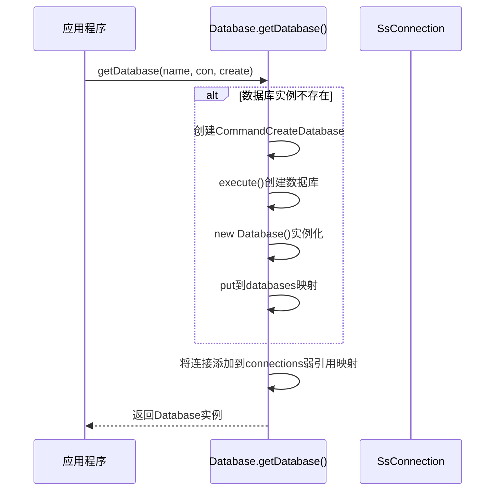
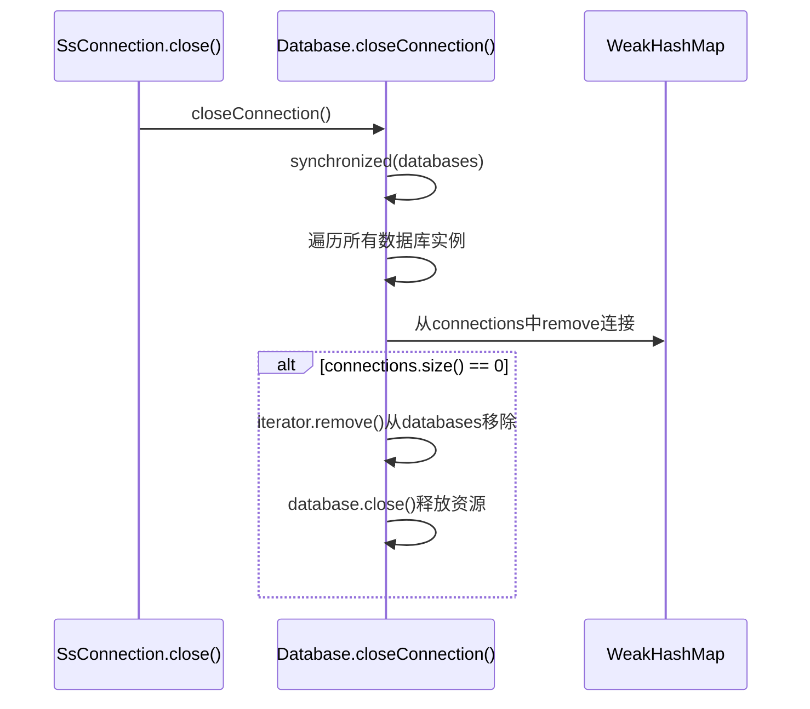
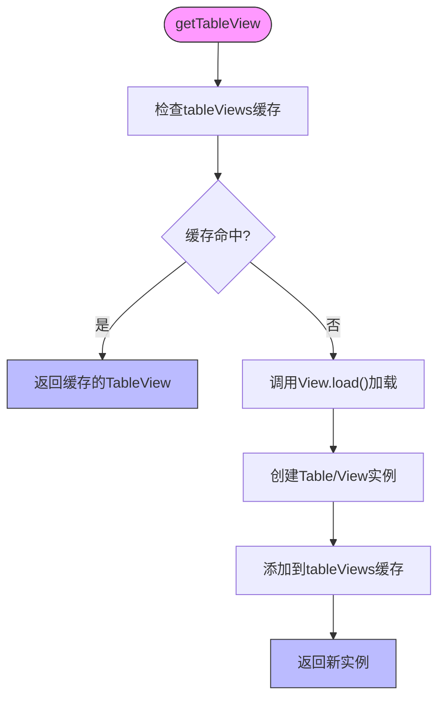
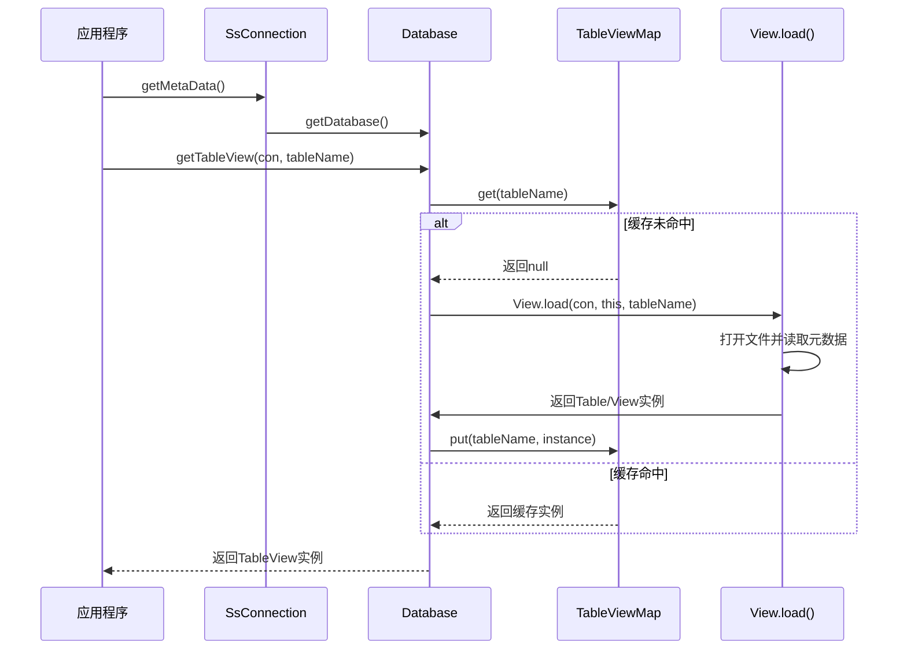
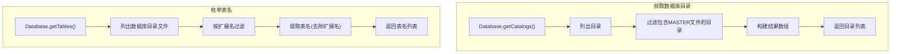

# Database管理

<cite>
**本文档引用的文件**   
- [Database.java](file://src/main/java/io/leavesfly/smallsql/rdb/engine/Database.java)
- [TableViewMap.java](file://src/main/java/io/leavesfly/smallsql/rdb/engine/table/TableViewMap.java)
- [SsConnection.java](file://src/main/java/io/leavesfly/smallsql/jdbc/SsConnection.java)
- [View.java](file://src/main/java/io/leavesfly/smallsql/rdb/engine/View.java)
- [Table.java](file://src/main/java/io/leavesfly/smallsql/rdb/engine/Table.java)
</cite>

## 目录
1. [核心职责概述](#核心职责概述)
2. [单例管理与连接引用计数](#单例管理与连接引用计数)
3. [连接关闭与资源清理](#连接关闭与资源清理)
4. [表视图缓存机制](#表视图缓存机制)
5. [JDBC连接到表实例加载流程](#jdbc连接到表实例加载流程)
6. [数据库目录与表名枚举](#数据库目录与表名枚举)

## 核心职责概述

Database类作为数据库容器的核心，负责管理数据库实例的生命周期、表和视图的缓存、连接引用计数以及资源清理。该类是线程安全的，被所有连接到同一数据库的连接共享。

**Section sources**
- [Database.java](file://src/main/java/io/leavesfly/smallsql/rdb/engine/Database.java#L61-L79)

## 单例管理与连接引用计数

Database类通过静态工厂方法getDatabase()实现数据库实例的单例管理和连接引用计数。该方法接收数据库名称、连接对象和创建标志作为参数，确保同一数据库名称和只读模式的组合只存在一个实例。

**Diagram sources**
- [Database.java](file://src/main/java/io/leavesfly/smallsql/rdb/engine/Database.java#L84-L111)
- [SsConnection.java](file://src/main/java/io/leavesfly/smallsql/jdbc/SsConnection.java#L74-L715)

**Section sources**
- [Database.java](file://src/main/java/io/leavesfly/smallsql/rdb/engine/Database.java#L84-L111)

## 连接关闭与资源清理

closeConnection()方法通过WeakHashMap实现连接关闭后的资源清理。当连接关闭时，该方法会从所有数据库实例的connections映射中移除该连接引用。当某个数据库实例的连接引用计数降为零时，该数据库实例会被卸载并释放所有资源。

**Diagram sources**
- [Database.java](file://src/main/java/io/leavesfly/smallsql/rdb/engine/Database.java#L148-L167)
- [SsConnection.java](file://src/main/java/io/leavesfly/smallsql/jdbc/SsConnection.java#L704-L715)

**Section sources**
- [Database.java](file://src/main/java/io/leavesfly/smallsql/rdb/engine/Database.java#L148-L167)

## 表视图缓存机制

TableViewMap类负责缓存表和视图实例，通过懒加载机制提高性能。该类使用HashMap存储表视图对象，并通过getUniqueKey()方法生成不区分大小写的唯一键，确保在不同操作系统上的一致性。

**Diagram sources**
- [Database.java](file://src/main/java/io/leavesfly/smallsql/rdb/engine/Database.java#L175-L197)
- [TableViewMap.java](file://src/main/java/io/leavesfly/smallsql/rdb/engine/table/TableViewMap.java#L25-L45)

**Section sources**
- [Database.java](file://src/main/java/io/leavesfly/smallsql/rdb/engine/Database.java#L175-L197)
- [TableViewMap.java](file://src/main/java/io/leavesfly/smallsql/rdb/engine/table/TableViewMap.java#L25-L45)

## JDBC连接到表实例加载流程

从JDBC连接获取到表实例加载的完整流程涉及多个组件的协作。当应用程序请求表实例时，系统首先通过连接获取数据库实例，然后从缓存中查找或加载表视图。

**Diagram sources**
- [Database.java](file://src/main/java/io/leavesfly/smallsql/rdb/engine/Database.java#L175-L197)
- [View.java](file://src/main/java/io/leavesfly/smallsql/rdb/engine/View.java#L75-L115)
- [Table.java](file://src/main/java/io/leavesfly/smallsql/rdb/engine/Table.java#L63-L100)

**Section sources**
- [Database.java](file://src/main/java/io/leavesfly/smallsql/rdb/engine/Database.java#L175-L197)
- [View.java](file://src/main/java/io/leavesfly/smallsql/rdb/engine/View.java#L75-L115)

## 数据库目录与表名枚举

通过Database类提供的方法可以获取数据库目录列表和枚举表名。getCatalogs()方法扫描当前工作目录或指定数据库的父目录，查找包含MASTER文件的目录作为有效数据库。getTables()方法则扫描数据库目录下的文件，根据文件扩展名识别表和视图。

**Diagram sources**
- [Database.java](file://src/main/java/io/leavesfly/smallsql/rdb/engine/Database.java#L305-L330)
- [Database.java](file://src/main/java/io/leavesfly/smallsql/rdb/engine/Database.java#L332-L348)

**Section sources**
- [Database.java](file://src/main/java/io/leavesfly/smallsql/rdb/engine/Database.java#L305-L348)