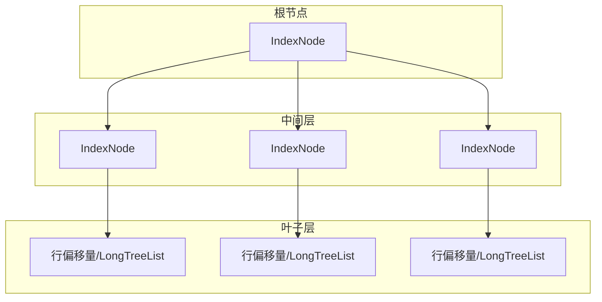
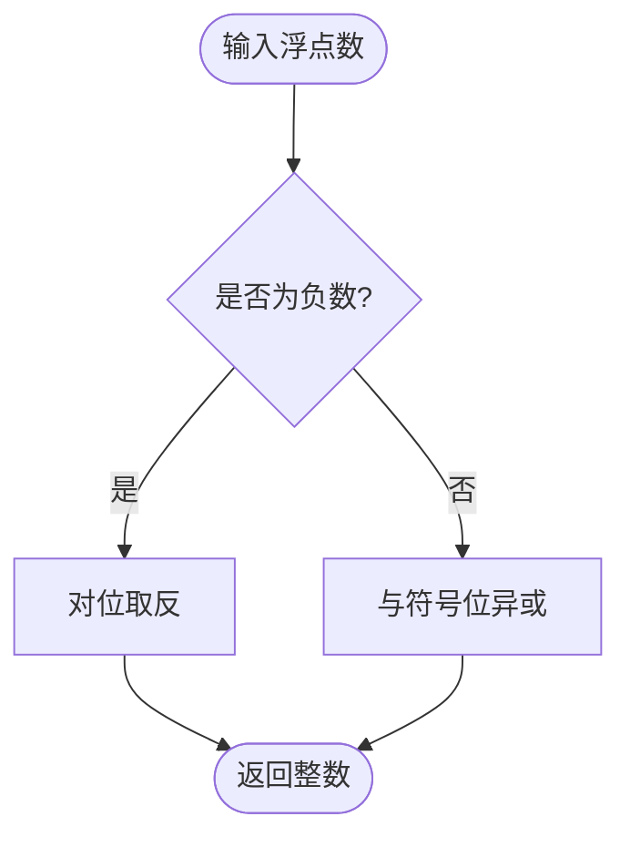
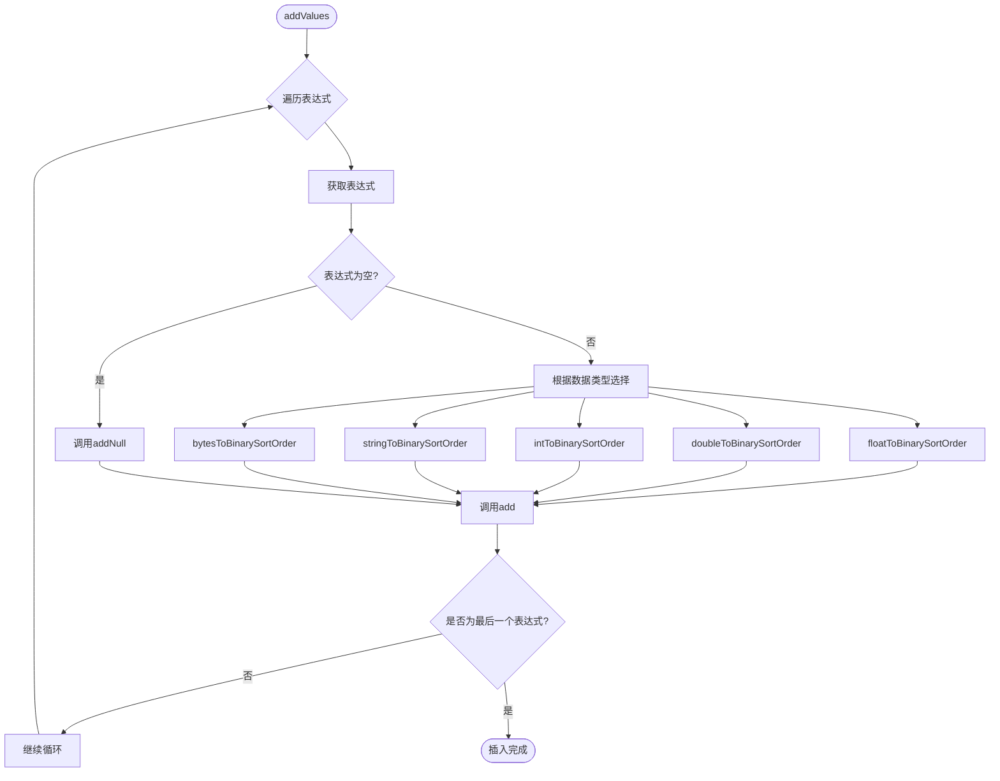
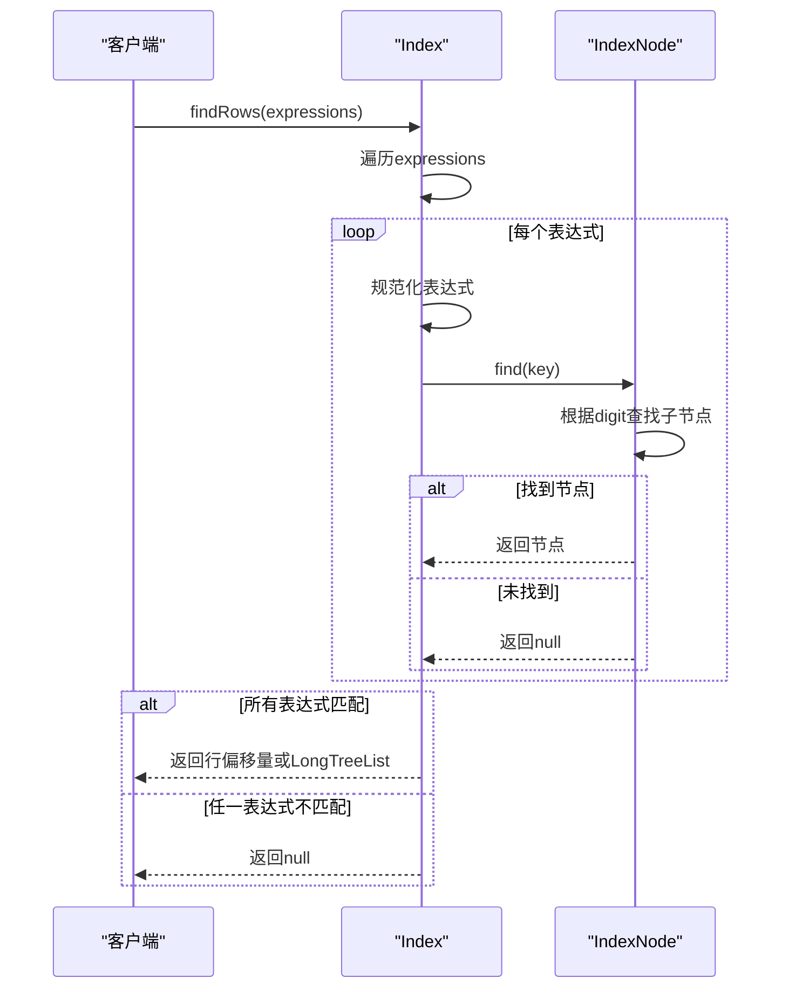
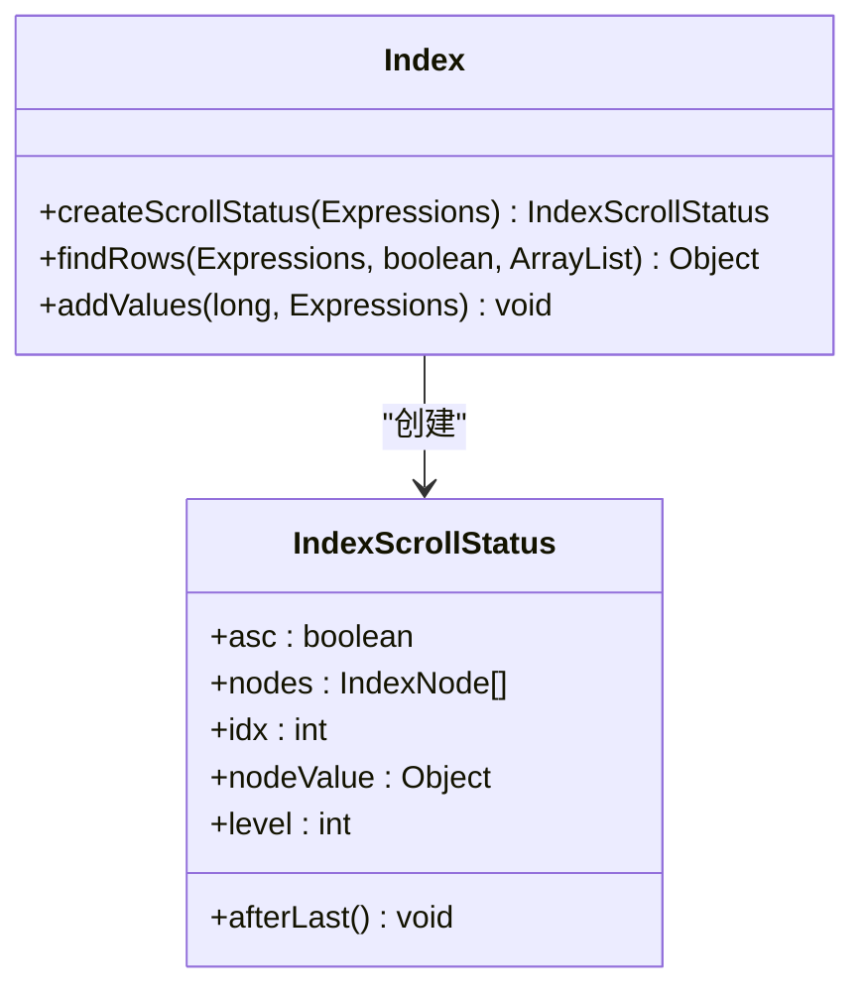

# Index实现

<cite>
**本文档中引用的文件**   
- [Index.java](file://src/main/java/io/leavesfly/smallsql/rdb/engine/Index.java)
- [IndexNode.java](file://src/main/java/io/leavesfly/smallsql/rdb/engine/IndexNode.java)
- [LongTreeList.java](file://src/main/java/io/leavesfly/smallsql/util/datastruct/LongTreeList.java)
- [Expressions.java](file://src/main/java/io/leavesfly/smallsql/rdb/sql/expression/Expressions.java)
- [Expression.java](file://src/main/java/io/leavesfly/smallsql/rdb/sql/expression/Expression.java)
- [FileIndexNode.java](file://src/main/java/io/leavesfly/smallsql/rdb/engine/index/FileIndexNode.java)
- [IndexNodeScrollStatus.java](file://src/main/java/io/leavesfly/smallsql/rdb/engine/index/IndexNodeScrollStatus.java)
</cite>

## 目录
1. [简介](#简介)
2. [核心组件](#核心组件)
3. [索引结构与设计](#索引结构与设计)
4. [数据规范化机制](#数据规范化机制)
5. [索引操作流程](#索引操作流程)
6. [查询与扫描机制](#查询与扫描机制)
7. [节点分裂与内存管理](#节点分裂与内存管理)
8. [性能考量](#性能考量)
9. [结论](#结论)

## 简介
本文档深入分析SmallSQL数据库系统中基于B+树的内存索引机制。重点阐述`Index`类如何通过`rootPage`维护索引根节点，`findRows()`方法如何遍历表达式树进行多列索引查找，以及`addValues()`如何将行偏移量插入索引。文档详细解释了`normalize`函数（如`floatToBinarySortOrder`、`stringToBinarySortOrder`）如何将各种数据类型转换为具有排序一致性的二进制表示。同时，阐述了`IndexNode`的256路树结构设计，包括digit分片、remainder值存储和节点分裂机制。最后，提供代码示例说明如何使用`Index.createScrollStatus()`创建索引扫描器和`Index.findRows()`执行等值查询。

## 核心组件

`Index`类是SmallSQL中内存索引的核心实现，它通过`IndexNode`构成的256路树结构来组织和管理数据。`Index`类的主要职责包括维护根节点、处理数据的插入与查找、以及管理索引的生命周期。`IndexNode`作为树的节点，负责存储实际的索引数据和指向子节点的引用。`LongTreeList`则用于在非唯一索引中存储多个行偏移量。

**Section sources**
- [Index.java](file://src/main/java/io/leavesfly/smallsql/rdb/engine/Index.java#L1-L554)
- [IndexNode.java](file://src/main/java/io/leavesfly/smallsql/rdb/engine/IndexNode.java#L1-L469)
- [LongTreeList.java](file://src/main/java/io/leavesfly/smallsql/util/datastruct/LongTreeList.java#L1-L636)

## 索引结构与设计

### 256路B+树结构
`IndexNode`采用256路树结构，每个节点最多可以有256个子节点。这种设计利用了16位字符（char）的高8位作为索引（digit），从而实现了高效的分层查找。树的每一层根据键值的某一部分（digit）进行分支，最终在叶子节点或中间节点的`value`字段中存储行偏移量或指向下一个索引的指针。

**Diagram sources**
- [IndexNode.java](file://src/main/java/io/leavesfly/smallsql/rdb/engine/IndexNode.java#L1-L469)

### 节点状态与数据存储
`IndexNode`通过`nodes`数组、`value`对象和`remainderKey`数组来管理其状态和数据。`nodes`数组存储指向子节点的引用，`value`可以是行偏移量（Long）、行偏移量列表（LongTreeList）、或指向下一个索引的根节点（IndexNode）。`remainderKey`用于存储键值的剩余部分，当键值的前缀足以区分时，可以将剩余部分直接存储在节点中，从而减少树的深度。

**Section sources**
- [IndexNode.java](file://src/main/java/io/leavesfly/smallsql/rdb/engine/IndexNode.java#L1-L469)

## 数据规范化机制

### 规范化函数
为了确保二进制排序与值的逻辑排序一致，`Index`类提供了一系列静态的规范化函数，将不同数据类型转换为具有排序一致性的二进制表示。

#### 浮点数规范化
`floatToBinarySortOrder`和`doubleToBinarySortOrder`函数通过位操作将浮点数转换为整数，确保负数的二进制表示小于正数，并且数值大小与二进制大小一致。

**Diagram sources**
- [Index.java](file://src/main/java/io/leavesfly/smallsql/rdb/engine/Index.java#L497-L552)

#### 整数规范化
`intToBinarySortOrder`和`shortToBinarySortOrder`函数通过与符号位异或，将有符号整数转换为无符号整数，从而保证排序一致性。

#### 字符串规范化
`stringToBinarySortOrder`函数将字符串转换为小写字符数组，确保不区分大小写的排序。对于定长字符串（CHAR），会去除尾部空格。

#### 二进制数据规范化
`bytesToBinarySortOrder`函数将字节数组直接转换为字符数组，每个字节映射到一个字符。

#### 数值类型规范化
`numericToBinarySortOrder`函数处理`MutableNumeric`类型的数值，将其内部表示转换为一个字符数组，其中第一个字符表示有效数字的长度。

**Section sources**
- [Index.java](file://src/main/java/io/leavesfly/smallsql/rdb/engine/Index.java#L497-L552)

## 索引操作流程

### 插入操作 (addValues)
`addValues`方法负责将一行数据的偏移量插入到索引中。它遍历`Expressions`中的每个表达式，根据其数据类型调用相应的规范化函数，然后调用`add`方法将规范化后的键值和行偏移量插入到树中。

**Diagram sources**
- [Index.java](file://src/main/java/io/leavesfly/smallsql/rdb/engine/Index.java#L224-L258)

### 查找操作 (findRows)
`findRows`方法用于根据给定的表达式查找对应的行偏移量。它同样遍历`Expressions`，对每个表达式进行规范化，然后调用`find`方法在树中查找。查找过程从根节点开始，根据键值的每个digit逐层向下，直到找到匹配的节点。

**Diagram sources**
- [Index.java](file://src/main/java/io/leavesfly/smallsql/rdb/engine/Index.java#L289-L339)

## 查询与扫描机制

### 索引扫描器 (IndexScrollStatus)
`IndexScrollStatus`类用于实现对索引的顺序扫描。通过`Index.createScrollStatus()`方法可以创建一个扫描器，该扫描器维护了当前扫描的位置和方向。

**Diagram sources**
- [Index.java](file://src/main/java/io/leavesfly/smallsql/rdb/engine/Index.java#L1-L554)
- [IndexNodeScrollStatus.java](file://src/main/java/io/leavesfly/smallsql/rdb/engine/index/IndexNodeScrollStatus.java#L1-L79)

## 节点分裂与内存管理

当一个节点的子节点数量超过256个时，需要进行节点分裂。虽然具体的分裂逻辑在提供的代码片段中未完全体现，但`IndexNode`的设计支持通过`addNode`和`saveNode`方法动态地添加和管理子节点。`LongTreeList`的内部结构也采用了树形压缩，以高效地存储大量行偏移量。

**Section sources**
- [IndexNode.java](file://src/main/java/io/leavesfly/smallsql/rdb/engine/IndexNode.java#L1-L469)
- [LongTreeList.java](file://src/main/java/io/leavesfly/smallsql/util/datastruct/LongTreeList.java#L1-L636)

## 性能考量
基于256路树的索引设计提供了极快的查找速度，时间复杂度接近O(log_256 n)。数据规范化确保了排序的正确性，而`remainderKey`机制减少了树的深度。`LongTreeList`的压缩存储优化了内存使用。整体设计在内存使用和查询性能之间取得了良好的平衡。

## 结论
SmallSQL的`Index`实现是一个高效、紧凑的内存索引系统。它通过创新的256路B+树结构、精确的数据规范化和智能的内存管理，为数据库提供了快速的查询能力。该设计充分考虑了不同类型数据的排序需求，并通过`IndexScrollStatus`等组件提供了灵活的查询接口，是SmallSQL数据库性能的关键组成部分。