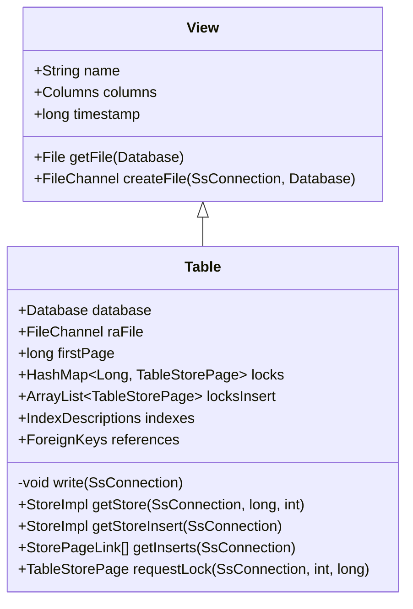
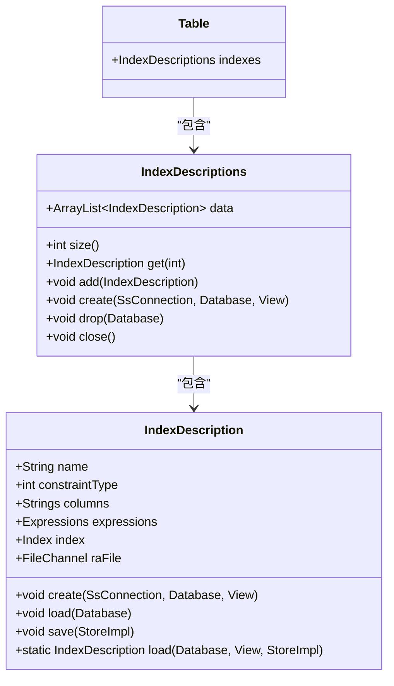
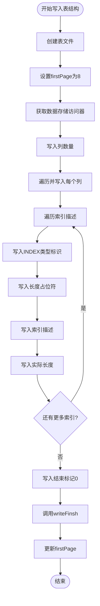
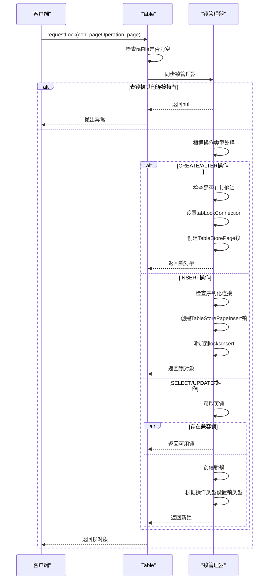
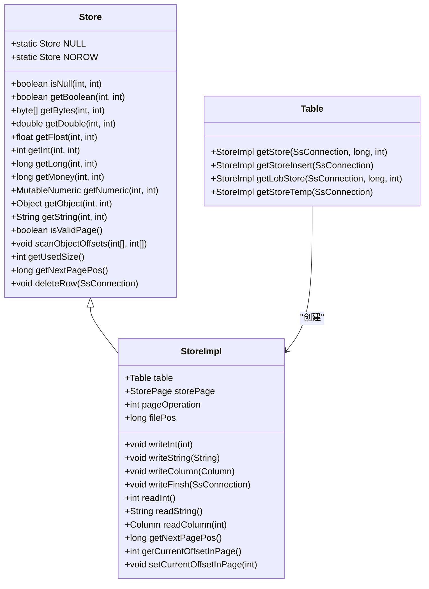
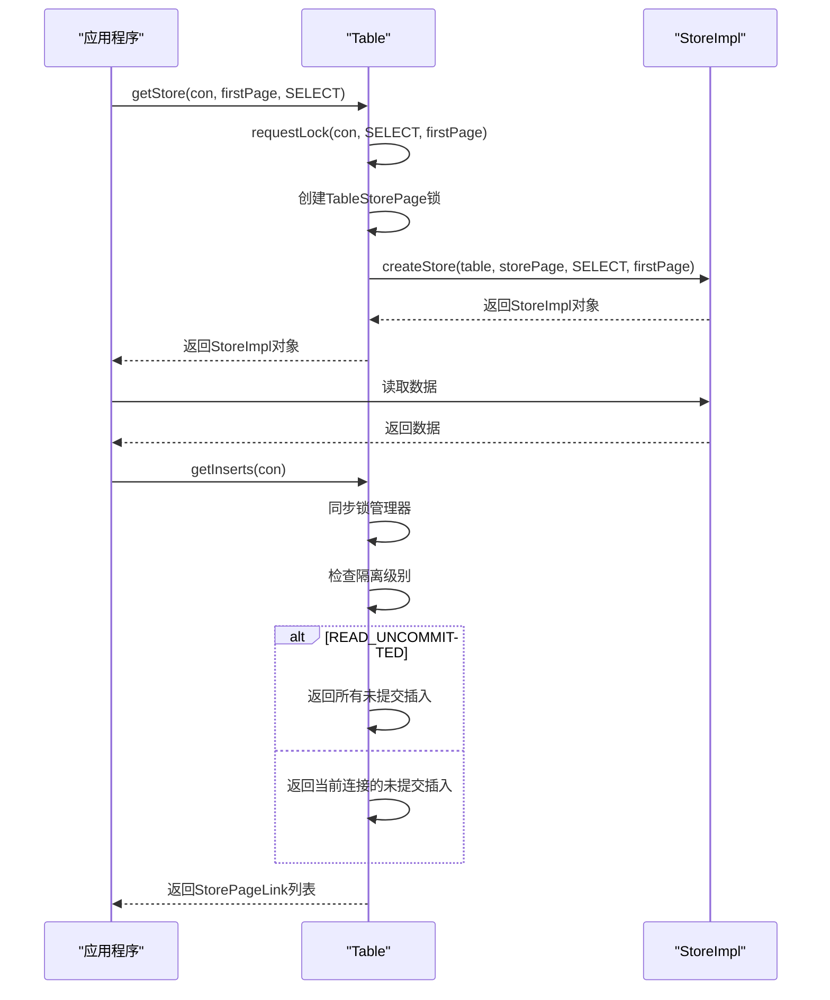

# Table结构

<cite>
**本文档中引用的文件**  
- [Table.java](file://src/main/java/io/leavesfly/smallsql/rdb/engine/Table.java)
- [View.java](file://src/main/java/io/leavesfly/smallsql/rdb/engine/View.java)
- [IndexDescription.java](file://src/main/java/io/leavesfly/smallsql/rdb/engine/index/IndexDescription.java)
- [Columns.java](file://src/main/java/io/leavesfly/smallsql/rdb/engine/table/Columns.java)
- [Store.java](file://src/main/java/io/leavesfly/smallsql/rdb/engine/Store.java)
</cite>

## 目录
1. [Table继承View的设计原理](#table继承view的设计原理)
2. [Table数据文件管理机制](#table数据文件管理机制)
3. [索引元数据关联机制](#索引元数据关联机制)
4. [表结构序列化实现](#表结构序列化实现)
5. [多粒度锁机制](#多粒度锁机制)
6. [数据存储访问器获取](#数据存储访问器获取)
7. [代码示例](#代码示例)

## Table继承View的设计原理

`Table`类继承自`View`抽象基类，实现了数据库表的核心功能。`View`类定义了表和视图的公共接口和基础属性，包括名称、列定义和时间戳等。`Table`类通过继承`View`获得了这些基础功能，并在此基础上扩展了表特有的功能，如数据文件管理、索引管理和锁机制。

`Table`类在构造函数中调用`super(name, new Columns())`初始化父类，然后设置数据库引用、文件通道和数据起始偏移量。这种设计模式实现了代码复用，同时保持了表和视图之间的统一接口。

**Section sources**
- [Table.java](file://src/main/java/io/leavesfly/smallsql/rdb/engine/Table.java#L59-L607)
- [View.java](file://src/main/java/io/leavesfly/smallsql/rdb/engine/View.java#L51-L204)

## Table数据文件管理机制

`Table`类通过`raFile`成员变量管理表数据文件，`firstPage`指向数据起始偏移量。`raFile`是`FileChannel`类型，用于随机访问表文件。`firstPage`记录了第一个数据页的文件偏移量，通常在表头信息之后。

当从现有表加载数据时，构造函数首先读取表头信息，然后使用`getStore`方法获取数据存储访问器。`write`方法负责将表结构序列化到文件，包括列定义和索引描述。`createFile`方法创建新的表文件并写入魔数和版本信息。

**Diagram sources**
- [Table.java](file://src/main/java/io/leavesfly/smallsql/rdb/engine/Table.java#L59-L607)
- [View.java](file://src/main/java/io/leavesfly/smallsql/rdb/engine/View.java#L51-L204)

**Section sources**
- [Table.java](file://src/main/java/io/leavesfly/smallsql/rdb/engine/Table.java#L59-L607)
- [View.java](file://src/main/java/io/leavesfly/smallsql/rdb/engine/View.java#L51-L204)

## 索引元数据关联机制

`Table`类通过`indexes`成员变量关联索引元数据。`indexes`是`IndexDescriptions`类型，包含表中所有索引的描述信息。每个索引由`IndexDescription`类表示，包含索引名称、约束类型、列列表和表达式等信息。

在表加载过程中，构造函数读取附加信息部分，当遇到`INDEX`类型时，调用`IndexDescription.load`方法加载索引描述。`write`方法在写入表结构时，遍历`indexes`中的每个`IndexDescription`，将其序列化到文件中。

**Diagram sources**
- [IndexDescription.java](file://src/main/java/io/leavesfly/smallsql/rdb/engine/index/IndexDescription.java#L67-L292)
- [Table.java](file://src/main/java/io/leavesfly/smallsql/rdb/engine/Table.java#L59-L607)

**Section sources**
- [IndexDescription.java](file://src/main/java/io/leavesfly/smallsql/rdb/engine/index/IndexDescription.java#L67-L292)
- [Table.java](file://src/main/java/io/leavesfly/smallsql/rdb/engine/Table.java#L59-L607)

## 表结构序列化实现

`write`方法实现了表结构的序列化。该方法首先创建表文件，然后获取数据存储访问器。序列化过程包括：写入列数量，遍历列定义并写入每个列；遍历索引描述，写入索引类型标识、长度占位符、索引描述本身和实际长度。

**Diagram sources**
- [Table.java](file://src/main/java/io/leavesfly/smallsql/rdb/engine/Table.java#L59-L607)

**Section sources**
- [Table.java](file://src/main/java/io/leavesfly/smallsql/rdb/engine/Table.java#L59-L607)

## 多粒度锁机制

`Table`类实现了多粒度锁机制，支持行锁、页锁和表锁。锁机制通过`locks`、`locksInsert`和`tabLockConnection`等成员变量实现。`requestLock`方法是锁请求的入口，根据操作类型和隔离级别决定是否授予锁。

对于`INSERT`操作，创建`TableStorePageInsert`锁并添加到`locksInsert`列表；对于`SELECT`和`UPDATE`操作，检查现有锁的兼容性，创建相应的读锁或写锁；对于`CREATE`和`ALTER`操作，需要获取表级锁。

**Diagram sources**
- [Table.java](file://src/main/java/io/leavesfly/smallsql/rdb/engine/Table.java#L59-L607)

**Section sources**
- [Table.java](file://src/main/java/io/leavesfly/smallsql/rdb/engine/Table.java#L59-L607)

## 数据存储访问器获取

`Table`类提供了`getStore`系列方法来获取不同操作类型的数据存储访问器。`getStore`方法用于读取和更新数据页，`getStoreInsert`方法用于获取插入操作的存储访问器，`getLobStore`方法用于获取LOB数据的存储访问器。

**Diagram sources**
- [Store.java](file://src/main/java/io/leavesfly/smallsql/rdb/engine/Store.java#L46-L90)
- [Table.java](file://src/main/java/io/leavesfly/smallsql/rdb/engine/Table.java#L59-L607)

**Section sources**
- [Store.java](file://src/main/java/io/leavesfly/smallsql/rdb/engine/Store.java#L46-L90)
- [Table.java](file://src/main/java/io/leavesfly/smallsql/rdb/engine/Table.java#L59-L607)

## 代码示例

以下代码示例展示了如何通过`Table.getStore()`读取数据页和`Table.getInserts()`获取未提交的插入记录：

**Diagram sources**
- [Table.java](file://src/main/java/io/leavesfly/smallsql/rdb/engine/Table.java#L59-L607)

**Section sources**
- [Table.java](file://src/main/java/io/leavesfly/smallsql/rdb/engine/Table.java#L59-L607)