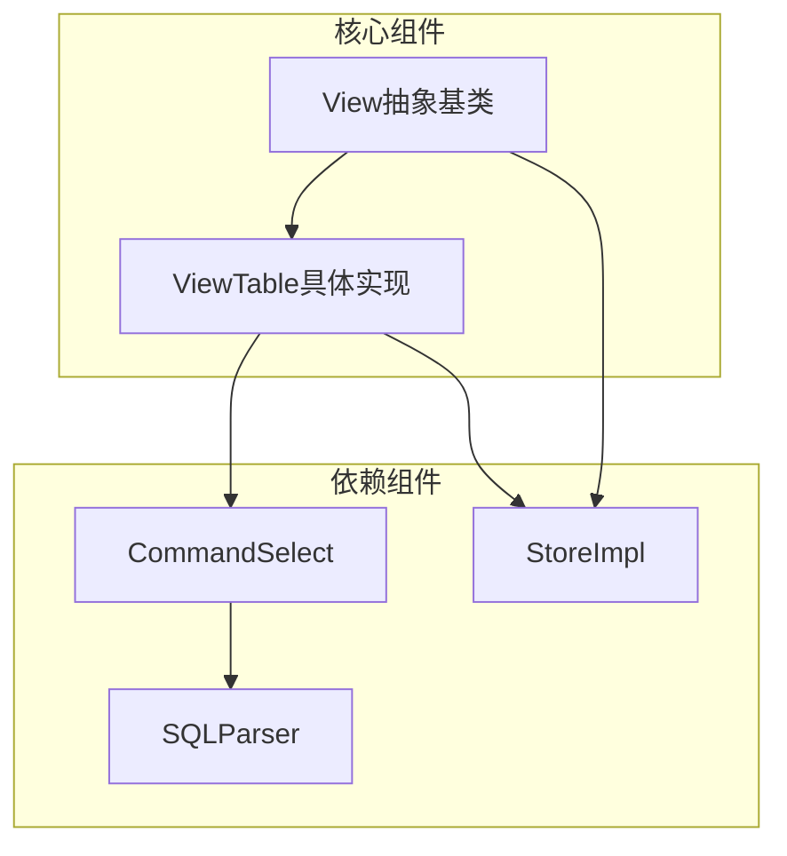
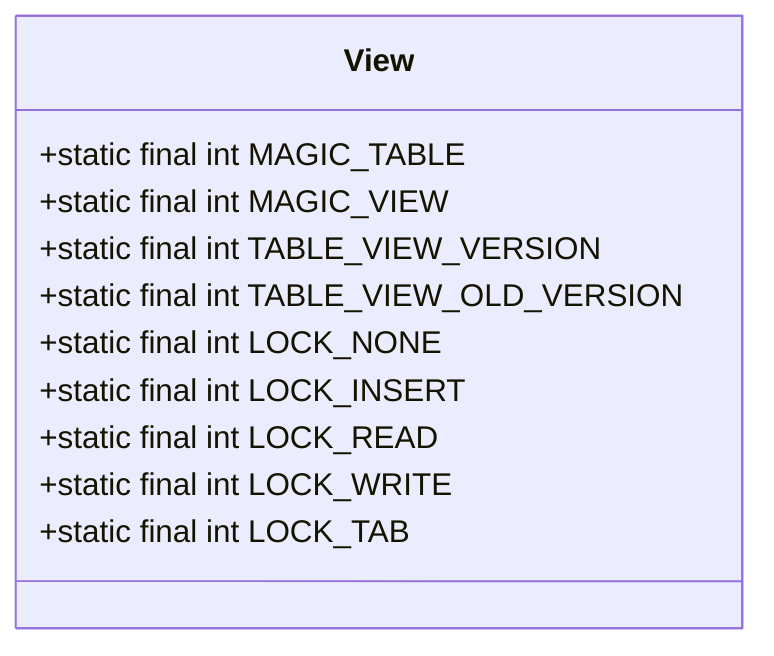
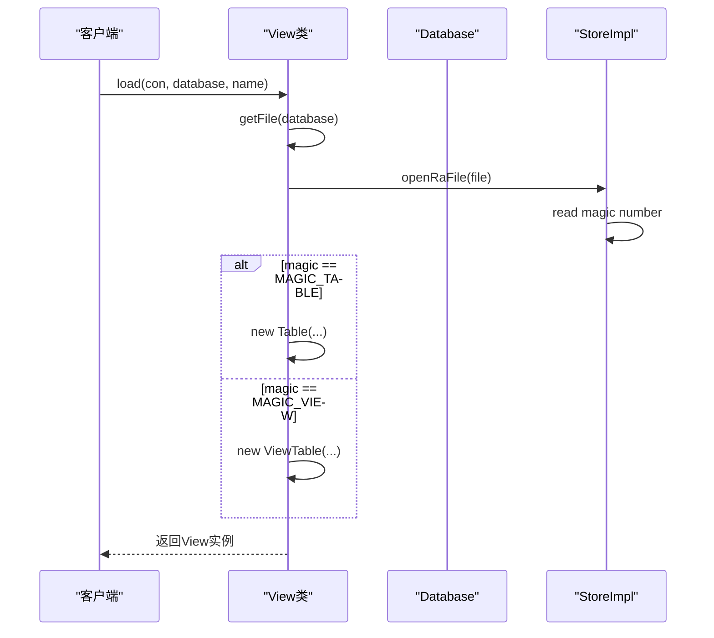
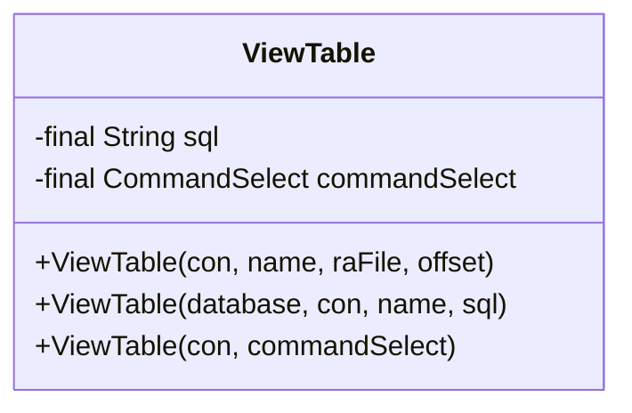
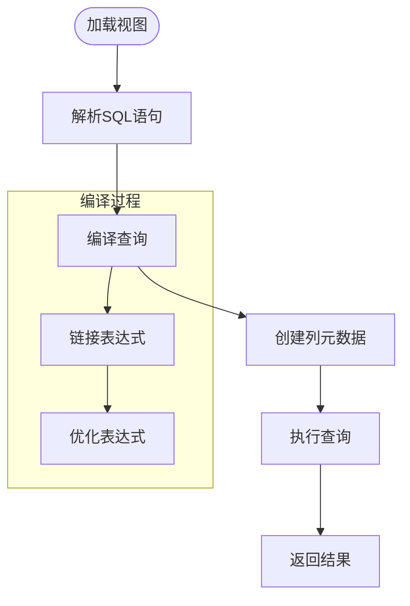
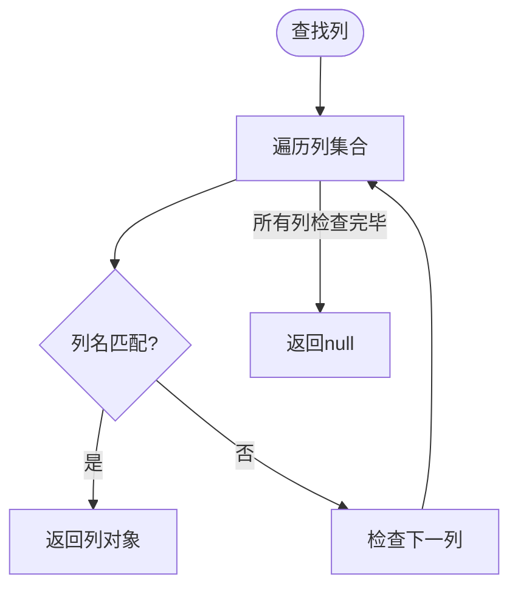
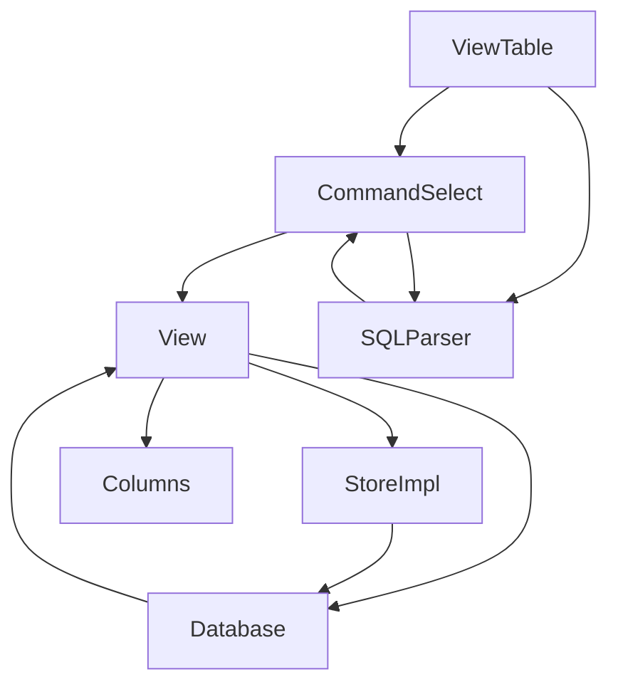

# View机制

<cite>
**本文档引用的文件**   
- [View.java](file://src/main/java/io/leavesfly/smallsql/rdb/engine/View.java)
- [ViewTable.java](file://src/main/java/io/leavesfly/smallsql/rdb/engine/ViewTable.java)
- [Database.java](file://src/main/java/io/leavesfly/smallsql/rdb/engine/Database.java)
- [CommandSelect.java](file://src/main/java/io/leavesfly/smallsql/rdb/command/dql/CommandSelect.java)
- [StoreImpl.java](file://src/main/java/io/leavesfly/smallsql/rdb/engine/store/StoreImpl.java)
- [Columns.java](file://src/main/java/io/leavesfly/smallsql/rdb/engine/table/Columns.java)
- [SQLParser.java](file://src/main/java/io/leavesfly/smallsql/rdb/sql/SQLParser.java)
</cite>

## 目录
1. [简介](#简介)
2. [核心组件](#核心组件)
3. [架构概述](#架构概述)
4. [详细组件分析](#详细组件分析)
5. [依赖分析](#依赖分析)
6. [性能考虑](#性能考虑)
7. [故障排除指南](#故障排除指南)
8. [结论](#结论)

## 简介
View机制是SmallSQL数据库系统中的核心功能之一，它提供了虚拟表的抽象机制，允许用户通过SELECT查询语句创建逻辑视图。该机制基于抽象基类View和具体实现类ViewTable，实现了表和视图的统一管理。View类作为抽象基类，定义了表和视图的通用接口和常量，而ViewTable类则具体实现了视图的功能，包括存储SELECT查询语句、动态执行查询和列元数据管理。

## 核心组件

View机制的核心组件包括View抽象基类和ViewTable具体实现类。View类定义了MAGIC_TABLE/MAGIC_VIEW文件标识常量、LOCK_*锁类型常量，并提供了load()工厂方法用于根据文件头魔数区分表和视图。ViewTable类实现了视图的具体功能，包括存储SELECT查询语句作为视图定义，并在查询时动态执行。createFile()模板方法通过writeMagic()钩子函数写入特定类型的文件头，而getFile()方法则生成表/视图的文件路径。

**本文档引用的文件**   
- [View.java](file://src/main/java/io/leavesfly/smallsql/rdb/engine/View.java)
- [ViewTable.java](file://src/main/java/io/leavesfly/smallsql/rdb/engine/ViewTable.java)

## 架构概述

View机制的架构基于抽象工厂模式和模板方法模式，通过View抽象基类和ViewTable具体实现类的组合，实现了表和视图的统一管理。系统通过文件头魔数识别文件类型，使用工厂方法创建相应的对象实例。视图的查询执行通过CommandSelect命令对象实现，实现了SQL语句的解析、编译和执行。

**图表来源**
- [View.java](file://src/main/java/io/leavesfly/smallsql/rdb/engine/View.java)
- [ViewTable.java](file://src/main/java/io/leavesfly/smallsql/rdb/engine/ViewTable.java)
- [CommandSelect.java](file://src/main/java/io/leavesfly/smallsql/rdb/command/dql/CommandSelect.java)

## 详细组件分析

### View抽象基类分析

View抽象基类定义了表和视图的通用接口和常量，是整个View机制的基础。该类通过静态常量定义了文件标识和锁类型，提供了工厂方法和模板方法来支持子类的扩展。

#### 常量定义

**图表来源**
- [View.java](file://src/main/java/io/leavesfly/smallsql/rdb/engine/View.java#L25-L45)

#### 工厂方法

**图表来源**
- [View.java](file://src/main/java/io/leavesfly/smallsql/rdb/engine/View.java#L60-L120)

### ViewTable具体实现分析

ViewTable类是View机制的具体实现，负责视图的创建、存储和查询执行。该类通过存储SELECT查询语句作为视图定义，并在查询时动态执行，实现了虚拟表的功能。

#### 构造函数

**图表来源**
- [ViewTable.java](file://src/main/java/io/leavesfly/smallsql/rdb/engine/ViewTable.java#L30-L80)

#### 查询执行流程

**图表来源**
- [ViewTable.java](file://src/main/java/io/leavesfly/smallsql/rdb/engine/ViewTable.java#L90-L150)
- [CommandSelect.java](file://src/main/java/io/leavesfly/smallsql/rdb/command/dql/CommandSelect.java#L100-L200)

### 列查找机制分析

View机制提供了高效的列查找功能，通过findColumn()和findColumnIdx()方法实现按名称查找列。这些方法在查询编译和执行过程中起着关键作用，确保了SQL语句中列引用的正确解析。

**图表来源**
- [View.java](file://src/main/java/io/leavesfly/smallsql/rdb/engine/View.java#L200-L220)

## 依赖分析

View机制依赖于多个核心组件，包括数据库管理、SQL解析、存储管理和命令执行。这些组件协同工作，实现了视图的完整功能。

**图表来源**
- [View.java](file://src/main/java/io/leavesfly/smallsql/rdb/engine/View.java)
- [ViewTable.java](file://src/main/java/io/leavesfly/smallsql/rdb/engine/ViewTable.java)
- [Database.java](file://src/main/java/io/leavesfly/smallsql/rdb/engine/Database.java)

**本文档引用的文件**   
- [View.java](file://src/main/java/io/leavesfly/smallsql/rdb/engine/View.java)
- [ViewTable.java](file://src/main/java/io/leavesfly/smallsql/rdb/engine/ViewTable.java)
- [Database.java](file://src/main/java/io/leavesfly/smallsql/rdb/engine/Database.java)
- [CommandSelect.java](file://src/main/java/io/leavesfly/smallsql/rdb/command/dql/CommandSelect.java)
- [StoreImpl.java](file://src/main/java/io/leavesfly/smallsql/rdb/engine/store/StoreImpl.java)
- [Columns.java](file://src/main/java/io/leavesfly/smallsql/rdb/engine/table/Columns.java)
- [SQLParser.java](file://src/main/java/io/leavesfly/smallsql/rdb/sql/SQLParser.java)

## 性能考虑

View机制在设计时考虑了性能优化，通过缓存、预编译和高效的存储结构来提高查询性能。视图的元数据在加载时被缓存，避免了重复解析。查询语句在首次执行时被编译，后续执行可以直接使用编译后的执行计划。存储结构采用固定大小的页，提高了I/O效率。

## 故障排除指南

在使用View机制时可能遇到的常见问题包括文件格式不兼容、权限错误和SQL语法错误。对于文件格式问题，应确保使用正确的版本创建和访问文件。权限错误通常与只读数据库或文件系统权限有关。SQL语法错误需要检查查询语句的正确性。

**本文档引用的文件**   
- [View.java](file://src/main/java/io/leavesfly/smallsql/rdb/engine/View.java#L100-L150)
- [ViewTable.java](file://src/main/java/io/leavesfly/smallsql/rdb/engine/ViewTable.java#L50-L100)

## 结论

View机制通过抽象基类和具体实现的组合，提供了一套完整的视图管理功能。该机制基于文件头魔数识别表和视图，使用工厂方法创建相应对象，通过模板方法实现文件头写入。ViewTable类存储SELECT查询语句作为视图定义，并在查询时动态执行，实现了虚拟表的功能。整个机制设计合理，性能优良，为SmallSQL数据库系统提供了强大的视图支持。