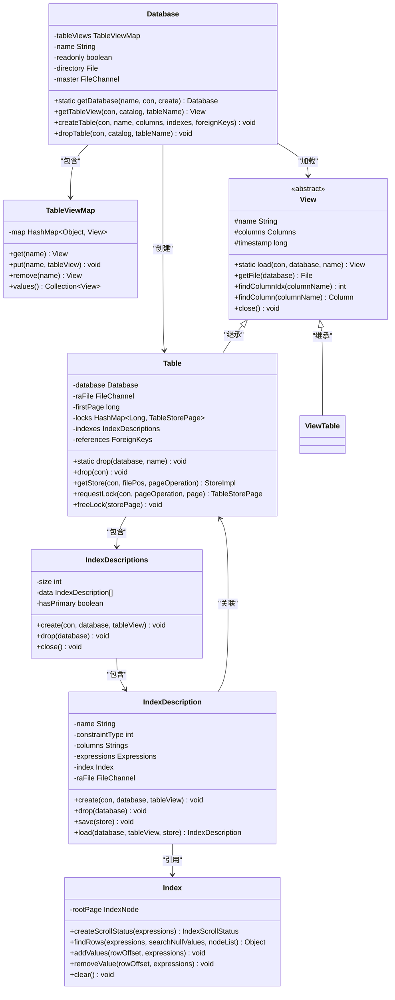
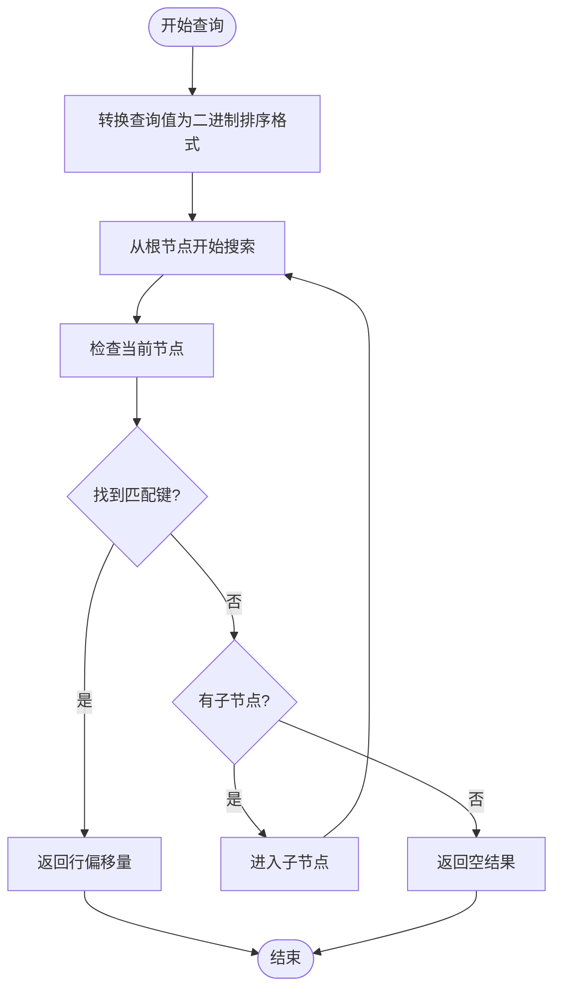
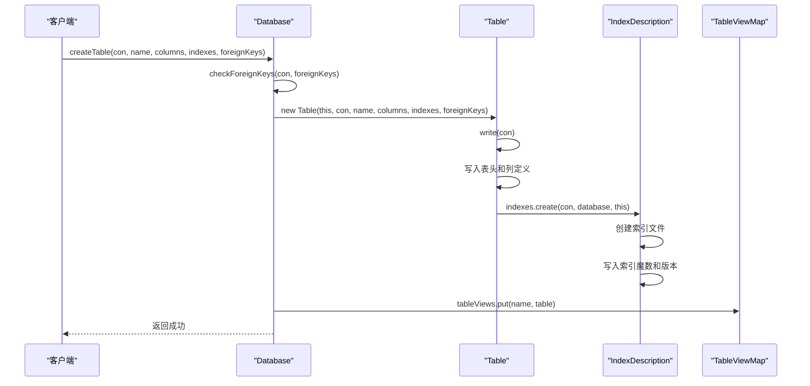

# 核心组件关系

<cite>
**本文档中引用的文件**  
- [Database.java](file://src/main/java/io/leavesfly/smallsql/rdb/engine/Database.java)
- [Table.java](file://src/main/java/io/leavesfly/smallsql/rdb/engine/Table.java)
- [View.java](file://src/main/java/io/leavesfly/smallsql/rdb/engine/View.java)
- [Index.java](file://src/main/java/io/leavesfly/smallsql/rdb/engine/Index.java)
- [IndexDescription.java](file://src/main/java/io/leavesfly/smallsql/rdb/engine/index/IndexDescription.java)
- [IndexDescriptions.java](file://src/main/java/io/leavesfly/smallsql/rdb/engine/index/IndexDescriptions.java)
- [TableViewMap.java](file://src/main/java/io/leavesfly/smallsql/rdb/engine/table/TableViewMap.java)
- [ViewTable.java](file://src/main/java/io/leavesfly/smallsql/rdb/engine/ViewTable.java)
</cite>

## 目录
1. [引言](#引言)
2. [核心组件职责与生命周期](#核心组件职责与生命周期)
3. [组件关系与继承设计](#组件关系与继承设计)
4. [索引机制与B+树实现](#索引机制与b树实现)
5. [数据库表视图管理](#数据库表视图管理)
6. [CREATE TABLE执行流程](#create-table执行流程)
7. [代码示例与API使用](#代码示例与api使用)
8. [总结](#总结)

## 引言
本文档深入分析SmallSQL数据库系统中核心组件Database、Table、Index和View的职责、生命周期及其相互关系。重点阐述Database如何通过TableViewMap管理表和视图的加载与缓存，Table继承View的设计意图，以及Index组件如何为Table提供高效查询支持。通过UML类图和序列图直观展示组件间的继承与协作关系，为开发者提供清晰的系统架构理解。

## 核心组件职责与生命周期

### Database组件
Database组件是数据库实例的容器，负责管理所有表和视图的生命周期。作为单例模式实现，它在多个连接间共享，确保线程安全。其主要职责包括：
- 管理表和视图的定义与锁
- 通过静态方法`getDatabase()`获取数据库实例
- 维护连接引用，当所有连接关闭时自动卸载数据库
- 通过`tableViews`成员管理表视图的缓存

**Section sources**
- [Database.java](file://src/main/java/io/leavesfly/smallsql/rdb/engine/Database.java#L1-L564)

### Table组件
Table类继承自View类，代表数据库中的物理表。其核心职责包括：
- 存储表的元数据（列定义、索引、外键）
- 管理表文件的读写操作
- 处理行级锁和事务控制
- 维护与索引的关联关系

Table的生命周期由Database管理，通过`createTable()`方法创建，`drop()`方法销毁。Table对象在首次访问时被加载到内存缓存中。

**Section sources**
- [Table.java](file://src/main/java/io/leavesfly/smallsql/rdb/engine/Table.java#L1-L608)

### View组件
View是Table和ViewTable的抽象基类，定义了表和视图的公共接口。其主要职责包括：
- 提供统一的表/视图访问接口
- 管理列定义和元数据
- 实现表名和时间戳的通用功能
- 定义文件操作的抽象方法

View通过`load()`静态方法实现工厂模式，根据文件魔数区分Table和ViewTable实例。

**Section sources**
- [View.java](file://src/main/java/io/leavesfly/smallsql/rdb/engine/View.java#L1-L205)

### Index组件
Index组件实现B+树索引结构，为Table提供高效查询支持。其核心功能包括：
- 存储索引键值与行偏移量的映射
- 支持唯一索引和非唯一索引
- 提供快速查找、插入和删除操作
- 处理多种数据类型的二进制排序转换

Index的生命周期与Table绑定，由IndexDescription管理其持久化。

**Section sources**
- [Index.java](file://src/main/java/io/leavesfly/smallsql/rdb/engine/Index.java#L1-L553)

## 组件关系与继承设计

**Diagram sources**
- [Database.java](file://src/main/java/io/leavesfly/smallsql/rdb/engine/Database.java#L1-L564)
- [Table.java](file://src/main/java/io/leavesfly/smallsql/rdb/engine/Table.java#L1-L608)
- [View.java](file://src/main/java/io/leavesfly/smallsql/rdb/engine/View.java#L1-L205)
- [Index.java](file://src/main/java/io/leavesfly/smallsql/rdb/engine/Index.java#L1-L553)
- [IndexDescription.java](file://src/main/java/io/leavesfly/smallsql/rdb/engine/index/IndexDescription.java#L1-L292)
- [IndexDescriptions.java](file://src/main/java/io/leavesfly/smallsql/rdb/engine/index/IndexDescriptions.java#L1-L147)

## 索引机制与B+树实现

### B+树索引构建
Index组件采用B+树结构实现索引，其构建过程如下：
1. **数据类型转换**：将各种数据类型转换为具有排序顺序的二进制表示
2. **节点管理**：使用IndexNode管理树的分支和叶子节点
3. **键值存储**：在叶子节点存储索引键值与行偏移量的映射
4. **唯一性处理**：唯一索引存储单个行偏移量，非唯一索引使用LongTreeList存储多个偏移量

### 查询路径
索引查询路径遵循标准B+树搜索算法：
1. 从根节点开始逐层向下搜索
2. 根据查询条件计算键值的二进制排序表示
3. 在每个节点中通过二分查找定位子节点
4. 到达叶子节点后返回对应的行偏移量或行偏移量列表

**Diagram sources**
- [Index.java](file://src/main/java/io/leavesfly/smallsql/rdb/engine/Index.java#L1-L553)
- [IndexDescription.java](file://src/main/java/io/leavesfly/smallsql/rdb/engine/index/IndexDescription.java#L1-L292)

## 数据库表视图管理

### TableViewMap缓存机制
Database通过TableViewMap实现表和视图的缓存管理：
- 使用HashMap存储表名到View实例的映射
- 通过`getUniqueKey()`方法确保表名的大小写不敏感
- 在`getTableView()`方法中实现懒加载模式
- 提供线程安全的同步访问

### 加载与缓存流程
1. 调用`getTableView()`方法
2. 检查TableViewMap缓存
3. 若缓存中不存在，则调用View.load()加载
4. 将新加载的View实例存入缓存
5. 返回View实例

**Section sources**
- [Database.java](file://src/main/java/io/leavesfly/smallsql/rdb/engine/Database.java#L1-L564)
- [TableViewMap.java](file://src/main/java/io/leavesfly/smallsql/rdb/engine/table/TableViewMap.java#L1-L79)

## CREATE TABLE执行流程

**Diagram sources**
- [Database.java](file://src/main/java/io/leavesfly/smallsql/rdb/engine/Database.java#L1-L564)
- [Table.java](file://src/main/java/io/leavesfly/smallsql/rdb/engine/Table.java#L1-L608)
- [IndexDescription.java](file://src/main/java/io/leavesfly/smallsql/rdb/engine/index/IndexDescription.java#L1-L292)

## 代码示例与API使用

### 获取表实例
通过Database.getTableView()方法获取表实例：

[SPEC SYMBOL](file://src/main/java/io/leavesfly/smallsql/rdb/engine/Database.java#L150-L155)

### 管理索引
Table通过indexes成员管理多个索引：

[SPEC SYMBOL](file://src/main/java/io/leavesfly/smallsql/rdb/engine/Table.java#L1-L608)

**Section sources**
- [Database.java](file://src/main/java/io/leavesfly/smallsql/rdb/engine/Database.java#L150-L155)
- [Table.java](file://src/main/java/io/leavesfly/smallsql/rdb/engine/Table.java#L1-L608)

## 总结
本文档详细分析了SmallSQL数据库系统中Database、Table、Index和View核心组件的职责、生命周期和相互关系。Database作为容器通过TableViewMap管理表和视图的加载与缓存，Table继承View的设计实现了代码复用和统一接口，Index组件通过B+树结构为Table提供高效查询支持。这些组件通过精心设计的继承和关联关系，共同构建了一个高效、可扩展的数据库引擎架构。