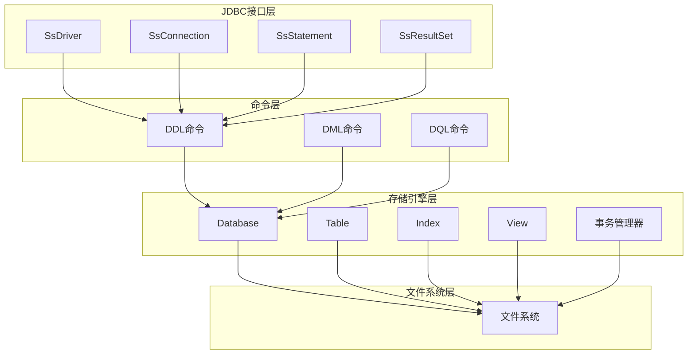

# 项目概述

<cite>
**本文档引用的文件**  
- [README.md](file://README.md)
- [pom.xml](file://pom.xml)
- [SsDriver.java](file://src/main/java/io/leavesfly/smallsql/SsDriver.java)
- [SsConnection.java](file://src/main/java/io/leavesfly/smallsql/jdbc/SsConnection.java)
- [Command.java](file://src/main/java/io/leavesfly/smallsql/rdb/command/Command.java)
- [Database.java](file://src/main/java/io/leavesfly/smallsql/rdb/engine/Database.java)
- [SQLParser.java](file://src/main/java/io/leavesfly/smallsql/rdb/sql/SQLParser.java)
</cite>

## 目录
1. [项目概述](#项目概述)
2. [核心特性](#核心特性)
3. [系统架构](#系统架构)
4. [核心组件分析](#核心组件分析)
5. [数据存储格式](#数据存储格式)
6. [并发控制](#并发控制)
7. [性能特性](#性能特性)
8. [构建和使用](#构建和使用)
9. [项目结构](#项目结构)
10. [贡献和开发](#贡献和开发)
11. [注意事项](#注意事项)

## 项目概述

SmallSQL是一个用Java编写的轻量级关系数据库管理系统(RDBMS)，提供了完整的SQL支持和JDBC接口。该项目是对原始SmallSQL数据库的重构版本。

- **项目名称**: SmallSQL
- **版本**: 1.0.0-SNAPSHOT
- **Java版本**: 1.6+
- **许可证**: GNU Lesser General Public License v2.1
- **原作者**: Volker Berlin

**Section sources**
- [README.md](file://README.md#L4-L10)

## 核心特性

- 完整的JDBC 4.0接口实现
- 支持标准SQL语法(DDL、DML、DQL)
- 基于文件的存储引擎
- 支持索引和外键约束
- 事务处理和并发控制
- 支持视图(Views)
- 内置数据类型支持
- 轻量级，无需额外依赖

**Section sources**
- [README.md](file://README.md#L12-L20)

## 系统架构

### 整体架构图



**Diagram sources**
- [README.md](file://README.md#L24-L44)

### 分层架构说明

1. **JDBC接口层**: 提供标准JDBC接口，包括Driver、Connection、Statement、ResultSet等
2. **命令层**: 解析和执行SQL命令，分为DDL、DML、DQL三类
3. **存储引擎层**: 管理数据库、表、索引等核心对象
4. **文件系统层**: 基于文件的数据持久化

**Section sources**
- [README.md](file://README.md#L46-L55)

## 核心组件分析

### 1. JDBC接口层 (`io.leavesfly.smallsql.jdbc`)

#### 主要组件:
- **SsDriver**: JDBC驱动程序入口点，处理连接URL解析
- **SsConnection**: 数据库连接管理，事务控制
- **SsStatement/SsPreparedStatement**: SQL语句执行器
- **SsResultSet**: 查询结果集处理
- **SsDatabaseMetaData**: 数据库元数据访问

#### 关键特性:
- 支持标准JDBC URL格式: `jdbc:smallsql:database_path`
- 自动事务管理和手动事务控制
- 完整的元数据支持

**Section sources**
- [README.md](file://README.md#L57-L70)
- [SsDriver.java](file://src/main/java/io/leavesfly/smallsql/SsDriver.java#L1-L203)
- [SsConnection.java](file://src/main/java/io/leavesfly/smallsql/jdbc/SsConnection.java#L1-L716)

### 2. 命令处理层 (`io.leavesfly.smallsql.rdb.command`)

#### 命令分类:

**DDL命令** (`ddl`包):
- `CommandCreateDatabase`: 创建数据库
- `CommandTable`: 创建/修改表结构
- `CommandCreateView`: 创建视图
- `CommandDrop`: 删除数据库对象
- `CommandSet`: 设置数据库参数

**DML命令** (`dml`包):
- `CommandInsert`: 数据插入操作
- `CommandUpdate`: 数据更新操作
- `CommandDelete`: 数据删除操作

**DQL命令** (`dql`包):
- `CommandSelect`: 数据查询操作，支持复杂查询

#### 设计模式:
- 使用命令模式(Command Pattern)封装SQL操作
- 统一的命令接口`Command`，包含执行和回滚逻辑

**Section sources**
- [README.md](file://README.md#L72-L90)
- [Command.java](file://src/main/java/io/leavesfly/smallsql/rdb/command/Command.java#L1-L191)

### 3. 存储引擎层 (`io.leavesfly.smallsql.rdb.engine`)

#### 核心组件:

**Database类**:
- 数据库实例管理器
- 维护表和视图的映射关系
- 处理数据库级别的锁定和并发控制
- 支持多连接共享同一数据库实例

**Table类**:
- 表数据管理和存储
- 支持行级锁定和页级锁定
- 管理表的索引和外键约束
- 处理数据的CRUD操作

**Index类**:
- B+树索引实现
- 支持唯一索引和非唯一索引
- 提供快速数据检索能力

**View类**:
- 虚拟表实现
- 支持基于SQL查询的视图定义

#### 存储特性:
- 基于文件通道(FileChannel)的高效I/O
- 页式存储管理
- 支持大对象(LOB)存储
- 事务日志和恢复机制

**Section sources**
- [README.md](file://README.md#L92-L115)
- [Database.java](file://src/main/java/io/leavesfly/smallsql/rdb/engine/Database.java#L1-L565)

### 4. SQL解析层 (`io.leavesfly.smallsql.rdb.sql`)

#### 主要组件:
- **SQLParser**: SQL语句解析器
- **SQLTokenizer**: SQL词法分析器
- **Expression**: SQL表达式处理
- **DataType**: 数据类型系统

#### 支持的SQL特性:
- 标准SQL语法支持
- 复杂查询(JOIN、子查询、聚合函数)
- 数据类型转换和验证
- 表达式计算和函数支持

**Section sources**
- [README.md](file://README.md#L117-L128)
- [SQLParser.java](file://src/main/java/io/leavesfly/smallsql/rdb/sql/SQLParser.java#L1-L800)

### 5. 工具和辅助组件

#### 日志系统 (`logger`包):
- 结构化日志记录
- 支持不同日志级别

#### 国际化支持 (`lang`包):
- 多语言错误消息
- 本地化支持

#### 工具类 (`util`包):
- 通用工具方法
- 数据结构和算法支持

**Section sources**
- [README.md](file://README.md#L130-L138)

## 数据存储格式

### 文件组织结构:
```
database_directory/
├── database.master     # 数据库主文件
├── table1.tbl         # 表数据文件
├── table1.idx         # 表索引文件
├── table1.lob         # 大对象文件
└── ...
```

### 存储特性:
- 每个表对应独立的数据文件
- 索引文件单独存储
- 支持大对象(BLOB/CLOB)的外部存储
- 页式存储，支持缓存优化

**Section sources**
- [README.md](file://README.md#L140-L151)

## 并发控制

### 锁定机制:
- **表级锁**: 支持共享锁和排他锁
- **行级锁**: 细粒度的数据访问控制
- **页级锁**: 存储页面的并发控制

### 事务支持:
- ACID属性保证
- 自动提交和手动事务控制
- 死锁检测和处理
- 事务回滚机制

**Section sources**
- [README.md](file://README.md#L153-L164)

## 性能特性

### 优化策略:
- B+树索引加速查询
- 页面缓存机制
- 延迟写入优化
- 批量操作支持

### 适用场景:
- 嵌入式应用
- 小到中型数据集
- 开发和测试环境
- 教学和学习用途

**Section sources**
- [README.md](file://README.md#L166-L177)

## 构建和使用

### 构建要求:
- Java 1.6+
- Maven 3.x

### 构建命令:
```bash
mvn clean compile
mvn test
mvn package
```

### JDBC连接示例:
```java
// 加载驱动
Class.forName("io.leavesfly.smallsql.SsDriver");

// 建立连接
String url = "jdbc:smallsql:./mydb";
Connection conn = DriverManager.getConnection(url);

// 执行SQL
Statement stmt = conn.createStatement();
ResultSet rs = stmt.executeQuery("SELECT * FROM users");

// 处理结果
while(rs.next()) {
    System.out.println(rs.getString("name"));
}

// 关闭连接
rs.close();
stmt.close();
conn.close();
```

**Section sources**
- [README.md](file://README.md#L179-L219)

## 项目结构

```
src/main/java/io/leavesfly/smallsql/
├── SsDriver.java              # JDBC驱动入口
├── jdbc/                      # JDBC接口实现
│   ├── SsConnection.java
│   ├── SsStatement.java
│   ├── SsResultSet.java
│   └── metadata/             # 元数据支持
├── rdb/                      # 关系数据库核心
│   ├── command/              # SQL命令处理
│   │   ├── ddl/             # 数据定义语言
│   │   ├── dml/             # 数据操作语言
│   │   └── dql/             # 数据查询语言
│   ├── engine/              # 存储引擎
│   │   ├── Database.java
│   │   ├── Table.java
│   │   ├── Index.java
│   │   └── store/           # 存储管理
│   └── sql/                 # SQL解析和处理
├── lang/                    # 国际化支持
├── logger/                  # 日志系统
└── util/                    # 工具类
```

**Section sources**
- [README.md](file://README.md#L221-L242)

## 贡献和开发

这是一个开源项目，欢迎贡献代码和改进建议。项目采用LGPL v2.1许可证，允许在商业和非商业项目中使用。

**Section sources**
- [README.md](file://README.md#L244-L247)
- [pom.xml](file://pom.xml#L1-L42)

## 注意事项

- 该数据库适合小到中型应用，不建议用于大规模生产环境
- 建议在使用前进行充分的测试
- 数据文件格式可能在版本间发生变化，升级时请注意兼容性

**Section sources**
- [README.md](file://README.md#L249-L254)